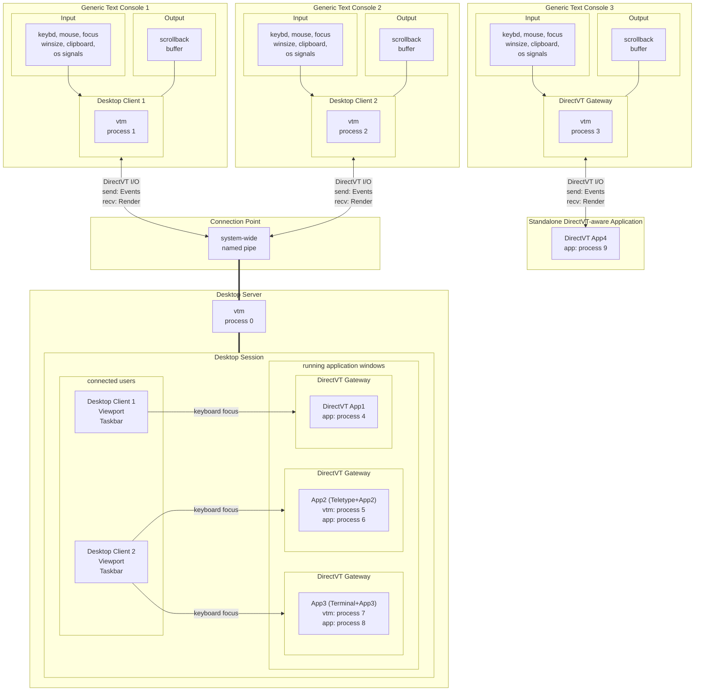

# Text-based Desktop Environment Architecture

- [Process model](#process-model)
- [Runtime modes](#runtimemodes)
- [Desktop applets](#desktopapplets)
- [TUI modes](#tui-modes)
  - [DirectVT mode](#directvt-mode)
  - [ANSI/VT mode](#ansivt-mode)
    - [Input](#input)
      - [Unix input sources](#unix-input-sources)
      - [MS Windows input sources](#ms-windows-input-sources)
    - [Output](#output)
- [Desktop structure](#desktop-structure)
  - [Desktop objects](#desktop-objects)
- [Usage scenarios](#usage-scenarios)
  - [Local usage](#local-usage)
    - [Run vtm desktop](#run-vtm-desktop)
    - [Run Terminal Console standalone](#run-terminal-console-standalone)
    - [Run a CUI application standalone](#run-a-cui-application-standalone)
    - [Run a CUI application inside the Terminal Console](#run-a-cui-application-inside-the-terminal-console)
  - [Remote access](#remote-access)
    - [Run a standalone CUI application remotely over SSH](#run-a-standalone-cui-application-remotely-over-ssh)
    - [Run remote vtm desktop in DirectVT mode over SSH](#run-remote-vtm-desktop-in-directvt-mode-over-ssh)
    - [Run remote vtm desktop in ANSI/VT mode over SSH](#run-remote-vtm-desktop-in-ansivt-mode-over-ssh)
    - [Run remote vtm desktop in DirectVT mode using netcat](#run-remote-vtm-desktop-in-directvt-mode-using-netcat-posix-only-unencrypted-for-private-use-only)
    - [Run remote vtm desktop in DirectVT mode using inetd + ncat](#run-remote-vtm-desktop-in-directvt-mode-using-inetd--ncat-posix-only-unencrypted-for-private-use-only)
    - [Local standard I/O redirection using socat](#local-standard-io-redirection-using-socat-posix-only)
  - [Standard I/O stream monitoring](#standard-io-stream-monitoring)
- [Desktop taskbar customization](#desktop-taskbar-customization)
- [Desktop Live Panel](panel.md)
- [Desktop objects and built-in applications](apps.md)

## Process model



- vtm is a text-based desktop environment that comes with a single executable.
- Due to the fact that a typical desktop environment is a dynamic long-living construct of interacting processes, vtm has a number of mutually exclusive runtime modes to parallelize this functionality by launching multiple interacting vtm processes.
- Due to the fact that a typical desktop environment is a dynamic, long-lived construct of interacting processes, vtm has a number of runtime modes for running multiple vtm processes in parallel to form the environment.
- Each desktop session is a vtm process running in `Desktop Server` mode.
- Desktop environment users connect to an existing desktop session through an additional vtm process running in `Desktop Client` mode.
- The desktop session has a unique id coined from the platform-specific creator UID unless explicitly specified.
- Only the session creator or elevated user can access the session.
- The regular user and the elevated user are different independent users despite having the same username.
- The session allows multiple access in real time.
- Multiple connected users can share a focused application, while each user can have multiple applications focused.
- Users can disconnect from the session and reconnect later.
- Sessions with different ids can coexist independently.
- To maximize rendering efficiency and minimize cross-platform issues, along with character-oriented xterm-compatible TUI mode called `ANSI/VT`, vtm supports an additional message-based binary TUI mode called `DirectVT`.
- All running applications are connected to the desktop environment using `DirectVT Gateway` windows as DirectVT endpoints.
  - DirectVT-aware applications are connected directly to the environment and can seamlessly send and receive the entire set of desktop events, as well as render themselves in binary form, avoiding expensive ANSI/VT parsing.
  - To run non-DirectVT applications, an additional vtm host process is launched in `Desktop Applet` mode with the `Teletype Console` or `Terminal Console` applet as a DirectVT bridge to the desktop environment.
- The desktop environment server can receive and execute script commands relayed from other vtm processes running on behalf of the session creator.
- In the case of a vtm process with redirected standard input, all standard input is directly relayed to the desktop environment server as a script command flow.

### Runtime modes

Runtime mode    | TUI mode                 | Environment role
----------------|--------------------------|------------------
Desktop Applet  | auto detected            | Desktop applet of an arbitrary type running in its own process that accepts user input and renders itself. Used to run heavy desktop objects in parallel processes to optimize desktop resource consumption.
Desktop Client  | auto detected            | Desktop client in its own process that forwards user input to the desktop and renders the corresponding desktop region with a taskbar overlay.
Desktop Server  | n/a<br>command line only | The desktop environment core that manages connected users, runs desktop applications, routes user input, and forwards renders to desktop clients.
Desktop Monitor | n/a<br>command line only | Desktop monitor that outputs the desktop session log and relays script commands to the desktop server via piped redirection.

The runtime mode can be selected using command-line options. By default, `Desktop Client` mode will be used, with `Desktop Server` implicitly running in parallel if it is not running.

### Desktop applets

The desktop applet type can be specified using the `vtm [-r [<type>]][<args...>]` command-line option. By default, `vtty` will be used if `<args...>` is specified without any `<type>`.

Desktop applet             | Type   | Host for
---------------------------|--------|----------------------
Teletype Console (default) | `vtty` | CUI applications.
Terminal Console           | `term` | CUI applications.
DirectVT Gateway           | `dtvt` | DirectVT-aware applications.
DirectVT Gateway with TTY  | `dtty` | CUI applications that redirect DirectVT flow to standard IO streams and require user input via platform's TTY.

## TUI modes

An instance of the vtm process in `Desktop Client` or `Desktop Applet` mode can operate in one of two TUI modes, either in `ANSI/VT` mode, or in `DirectVT`(`dtvt`) mode.

### DirectVT mode

In DirectVT TUI mode, the vtm process, communicating with the desktop server, multiplexes the following data channels:
- Keyboard event channel
- Mouse event channel
- Focus event channel
- Window size event channel
- Clipboard event channel
- Render output channel
- Shutdown event channel

The DirectVT stream can be wrapped in any transport layer protocol suitable for stdin/stdout transfer, such as SSH.

### ANSI/VT mode

#### Input

In ANSI/VT TUI mode, the vtm process parses input from multiple standard sources, and forwards it to the desktop server using the DirectVT transport. The set of input sources varies by platform.

##### Unix input sources

- STDIN
    - Bracketed paste marks `\x1b[200~`/`\x1b[201~` are treated as the boundaries of a binary immutable block pasted from the clipboard. This immutable block is handled independently of keyboard input and forwarded to the clipboard event channel.
    - SGR mouse reporting sequences `\x1b[<s;x;yM/m` are redirected to the mouse event channel.
    - Terminal window focus reporting sequences `\x1b[I`/`\x1b[O` are redirected to the focus event channel.
    - Line style reporting sequences `\x1b[33:STYLEp` are redirected to the style event channel (current/selected line wrapping on/off, left/right/center alignment).
    - All incoming text flow that does not fall into the above categories is clusterized, forming a key pressed stream forwarded to the keyboard event channel.
- Operating system signals
    - SIGWINCH events are forwarded to the window size event channel.
    - SIGINT events are forwarded to the shutdown event channel to perform graceful exit.
    - SIGHUP events are forwarded to the shutdown event channel to perform graceful exit.
    - SIGTERM events are forwarded to the shutdown event channel to perform graceful exit.
- PS/2 Mouse device (Linux VGA Console only)
    - `/dev/input/mice`: Received ImPS/2 mouse protocol events are decoded and forwarded to the mouse event channel.
    - `/dev/input/mice.vtm` (used in case of inaccessibility of `/dev/input/mice`)

##### MS Windows input sources

- ReadConsoleInput events (Win32 Console API)
    - The KEY_EVENT stream is clusterized, forming a key pressed stream forwarded to the keyboard event channel (excluding repeat modifier keys).
    - The MOUSE_EVENT stream is forwarded to the mouse event channel (excluding double clicks and idle events).
    - The FOCUS_EVENT stream is forwarded to the focus event channel.
    - The WINDOW_BUFFER_SIZE_EVENT stream is forwarded to the window size event channel.
    - The MENU_EVENT stream is interpreted using the Event.MenuEvent.dwCommandId value:
        - 0x8000: The subsequent MENU_EVENT record is forwarded to the style event channel.
        - 0x8001: Clipboard-paste block start (INPUT_RECORD Begin Mark). Subsequent KEY_EVENT records are read until the INPUT_RECORD End Mark appears, and then a whole block of chars is forwarded to the clipboard event channel.
        - 0x8002: Clipboard-paste block end (INPUT_RECORD End Mark).
- Window system-defined messages
    - WM_CREATE event is forwarded to the clipboard event channel.
    - WM_CLIPBOARDUPDATE events are forwarded to the clipboard event channel.
    - WM_ENDSESSION event is interpreted using its sub-parameter's value:
        - ENDSESSION_CLOSEAPP: Register CTRL_CLOSE_EVENT signal.
        - ENDSESSION_LOGOFF: Register CTRL_LOGOFF_EVENT signal.
        - any other non-zero: Register CTRL_SHUTDOWN_EVENT signal.
- Operating system signals
    - CTRL_C_EVENT events are form the `Ctrl+C` key pressed event stream forwarded to the keyboard event channel.
    - CTRL_BREAK_EVENT events are form the `Ctrl+Break` key pressed event stream forwarded to the keyboard event channel.
    - CTRL_CLOSE_EVENT event is forwarded to the shutdown event channel to perform graceful exit.
    - CTRL_LOGOFF_EVENT event is forwarded to the shutdown event channel to perform graceful exit.
    - CTRL_SHUTDOWN_EVENT event is forwarded to the shutdown event channel to perform graceful exit.

#### Output

Console UI applications running as external processes are instantly rendered into their host `DirectVT Gateways ` windows running directly in the desktop server address space.

The desktop server receives and caches the window rasters and sends the corresponding projection rendering to desktop clients at each internal timer tick.

The binary render stream received from the desktop server to output is converted by the desktop client to the format suitable for the console being used to output. The console type is detected at the desktop client startup and can be one of the following:
- XTerm-compatible terminal with truecolor support
- XTerm-compatible terminal with 256-color support (Apple Terminal)
- XTerm-compatible terminal with 16-color support (Linux VGA Console, 16-color terminals)
- Win32 Console with 16-color support (Command Prompt on platforms from Windows 8.1 upto Windows 2019 Server)

The desktop client outputs the received render to the hosting console only when the console is ready to accept the next frame.

## Desktop structure

 Term               | Description
--------------------|---------------
`colored character` | A character depicted with rendition attributes such as background and foreground color.
`text console`      | A cellular rectangular surface designed to display colored monospaced characters in cells.
`text cell`         | A text console cell containing a colored monospaced character or its fragment.
`bitmap`            | A rectangular block of text cells.
`canvas`            | A rectangular buffer for text cells output.

Internally the desktop is represented by the parent-child object tree with a single root object that maintains a desktop-wide configuration, a list of connected users, and a list of running windows. The root object broadcasts a fixed number of ticks every second to update the tree state and to do something else in sync.

Users and windows are associated with the rectangular regions where they are placed at the moment. For the connected user it is a viewport of the terminal used to connect to the desktop. For the application window it is a window rectangle itself.

Desktop has no bounds and users can navigate the desktop in any direction. For every window located outside the user viewport the navigation string apeears from the viewport center towards the window location.

Each desktop window has a canvas for the hosted object bitmap, sizing grips around the canvas, a window title at the top, and a window footer at the bottom.

The desktop window can host an object instance of an arbitrary type. The hosted object controls all the hosting window's properties.

### Desktop objects

Desktop object                          | Description
----------------------------------------|----------------------
Teletype Console<br>`teletype`          | A solid rectangular truecolor text canvas depicting a freely scrollable buffer of the text runs generated by an xterm-compatible parser from the standard output of an attached CUI application. It can be a very heavy object due to maintaining a scrollback buffer of arbitrary length. Not used directly in the desktop process's address space.
Terminal Console<br>`terminal`          | A derivative of `Teletype Console` with additional UI controls.
DirectVT Gateway<br>`dtvt`              | A lightweight truecolor text canvas depicting content received from an external dtvt-aware process.
Teletype Console dtvt‑bridge<br>`vtty`  | A `DirectVT Gateway` hosting an external standalone `Teletype Console` applet. It is designed to run a heavy `Teletype Console` object in the external process's address space to optimize desktop resource consumption.
Terminal Console dtvt‑bridge<br>`term`  | A `DirectVT Gateway` hosting an external standalone `Terminal Console` applet. It is designed to run a heavy `Terminal Console` object in the external process's address space to optimize desktop resource consumption.
DirectVT Gateway with TTY<br>`dtty`     | A derivative of `DirectVT Gateway` stacked with additional limited `Teletype Console` as a controlling terminal. It is used for CUI applications that redirect DirectVT stream to standard output and require user input via platform's TTY. Depending on activity the corresponding console became active for the user.
Tiling Window Manager<br>`tile`         | A window container with an organization of the hosting window area into mutually non-overlapping panes for nested windows.
Desktop Region Marker<br>`site`         | A transparent resizable frame for marking the specific desktop region for quick navigation across the borderless workspace.

Do not confuse the `Desktop Applet` names with the desktop object names, even though they are the same literally, e.g. `vtty` and `term`. Desktop objects of the same name as Desktop Applets are wrappers for heavy desktop objects that should be launched in parallel vtm processes.

# Usage scenarios

## Local usage

### Run vtm desktop

- Run command:
    ```bash
    vtm
    ```

### Run Terminal Console standalone

- Run command:
    ```bash
    vtm -r term
    ```

### Run a CUI application standalone

- Run command:
    ```bash
    vtm </path/to/console/app...>
    ```

### Run a CUI application inside the Terminal Console

- Run command:
    ```bash
    vtm -r term </path/to/console/app...>
    # The `vtm -r term` option means to run the Terminal Console standalone to host a CUI application.
    ```

## Remote access

In general, the local and remote platforms may be different.

When the DirectVT mode is used, all keyboard, mouse and other input events are transmitted between hosts in a binary endianness-aware form.

The following examples assume that vtm is installed on both the local and remote sides.

### Run a standalone CUI application remotely over SSH

- Remote side
    - Run SSH-server if it is not running.
- Local side
    - Run command:
    ```bash
    vtm -r dtty ssh user@server vtm -r vtty </path/to/console/app...>
    # The `vtm -r dtty` option means to run the next statement in DirectVT&TTY console.
    # The `ssh user@server vtm -r vtty` statement means to connect via ssh and launch the Teletype Console on the remote host.
    ```
    or
    ```bash
    vtm ssh user@server vtm </path/to/console/app...>
    ```

### Run remote vtm desktop in DirectVT mode over SSH

- Remote side
    - Run SSH-server if it is not running.
- Local side
    - Run command:
    ```bash
    vtm -r dtty ssh user@server vtm
    # The `vtm -r dtty` option means to run the next statement in DirectVT&TTY console.
    # The `ssh user@server vtm` statement means to connect via ssh and run the vtm desktop on the remote host.
    ```
    or
    ```bash
    vtm ssh user@server vtm
    # The `-r dtty` option is auto added if the first command-line argument starts with `ssh` keyword.
    ```

### Run remote vtm desktop in ANSI/VT mode over SSH

- Remote side
    - Run SSH-server if it is not running.
- Local side
    - Run commands:
    ```bash
    ssh user@server
    vtm
    ```
    or
    ```bash
    ssh -t user@server vtm
    # The ssh's `ssh -t ...` option is required to allocate TTY on remote host.
    ```

### Run remote vtm desktop in DirectVT mode using `netcat` (POSIX only, unencrypted, for private use only)

- Remote side
    - Run command:
    ```bash
    ncat -l tcp_port -k -e vtm
    # ncat's option `-l tcp_port` specifies tcp port to listen.
    # ncat's option `-k` to keep connection open for multiple clients.
    # ncat's option `-e` to run vtm for every connected client.
    ```
- Local side
    - Run command:
    ```bash
    vtm -r dtvt ncat remote_ip remote_tcp_port
    # The `vtm -r dtvt` option means to run DirectVT Gateway to host ncat.
    # Note: Make sure `ncat` is installed.
    ```

### Run remote vtm desktop in DirectVT mode using `inetd + ncat` (POSIX only, unencrypted, for private use only)

- Remote side
    - Install `inetd`.
    - Add the following line to the `/etc/inetd.conf`:
        ```bash
        tcp_port stream tcp nowait user_name /remote/side/path/to/vtm  vtm
        # `tcp_port`: tcp port to listen.
        # `user_name`: user login name.
        ```
    - Launch `inetd`:
        ```
        inetd
        ```
- Local side
    - Run command:
    ```bash
    vtm -r dtvt ncat remote_ip remote_tcp_port
    ```

### Local standard I/O redirection using `socat` (POSIX only)

- Host side
    - Run commands:
    ```
    mkfifo in && mkfifo out
    vtm >out <in
    ```
- User side
    - Run command:
    ```bash
    vtm -r dtvt socat open:out\!\!open:in stdin\!\!stdout
    # Note: Make sure `socat` is installed.
    ```


## Standard I/O stream monitoring

vtm allows developers to visualize standard input/output streams of the running CUI applications. Launched in the `Desktop Monitor` mode, vtm will log the event stream of each terminal window with the `Logs` switch enabled.

Important: Avoid enabling the `Logs` switch in the terminal window hosting the `Desktop Monitor` process running, this may lead to recursive event logging of event logging with unpredictable results.

Important: Be careful with enabling the `Logs` switch when working with sensitive information, since all IO events, including keypresses, are logged in this mode.

## Desktop taskbar customization

The taskbar menu can be configured using a settings file `~/.config/vtm/settings.xml` (`%USERPROFILE%\.config\vtm\settings.xml` on Windows):
```xml
<config>
    <menu>
        <!-- <item*/> --> <!-- Clear default item list -->
        <item splitter label="Remote Access"/>

        <item id="Run remote vtm desktop in DirectVT mode over SSH" type=dtty cmd="ssh user@server vtm"/>
        <item id="Run console app in remote terminal over SSH"      type=dtty cmd="ssh user@server vtm -r term </path/to/console/app...>"/>
        <item id="Run console app remotely over SSH w/o extra UI"   type=dtty cmd="ssh user@server vtm </path/to/console/app...>"/>

        <item splitter label="Another Examples"/>

        <item id="Far Manager"             type=vtty cmd="far"/>
        <item id="Far Manager in terminal" type=dtvt cmd="$0 -r term far"/>

        <item id="Midnight Commander"             type=vtty cmd="mc"/>
        <item id="Midnight Commander in terminal" type=dtvt cmd="$0 -r term mc"/>

        <item id="Remote cmd in terminal over SSH" type=dtty cmd="ssh user@server vtm -r term cmd"/>
        <item id="Remote cmd over SSH"             type=dtty cmd="ssh user@server vtm cmd"/>
        <item id="Remote Far Manager over SSH"     type=dtty cmd="ssh user@server vtm far"/>
        <item id="Remote wsl over SSH"             type=dtty cmd="ssh user@server vtm wsl"/>
        <item id="Remote mc over SSH"              type=dtty cmd="ssh user@server vtm mc"/>
        <item id="Remote wsl mc over SSH"          type=dtty cmd="ssh user@server vtm wsl mc"/>
    </menu>
</config>
```

The taskbar menu of the running desktop can be configured using shell piped redirection by sending script commands to the running vtm desktop:
```
# Delete existing menu items
echo "vtm.del()" | vtm
```
```
# Add new menu items
echo "vtm.set(id=Term label='Terminal' type=dtvt cmd='vtm -r term')" | vtm
echo "vtm.set(id=White label='White Terminal' type=dtvt cmd='vtm -r term' cfg='<config><term><color><default fgc=0xFF000000 bgc=0xFFffffff/></color></term></config>')" | vtm
echo "vtm.set(id=Huge label='Huge Terminal' type=dtvt cmd='vtm -r term' cfg='<config><term><scrollback size=500000/></term></config>')" | vtm
echo "vtm.set(id=Tile label='Three Terminals' type=tile cmd='v(h(Term, White), Huge)')" | vtm
echo "vtm.set(id=cmd label='Remote cmd over SSH' type=dtty cmd='ssh user@server vtm cmd')" | vtm
```
```
# Set default menu item
echo "vtm.selected(Term)" | vtm
```
```
# Run window with terminals
echo "vtm.run(id=Tile)" | vtm
```
