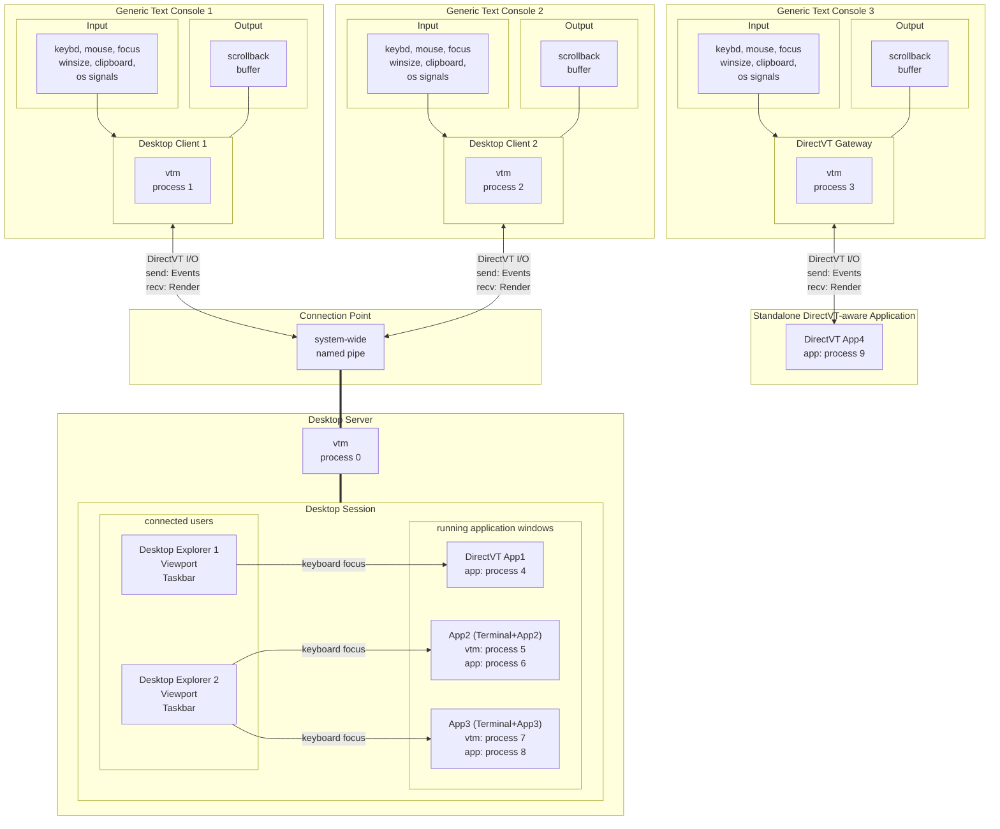

# Text-based Desktop Environment Architecture

The desktop environment is a complex construct of interacting entities, some of which must reside in parallel processes to optimize system resource consumption. For this, vtm has the following architectural traits.

First, vtm comes with a single executable that has a number of mutually exclusive internal operating modes to parallelize functionality by running multiple instances.

The second, the desktop environment interprocess communication, along with vtm instances, involves third-party applications that rely on platform-specific plain-text I/O. So vtm supports several interprocess communication modes to maximize efficiency and minimize cross-platform issues.

Internal operating modes:
- Desktop Applet
- Desktop Client
- Desktop Server
- Desktop Monitor

Interprocess communication modes:
- DirectVT
- Text/VT
- Command line

The following combinations of internal and interprocess modes are supported:

|               | DirectVT | Text/VT | Command line
----------------|----------|---------|-------------
Desktop Applet  | auto     | auto    |
Desktop Client  | auto     | auto    |
Desktop Server  |          |         | auto
Desktop Monitor |          |         | auto

The internal operating mode is determined by the command-line options used. By default, the `Desktop Client` mode is used.

In `Desktop Client` and `Desktop Applet` operating modes the interprocess communication mode is autodetected at startup. In other operating modes, only the `Command line` mode is used and only if the platform TTY is available.

## Internal operating modes

### Desktop Applet mode

`Desktop Applet` mode is the internal vtm operating mode in which there is only one fullscreen object of a certain type running. Closing this object terminates the vtm process. If a vtm process running in this mode is hosted inside a desktop `DirectVT Gateway` window, the hosted object behaves as if it were attached directly to the desktop window, seamlessly receiving the entire set of desktop events.

...Desktop Applet mode is enabled by the `vtm [--run [<type>]] [args...>]` command-line option. Where the `<type>` value specifies the built-in desktop applet being running, and `<args...>` is the CUI application to be hosted inside that hosting applet.

 Applet                            | Arguments                          | Description
-----------------------------------|------------------------------------|----------------------
`teletype`/`Teletype Console`      | `vtm -r vtty <cui_app ...>`        | Used to run CUI applications inside `Teletype Console`.
`terminal`/`Terminal Emulator`     | `vtm -r term <cui_app ...>`        | Used to run CUI applications inside `Terminal Emulator`.
`dtvt`/`DirectVT Gateway`          | `vtm -r dtvt <dtvt_app ...>`       | Used to run DirectVT aware applications inside the `DirectVT Gateway`.
`dtty`/`DirectVT Gateway with TTY` | `vtm -r dtty <cui_dtvt_proxy ...>` | Used to run CUI applications that redirect DirectVT traffic to standard output and require user input via platform's TTY.

Do not confuse the values of the `<type>` option with the names of the desktop object types, even though they are the same literally, e.g. `vtty` and `term`. Desktop objects of the same name are wrappers for heavy desktop objects that should be launched in external vtm processes in detached window mode to optimize desktop resource consumption.

### Desktop Client mode

...//todo
...By default, the `Desktop Client` will run and the `Desktop Server` will be launched in background if it is not running.

...A standalone running `Desktop Client` can be seamlesly attached to the desktop using `DirectVT Gateway` object.

### Desktop Server mode

#### Desktop structure

Internally the desktop is represented by the parent-child object tree with a single root object. The root object broadcasts a fixed number of ticks every second to update the tree state and to do something else in sync.

The desktop root maintains a desktop-wide configuration, a list of connected users, and a list of running windows.

Users and windows are associated with the rectangular regions where they are placed at the moment. For the connected user it is a viewport of the terminal used to connect to the desktop. For the window it is a window rectangle itself.

Desktop has no bounds and users can navigate the desktop in any direction. For every window located outside the user viewport the navigation string apeears from the viewport center towards the window location.

Each desktop window has a canvas for the hosted object bitmap, sizing grips around the canvas, a window title at the top, and a window footer at the bottom.

The desktop window can host an object instance of an arbitrary type. The hosted object controls all the hosting window's properties.

Desktop object types:

 Type      | Name                            | Description
-----------|---------------------------------|----------------------
`teletype` | `Teletype Console`              | A solid rectangular truecolor text canvas depicting a freely scrollable buffer of the text runs generated by an xterm-compatible parser from the standard output of an attached CUI application. It can be a very heavy object due to maintaining a scrollback buffer of arbitrary length. Not used directly in the desktop process's address space.
`terminal` | `Terminal Emulator`             | A derivative of `Teletype Console` with additional UI controls.
`dtvt`     | `DirectVT Gateway`              | A lightweight truecolor text canvas depicting content received from an external dtvt-aware process.
`vtty`     | `Teletype Console dtvt-bridge`  | A `DirectVT Gateway` hosting an external standalone `Teletype Console` process. It is designed to run a heavy `Teletype Console` object in the external process's address space to optimize desktop resource consumption.
`term`     | `Terminal Emulator dtvt-bridge` | A `DirectVT Gateway` hosting an external standalone `Terminal Emulator` process. It is designed to run a heavy `Terminal Emulator` object in the external process's address space to optimize desktop resource consumption.
`dtty`     | `DirectVT Gateway with TTY`     | A derivative of `DirectVT Gateway` stacked with additional limited `Teletype Console` as a controlling terminal. It is used for CUI applications that redirect DirectVT traffic to standard output and require user input via platform's TTY. Depending on activity the corresponding console became active for the user.
`tile`     | `Tiling Window Manager`         | A window container with an organization of the hosting window area into mutually non-overlapping panes for nested windows.
`site`     | `Desktop Region Marker`         | A transparent resizable frame for marking the specific desktop region for quick navigation across the borderless workspace.

The desktop root after creating a new window or attaching a new user broadcasts a desktop-wide event in order to update users taskbars.

### Desktop Monitor mode
...
#### Script Relay
...

## Interprocess communication modes

### Process model



- At startup vtm creates a new or connects to an existing desktop session.
- The desktop session is hosted in a forked and detached vtm process (desktop server).
- The session is tied to the desktop id.
- Only the session creator can access the session (for non-elevated users).
- The desktop id is coined from the platform-specific creator UID unless explicitly specified.
- The regular user and the elevated user are different independent users despite having the same username.
- The session allows multiple access in real time.
- Users can disconnect from the session and reconnect later.
- Sessions with different desktop ids can coexist independently.
- Non-DirectVT application runs a pair of operating system processes: terminal process + application process, attached to the `DirectVT Gateway` desktop window.
- The terminal process is a fork of the original desktop server process, running `Terminal Emulator` or `Teletype Console` in `Desktop Applet` mode. Terminating this process will automatically close the corresponding `DirectVT Gateway` desktop window.
- The session exists until it is explicitly shutted down.

Interprocess communication relies on the DirectVT binary protocol, multiplexing the following primary channels:
- Keyboard event channel
- Mouse event channel
- Focus event channel
- Window size event channel
- Clipboard event channel
- Render output channel
- Shutdown event channel

The vtm client side (desktop client) can operate in two modes, either in Text/VT mode (common terminal environment with plain text I/O), or in DirectVT/dtvt mode (vtm environment with binary I/O).

The vtm server side (desktop server) receives inbound connections only in DirectVT mode.

The DirectVT client-server channel can be wrapped in any transport layer protocol suitable for stdin/stdout transfer, such as SSH.

### DirectVT interprocess communication mode

In DirectVT mode, the client side receives the event stream, and renders itself directly in a binary endianness-aware form, avoiding any expensive parsing and cross-platform issues.

### Text/VT interprocess communication mode

#### Input

In Text/VT mode, the client side parses input from multiple standard sources, and forwards it through appropriate channels to the server side using the DirectVT protocol. The set of input sources varies by platform.

##### Unix input sources

- STDIN
    - Bracketed paste marks `\x1b[200~`/`\x1b[201~` are treated as the boundaries of a binary immutable block pasted from the clipboard. This immutable block is handled independently of keyboard input and forwarded to the clipboard event channel.
    - SGR mouse reporting sequences `\x1b[<s;x;yM/m` are redirected to the mouse event channel.
    - Terminal window focus reporting sequences `\x1b[I`/`\x1b[O` are redirected to the focus event channel.
    - Line style reporting sequences `\x1b[33:STYLEp` are redirected to the style event channel (current/selected line wrapping on/off, left/right/center alignment).
    - All incoming text flow that does not fall into the above categories is clusterized, forming a key pressed stream forwarded to the keyboard event channel.
- Operating system signals
    - SIGWINCH events are forwarded to the window size event channel.
    - SIGINT events are forwarded to the shutdown event channel to perform graceful exit.
    - SIGHUP events are forwarded to the shutdown event channel to perform graceful exit.
    - SIGTERM events are forwarded to the shutdown event channel to perform graceful exit.
- PS/2 Mouse device (Linux VGA Console only)
    - `/dev/input/mice`: Received ImPS/2 mouse protocol events are decoded and forwarded to the mouse event channel.
    - `/dev/input/mice.vtm` (used in case of inaccessibility of `/dev/input/mice`)

##### Windows input sources

- ReadConsoleInput events (Win32 Console API)
    - The KEY_EVENT stream is clusterized, forming a key pressed stream forwarded to the keyboard event channel (excluding repeat modifier keys).
    - The MOUSE_EVENT stream is forwarded to the mouse event channel (excluding double clicks and idle events).
    - The FOCUS_EVENT stream is forwarded to the focus event channel.
    - The WINDOW_BUFFER_SIZE_EVENT stream is forwarded to the window size event channel.
    - The MENU_EVENT stream is interpreted using the Event.MenuEvent.dwCommandId value:
        - 0x8000: The subsequent MENU_EVENT record is forwarded to the style event channel.
        - 0x8001: Clipboard-paste block start (INPUT_RECORD begin mark). Subsequent KEY_EVENT records are read until the INPUT_RECORD end mark appears, and then a whole block of chars is forwarded to the clipboard event channel.
        - 0x8002: Clipboard-paste block end (INPUT_RECORD end mark).
- Window system-defined messages
    - WM_CREATE event is forwarded to the clipboard event channel.
    - WM_CLIPBOARDUPDATE events are forwarded to the clipboard event channel.
    - WM_ENDSESSION event is interpreted using its sub-parameter's value:
        - ENDSESSION_CLOSEAPP: Register CTRL_CLOSE_EVENT signal.
        - ENDSESSION_LOGOFF: Register CTRL_LOGOFF_EVENT signal.
        - any other non-zero: Register CTRL_SHUTDOWN_EVENT signal.
- Operating system signals
    - CTRL_C_EVENT events are form the `Ctrl+C` key pressed event stream forwarded to the keyboard event channel.
    - CTRL_BREAK_EVENT events are form the `Ctrl+Break` key pressed event stream forwarded to the keyboard event channel.
    - CTRL_CLOSE_EVENT event is forwarded to the shutdown event channel to perform graceful exit.
    - CTRL_LOGOFF_EVENT event is forwarded to the shutdown event channel to perform graceful exit.
    - CTRL_SHUTDOWN_EVENT event is forwarded to the shutdown event channel to perform graceful exit.

#### Output

Console UI applications running as external processes are instantly rendered into their host desktop windows.

The desktop server receives and caches the window rasters and sends the corresponding projection rendering to clients at each internal timer tick.

The binary render stream received from the server side to output is converted by the client side to the format suitable for the console being used to output. The console type is detected at the client side startup and can be one of the following:
- XTerm-compatible terminal with truecolor support
- XTerm-compatible terminal with 256-color support (Apple Terminal)
- XTerm-compatible terminal with 16-color support (Linux VGA Console, 16-color terminals)
- Win32 Console with 16 colors support (Command Prompt on platforms from Windows 8 upto Windows 2019 Server)

The client side outputs the received render to the console only when the console is ready to accept the next frame.

# Usage scenarios

## Local usage

### Run vtm desktop

- Run command:
    ```bash
    vtm
    ```

### Run Terminal Emulator standalone

- Run command:
    ```bash
    vtm -r term
    ```

### Run a CUI application standalone

- Run command:
    ```bash
    vtm </path/to/console/app...>
    ```

### Run a CUI application inside the Terminal Emulator

- Run command:
    ```bash
    vtm -r term </path/to/console/app...>
    # The `vtm -r term` option means to run the Terminal Emulator standalone to host a CUI application.
    ```

## Remote access

In general, the local and remote platforms may be different.

When DirectVT mode is enabled, all keyboard, mouse and other input events are transmitted between hosts in a binary endianness-aware form.

The following examples assume that vtm is installed on both the local and remote sides.

### Run a standalone CUI application remotely over SSH

- Remote side
    - Run SSH-server if it is not running.
- Local side
    - Run command:
    ```bash
    vtm -r dtty ssh user@server vtm -r vtty </path/to/console/app...>
    # The `vtm -r dtty` option means to run the next statement in DirectVT&TTY console.
    # The `ssh user@server vtm -r vtty` statement means to connect via ssh and launch the Teletype Console on the remote host.
    ```
    or
    ```bash
    vtm ssh user@server vtm </path/to/console/app...>
    ```

### Run remote vtm desktop in DirectVT mode over SSH

- Remote side
    - Run SSH-server if it is not running.
- Local side
    - Run command:
    ```bash
    vtm -r dtty ssh user@server vtm
    # The `vtm -r dtty` option means to run the next statement in DirectVT&TTY console.
    # The `ssh user@server vtm` statement means to connect via ssh and run the vtm desktop on the remote host.
    ```
    or
    ```bash
    vtm ssh user@server vtm
    # The `-r dtty` option is auto added if the first command-line argument starts with `ssh` keyword.
    ```

### Run remote vtm desktop in Text/VT mode over SSH

- Remote side
    - Run SSH-server if it is not running.
- Local side
    - Run commands:
    ```bash
    ssh user@server
    vtm
    ```
    or
    ```bash
    ssh -t user@server vtm
    # The ssh's `ssh -t ...` option is required to allocate TTY on remote host.
    ```

### Run remote vtm desktop in DirectVT mode using `netcat` (POSIX only, unencrypted, for private use only)

- Remote side
    - Run command:
    ```bash
    ncat -l tcp_port -k -e vtm
    # ncat's option `-l tcp_port` specifies tcp port to listen.
    # ncat's option `-k` to keep connection open for multiple clients.
    # ncat's option `-e` to run vtm for every connected client.
    ```
- Local side
    - Run command:
    ```bash
    vtm -r dtvt ncat remote_ip remote_tcp_port
    # The `vtm -r dtvt` option means to run DirectVT Gateway to host ncat.
    # Note: Make sure `ncat` is installed.
    ```

### Run remote vtm desktop in DirectVT mode using `inetd + ncat` (POSIX only, unencrypted, for private use only)

- Remote side
    - Install `inetd`.
    - Add the following line to the `/etc/inetd.conf`:
        ```bash
        tcp_port stream tcp nowait user_name /remote/side/path/to/vtm  vtm
        # `tcp_port`: tcp port to listen.
        # `user_name`: user login name.
        ```
    - Launch `inetd`:
        ```
        inetd
        ```
- Local side
    - Run command:
    ```bash
    vtm -r dtvt ncat remote_ip remote_tcp_port
    ```

### Local standard I/O redirection using `socat` (POSIX only)

- Host side
    - Run commands:
    ```bash
    mkfifo in && mkfifo out
    vtm >out <in
    ```
- User side
    - Run command:
    ```bash
    vtm -r dtvt socat open:out\!\!open:in stdin\!\!stdout
    # Note: Make sure `socat` is installed.
    ```

# Desktop Taskbar

The taskbar menu can be configured using a settings file `~/.config/vtm/settings.xml` (`%USERPROFILE%\.config\vtm\settings.xml` on Windows):
```xml
<config>
    <menu>
        <!-- <item*/> --> <!-- Clear default item list -->
        <item splitter label="Remote Access"/>

        <item id="Run remote vtm desktop in DirectVT mode over SSH" type=dtty cmd="ssh user@server vtm"/>
        <item id="Run console app in remote terminal over SSH"      type=dtty cmd="ssh user@server vtm -r term </path/to/console/app...>"/>
        <item id="Run console app remotely over SSH w/o extra UI"   type=dtty cmd="ssh user@server vtm </path/to/console/app...>"/>

        <item splitter label="Another Examples"/>

        <item id="Far Manager"             type=vtty cmd="far"/>
        <item id="Far Manager in terminal" type=dtvt cmd="$0 -r term far"/>

        <item id="Midnight Commander"             type=vtty cmd="mc"/>
        <item id="Midnight Commander in terminal" type=dtvt cmd="$0 -r term mc"/>

        <item id="Remote cmd in terminal over SSH" type=dtty cmd="ssh user@server vtm -r term cmd"/>
        <item id="Remote cmd over SSH"             type=dtty cmd="ssh user@server vtm cmd"/>
        <item id="Remote Far Manager over SSH"     type=dtty cmd="ssh user@server vtm far"/>
        <item id="Remote wsl over SSH"             type=dtty cmd="ssh user@server vtm wsl"/>
        <item id="Remote mc over SSH"              type=dtty cmd="ssh user@server vtm mc"/>
        <item id="Remote wsl mc over SSH"          type=dtty cmd="ssh user@server vtm wsl mc"/>
    </menu>
</config>
```

The taskbar menu of the running desktop can be configured using shell piped redirection by sending script commands to the running vtm desktop:
```
# Delete existing menu items
echo "vtm.del()" | vtm
```
```
# Add new menu items
echo "vtm.set(id=Term label='Terminal' type=dtvt cmd='vtm -r term')" | vtm
echo "vtm.set(id=White label='White Terminal' type=dtvt fgc=0xFF000000 bgc=0xFFffffff cmd='vtm -r term')" | vtm
echo "vtm.set(id=Huge label='Huge Terminal' type=dtvt cmd='vtm -r term' cfg='<config><term><scrollback size=500000/></term></config>')" | vtm
echo "vtm.set(id=Tile label='Three Terminals' type=tile cmd='v(h(Term, White), Huge)')" | vtm
echo "vtm.set(id=cmd label='Remote cmd over SSH' type=dtty cmd='ssh user@server vtm cmd')" | vtm
```
```
# Set default menu item
echo "vtm.selected(Term)" | vtm
```
```
# Run window with terminals
echo "vtm.run(id=Tile)" | vtm
```

# Tiling Window Manager

Desktop windows can be organized using the built-in tiling window manager. Grouping can be temporary within the current session, or pre-configured using settings. See [Settings/App type `group`](settings.md#app-window-types) for details.

# VT logging for developers

vtm allows developers to visualize standard input/output streams. Launched with the `vtm -m` option, vtm will log the event stream of each terminal window with the `Logs` switch enabled.

Important: Avoid enabling the `Logs` switch in the terminal window with the `vtm -m` process running, this may lead to recursive event logging of event logging with unpredictable results.

Important: Be careful with enabling the `Logs` switch when working with sensitive information, since all IO events, including keypresses, are logged in this mode.

# Terms

 Term               | Meaning
--------------------|---------------
`colored character` | A character depicted with rendition attributes such as background and foreground color.
`text console`      | A cellular rectangular surface designed to display colored monospaced characters in cells.
`text cell`         | A text console cell containing a colored monospaced character or its fragment.
`bitmap`            | A rectangular block of text cells.
`canvas`            | A rectangular buffer for text cells output.