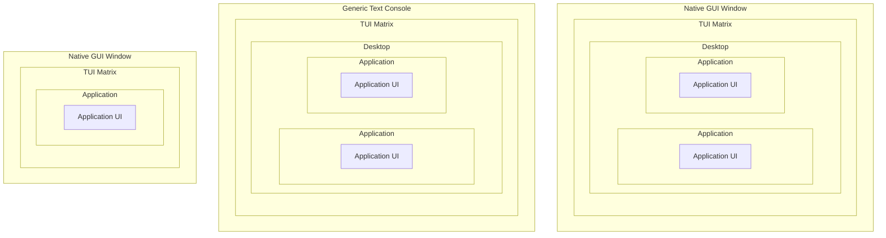
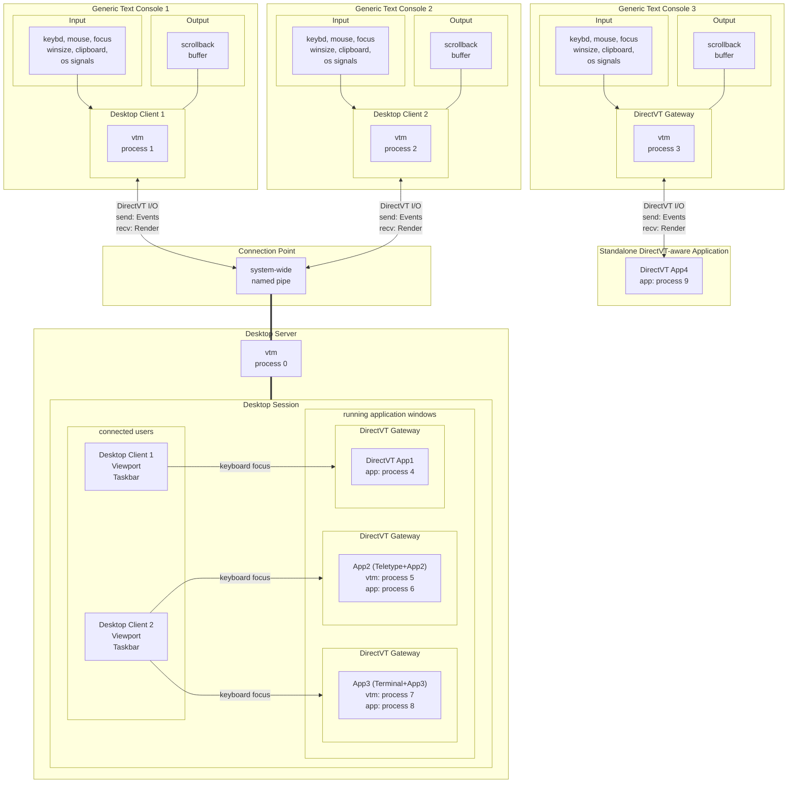

# Text-based Desktop Environment Architecture

- [UI Concept](#ui-concept)
  - [Hybrid TUI](#hybrid-tui)
    - [Advantages of HTUI over TUI and GUI](#advantages-of-htui-over-tui-and-gui)
    - [Logic of HTUI Application Operation](#logic-of-htui-application-operation)
  - [Vtm as a Hybrid TUI Applications Environment](#vtm-as-a-hybrid-tui-applications-environment)
- [Process Model Diagram](#process-model-diagram)
- [Architecture Overview](#architecture-overview)
- [Runtime modes](#runtime-modes)
  - [Desktop applets](#desktop-applets)
- [I/O modes](#io-modes)
  - [DirectVT mode](#directvt-mode)
  - [Classic VT mode](#classic-vt-mode)
    - [Input](#input)
      - [Unix input sources](#unix-input-sources)
      - [MS Windows input sources](#ms-windows-input-sources)
    - [Output](#output)
- [Desktop structure](#desktop-structure)
  - [Desktop objects](#desktop-objects)
- [Quickstart](#quickstart)
  - [Local usage](#local-usage)
    - [Installation](#installation)
    - [Run vtm desktop](#run-vtm-desktop)
    - [Run Teletype Console](#run-teletype-console)
    - [Run Terminal Console](#run-terminal-console)
  - [Remote access](#remote-access)
    - [Run remote desktop/terminal over SSH](#run-remote-desktopterminal-over-ssh)
    - [Remote access using `netcat`](#remote-access-using-netcat-directvt-mode-posix-only-unencrypted-for-private-use-only)
    - [Remote access using `inetd + ncat`](#remote-access-using-inetd--ncat-posix-only-unencrypted-for-private-use-only)
    - [Local standard I/O redirection using `socat`](#local-standard-io-redirection-using-socat-posix-only)
    - [Remote Access using `socat`/`winsocat`](#remote-access-using-socatwinsocat-unencrypted-for-private-use-or-over-vpn)
    - [Remote Access using `socat`/`winsocat` over SSH Reverse Tunnel](#remote-access-using-socatwinsocat-over-ssh-reverse-tunnel)
  - [Standard I/O stream monitoring](#standard-io-stream-monitoring)
  - [Desktop taskbar menu customization](#desktop-taskbar-menu-customization)
  - [Keyboard hacking](#keyboard-hacking)
- [Desktop Live Panel](panel.md)
- [Desktop objects and built-in applications](apps.md)

## UI Concept

### Hybrid TUI

**Hybrid TUI** (**HTUI**), or Hybrid Textual User Interface, is a class of software within **a single executable file** where the entire user interface is represented by a mosaic of text cells forming a **TUI matrix** directly rendered either into its own **GUI window** or into a compatible **text console** providing a **unified user experience** regardless of the execution environment, bridging the gap between **TUI** and **GUI**.

The key technology for **HTUI** is **VT2D** (**Unicode Character Geometry Modifiers**), which allows scaling and transforming individual characters and their parts at the cell level and ensures perfect visual uniformity of the user interface.

#### Advantages of HTUI over TUI and GUI

| Advantage       | Over TUI | Over GUI
|-----------------|----------|---------
| Unified UX      | Provides full graphical rendering (e.g., fonts, shadows, alpha blending) when launched in graphical environment. | Retains full functionality and look when launched in a remote SSH session or existing terminal.
| Single Binary   | Does not require compiling different versions or maintaining separate executables for different modes. | Avoids the need to maintain two entirely separate codebases (terminal and graphical).
| Flexible Launch | The user chooses how to launch the app - from the console or with a double-click - without losing functionality. | Offers the lightweight and minimalist nature of TUI apps with the capabilities of a windowed mode.

#### Logic of HTUI Application Operation

- **Environment check**:
  - If an explicit CLI flag is specified to use TUI or GUI mode, the application will attempt to activate the specified mode.
  - If **no explicit mode is specified**, the application will attempt to launch in **GUI mode**, which provides a full range of capabilities.
  - If the GUI mode is unavailable (for example, the application is running in Session 0), the application starts in **TUI** mode.
- **Unified Interface:**
  - In both modes, the same internal rendering logic is utilized, based on **projecting a virtual TUI matrix onto a canvas** of the graphic window or terminal, ensuring an identical visual appearance.
  - In **GUI** mode, the application renders by leveraging the full potential of VT2D and uses the native API for user input (keyboard, mouse, system events), ensuring **maximum performance and capabilities**.
  - In **TUI** mode, the application adapts to the **limited input/output capabilities** of the host terminal.

### Vtm as a Hybrid TUI Applications Environment

The main goal of the vtm project is to form the foundation of the **Hybrid TUI Application** concept, empowering this class of applications with a reactive UI **driven by DynamicXML+Lua** (similar to WPF with XAML+CLR or web apps with HTML+JS), and to create an environment that reveals their potential.



## Process Model Diagram



## Architecture Overview

- Vtm is a text-based application that comes with a single executable and has a number of runtime modes for running multiple instances in parallel to form the desktop environment.
- A vtm process running in `Desktop Server` mode creates a desktop session.
- Desktop users connect to an existing desktop session through an additional vtm process running in `Desktop Client` mode. The desktop is presented to the user as a **borderless workspace that allows panning** in all **directions** (infinite desktop).
- The desktop session has a unique ID, coined from the platform-specific creator UID, unless explicitly specified otherwise.
- Sessions with different IDs can coexist independently.
- Only the session creator or an elevated user can access the session.
- The "regular" user and the "elevated" user are different independent users despite having the same username.
- The session allows multiple access **in real time**.
- Multiple connected users can share a focused application, while each user can have multiple applications focused.
- Users can disconnect from the session and reconnect later.
- To maximize rendering efficiency and minimize cross-platform issues, along with the character-oriented xterm-compatible I/O mode called `Classic VT`, vtm supports an additional message-based binary I/O mode called `DirectVT`.
- Using `DirectVT` mode (when vtm is running as a `Desktop Client` or `DirectVT Gateway`), vtm has the ability to fully binary deserialize/serialize its state through arbitrary channels (like socat over SSH reverse tunnel) and does not require a running SSH server on the remote side.
- Vtm employs a **Hybrid TUI** (**HTUI**) approach: it can render itself into both GUI windows and terminals (`vtm --gui` and `vtm --tui` flags). Currently, rendering into a native GUI window is only available on the Windows platform.
- In GUI mode, vtm replicates its unique TUI-mode style and windowing mechanics, including keyboard multifocus (activated by `Ctrl+LeftClick`).
- On Windows, any user can launch an **SSH-accessible desktop** session **in Session 0**, running under their own security context and is independent of any active graphical session (requires the vtm service installed via `vtm --install` from an elevated console).
- When running in the **Linux in-kernel VGA Console** or **KMSCON** environment, vtm can directly use any kernel pointer devices (`/dev/input/eventX`) (requires persistent access configured using `sudo vtm --mouse 1`).
- A typical console application integrates into the desktop using the `DirectVT Gateway` window as the DirectVT connection endpoint.
  - A DirectVT-aware application directly connected to the environment can seamlessly send and receive the entire set of desktop events, as well as render itself in a binary form, avoiding expensive `Classic VT` parsing.
  - To run a non-DirectVT application, an additional vtm host process is launched in `Desktop Applet` mode with the `Teletype Console` or `Terminal Console` applet as a DirectVT bridge to the desktop environment.
- The desktop has a built-in Tiling Window Manager for organizing desktop space into non-overlapping panels with Drag and Drop support for moving panels (like in web browsers).
- The user interface supports Lua scripting, allowing scripts to be bound to various internal events via configuration settings, as well as executed directly from child processes via APC sequences.
- The desktop server can receive and execute Lua scripts relayed from other vtm processes (running on behalf of the session creator) via a redirected standard input, or interactively executed from the attached log monitor (`vtm --monitor`).
- In terminal emulator mode (`Teletype Console` or `Terminal Console` launched via `vtm --run vtty` or `vtm --run term`), vtm also supports the following features:
  - Simultaneous output of wrapped and non-wrapped text lines of arbitrary length with horizontal scrolling.
  - An **in-process Win32 Console Server implementation**, which is independent of the standard system `conhost.exe` and compatible with **Windows 8.1** and **Windows Server 2012 Core** (including GUI mode with true-color Unicode rendering).
  - Mouse reports with floating point coordinates, where the cursor position inside a cell is normalized from 0 to 1.
  - Special (Exclusive) keyboard mode for the terminal window to transfer all keyboard events to the terminal as is.
  - A configurable scrollback buffer size (**100k lines by default**, limited by max_int32 and system RAM).
  - Text lookup in the scrollback buffer.
  - Unicode Character Geometry Modifiers VT2D with the ability to output text characters of arbitrary size and in parts (up to 16x4 cells).
  - Stdin/stdout logging.
- Vtm supports the creation of advanced keyboard bindings (generic: `Ctrl+Enter`, literal: `Ctrl+'\n'`, specific: `LeftCtrl+KeyEnter`, scancodes: `0x1D+0x1C`), allowing for the configuration of complex behavior, like a tmux-style prefix key for modality (e.g., toggling window movement with arrow keys).
- The entire user interface can be localized to any language, including those with complex scripts, via a configuration file (rendering is powered by VT2D in GUI mode).
- Vtm has a built-in logging subsystem; the log output is available via the `vtm --monitor` command.
- Used non-standard technologies:
  - DirectVT (binary input and output)
  - VT2D (Unicode Character Geometry Modifiers)
  - DynamicXML (settings configuration)
  - Lua scripting (reactive UI)
  - TUI Shadows (SGR attribute)
  - VT Input Mode (floating point mouse reporting)
  - Hybrid TUI (HTUI)
  - In-process Windows Console Server (Windows 8.1 and later compatibility)
  - Terminal with horizontal scrolling support (wrapped and un-wrapped text lines simultaneously)

## Runtime modes

Runtime mode    | I/O mode                 | Environment role
----------------|--------------------------|------------------
Desktop Applet  | auto detected            | A desktop applet of an arbitrary type running in its own process that accepts user input and renders itself. Used to place a heavy (complex) desktop object in a separate process to optimize desktop resource consumption.
Desktop Client  | auto detected            | A desktop client running in its own process that forwards user input to the desktop and renders the corresponding desktop region with a taskbar overlay.
Desktop Server  | n/a<br>command line only | The desktop environment core that manages connected users, runs desktop applications, routes user input, and forwards render output to desktop clients.
Desktop Monitor | n/a<br>command line only | A desktop log monitor which outputs desktop session logs and relays script commands to the desktop server via standard input redirection.

The runtime mode can be selected using command-line options. By default, `Desktop Client` mode will be used, and `Desktop Server` will be started in parallel if it is not already running.

### Desktop applets

The desktop applet type can be specified using the `vtm [-r [<type>]][<args...>]` command-line option. By default, `vtty` will be used if `<args...>` is specified without any `<type>`.

Desktop applet             | Type   | Host for
---------------------------|--------|----------------------
Teletype Console (default) | `vtty` | CUI applications.
Terminal Console           | `term` | CUI applications.
DirectVT Gateway           | `dtvt` | DirectVT-aware applications.
DirectVT Gateway with TTY  | `dtty` | CUI applications that redirect the DirectVT flow to standard I/O streams and require user input via the platform's TTY.

## I/O modes

A vtm process instance running in `Desktop Client` or `Desktop Applet` mode can operate in one of two I/O modes: either `Classic VT` mode or `DirectVT` (`dtvt`) mode.

### DirectVT mode

In DirectVT mode, vtm process multiplexes the following events:
- Keyboard
- Mouse
- Focus
- Window size
- Clipboard
- Rendering
- Process lifetime control

The DirectVT stream can be wrapped in any transport layer protocol suitable for stdin/stdout transfer, such as SSH.

### Classic VT mode

#### Input

In Classic VT mode, a vtm process parses input from multiple standard sources and forwards it to the desktop server using the DirectVT transport. The set of input sources varies by platform.

##### Unix input sources

- STDIN
    - Bracketed paste marks `\x1b[200~`/`\x1b[201~` are treated as the boundaries of a binary, immutable block pasted from the clipboard. This immutable block is handled independently of keyboard input and forwarded to the clipboard event channel.
    - SGR mouse reporting sequences `\x1b[<s;x;yM/m` are redirected to the mouse event channel.
    - Terminal window focus reporting sequences `\x1b[I`/`\x1b[O` are redirected to the focus event channel.
    - Line style reporting sequences `\x1b[33:STYLEp` are redirected to the style event channel (current/selected line wrapping on/off, left/right/center alignment).
    - All incoming text flow that does not fall into the above categories is clusterized, forming a key-pressed stream forwarded to the keyboard event channel.
- Operating system signals
    - SIGWINCH events are forwarded to the window size event channel.
    - SIGINT events are forwarded to the process lifetime control channel to perform a graceful exit.
    - SIGHUP events are forwarded to the process lifetime control channel to perform a graceful exit.
    - SIGTERM events are forwarded to the process lifetime control channel to perform a graceful exit.
- PS/2 Mouse device (Linux VGA Console (in-kernel console) only)
    - `/dev/input/eventX`: Received pointing device events are decoded and forwarded to the mouse event channel.

##### MS Windows input sources

- ReadConsoleInput events (Win32 Console API)
    - The KEY_EVENT stream is clusterized, forming a key-pressed stream forwarded to the keyboard event channel (excluding repeat modifier keys).
    - The MOUSE_EVENT stream is forwarded to the mouse event channel (excluding double clicks and idle events).
    - The FOCUS_EVENT stream is forwarded to the focus event channel.
    - The WINDOW_BUFFER_SIZE_EVENT stream is forwarded to the window size event channel.
    - The MENU_EVENT stream is interpreted using the Event.MenuEvent.dwCommandId value:
        - 0x8000: The subsequent MENU_EVENT record is forwarded to the style event channel.
        - 0x8001: Clipboard-paste block start (INPUT_RECORD Begin Mark). Subsequent KEY_EVENT records are read until the INPUT_RECORD End Mark appears, and then a whole block of chars is forwarded to the clipboard event channel.
        - 0x8002: Clipboard-paste block end (INPUT_RECORD End Mark).
- Window system-defined messages
    - WM_CREATE event is forwarded to the clipboard event channel.
    - WM_CLIPBOARDUPDATE events are forwarded to the clipboard event channel.
    - WM_ENDSESSION event is interpreted using its sub-parameter's value:
        - ENDSESSION_CLOSEAPP: Registers the CTRL_CLOSE_EVENT signal.
        - ENDSESSION_LOGOFF: Registers the CTRL_LOGOFF_EVENT signal.
        - Any other non-zero value: Registers the CTRL_SHUTDOWN_EVENT signal.
- Operating system signals
    - CTRL_C_EVENT events form the `Ctrl+C` key-pressed event stream forwarded to the keyboard event channel.
    - CTRL_BREAK_EVENT events form the `Ctrl+Break` key-pressed event stream forwarded to the keyboard event channel.
    - CTRL_CLOSE_EVENT event is forwarded to the process lifetime control channel to perform a graceful exit.
    - CTRL_LOGOFF_EVENT event is forwarded to the process lifetime control channel to perform a graceful exit.
    - CTRL_SHUTDOWN_EVENT event is forwarded to the process lifetime control channel to perform a graceful exit.

#### Output

CUI applications running as external processes are instantly rendered into their host `DirectVT Gateways` windows, which run directly in the desktop server's address space.

The desktop server receives and caches window bitmaps, sending incremental changes to desktop clients every tick of an internal timer. 

The binary render stream received from the desktop server is converted by the desktop client into the format suitable for the console being used for output. The console type is detected at desktop client startup and can be one of the following:

  - XTerm-compatible terminal with truecolor support
  - XTerm-compatible terminal with 256-color support (Apple Terminal)
  - XTerm-compatible terminal with 16-color support (Linux VGA Console, 16-color terminals)
  - Win32 Console with 16-color support (Command Prompt on platforms from Windows 8.1 up to Windows 2019 Server) 

The desktop client outputs the received render to the hosting console only when the console is ready to accept the next frame.

## Desktop structure

 Term               | Description
--------------------|---------------
`colored character` | A character depicted with rendition attributes such as background and foreground colors.
`text console`      | A cellular, rectangular surface designed to display colored, monospaced characters in cells.
`text cell`         | A text console cell containing a colored, monospaced character or its fragment.
`bitmap`            | A rectangular block of text cells.
`canvas`            | A rectangular buffer for bitmap output.

Internally, the desktop is represented by a parent-child object tree with a single root object that maintains a desktop-wide configuration, a list of connected users, and a list of running windows. The root object broadcasts a fixed number of ticks every second to update the tree state and to perform other synchronized actions.

Users and windows are associated with the rectangular regions where they are currently placed. For the connected user, it is the viewport of the terminal used to connect to the desktop. For the application window, it is the window rectangle itself.

The desktop has no bounds, and users can navigate the desktop in any direction. For every window located outside the user's viewport, a navigation string appears from the viewport center towards the window's location.

Each desktop window has a canvas for the hosted object's bitmap, sizing grips around the canvas, a window title at the top, and a window footer at the bottom.

The desktop window can host an object instance of an arbitrary type. The hosted object controls all of the hosting window's properties.

### Desktop objects

Desktop object                          | Description
----------------------------------------|----------------------
Teletype Console<br>`teletype`          | A solid, rectangular, truecolor text canvas depicting a freely scrollable buffer of text runs generated by an xterm-compatible parser from the standard output of an attached CUI application. It can be a very heavy object due to maintaining a scrollback buffer of arbitrary length. Not used directly in the desktop process's address space.
Terminal Console<br>`terminal`          | A derivative of `Teletype Console` with additional UI controls.
DirectVT Gateway<br>`dtvt`              | A lightweight truecolor text canvas depicting content received from an external dtvt-aware process.
Teletype Console dtvt‑bridge<br>`vtty`  | A `DirectVT Gateway` hosting an external, standalone `Teletype Console` applet. It is designed to run heavy `Teletype Console` objects as external processes to optimize desktop resource consumption.
Terminal Console dtvt‑bridge<br>`term`  | A `DirectVT Gateway` hosting an external, standalone Terminal Console applet. It is designed to run heavy Terminal Console objects as external processes to optimize desktop resource consumption.
DirectVT Gateway with TTY<br>`dtty`     | A derivative of `DirectVT Gateway` stacked with an additional, limited `Teletype Console` as a controlling terminal. It is used for CUI applications that redirect the DirectVT stream to standard output and require user input via the platform's TTY. Depending on activity, the corresponding console becomes active for the user.
Tiling Window Manager<br>`tile`         | A window container with an organization of the hosting window area into mutually non-overlapping panes for nested windows.
Desktop Region Marker<br>`site`         | A transparent, resizable frame for marking the specific desktop region for quick navigation across the borderless workspace.

Notes:
  - `vtty`/`dtty` as hosts for heavy objects:
    - These heavy objects are typically terminal emulator instances that maintain a scrollback buffer of arbitrary size. By default, this buffer is set to 100,000 lines but can accommodate millions of lines if sufficient memory is available (limited only by `int32_max` count).
    - While a terminal instance starts lightweight, the scrollback buffer (internally a circular buffer) grows over time as application output fills it. This resource consumption is the primary reason for running these specific object types as external processes (`Desktop Applet` mode).
  - Do not confuse the `Desktop Applet` names with the desktop object names, even though they are literally the same, e.g. `vtty` and `term`. Desktop objects of the same name as Desktop Applets are wrappers for heavy desktop objects that should be launched in parallel vtm processes.

# Quickstart

## Local usage

### Installation

Vtm can function perfectly well without explicit installation. However, for ease of launch, vtm can be installed (copied) to %SystemRoot% (usually `C:\Windows`) or `/usr/local/bin`, depending on the platform.

```bash
sudo vtm --install
```

Notes:
  - Mouse support in the Linux VGA Console (in-kernel console) requires direct access to mouse devices. The command `sudo vtm --mouse` grants access to pointing devices for all users.
  - On Windows, the `vtm --install` command will also install a **system service** (vtm `Text-based desktop environment.`), which makes it possible to run the vtm desktop in **Session 0** for connections to it from outside via ssh.

### Run vtm desktop

```bash
#  run desktop in background      ┌─ run desktop client
#                  ─┴──────────  ─┴─
#  ┌─ expanded to `vtm --daemon; vtm`
# ─┴─
  vtm
```

Note: You can explicitly specify running vtm inside the terminal (run `vtm --tui`) or in its own GUI window (run `vtm --gui`). GUI mode is only available on Windows for now.

### Run Teletype Console

```bash
#                                 ┌─ Classic VT console (Teletype, vtty) for any command or TUI App
#                                ─┴──
#      ┌─ expanded to `vtm --run vtty <any_command_or_tui_app>`
# ─────┴────────────────────
  vtm any_command_or_tui_app
```

### Run Terminal Console

```bash
#                                 ┌─ use Terminal Console to run any_command_or_tui_app or user default shell
#                                ─┴──
#      ┌─ expanded to `vtm --run term <any_command_or_tui_app or user_default_shell (if empty)>`
# ─────┴──────────────────────────────
  vtm -r term [any_command_or_tui_app]
```

## Remote Access

- In general, the local and remote platforms may be different.
- When the DirectVT mode is used, all keyboard, mouse, and other input events are transmitted between hosts in a binary form.
- The following examples assume that vtm is accessible via PATH on both the local and remote sides. 

### Run remote desktop/terminal over SSH

Note: vtm (as a desktop client or standalone terminal) can be run in an existing interactive SSH session as a regular TUI application in Classic VT mode.

In the Classic VT console (Teletype, Terminal), vtm always runs in Classic VT mode:
```bash
#                                               ┌─ Classic VT console (Teletype, vtty) for any command or TUI App
#                                              ─┴──
#  ┌ ssh/ssh.exe     ┌─ expanded to `vtm --run vtty [any_remote_command_or_tui_app]`
# ─┴─             ───┴───────────────────────────────
  ssh user@server vtm [any_remote_command_or_tui_app]
#                 ┬┬─  ─────────────┬───────────────
# <─ Classic VT <─┘└<─ Classic VT <─┘
```

DirectVT mode will be automatically enabled if vtm is started inside the DirectVT console (DirectVT Gateway):
```bash
#    DirectVT Gateway with TTY (DirectVT console) for DirectVT content received from an external dtvt-aware process
#                              ─┴──
#    ┌─ expanded to `vtm --run dtty ssh`
#    │                   ┌─ expanded to `vtm --run vtty <any_remote_command_or_tui_app>`
# ───┴───             ───┴───────────────────────────────
  vtm ssh user@server vtm <any_remote_command_or_tui_app>
# ─┬─                 ┬┬   ─────────────┬───────────────
#  └ binary DirectVT ─┘└<─ Classic VT <─┘
```
...or with verbose syntax, allowing the use of any dtvt-aware source, not just ssh:
```bash
#  DirectVT ─┐    ┌ any ssh/ssh.exe command ┌─ Classic VT console (Teletype, vtty) for TUI App
#   console ─┴── ─┴─────────────           ─┴──
  vtm --run dtty ssh user@server vtm --run vtty <any_remote_command_or_tui_app>
# ─┬────────────                 ─┬┬             ──────────────┬──────────────
#  └─── binary DirectVT stream ───┘└<─── Classic VT stream <───┘
```

Short command to access remote vtm desktop over SSH:
```bash
#    ┌─ expanded to `vtm --run dtty ssh`
#    │                 ┌─ expanded to `vtm --daemon; vtm`
# ───┴───             ─┴─
  vtm ssh user@server vtm
# ─┬─                 ─┬─
#  └ binary DirectVT ──┘
```

### Remote access using `netcat` (DirectVT mode, POSIX only, unencrypted, for private use only)

- Remote side
  ```bash
    ncat -l tcp_port -k -e vtm
  #      ─┬───────── ─┬ ─┬────
  #       │           │  └ run vtm for every connected client
  #       │           └ keep connection open for multiple clients
  #       └ specifies tcp port to listen
  ```
- Local side
  ```bash
  #         ┌─ DirectVT Gateway (dtvt) for content received from ncat
  #        ─┴──
    vtm -r dtvt ncat remote_ip remote_tcp_port
  ```

### Remote access using `inetd + ncat` (POSIX only, unencrypted, for private use only)

- Remote side
  - Install `inetd`.
  - Add the following line to the `/etc/inetd.conf`:
    ```bash
      tcp_port stream tcp nowait user_name /remote/side/path/to/vtm  vtm
    # ──────┬─                   ─┬───────
    #       │                     └ user login name
    #       └ tcp port to listen
    ```
  - Launch `inetd`:
    ```
    inetd
    ```
- Local side
  ```bash
  #         ┌─ DirectVT Gateway (dtvt) for content received from ncat
  #        ─┴──
    vtm -r dtvt ncat remote_ip remote_tcp_port
  ```

### Local standard I/O redirection using `socat` (POSIX only)

- Host side
  ```
  mkfifo in && mkfifo out
  vtm >out <in
  ```
- User side
  ```bash
  #         ┌─ DirectVT Gateway (dtvt) for content received from socat
  #        ─┴──
    vtm -r dtvt socat open:out\!\!open:in stdin\!\!stdout
  ```

### Remote Access using `socat`/`winsocat` (unencrypted, for private use or over VPN)

The remote and local sides may differ in platform.

#### Unix

- Local side with ip=1.2.3.4 (waiting for a connection from a remote on 1122tcp - a random available TCP port)
  ```bash
  #                        ┌> relay dtvt-stream ┐
  #                   ─────┴───────── ──────────┴────
    vtm -r dtvt socat tcp-listen:1122 stdin\!\!stdout
  # ─┬─────────                       ───┬───────────
  #  └< binary DirectVT <────────────────┘
  ```
- Remote side - run vtm desktop and forward its stdio to the side with ip=1.2.3.4
  ```bash
    socat tcp:1.2.3.4:1122 exec:"vtm"
  #       ─┬──────────────       ─┬─
  #        └< relay dtvt-stream <─┘
  ```

The client and server roles can be swapped:

- Local side (connect to 1.2.3.4:1122tcp)
  ```bash
  vtm -r dtvt socat tcp:1.2.3.4:1122 stdin\!\!stdout
  ```
- Remote side with ip=1.2.3.4 (vtm desktop waits for a connection on 1122tcp from a remote)
  ```bash
  socat tcp-listen:1122 exec:"vtm"
  ```

#### Windows

- Install `winsocat`
  ```
  winget install winsocat
  ```

- Local side with ip=1.2.3.4 (waiting for a connection from a remote on 1122tcp - a random available TCP port)
  ```bash
  vtm -r dtvt winsocat tcp-listen:1122 stdio
  ```
- Remote side - run vtm desktop and forward its stdio to the side with ip=1.2.3.4
  ```bash
  winsocat tcp:1.2.3.4:1122 exec:"vtm"
  ```

### Remote Access using `socat`/`winsocat` over SSH Reverse Tunnel

Notes:
- The remote and local platforms may differ.
- Using the **localhost** name may cause connection issues with the IP address family (IPv4: `127.0.0.1` vs. IPv6: `[::1]`) between remote systems. Use an explicit IP address to avoid this.

#### Unix

- Remote side
  ```bash
  #   Run reverse tunnel for 1122tcp in background
  #                         ┌─ relay all traffic passed through 127.0.0.1:1122tcp to the remote host
  #                ─────────┴────
    ssh -N -R 1122:127.0.0.1:1122 user@1.2.3.4 &
  #     ─┬ ─┬─────                ─┬────────── ┬
  #      │  └─ listen on remote    │           └─ run in background
  #      │                         └─ remote host
  #      └─ do nothing on remote just listen 1122tcp
  #
  # Save the background process' PID
  ssh_tunnel_pid=$!
  #
  # Run vtm and forward its stdio (in dtvt format) streams to 127.0.0.1:1122.
  #            ┌──────< relay dtvt-stream <─────┐      ┌─ kill the ssh reverse tunnel after vtm exits
  #       ─────┴────────────────────────       ─┴─   ──┴─────────────────
    socat tcp-listen:1122,bind=127.0.0.1 exec:"vtm"; kill $ssh_tunnel_pid
  #       ─────┬────────────────────────
  #            └─ wait for forwarded connections on 127.0.0.1:1122tcp
  # or reversed
  # socat exec:"vtm" tcp-listen:1122,bind=127.0.0.1; kill $ssh_tunnel_pid
  ```
- Local side with ip=1.2.3.4 (connect to the remote vtm desktop via 127.0.0.1:1122tcp)
  ```bash
  #    ┌──────────< binary DirectVT <─────────────┐
  # ───┴───────                          ─────────┴─────
    vtm -r dtvt socat tcp:127.0.0.1:1122 stdin\!\!stdout
  #                   ────┬───────────── ─────────┬─────
  #                       └─> relay dtvt-stream >─┘
  ```

#### Windows

- Install `winsocat`
  ```
  winget install winsocat
  ```
- Remote side
  ```pwsh
  # Run reverse tunnel for 1122tcp in background.
  $process = Start-Process "ssh" "-N -R 1122:127.0.0.1:1122 user@1.2.3.4" -PassThru -WindowStyle Minimized
  # Run vtm and forward its stdio streams to 127.0.0.1:1122.
  #               ┌──────< relay dtvt-stream <─────┐      ┌─ kill the ssh reverse tunnel after vtm exits
  #          ─────┴────────────────────────       ─┴─   ──┴─────────────────────────
    winsocat tcp-listen:1122,bind=127.0.0.1 exec:"vtm"; Stop-Process -Id $process.Id
  #          ─────┬────────────────────────
  #               └─ wait for forwarded connections on 127.0.0.1:1122tcp
  # or
  # winsocat exec:"vtm" tcp-listen:1122,bind=127.0.0.1; Stop-Process -Id $process.Id
  ```
- Local side with ip=1.2.3.4 (connect to the remote vtm desktop via 127.0.0.1:1122tcp)
  ```pwsh
  #    ┌───────< binary DirectVT <─────────────┐
  # ───┴───────                             ───┴─
    vtm -r dtvt winsocat tcp:127.0.0.1:1122 stdio
  #                      ┬───────────────── ───┬─
  #                      └> relay dtvt-stream >┘
  # Kill the abandoned winsocat process (it keeps running for some reason)
  Get-Process -Name "winsocat" | Stop-Process -Force
  ```

## Standard I/O stream monitoring

It is possible to visualize standard input/output streams of running CUI applications. Launched in the `Log Monitor` mode (`vtm -m`), vtm will log the event stream of each terminal window where the `Logs` switch is enabled.

Important: Avoid enabling the `Logs` switch in the terminal window hosting the `Log Monitor` process itself, as this may lead to recursive event logging with unpredictable results.

## Desktop taskbar menu customization

The taskbar menu can be configured using a settings file `~/.config/vtm/settings.xml` (`%USERPROFILE%\.config\vtm\settings.xml` on Windows):
```xml
<config>
    <desktop>
        <taskbar>
            <!-- <item*/> --> <!-- Uncomment to clear the default item list. -->
            <item splitter label="Remote Access"/>

            <item id="Run remote vtm desktop in DirectVT mode over SSH"    type="dtty" cmd="ssh user@server vtm"/>
            <item id="Run console app in remote terminal over SSH"         type="dtty" cmd="ssh user@server vtm -r term </path/to/console/app...>"/>
            <item id="Run console app remotely over SSH w/o extra UI"      type="dtty" cmd="ssh user@server vtm </path/to/console/app...>"/>

            <item splitter label="More Examples"/>

            <item id="Far Manager"             type="vtty" cmd="far"/>
            <item id="Far Manager in terminal" type="dtvt" cmd="$0 -r term far"/>

            <item id="Midnight Commander"             type="vtty" cmd="mc"/>
            <item id="Midnight Commander in terminal" type="dtvt" cmd="$0 -r term mc"/>

            <item id="Remote cmd in terminal over SSH" type="dtty" cmd="ssh user@server vtm -r term cmd"/>
            <item id="Remote cmd over SSH"             type="dtty" cmd="ssh user@server vtm cmd"/>
            <item id="Remote Far Manager over SSH"     type="dtty" cmd="ssh user@server vtm far"/>
            <item id="Remote wsl over SSH"             type="dtty" cmd="ssh user@server vtm wsl"/>
            <item id="Remote mc over SSH"              type="dtty" cmd="ssh user@server vtm mc"/>
            <item id="Remote wsl mc over SSH"          type="dtty" cmd="ssh user@server vtm wsl mc"/>
        </taskbar>
    </desktop>
</config>
```

## Keyboard hacking

It is possible to emulate the tmux-like keyboard prefix approach by using a global variable in the Lua scripting runspace. As an example, the following configuration adds the keyboard shortcut `Ctrl+B` as a toggle for an additional keyboard mode (coupled with a user-defined variable named `kbmodifier` - a table of Boolean values unique to each connected user: `kbmodifier[vtm.gate]`) that allows windows to be moved directly using the arrow keys:

- `~/.config/vtm/settings.xml`:
  ```xml
  <config>
      <events>
          <gate>
              <script="if kbmodifier == nil then kbmodifier = {}; end;" on="release: e2::form::upon::started"/> <!-- Initialize `kbmodifier` table if it is not initialized. -->
              <script="kbmodifier[vtm.gate] = nil;"                     on="release: e2::form::upon::stopped"/> <!-- Remove user specific kbmodifier state on user disconnect. -->
          </gate>
          <desktop>
              <SetMark="vtm.gate.SetOverlay(0, kbmodifier[vtm.gate] and '\\n\\x1b[11:2p\\x1b[41mB' or ''); vtm.gate.Deface();"/> <!-- `SetMark` macro. If the kbmodifier is active, draw a visual red "B" mark near the right side of the viewport. -->
              <script="kbmodifier[vtm.gate] = not kbmodifier[vtm.gate];" | SetMark  on="Ctrl+B"/> <!-- Emulate tmux-like prefix key. Store the mode state value in the `kbmodifier` table using a unique vtm.gate (user's console) value for each user. -->
              <script="" on="Alt+Z"        /> <!-- Unbind existing FocusTaskbar binding.    -->
              <script="" on="Ctrl+PageUp"  /> <!-- Unbind existing FocusPrevWindow binding. -->
              <script="" on="Ctrl+PageDown"/> <!-- Unbind existing FocusNextWindow binding. -->
          </desktop>
          <applet> <!-- Key bindings for the application window. -->
              <KeyFilter=prerun prerun="if (not kbmodifier[vtm.gate] and vtm.gear.Bypass()) then return; end; "/> <!-- `KeyFilter` macro. Do nothing if `kbmodifier[vtm.gate]` is false. Calling vtm.gear.Bypass() always returns true. -->
              <script=KeyFilter | MoveAppletLeft         on="LeftArrow"                                  /> <!-- The ` | ` operator concatenates script fragments/macros. If for some reason the keyboard event is not processed by anyone, it will then return and fire on this object, so the KeyFilter's script is also reused at the beginning of the `script="..."`. -->
              <script=KeyFilter | MoveAppletRight        on="RightArrow"                                 /> <!-- The `prerun` attribute (inherited from KeyFilter) contains a Lua script that will be executed during pre-polling to filter out key events. -->
              <script=KeyFilter | MoveAppletUp           on="UpArrow"                                    /> <!-- When `kbmodifier[vtm.gate]` is true, you can move windows using the arrow keys. -->
              <script=KeyFilter | MoveAppletDown         on="DownArrow"                                  /> <!-- Macros like `MoveApplet...` are defined in the default configuration. You can list them with `vtm -l`. -->
              <script=KeyFilter | MoveAppletTopLeft      on="LeftArrow+UpArrow    | UpArrow+LeftArrow"   /> <!-- Simultaneous key presses should also be processed if supported. -->
              <script=KeyFilter | MoveAppletBottomLeft   on="LeftArrow+DownArrow  | DownArrow+LeftArrow" /> <!-- It is convenient to specify multiple keyboard shortcuts in one definition separated by `|`. -->
              <script=KeyFilter | MoveAppletTopRight     on="RightArrow+UpArrow   | UpArrow+RightArrow"  />
              <script=KeyFilter | MoveAppletBottomRight  on="RightArrow+DownArrow | DownArrow+RightArrow"/>
              <script=KeyFilter | IncreaseAppletWidth    on="Ctrl+RightArrow"                            />
              <script=KeyFilter | DecreaseAppletWidth    on="Ctrl+LeftArrow"                             />
              <script=KeyFilter | IncreaseAppletHeight   on="Ctrl+DownArrow"                             />
              <script=KeyFilter | DecreaseAppletHeight   on="Ctrl+UpArrow"                               />
              <script=KeyFilter | FocusPrevWindow        on="PageUp"                                     />
              <script=KeyFilter | FocusNextWindow        on="PageDown"                                   />
              <script=KeyFilter | FocusTaskbar           on="preview: -Esc"                              /> <!-- Focus taskbar on Esc unpress. The `on="Esc"` combination is busy in bindings like `"Esc+..."`. -->
          </applet>
      </events>
  </config>
  ```

# Desktop Live Panel

- [Desktop Live Panel](panel.md)

# Desktop objects and built-in applications

- [Desktop objects and built-in applications](apps.md)

#### 28 Feb 2025: The following functionality is under development:

Additionally, the taskbar menu of the running desktop can be configured using shell piped redirection by sending script commands to the running vtm desktop:
```
# Delete existing menu items
echo "vtm.taskbar.Del()" | vtm
```
```
# Add new menu items
echo "vtm.taskbar.Set({ id='Term', label='Terminal', type='dtvt', cmd='vtm -r term' })" | vtm
echo "vtm.taskbar.Set({ id='White', label='White Terminal', type='dtvt', cmd='vtm -r term', cfg='<config><terminal><colors><default fgc=0xFF000000 bgc=0xFFffffff/></colors></terminal></config>' })" | vtm
echo "vtm.taskbar.Set({ id='Huge', label='Huge Terminal', type='dtvt', cmd='vtm -r term', cfg='<config><terminal><scrollback size=500000/></terminal></config>' })" | vtm
echo "vtm.taskbar.Set({ id='Tile', label='Three Terminals', type='tile', cmd='v(h(Term, White), Huge)' })" | vtm
echo "vtm.taskbar.Set({ id='cmd', label='Remote cmd over SSH', type='dtty', cmd='ssh user@server vtm cmd' })" | vtm
```
```
# Set default menu item
echo "vtm.taskbar.Selected('Term')" | vtm
```
```
# Run window with terminals
echo "vtm.desktop.Run({ id='Tile' })" | vtm
```
