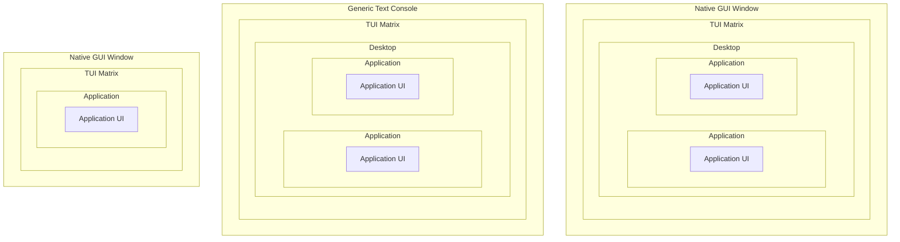
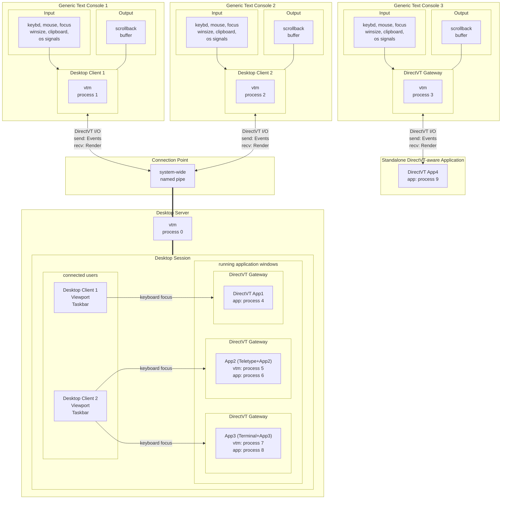

# Text-based Desktop Environment Architecture

- [UI Concept](#ui-concept)
- [Process model](#process-model)
- [Runtime modes](#runtime-modes)
- [Desktop applets](#desktop-applets)
- [I/O modes](#io-modes)
  - [DirectVT mode](#directvt-mode)
  - [ANSI/VT mode](#ansivt-mode)
    - [Input](#input)
      - [Unix input sources](#unix-input-sources)
      - [MS Windows input sources](#ms-windows-input-sources)
    - [Output](#output)
- [Desktop structure](#desktop-structure)
  - [Desktop objects](#desktop-objects)
- [Quickstart](#quickstart)
  - [Local usage](#local-usage)
    - [Run vtm desktop](#run-vtm-desktop)
    - [Run Terminal Console standalone](#run-terminal-console-standalone)
    - [Run a CUI application standalone](#run-a-cui-application-standalone)
    - [Run a CUI application inside the Terminal Console](#run-a-cui-application-inside-the-terminal-console)
  - [Remote access](#remote-access)
    - [Run a standalone CUI application remotely over SSH](#run-a-standalone-cui-application-remotely-over-ssh)
    - [Run remote vtm desktop in DirectVT mode over SSH](#run-remote-vtm-desktop-in-directvt-mode-over-ssh)
    - [Run remote vtm desktop in ANSI/VT mode over SSH](#run-remote-vtm-desktop-in-ansivt-mode-over-ssh)
    - [Run remote vtm desktop in DirectVT mode using netcat](#run-remote-vtm-desktop-in-directvt-mode-using-netcat-posix-only-unencrypted-for-private-use-only)
    - [Run remote vtm desktop in DirectVT mode using inetd + ncat](#run-remote-vtm-desktop-in-directvt-mode-using-inetd--ncat-posix-only-unencrypted-for-private-use-only)
    - [Local standard I/O redirection using socat](#local-standard-io-redirection-using-socat-posix-only)
  - [Standard I/O stream monitoring](#standard-io-stream-monitoring)
  - [Desktop taskbar menu customization](#desktop-taskbar-menu-customization)
  - [Keyboard hacking](#keyboard-hacking)
- [Desktop Live Panel](panel.md)
- [Desktop objects and built-in applications](apps.md)

## UI Concept



Vtm is a text-based application where the entire user interface is represented by a mosaic of text cells forming a TUI matrix. The resulting TUI matrix is just rendered either into its own GUI window or into a compatible text console.

It can wrap any console application and be nested indefinitely, forming a text-based desktop environment.

<sup>Currently, rendering into a native GUI window is only available on the Windows platform; on Unix platforms, a terminal emulator is required.</sup>

## Process model



- Vtm is a text-based application that comes with a single executable and has a number of runtime modes for running multiple instances in parallel to form the desktop environment.
- A vtm process running in `Desktop Server` mode creates a desktop session.
- Desktop users connect to an existing desktop session through an additional vtm process running in `Desktop Client` mode.
- The desktop session has a unique id coined from the platform-specific creator UID unless explicitly specified.
- Only the session creator or elevated user can access the session.
- The regular user and the elevated user are different independent users despite having the same username.
- The session allows multiple access in real time.
- Multiple connected users can share a focused application, while each user can have multiple applications focused.
- Users can disconnect from the session and reconnect later.
- Sessions with different ids can coexist independently.
- To maximize rendering efficiency and minimize cross-platform issues, along with character-oriented xterm-compatible I/O mode called `ANSI/VT`, vtm supports an additional message-based binary I/O mode called `DirectVT`.
- A typical console application integrates into the desktop using the `DirectV Gateway` window as the DirectVT connection endpoint.
  - A DirectVT-aware application directly connected to the environment can seamlessly send and receive the entire set of desktop events, as well as render themselves in binary form, avoiding expensive ANSI/VT parsing.
  - To run a non-DirectVT application, an additional vtm host process is launched in `Desktop Applet` mode with the `Teletype Console` or `Terminal Console` applet as a DirectVT bridge to the desktop environment.
- The desktop server can receive and execute script commands relayed from other vtm processes running on behalf of the session creator.
- In the case of a vtm process with redirected standard input, all standard input is directly relayed to the desktop server as a script command flow.

### Runtime modes

Runtime mode    | I/O mode                 | Environment role
----------------|--------------------------|------------------
Desktop Applet  | auto detected            | A desktop applet of an arbitrary type running in its own process that accepts user input and renders itself. Used to place a heavy (complex) desktop object in a separate process in order to optimize desktop resource consumption.
Desktop Client  | auto detected            | A desktop client running in its own process that forwards user input to the desktop and renders the corresponding desktop region with a taskbar overlay.
Desktop Server  | n/a<br>command line only | The desktop environment core that manages connected users, runs desktop applications, routes user input, and forwards renders to desktop clients.
Desktop Monitor | n/a<br>command line only | A desktop log monitor which outputs desktop session logs and relays script commands to the desktop server via piped redirection.

The runtime mode can be selected using command-line options. By default, `Desktop Client` mode will be used, and `Desktop Server` will be started in parallel if it is not running.

### Desktop applets

The desktop applet type can be specified using the `vtm [-r [<type>]][<args...>]` command-line option. By default, `vtty` will be used if `<args...>` is specified without any `<type>`.

Desktop applet             | Type   | Host for
---------------------------|--------|----------------------
Teletype Console (default) | `vtty` | CUI applications.
Terminal Console           | `term` | CUI applications.
DirectVT Gateway           | `dtvt` | DirectVT-aware applications.
DirectVT Gateway with TTY  | `dtty` | CUI applications that redirect DirectVT flow to standard I/O streams and require user input via platform's TTY.

## I/O modes

A vtm process instance running in `Desktop Client` or `Desktop Applet` mode can operate in one of two I/O modes: either `ANSI/VT` mode or `DirectVT`(`dtvt`) mode.

### DirectVT mode

In DirectVT mode, vtm process multiplexes the following events:
- Keyboard
- Mouse
- Focus
- Window size
- Clipboard
- Rendering
- Process lifetime control

The DirectVT stream can be wrapped in any transport layer protocol suitable for stdin/stdout transfer, such as SSH.

### ANSI/VT mode

#### Input

In ANSI/VT mode, vtm process parses input from multiple standard sources, and forwards it to the desktop server using the DirectVT transport. The set of input sources varies by platform.

##### Unix input sources

- STDIN
    - Bracketed paste marks `\x1b[200~`/`\x1b[201~` are treated as the boundaries of a binary immutable block pasted from the clipboard. This immutable block is handled independently of keyboard input and forwarded to the clipboard event channel.
    - SGR mouse reporting sequences `\x1b[<s;x;yM/m` are redirected to the mouse event channel.
    - Terminal window focus reporting sequences `\x1b[I`/`\x1b[O` are redirected to the focus event channel.
    - Line style reporting sequences `\x1b[33:STYLEp` are redirected to the style event channel (current/selected line wrapping on/off, left/right/center alignment).
    - All incoming text flow that does not fall into the above categories is clusterized, forming a key pressed stream forwarded to the keyboard event channel.
- Operating system signals
    - SIGWINCH events are forwarded to the window size event channel.
    - SIGINT events are forwarded to the process lifetime control channel to perform graceful exit.
    - SIGHUP events are forwarded to the process lifetime control channel to perform graceful exit.
    - SIGTERM events are forwarded to the process lifetime control channel to perform graceful exit.
- PS/2 Mouse device (Linux VGA Console (in-kernel console) only)
    - `/dev/input/mice`: Received ImPS/2 mouse protocol events are decoded and forwarded to the mouse event channel.
    - `/dev/input/mice.vtm` (used in case of inaccessibility of `/dev/input/mice`)

##### MS Windows input sources

- ReadConsoleInput events (Win32 Console API)
    - The KEY_EVENT stream is clusterized, forming a key pressed stream forwarded to the keyboard event channel (excluding repeat modifier keys).
    - The MOUSE_EVENT stream is forwarded to the mouse event channel (excluding double clicks and idle events).
    - The FOCUS_EVENT stream is forwarded to the focus event channel.
    - The WINDOW_BUFFER_SIZE_EVENT stream is forwarded to the window size event channel.
    - The MENU_EVENT stream is interpreted using the Event.MenuEvent.dwCommandId value:
        - 0x8000: The subsequent MENU_EVENT record is forwarded to the style event channel.
        - 0x8001: Clipboard-paste block start (INPUT_RECORD Begin Mark). Subsequent KEY_EVENT records are read until the INPUT_RECORD End Mark appears, and then a whole block of chars is forwarded to the clipboard event channel.
        - 0x8002: Clipboard-paste block end (INPUT_RECORD End Mark).
- Window system-defined messages
    - WM_CREATE event is forwarded to the clipboard event channel.
    - WM_CLIPBOARDUPDATE events are forwarded to the clipboard event channel.
    - WM_ENDSESSION event is interpreted using its sub-parameter's value:
        - ENDSESSION_CLOSEAPP: Register CTRL_CLOSE_EVENT signal.
        - ENDSESSION_LOGOFF: Register CTRL_LOGOFF_EVENT signal.
        - any other non-zero: Register CTRL_SHUTDOWN_EVENT signal.
- Operating system signals
    - CTRL_C_EVENT events are form the `Ctrl+C` key pressed event stream forwarded to the keyboard event channel.
    - CTRL_BREAK_EVENT events are form the `Ctrl+Break` key pressed event stream forwarded to the keyboard event channel.
    - CTRL_CLOSE_EVENT event is forwarded to the process lifetime control channel to perform graceful exit.
    - CTRL_LOGOFF_EVENT event is forwarded to the process lifetime control channel to perform graceful exit.
    - CTRL_SHUTDOWN_EVENT event is forwarded to the process lifetime control channel to perform graceful exit.

#### Output

CUI applications running as external processes are instantly rendered into their host `DirectVT Gateways` windows running directly in the desktop server address space.

The desktop server receives and caches window bitmaps and sends incremental changes to desktop clients every tick of an internal timer.

The binary render stream received from the desktop server to output is converted by the desktop client to the format suitable for the console being used to output. The console type is detected at the desktop client startup and can be one of the following:
- XTerm-compatible terminal with truecolor support
- XTerm-compatible terminal with 256-color support (Apple Terminal)
- XTerm-compatible terminal with 16-color support (Linux VGA Console, 16-color terminals)
- Win32 Console with 16-color support (Command Prompt on platforms from Windows 8.1 upto Windows 2019 Server)

The desktop client outputs the received render to the hosting console only when the console is ready to accept the next frame.

## Desktop structure

 Term               | Description
--------------------|---------------
`colored character` | A character depicted with rendition attributes such as background and foreground colors.
`text console`      | A cellular rectangular surface designed to display colored monospaced characters in cells.
`text cell`         | A text console cell containing a colored monospaced character or its fragment.
`bitmap`            | A rectangular block of text cells.
`canvas`            | A rectangular buffer for bitmap output.

Internally the desktop is represented by the parent-child object tree with a single root object that maintains a desktop-wide configuration, a list of connected users, and a list of running windows. The root object broadcasts a fixed number of ticks every second to update the tree state and to do something else in sync.

Users and windows are associated with the rectangular regions where they are placed at the moment. For the connected user it is a viewport of the terminal used to connect to the desktop. For the application window it is a window rectangle itself.

Desktop has no bounds and users can navigate the desktop in any direction. For every window located outside the user viewport the navigation string apeears from the viewport center towards the window location.

Each desktop window has a canvas for the hosted object bitmap, sizing grips around the canvas, a window title at the top, and a window footer at the bottom.

The desktop window can host an object instance of an arbitrary type. The hosted object controls all the hosting window's properties.

### Desktop objects

Desktop object                          | Description
----------------------------------------|----------------------
Teletype Console<br>`teletype`          | A solid rectangular truecolor text canvas depicting a freely scrollable buffer of the text runs generated by an xterm-compatible parser from the standard output of an attached CUI application. It can be a very heavy object due to maintaining a scrollback buffer of arbitrary length. Not used directly in the desktop process's address space.
Terminal Console<br>`terminal`          | A derivative of `Teletype Console` with additional UI controls.
DirectVT Gateway<br>`dtvt`              | A lightweight truecolor text canvas depicting content received from an external dtvt-aware process.
Teletype Console dtvt‑bridge<br>`vtty`  | A `DirectVT Gateway` hosting an external standalone `Teletype Console` applet. It is designed to run heavy `Teletype Console` objects as external processes to optimize desktop resource consumption.
Terminal Console dtvt‑bridge<br>`term`  | A `DirectVT Gateway` hosting an external standalone `Terminal Console` applet. It is designed to run heavy `Terminal Console` objects as external processes to optimize desktop resource consumption.
DirectVT Gateway with TTY<br>`dtty`     | A derivative of `DirectVT Gateway` stacked with additional limited `Teletype Console` as a controlling terminal. It is used for CUI applications that redirect DirectVT stream to standard output and require user input via platform's TTY. Depending on activity the corresponding console became active for the user.
Tiling Window Manager<br>`tile`         | A window container with an organization of the hosting window area into mutually non-overlapping panes for nested windows.
Desktop Region Marker<br>`site`         | A transparent resizable frame for marking the specific desktop region for quick navigation across the borderless workspace.

Do not confuse the `Desktop Applet` names with the desktop object names, even though they are the same literally, e.g. `vtty` and `term`. Desktop objects of the same name as Desktop Applets are wrappers for heavy desktop objects that should be launched in parallel vtm processes.

# Quickstart

## Local usage

### Installation

Vtm can function perfectly well without explicit installation. However, for ease of launch, vtm can be installed (copied) to %SystemRoot% (usually `C:\Windows`) or `/usr/local/bin`, depending on the platform.

- Run command:
  ```bash
  sudo vtm --install
  ```

Note: Mouse support in the Linux VGA Console (in-kernel console) requires direct access to mouse devices. The command `sudo vtm --mouse` grants access to pointing devices for all users.

### Run vtm desktop

- Run command:
  ```bash
  vtm
  ```

Note: You can explicitly specify to run vtm inside the terminal (run `vtm --tui`) or in its own GUI window (run `vtm --gui`). GUI mode is only available on Windows for now.

### Run Terminal Console standalone

- Run command:
  ```bash
  vtm -r term
  ```

### Run a CUI application standalone

- Run command:
  ```bash
  vtm </path/to/console/app...>
  ```

### Run a CUI application inside the Terminal Console

- Run command:
  ```bash
  vtm -r term </path/to/console/app...>
  # The `vtm -r term` option means to run the Terminal Console standalone to host a CUI application.
  ```

## Remote access

In general, the local and remote platforms may be different.

When the DirectVT mode is used, all keyboard, mouse and other input events are transmitted between hosts in a binary form.

The following examples assume that vtm is installed on both the local and remote sides.

### Run a standalone CUI application remotely over SSH

- Remote side
  - Make sure the remote SSH server is running.
- Local side
  - Run command:
    ```bash
    vtm -r dtty ssh user@server vtm -r vtty </path/to/console/app...>
    # The `vtm -r dtty` option means to run the next statement in DirectVT&TTY console.
    # The `ssh user@server vtm -r vtty` statement means to connect via ssh and launch the Teletype Console on the remote host.
    ```
    or
    ```bash
    vtm ssh user@server vtm </path/to/console/app...>
    ```

### Run remote vtm desktop in DirectVT mode over SSH

- Remote side
  - Make sure the remote SSH server is running.
- Local side
  - Run command:
    ```bash
    vtm -r dtty ssh user@server vtm
    # The `vtm -r dtty` option means to run the next statement in DirectVT&TTY console.
    # The `ssh user@server vtm` statement means to connect via ssh and run the vtm desktop on the remote host.
    ```
    or
    ```bash
    vtm ssh user@server vtm
    # The `-r dtty` option is auto added if the first command-line argument starts with `ssh` keyword.
    ```

### Run remote vtm desktop in ANSI/VT mode over SSH

- Remote side
  - Make sure the remote SSH server is running.
- Local side
  - Run commands:
    ```bash
    ssh user@server
    vtm
    ```
    or
    ```bash
    ssh -t user@server vtm
    # The ssh's `ssh -t ...` option is required to force TTY allocation on the remote host.
    ```

### Run remote vtm desktop in DirectVT mode using `netcat` (POSIX only, unencrypted, for private use only)

- Remote side
  - Run command:
    ```bash
    ncat -l tcp_port -k -e vtm
    # ncat's option `-l tcp_port` specifies tcp port to listen.
    # ncat's option `-k` to keep connection open for multiple clients.
    # ncat's option `-e` to run vtm for every connected client.
    ```
- Local side
  - Run command:
    ```bash
    vtm -r dtvt ncat remote_ip remote_tcp_port
    # The `vtm -r dtvt` option means to run DirectVT Gateway to host ncat.
    # Note: Make sure `ncat` is installed.
    ```

### Run remote vtm desktop in DirectVT mode using `inetd + ncat` (POSIX only, unencrypted, for private use only)

- Remote side
  - Install `inetd`.
  - Add the following line to the `/etc/inetd.conf`:
    ```bash
    tcp_port stream tcp nowait user_name /remote/side/path/to/vtm  vtm
    # `tcp_port`: tcp port to listen.
    # `user_name`: user login name.
    ```
  - Launch `inetd`:
    ```
    inetd
    ```
- Local side
  - Run command:
    ```bash
    vtm -r dtvt ncat remote_ip remote_tcp_port
    ```

### Local standard I/O redirection using `socat` (POSIX only)

- Host side
  - Run commands:
    ```
    mkfifo in && mkfifo out
    vtm >out <in
    ```
- User side
  - Run command:
    ```bash
    vtm -r dtvt socat open:out\!\!open:in stdin\!\!stdout
    # Note: Make sure `socat` is installed.
    ```

## Standard I/O stream monitoring

It is possible to visualize standard input/output streams of the running CUI applications. Launched in the `Log Monitor` mode (`vtm -m`), vtm will log the event stream of each terminal window with the `Logs` switch enabled.

Important: Avoid enabling the `Logs` switch in the terminal window hosting the `Log Monitor` process running, this may lead to recursive event logging of event logging with unpredictable results.

## Desktop taskbar menu customization

The taskbar menu can be configured using a settings file `~/.config/vtm/settings.xml` (`%USERPROFILE%\.config\vtm\settings.xml` on Windows):
```xml
<config>
    <desktop>
        <taskbar>
            <!-- <item*/> --> <!-- Uncomment to clear default item list. -->
            <item splitter label="Remote Access"/>

            <item id="Run remote vtm desktop in DirectVT mode over SSH"    type="dtty" cmd="ssh user@server vtm"/>
            <item id="Run console app in remote terminal over SSH"         type="dtty" cmd="ssh user@server vtm -r term </path/to/console/app...>"/>
            <item id="Run console app remotely over SSH w/o extra UI"      type="dtty" cmd="ssh user@server vtm </path/to/console/app...>"/>

            <item splitter label="Another Examples"/>

            <item id="Far Manager"             type="vtty" cmd="far"/>
            <item id="Far Manager in terminal" type="dtvt" cmd="$0 -r term far"/>

            <item id="Midnight Commander"             type="vtty" cmd="mc"/>
            <item id="Midnight Commander in terminal" type="dtvt" cmd="$0 -r term mc"/>

            <item id="Remote cmd in terminal over SSH" type="dtty" cmd="ssh user@server vtm -r term cmd"/>
            <item id="Remote cmd over SSH"             type="dtty" cmd="ssh user@server vtm cmd"/>
            <item id="Remote Far Manager over SSH"     type="dtty" cmd="ssh user@server vtm far"/>
            <item id="Remote wsl over SSH"             type="dtty" cmd="ssh user@server vtm wsl"/>
            <item id="Remote mc over SSH"              type="dtty" cmd="ssh user@server vtm mc"/>
            <item id="Remote wsl mc over SSH"          type="dtty" cmd="ssh user@server vtm wsl mc"/>
        </taskbar>
    </desktop>
</config>
```

## Keyboard hacking

It is possible to emulate the tmux-like keyboard prefix approach by using a global variable in the Lua-scripting runspace. As an example, the following configuration adds the keyboard shortcut `Ctrl+B` as a toggle for an additional keyboard mode (coupled with a user-defined variable named `kbmodifier` - a table of Boolean values ​​unique to each connected user: `kbmodifier[vtm.gate]`) that allows windows to be moved directly using the arrow keys:

- `~/.config/vtm/settings.xml`:
  ```xml
  <config>
      <events>
          <gate>
              <script="if kbmodifier == nil then kbmodifier = {}; end;" on="release: e2::form::upon::started"/> <!-- Initialize `kbmodifier` table if it is not initialized. -->
              <script="kbmodifier[vtm.gate] = nil;"                     on="release: e2::form::upon::stopped"/> <!-- Remove user specific kbmodifier state on user disconnect. -->
          </gate>
          <desktop>
              <SetMark="vtm.gate.SetOverlay(0, kbmodifier[vtm.gate] and '\\n\\x1b[11:2p\\x1b[41mB' or ''); vtm.gate.Deface();"/> <!-- `SetMark` macro. If the kbmodifier is active, draw a visual red "B" mark near the right side of the viewport. -->
              <script="kbmodifier[vtm.gate] = not kbmodifier[vtm.gate];" | SetMark  on="Ctrl+B"/> <!-- Emulate tmux-like prefix key. Store the mode state value in the `kbmodifier` table using a unique vtm.gate (user's console) value for each user. -->
              <script="" on="Alt+Z"        /> <!-- Unbind existing FocusTaskbar binding.    -->
              <script="" on="Ctrl+PageUp"  /> <!-- Unbind existing FocusPrevWindow binding. -->
              <script="" on="Ctrl+PageDown"/> <!-- Unbind existing FocusNextWindow binding. -->
          </desktop>
          <applet> <!-- Key bindings for the application window. -->
              <KeyFilter=prerun prerun="if (not kbmodifier[vtm.gate] and vtm.gear.Bypass()) then return; end; "/> <!-- `KeyFilter` macro. Do nothing if `kbmodifier[vtm.gate]` is false. Calling vtm.gear.Bypass() always returns true. -->
              <script=KeyFilter | MoveAppletLeft         on="LeftArrow"                                  /> <!-- The ` | ` operator concatenates script fragments/macros. If for some reason the keyboard event is not processed by anyone, it will then return and fire on this object, so the KeyFilter's script is also reused at the beginning of the `script="..."`. -->
              <script=KeyFilter | MoveAppletRight        on="RightArrow"                                 /> <!-- The `prerun` attribute (inherited from KeyFilter) contains a Lua script that will be executed during pre-polling to filter out key events. -->
              <script=KeyFilter | MoveAppletUp           on="UpArrow"                                    /> <!-- When `kbmodifier[vtm.gate]` is true, you can move windows using the arrow keys. -->
              <script=KeyFilter | MoveAppletDown         on="DownArrow"                                  /> <!-- Macros like `MoveApplet...` are defined in the default configuration. You can list them with `vtm -l`. -->
              <script=KeyFilter | MoveAppletTopLeft      on="LeftArrow+UpArrow    | UpArrow+LeftArrow"   /> <!-- Simultaneous key presses should also be processed if supported. -->
              <script=KeyFilter | MoveAppletBottomLeft   on="LeftArrow+DownArrow  | DownArrow+LeftArrow" /> <!-- It is convenient to specify multiple keyboard shortcuts in one definition separated by `|`. -->
              <script=KeyFilter | MoveAppletTopRight     on="RightArrow+UpArrow   | UpArrow+RightArrow"  />
              <script=KeyFilter | MoveAppletBottomRight  on="RightArrow+DownArrow | DownArrow+RightArrow"/>
              <script=KeyFilter | IncreaseAppletWidth    on="Ctrl+RightArrow"                            />
              <script=KeyFilter | DecreaseAppletWidth    on="Ctrl+LeftArrow"                             />
              <script=KeyFilter | IncreaseAppletHeight   on="Ctrl+DownArrow"                             />
              <script=KeyFilter | DecreaseAppletHeight   on="Ctrl+UpArrow"                               />
              <script=KeyFilter | FocusPrevWindow        on="PageUp"                                     />
              <script=KeyFilter | FocusNextWindow        on="PageDown"                                   />
              <script=KeyFilter | FocusTaskbar           on="preview: -Esc"                              /> <!-- Focus taskbar on Esc unpress. The `on="Esc"` combination is busy in bindings like `"Esc+..."`. -->
          </applet>
      </events>
  </config>
  ```

# Desktop Live Panel

- [Desktop Live Panel](panel.md)

# Desktop objects and built-in applications

- [Desktop objects and built-in applications](apps.md)

#### 28 Feb 2025: The following functionality is under development:

Additionally, the taskbar menu of the running desktop can be configured using shell piped redirection by sending script commands to the running vtm desktop:
```
# Delete existing menu items
echo "vtm.taskbar.Del()" | vtm
```
```
# Add new menu items
echo "vtm.taskbar.Set({ id='Term', label='Terminal', type='dtvt', cmd='vtm -r term' })" | vtm
echo "vtm.taskbar.Set({ id='White', label='White Terminal', type='dtvt', cmd='vtm -r term', cfg='<config><terminal><colors><default fgc=0xFF000000 bgc=0xFFffffff/></colors></terminal></config>' })" | vtm
echo "vtm.taskbar.Set({ id='Huge', label='Huge Terminal', type='dtvt', cmd='vtm -r term', cfg='<config><terminal><scrollback size=500000/></terminal></config>' })" | vtm
echo "vtm.taskbar.Set({ id='Tile', label='Three Terminals', type='tile', cmd='v(h(Term, White), Huge)' })" | vtm
echo "vtm.taskbar.Set({ id='cmd', label='Remote cmd over SSH', type='dtty', cmd='ssh user@server vtm cmd' })" | vtm
```
```
# Set default menu item
echo "vtm.taskbar.Selected('Term')" | vtm
```
```
# Run window with terminals
echo "vtm.desktop.Run({ id='Tile' })" | vtm
```
