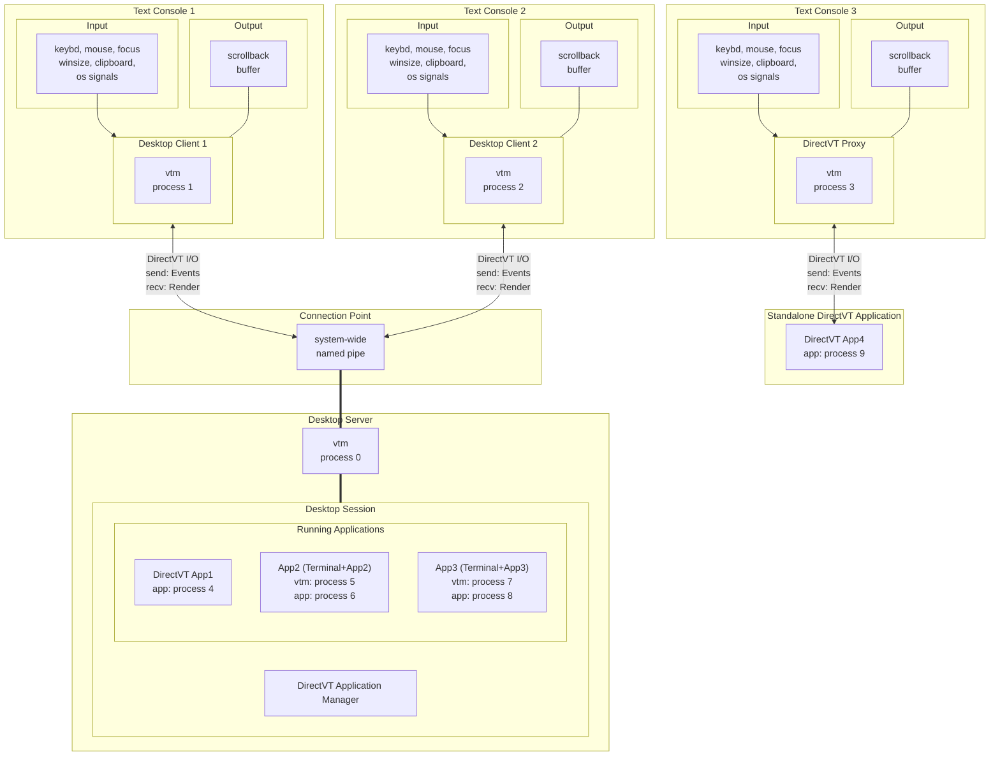

# Text Mode Desktop Architecture

## Process Model



- At startup vtm creates a new or connects to an existing desktop session.
- The desktop session is hosted in a forked and detached vtm process (desktop server).
- The session is tied to an operating system's named pipe (desktop session connection point).
- The connection point unique name is coined from the creator's UID or specified explicitly.
- Only the session creator can access the session (for non-elevated users).
- The regular user and the elevated user are different independent users despite having the same username.
- The session allows multiple access in real time.
- Users can disconnect from the session and reconnect later.
- Sessions with different connection points can coexist independently.
- Applications are launched/terminated by the user within the current desktop session.
- Non-DirectVT application runs a pair of operating system processes: terminal process + application process.
- The terminal process is a fork of the original desktop server process, running as standalone terminal in DirectVT mode. Terminating this process will automatically close the application.
- The session exists until it is explicitly shutted down.

## Interprocess Communication

Interprocess communication relies on the DirectVT binary protocol, multiplexing the following primary channels:
- Keyboard event channel
- Mouse event channel
- Focus event channel
- Window size event channel
- Clipboard event channel
- Render output channel
- Shutdown event channel

The vtm client side (desktop client) can operate in two modes, either in ANSI/VT mode (common terminal environment with plain text I/O), or in DirectVT/dtvt mode (vtm environment with binary I/O).

The vtm server side (desktop server) is always operate in DirectVT mode.

The DirectVT client-server channel can be wrapped in any transport layer protocol suitable for stdin/stdout transfer, such as SSH.

## DirectVT mode

In DirectVT mode, the client side receives the event stream and renders directly in binary form (with platform endianness correction), avoiding any expensive parsing and cross-platform issues.

## ANSI/VT mode

### Input

In ANSI/VT mode, the client side parses input from multiple standard sources, and forwards it through appropriate channels to the server side using the DirectVT protocol. The set of input sources varies by platform.

#### Unix input sources

- STDIN
    - Bracketed paste marks `\x1b[200~`/`\x1b[201~` are treated as the boundaries of a binary immutable block pasted from the clipboard. This immutable block is handled independently of keyboard input and forwarded to the clipboard event channel.
    - SGR mouse reporting sequences `\x1b[<s;x;yM/m` are redirected to the mouse event channel.
    - Terminal window focus reporting sequences `\x1b[I`/`\x1b[O` are redirected to the focus event channel.
    - Line style reporting sequences `\x1b[33:STYLEp` are redirected to the style event channel (current/selected line wrapping on/off, left/right/center alignment).
    - All incoming text flow that does not fall into the above categories is clusterized, tied to the keys pressed, and forwarded to the keyboard event channel.
- Operating system signals
    - SIGWINCH: Event is forwarded to the window size event channel.
    - SIGINT: Event is forwarded to the shutdown event channel (going to graceful shutdown).
    - SIGHUP: Event is forwarded to the shutdown event channel (going to graceful shutdown).
    - SIGTERM: Event is forwarded to the shutdown event channel (going to graceful shutdown).
- PS/2 Mouse device (Linux VGA Console only)
    - `/dev/input/mice`: Interpreted ImPS/2 mouse protocol events are forwarded to the mouse event channel.
    - `/dev/input/mice.vtm` (used in case of inaccessibility of `/dev/input/mice`)

#### Windows input sources

- ReadConsoleInput events (Win32 Console API)
    - The KEY_EVENT stream is clusterized, tied to the keys pressed, and forwarded to the keyboard event channel (excluding repeat modifier keys).
    - The MOUSE_EVENT stream is forwarded to the mouse event channel (excluding double clicks and idle events).
    - The FOCUS_EVENT stream is forwarded to the focus event channel.
    - The WINDOW_BUFFER_SIZE_EVENT stream is forwarded to the window size event channel.
    - The MENU_EVENT stream is interpreted using the Event.MenuEvent.dwCommandId value:
        - 0x8000: The subsequent MENU_EVENT record is forwarded to the style event channel.
        - 0x8001: Clipboard-paste block start (INPUT_RECORD begin mark). Subsequent KEY_EVENT records are read until the INPUT_RECORD end mark appears, and then a whole block of chars is forwarded to the clipboard event channel.
        - 0x8002: Clipboard-paste block end (INPUT_RECORD end mark).
- Window system-defined messages
    - WM_CREATE: Event is forwarded to the clipboard event channel.
    - WM_CLIPBOARDUPDATE: Event is forwarded to the clipboard event channel.
    - WM_ENDSESSION
        - ENDSESSION_CLOSEAPP: Register CTRL_CLOSE_EVENT signal.
        - ENDSESSION_LOGOFF: Register CTRL_LOGOFF_EVENT signal.
        - any other non-zero: Register CTRL_SHUTDOWN_EVENT signal.
- Operating system signals
    - CTRL_C_EVENT: Event is tied to the `Ctrl+C` keys pressed, and forwarded to the keyboard event channel.
    - CTRL_BREAK_EVENT: Event is tied to the `Ctrl+Break` keys pressed, and forwarded to the keyboard event channel.
    - CTRL_CLOSE_EVENT: Event is forwarded to the shutdown event channel (going to graceful shutdown).
    - CTRL_LOGOFF_EVENT: Event is forwarded to the shutdown event channel (going to graceful shutdown).
    - CTRL_SHUTDOWN_EVENT: Event is forwarded to the shutdown event channel (going to graceful shutdown).

### Output

The binary render received for output from the server side is converted by the client side into a format suitable for the type of console being used. The console type is detected at startup and can be one of the following:
- VT Terminal with truecolor support
- VT Terminal with 256-color support (Apple Terminal)
- VT Terminal with 16-color support (Linux VGA Console, 16-color terminals)
- Win32 Console with 16 colors support (Command Prompt on platforms from Windows 8 upto Windows 2019 Server)

vtm renders itself at a constant frame rate into internal buffers and outputs to the console only when the console is ready to accept the next frame.

# Usage Scenarios

## Local Usage

### Running vtm desktop

- Run command
    ```bash
    vtm
    ```

### Running built-in terminal with default shell

- Run command
    ```bash
    vtm -r term
    ```
    or
    ```bash
    vtm -r
    # The `vtm -r` option is auto converted to the `vtm -r term`.
    ```

### Running a standalone console application

- Run command
    ```bash
    vtm -r term /path/to/console/app
    # The `vtm -r term` option means to run the built-in terminal to host the console application.
    ```
    or
    ```bash
    vtm -r /path/to/console/app
    # The `vtm -r ...` option is auto converted to the `vtm -r term ...`.
    ```

### Running a standalone console application without extra UI

- Run command
    ```bash
    vtm -r headless /path/to/console/app
    # The `vtm -r headless` option means to run the built-in terminal without menu and bottom bar.
    ```

## Remote Access

In general, the local and remote platforms may be different.

When DirectVT mode is enabled, all keyboard, mouse and other input events are transmitted between hosts in binary form.

The following examples assume that vtm is installed on both the local and remote sides.

### Running a standalone console application remotely via SSH

- Remote side
    - Running SSH-server
- Local side
    - Run command
    ```bash
    vtm -r xlvt ssh user@server vtm -r term /path/to/console/app
    # The `vtm -r xlvt` option means to run the next statement in DirectVT/XLVT mode.
    # The `ssh user@server vtm -r term` statement means to connect via ssh and run the built-in terminal on the remote host.
    ```
    or
    ```bash
    vtm ssh user@server vtm -r /path/to/console/app
    # The `vtm -r ...` option is auto converted to the `vtm -r term ...`.
    ```

### Running vtm in DirectVT mode remotely via SSH

- Remote side
    - Running SSH-server
- Local side
    - Run command
    ```bash
    vtm -r xlvt ssh user@server vtm
    # The `vtm -r xlvt` option means to run the next statement in DirectVT/XLVT mode.
    # The `ssh user@server vtm` statement means to connect via ssh and run vtm on the remote host.
    ```
    or
    ```bash
    vtm ssh user@server vtm
    # The `-r xlvt` option is auto added if the first command line argument starts with `ssh ...`.
    ```

### Running vtm in ANSI/VT mode remotely via SSH

- Remote side
    - Running SSH-server
- Local side
    - Run commands
    ```bash
    ssh user@server
    vtm
    ```
    or
    ```bash
    ssh -t user@server vtm
    # The `ssh -t ...` option is required to allocate TTY on remote host.
    ```

### Running vtm in DirectVT mode remotely via `netcat` (POSIX only, unencrypted, for private use only)

- Remote side
    - Run command
    ```bash
    ncat -l tcp_port -k -e vtm
    # `-l tcp_port`: specify tcp port to listen.
    # `-k`: order to keep connection open for multiple clients.
    # `-e`: order to run vtm for every connected client.
    ```
- Local side
    - Run command
    ```bash
    vtm -r dtvt ncat remote_ip remote_tcp_port
    # The `vtm -r dtvt` option means to run DirectVT proxy (not required inside vtm environment).
    # Note: Make sure `ncat` is installed.
    ```

### Running vtm in DirectVT mode remotely using `inetd` (POSIX only, unencrypted, for private use only)

- Remote side
    - Install `inetd`
    - Add the following line to the `/etc/inetd.conf`:
        ```bash
        tcp_port stream tcp nowait user_name /remote/side/path/to/vtm  vtm
        # `tcp_port`: tcp port to listen.
        # `user_name`: user login name.
        ```
    - Launch `inetd`
        ```
        inetd
        ```
- Local side
    - Run command
    ```bash
    vtm -r dtvt ncat remote_ip remote_tcp_port
    # The `vtm -r dtvt` option means to run DirectVT proxy (not required inside vtm desktop environment).
    # Note: Make sure `ncat` is installed.
    ```

### Local Standard I/O Redirection (POSIX only)

- Host side
    - Run commands
    ```bash
    mkfifo in && mkfifo out
    vtm >out <in
    ```
- User side
    - Run command
    ```bash
    vtm -r dtvt socat open:out\!\!open:in stdin\!\!stdout
    # The `vtm -r dtvt` option means to run DirectVT proxy (not required inside vtm desktop environment).
    # Note: Make sure `socat` is installed.
    ```

## More Tips

## Desktop Taskbar Menu Customization

The taskbar menu can be configured using a settings file `~/.config/vtm/settings.xml` (`%USERPROFILE%\\.config\\vtm\\settings.xml`):
```xml
<config>
    <menu>
        <!-- <item*/> --> <!-- Clear default item list -->
        <item splitter label="Built-in apps"/>

        <item id="Text Editor demo" type=dtvt param="vtm -r text"/>
        <item id="Calculator demo"  type=dtvt param="vtm -r calc"/>
        <item id="Truecolor test"   type=dtvt param="vtm -r truecolor"/>

        <item splitter label="Remote Access"/>

        <item id="Run vtm in DirectVT mode remotely via SSH"    type=xlvt param="ssh user@server vtm"/>
        <item id="Run a standalone console application via ssh" type=xlvt param="ssh user@server vtm -r /path/to/console/app"/>
        <item id="Run application via ssh w/o extra UI"         type=xlvt param="ssh user@server vtm -r headless /path/to/console/app"/>

        <item splitter label="Another Examples"/>

        <item id="Far Manager"             type=headless param="far"/>
        <item id="Far Manager in terminal" type=dtvt     param="$0 -r far"/>

        <item id="Midnight Commander"             type=headless param="mc"/>
        <item id="Midnight Commander in terminal" type=dtvt     param="$0 -r mc"/>

        <item id="Far Manager via ssh"     type=xlvt param="ssh user@server vtm -r headless far"/>
        <item id="cmd in terminal via ssh" type=xlvt param="ssh user@server vtm -r term cmd"/>
        <item id="cmd via ssh"             type=xlvt param="ssh user@server vtm -r headless cmd"/>
        <item id="wsl via ssh"             type=xlvt param="ssh user@server vtm -r headless  wsl"/>
        <item id="mc via ssh"              type=xlvt param="ssh user@server vtm -r headless mc"/>
        <item id="wsl mc via ssh"          type=xlvt param="ssh user@server vtm -r headless wsl mc"/>
    </menu>
</config>
```

### Tiling Window Manager

Terminal windows can be organized using the built-in tiling window manager. Grouping can be temporary within the current session, or pre-configured using settings. See [Settings/App type `Group`](settings.md#app-type) for details.

### VT Logging for Developers

vtm allows developers to visualize standard input/output streams. Launched with the `vtm -m` option, vtm will log the event stream of each terminal window with the `Logs` switch enabled.

Important: Avoid enabling the `Logs` switch in the terminal window with the `vtm -m` process running, this may lead to recursive event logging of event logging with unpredictable results.

Important: Be careful with enabling the `Logs` switch when working with sensitive information, since all IO events, including keypresses, are logged in this mode.