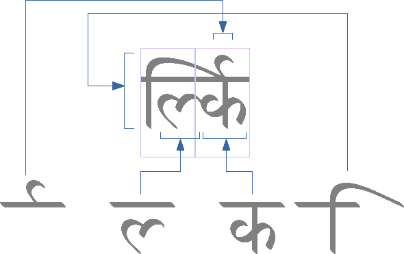
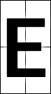
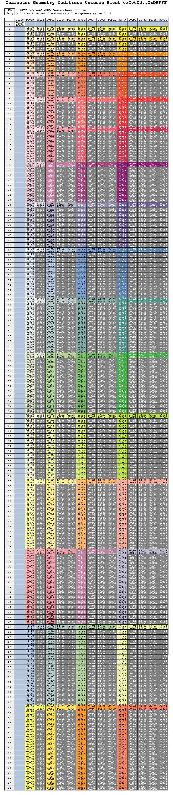
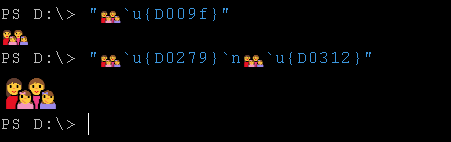
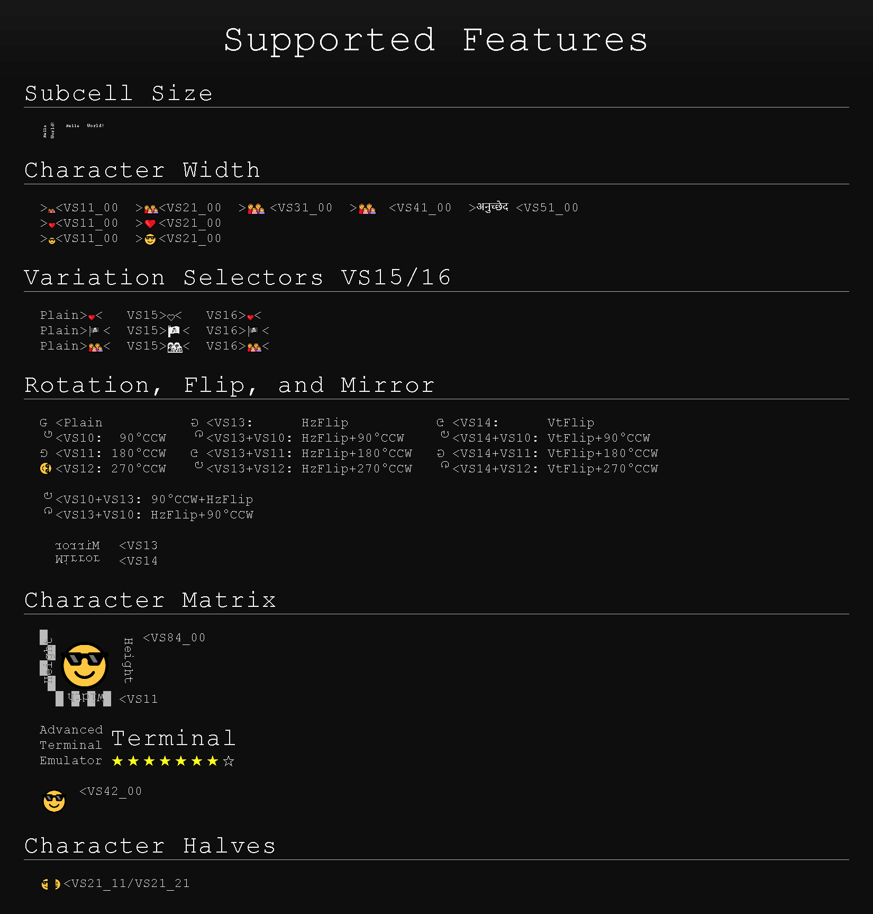

# VT2D: Unicode Character Geometry Modifiers

A user interface based solely on monospaced Unicode characters (a concept known as a text-based user interface, or TUI) has known limitations regarding character width and rendering, leading to the following constraints in standard terminal environments:

- No way to specify a custom width for displayed characters.
- No way to display the same characters in narrow and wide variants simultaneously.
- No way to use triple and quadruple-width characters alongside narrow and standard-width ones.
- Inconsistent character width assumptions across different applications and terminal emulators.
- No way to partially display wide characters.
- No way to display characters taller than one cell.
- No way to display subcell-sized characters.
- No way to rotate or mirror characters.

## Character matrix

Each Unicode character is represented by a sequence of codepoints (one or more), known as a grapheme cluster. Using a specific font, this sequence is translated into a glyph run.



By defining the graphical representation of a character as a cellular matrix (a 1x1 matrix consists of one fragment), the final scaling and rasterization of the glyph run can be performed within a rectangular cell matrix. This matrix is defined either implicitly based on the Unicode properties of the cluster's codepoints, or explicitly using a modifier codepoint from the Unicode private use area range U+D0000–U+D08F6.

1x1 | 2x2 | 3x1
----|-----|-----
 |  | 

Matrix fragments, up to a size of 16x4 cells, require at least four associated integer values. These values can be packed into the Unicode codepoint space by enumerating "wh_xy" values, where:
  - w: Character matrix width.
  - h: Character matrix height.
  - x: Horizontal fragment selector within the matrix.
  - y: Vertical fragment selector within the matrix.
  - For character matrices larger than 16x4, standard pixel graphics should be used instead.

[Table source](images/vtm_character_geometry_modifiers_16x4.xhtml)



### The resulting concept

- Terminals can annotate each scrollback cell with character matrix metadata and use it to display either the entire character image or a specific fragment within the cell boundaries.
- Users/applications can explicitly specify the size of the character matrix (by zeroing out `_xy`) or select any fragment of it (non-zero `_xy`) by placing a specific modifier character after the grapheme cluster.

Example 1. Output a 3x1 (31_00) character:
  - `pwsh`
    ```pwsh
    "👩‍👩‍👧‍👧`u{D009F}"
    ```
  - `bash`
    ```bash
    printf "👩‍👩‍👧‍👧\UD009F\n"
    ```
Example 2. Output a 6x2 character (by stacking two 6x1 fragments 62_01 and 62_02 on top of each other):
  - `pwsh`
    ```pwsh
    "👩‍👩‍👧‍👧`u{D0279}`n👩‍👩‍👧‍👧`u{D0312}"
    ```
  - `bash`
    ```bash
    printf "👩‍👩‍👧‍👧\UD0279\n👩‍👩‍👧‍👧\UD0312\n"
    ```
Example 3. Output a solid 9x3 character:
  - `pwsh`
    ```pwsh
    "👩‍👩‍👧‍👧`u{D03C3}"
    ```
  - `bash`
    ```bash
    printf "👩‍👩‍👧‍👧\UD03C3\n"
    ```
Example 4. Output the longest word in the Hindi language 16x1 (G1_00):
  - `pwsh`
    ```pwsh
    "`u{2}विश्वविज्ञानकोशनिर्माणसमिति`u{D0121}"
    ```
  - `bash`
    ```bash
    printf "\U2विश्वविज्ञानकोशनिर्माणसमिति\UD0121\n"
    ```
Expected result:  
  

### Helper functions

A possible implementation of helper functions for converting between modifier codepoints and character matrix parameter tuples `wh_xy` is provided below.

```c++
struct wh_xy
{
    int w, h, x, y;
};
static int p(int n) { return n * (n + 1) / 2; }
const int kx = 16; // Max width of the character matrix.
const int ky = 4; // Max height of the character matrix.
const int mx = p(kx + 1); // Lookup table boundaries.
const int my = p(ky + 1); //
const int unicode_block = 0xD0000; // Unicode codepoint block for geometry modifiers.

// Returns the modifier codepoint value for the specified tuple w, h, x, y.
static int modifier(int w, int h, int x, int y) { return unicode_block + p(w) + x + (p(h) + y) * mx; };

// Returns a tuple w, h, x, y for the specified codepoint modifier using a static lookup table.
static wh_xy matrix(int codepoint)
{
    static auto lut = []
    {
        auto v = std::vector(mx * my, wh_xy{});
        for (auto w = 1; w <= kx; w++)
        for (auto h = 1; h <= ky; h++)
        for (auto y = 0; y <= h; y++)
        for (auto x = 0; x <= w; x++)
        {
            v[p(w) + x + (p(h) + y) * mx] = wh_xy{ w, h, x, y };
        }
        return v;
    }();
    return lut[codepoint - unicode_block];
}
```

## Grapheme cluster boundaries

By default, grapheme clustering occurs according to `Unicode UAX #29` (https://www.unicode.org/reports/tr29/#Grapheme_Cluster_Boundary_Rules).

To set arbitrary boundaries, the C0 control character `ASCII 0x02 STX` is used to signal the beginning of a grapheme cluster. In this case, the cluster's closing character is always a codepoint from the range U+D0000–U+DFFFF, which also sets the dimension of the character matrix. All codepoints between STX and the closing codepoint will be included in that specific grapheme cluster.

## Another brick in the wall

> At present only standardized variation sequences with VS1, VS2, VS3, VS15 and VS16 have been defined; VS15 and VS16 are reserved to request that a character should be displayed as text or as an emoji respectively.

> VS4–VS14 (U+FE03–U+FE0D) are not used for any variation sequences

- https://en.wikipedia.org/wiki/Variation_Selectors_(Unicode_block)
- https://www.unicode.org/Public/UNIDATA/StandardizedVariants.txt
- https://www.unicode.org/reports/tr51/tr51-16.html#Direction

So, we utilize the unused `VS4–VS14` range to define glyph alignment and transformation:

### Glyph run alignment inside the matrix

VS  | Codepoint | Axis       | Alignment
----|-----------|------------|--------------
VS4 | 0xFE03    | Horizontal | Left
VS5 | 0xFE04    | Horizontal | Center
VS6 | 0xFE05    | Horizontal | Right
VS7 | 0xFE06    | Vertical   | Top
VS8 | 0xFE07    | Vertical   | Middle
VS9 | 0xFE08    | Vertical   | Bottom

Notes:
- We are not operating at a low enough level to support justified alignment.
- By default, glyphs are aligned on the baseline at the writing origin.

### Matrix rotation and flips

VS   | Codepoint | Fx
-----|-----------|-----------
VS10 | 0xFE09    | Rotate 90° CCW
VS11 | 0xFE0A    | Rotate 180° CCW
VS12 | 0xFE0B    | Rotate 270° CCW
VS13 | 0xFE0C    | Horizontal flip
VS14 | 0xFE0D    | Vertical flip

Example functions for applying a rotation operation to the current three-bit integer state:
```c++
void VS10(int& state) { state = (state & 0b100) | ((state + 0b001) & 0b011); }
void VS11(int& state) { state = (state & 0b100) | ((state + 0b010) & 0b011); }
void VS12(int& state) { state = (state & 0b100) | ((state + 0b011) & 0b011); }
void VS13(int& state) { state = (state ^ 0b100) | ((state + (state & 1 ? 0 : 0b010)) & 0b011); }
void VS14(int& state) { state = (state ^ 0b100) | ((state + (state & 1 ? 0b010 : 0)) & 0b011); }

int get_angle(int state) { int angle = 90 * (state & 0b011); return angle; }
int get_hflip(int state) { int hflip = state >> 2; return hflip; }
```

# New Look for Text-based User Interface

Screenshot of a test page in a terminal emulator that supports the VT2D concept:


