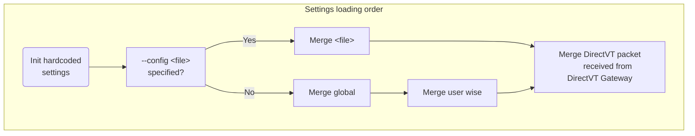

# Text-based Desktop Environment

## Command-line options

### Syntax

```
vtm [ -c <file> ][ -q ][ -p <id> ][ -s | -d | -m ][ -x <cmds> ]
vtm [ -c <file> ][ -q ][ -r [ <type> ]][ <args...> ]
vtm [ -c <file> ]  -l
vtm -i | -u | -v | -?

<script commands via piped redirection> | vtm [ -p <id> ]
```

> By default, the built-in Desktop Client will run and the Desktop Server will be launched in background if it is not running.

Option                  | Description
------------------------|-------------------------------------------------------
`-h`, `-?`, `--help`    | Print command-line options.
`-v`, `--version`       | Print version.
`-l`, `--listconfig`    | Print configuration.
`-i`, `--install`       | Perform system-wide installation.
`-u`, `--uninstall`     | Perform system-wide deinstallation.
`-q`, `--quiet`         | Disable logging.
`-x`, `--script <cmds>` | Specifies script commands to be run by the desktop when ready.
`-c`, `--config <file>` | Specifies the settings file to load.
`-p`, `--pin <id>`      | Specifies the desktop id it is pinned to.
`-s`, `--server`        | Run Desktop Server.
`-d`, `--daemon`        | Run Desktop Server in background.
`-m`, `--monitor`       | Run Desktop Monitor.
`-r`, `--`, `--run`     | Run desktop applet standalone.
`<type>`                | Desktop applet type to run.
`<args...>`             | Desktop applet arguments.

### Desktop applets

Applet                     | Type | Arguments
---------------------------|------|------------------------------------------
Teletype Console (default) | vtty | CUI application with arguments to run.
Terminal Emulator          | term | CUI application with arguments to run.
DirectVT Gateway           | dtvt | DirectVT-aware application to run.
DirectVT Gateway with TTY  | dtty | CUI application to run, forwarding DirectVT I/O.

The following commands have a short form:
  - `vtm -r vtty <cui_app...>` can be shortened to `vtm <cui_app...>`.
  - `vtm -r dtty ssh <user@host dtvt_app...>` can be shortened to `vtm ssh <user@host dtvt_app...>`.

### Settings loading order



- Initialize hardcoded settings.
- In case of using the `--config <file>` option and the `<file>` can be loaded:
    - Merge settings from the `<file>`.
- otherwise:
    - Merge with system-wide settings from `/etc/vtm/settings.xml` (`%PROGRAMDATA%/vtm/settings.xml` on Windows).
    - Merge with user-wise settings from `~/.config/vtm/settings.xml`.
- Merge with DirectVT packet received from the hosting DirectVT Gateway.

### Script commands

Syntax: `<command>([<args...>])[; <command>([<args...>]); ... <command>([<args...>])]`

 Command                                 | Description
-----------------------------------------|-------------------------------------------
`vtm.run([<attr_list...>])`              | Create and run a menu item constructed using a space-separated list of `<attribute>=<value>` (derived from existing or updated temporary item).<br>Create and run temporary menu item constructed using default attributes if no `<attr_list...>` specified.<br>See [Settings/Taskbar menu item attributes](settings.md#Taskbar-menu-item-attributes) for details.
`vtm.set(id=<item_id> [<attr_list...>])` | Create or override a menu item using a space-separated list of `<attribute>=<value>`.
`vtm.del([<item_id>])`                   | Delete the taskbar menu item by `<id>`.<br>Delete all menu items if no `<id>` specified.
`vtm.dtvt(<dtvt_app...>)`                | Create a temporary menu item and run the specified dtvt-executable.
`vtm.selected(<item_id>)`                | Set selected menu item using specified `<id>` (affected to the desktop RightDrag gesture and Tile's `+` button).
`vtm.shutdown()`                         | Terminate the running desktop session.

The following characters in script commands will be de-escaped: `\e` `\t` `\r` `\n` `\a` `\"` `\'` `\\`

### Usage Examples

Command                                               | Description
------------------------------------------------------|--------------------------------------------
`vtm`                                                 | Run Desktop Client.
`vtm ssh <user@server> vtm`                           | Run Desktop Client remotely over SSH.
`vtm -r term`                                         | Run Terminal Emulator.
`vtm -r term </path/to/console/app...>`               | Run Terminal Emulator with a CUI application inside.
`vtm ssh <user@server> vtm </path/to/console/app...>` | Run a CUI application remotely over SSH.
`vtm -x "vtm.del(); vtm.set(splitter id=Apps); vtm.set(id=Term)"` | Run Desktop Client and reconfigure the taskbar menu.
`echo "vtm.del(); vtm.set(splitter id=Apps); vtm.set(id=Term)" \| vtm`<br><br>`echo "vtm.set(id=user@server type=dtty cmd='ssh <user@server> vtm')" \| vtm` | Reconfigure the taskbar menu of the running desktop.
`echo "vtm.run()" \| vtm`<br><br>`echo "vtm.run(id=Term)" \| vtm`<br><br>`echo "vtm.dtvt(vtm -r term)" \| vtm` | Run Terminal Emulator on the running desktop.
`echo "vtm.run(title='Console \nApplication' cmd='</path/to/app...>')" \| vtm` | Run Teletype Console with a CUI application inside on the running desktop.
`echo "vtm.run(type=tile title=Terminals cmd='v(h(Term,Term),Term)')" \| vtm` | Run Tiling Window Manager with three terminals attached.
`echo "vtm.shutdown()" \| vtm`                        | Terminate the running desktop session.