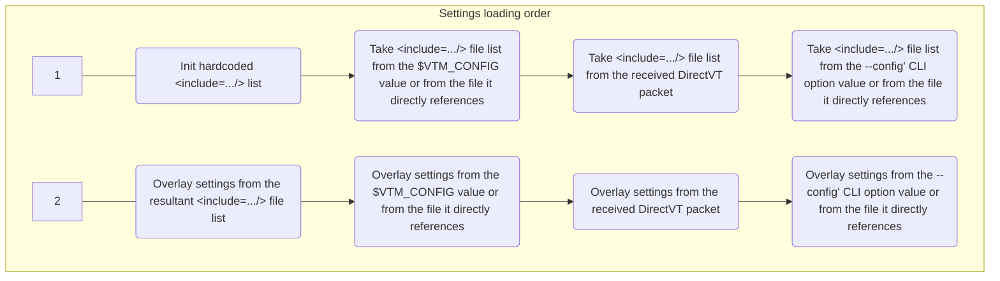

# Text-based desktop environment settings



## TL;DR

The settings are stored in the DynamicXML file format, which looks like classical XML but with dynamic element refrencing and templating.  
See [`/src/vtm.xml`](../src/vtm.xml) for example.

We call the text data in the settings file "plain XML data" even though our file format is not technically XML, but only visually resembles it.

There are two predefined settings source locations and this can be changed as needed:
```xml
<include="/etc/vtm/settings.xml"/>        <!-- Default system-wide settings source. The "/etc/..." path will be auto converted to the "%PROGRAMDATA%\..." on Windows. -->
<include="~/.config/vtm/settings.xml"/>   <!-- Default user-wise settings source. -->
```

The process of loading settings consists of the following steps:
- Build an ordered list of the setting source files by looking for the root `<include=.../>` elements.
- Overlay settings from the source files in the specified order.
- Overlay settings from the value of the `$VTM_CONFIG` environment variable or from a settings file it directly references.
- Overlay settings from the DirectVT config payload received from the parent process.
- Overlay settings from the specified `--config <...>` CLI option value or from a settings file it directly references.

The file list is built in the following order from the following sources:
- The settings file list from the hardcoded configuration containing a list of two files:
  ```xml
  <include*/>  <!-- Clear previously defined sources. Start a new list. -->
  <include="/etc/vtm/settings.xml"/>        <!-- Default system-wide settings source. The "/etc/..." path will be auto converted to the "%PROGRAMDATA%\..." on Windows. -->
  <include="~/.config/vtm/settings.xml"/>   <!-- Default user-wise settings source. -->
  ...
  ```
- The settings file list from the `$VTM_CONFIG` environment variable value or from a settings file it directly references.
  - A case with a plain XML-data:
    - `$VTM_CONFIG=<include*/><include='/path/to/override_defaults.xml'/>...` - Clear the current file list and begin a new file list containing a single file '/path/to/override_defaults.xml'.
    - `$VTM_CONFIG=<include='/path/to/first.xml'/><include='/path/to/second.xml'/>...` - Append the current file list with the files '/path/to/first.xml' and '/path/to/second.xml'.
  - A case with a file reference:
    - `$VTM_CONFIG='/path/to/override_defaults.xml'` - Take the file list from the '/path/to/override_defaults.xml'.
- The settings file list from the DirectVT config received from the parent process.
- The settings file list from the specified `--config <...>` CLI option value or from a settings file it directly references.
  - A case with a plain XML-data:
    - `./vtm --config "<include*/><include='/path/to/override_defaults.xml'/>..."` - Clear the current file list and begin a new file list containing a single file '/path/to/override_defaults.xml/'.
  - A case with a file reference:
    - `./vtm --config "/path/to/override_defaults.xml"` - Take the file list from the '/path/to/override_defaults.xml'.

## DynamicXML

DynamicXML is a configuration language based on the XML 1.1 syntax, but with substantial extensions that introduce dynamic features, templating mechanisms, and data merging logic. It is designed as a flexible and powerful format for human-written, highly efficient configuration files, allowing for data reuse, variable substitution, and a form of in-document dry principle (Don't Repeat Yourself).

### Differences from Classical XML 1.1

1. #### Core Syntax and Structure

   | Aspect                | Difference
   |-----------------------|-----------
   | Encoding              | Documents use **UTF-8** encoding only.
   | Allowed Characters    | Any Unicode characters are permitted, including the **U+0000 (null)** character, which is prohibited in XML 1.1.
   | Entities              | There is no support for named XML character entities (`&amp;`, `&lt;`, etc.).
   | Root Elements         | The presence of **multiple root elements** within a single document is allowed.
   | Whitespace            | No spaces are allowed between the opening angle bracket (`<`) and the element name.
   | Semantics             | There is no distinction between an XML-attribute and an XML-element. All attributes are treated as sub-elements.<br>The notations `<... name="value" />`, `<...><name>"value"</name></...>`, and `<...><name="value" /></...>` all have identical meanings.

2. #### Value Processing and Types

   | Aspect                | Difference
   |-----------------------|-----------
   | Data Types            | Each element has its own string value. All values are stored as **strings**. The consuming application decides on its end how to interpret them (e.g., as a number or a boolean).
   | Nested Elements       | Each element, in addition to its own string value, directly owns the nested elements.
   | Required Quoting      | All string values, except those that begin with a decimal digit, `-`, or `#`, must be enclosed in single or double quotes.
   | Value Fragmentation   | An element's value can be fragmented and combined both after the equals sign and between the opening and closing tags.
   | Whitespace Handling   | Content between tags can be quoted (strict boundaries) or raw (trailing whitespace immediately before a nested or closing tag is removed).
   | Escaping              | Special literals for control characters and Unicode sequences are supported (e.g., \t, \n, \e, \u{...}).

   The following literals within values have special meaning and will be expanded:
     - `\a`  ASCII 0x07 BEL
     - `\t`  ASCII 0x09 TAB
     - `\n`  ASCII 0x0A LF
     - `\r`  ASCII 0x0D CF
     - `\e`  ASCII 0x1B ESC
     - `\\`  ASCII 0x5C Backslash
     - `\u{XX...}` or `\uXX...`  Unicode codepoint, where `XX...` is the hexadecimal value.

3. #### Dynamic Features: References and Templates

   | Aspect                | Difference
   |-----------------------|-----------
   | Element References    | Elements can reference the values or entire structures of other elements using relative or absolute paths. Any unquoted non-numeric value is treated as a reference.
   | Namespacing/Scoping   | Each element forms its own namespace (scope).
   | Value Concatenation   | An element's content may consist of several substrings and/or references combined using the vertical bar (`\|`) operator.
   | Inheritance           | Assigning references to elements makes the scopes of these elements inherited and directly accessible.
   | Runtime Resolution	   | All values are resolved not at the tree construction stage, but at runtime, upon application request. The application can change values within the tree during operation, thereby affecting all dependent values.
   | Resolving Order       | Reference resolution works by recursively iterating through inherited scopes in the order they are assigned, then traversing the current scope and all surrounding parent scopes until the first element name match is found.
   | Recursion and Cycles  | Recursive references are resolved starting from the element scope. Circular references are **silently ignored**.
   | Templates             | The structures of elements containing references are templates. Template instantiation is performed from inheritance sources and surrounding elements.
   | Compact Syntax        | A shorthand for nesting is supported: `<node0/node1/thing name="value"/>` is equivalent to the full tag hierarchy.

4. #### Data Merging (Overlaying)

   DynamicXML files support an "overlaying" mechanism where values in an overlaid document can update values in a base document.

   | Same-named Elements | Update Rules
   |---------------------|-------------
   | Single Element      | The values of single elements of the original structure will be updated to the values of the overlaid structure.
   | List of Elements    | A list of elements with the same name within a scope may start with an empty element with an asterisk postfix (`<item*/>...<item .../>...<item .../>`), meaning that this list will always overwrite the existing one during overlaying.<br>Updating an existing list will pre-clear it if its first element is not marked with an asterisk.

### Possible Structural Designs

To illustrate possible structural designs, consider the following hierarchy of elements:

- \<document\> - Top-level element
  - \<thing\> - Second level element
    - \<name\> - Third level element

The following forms of element declaration are equivalent:

- Using classical XML syntax:
  ```xml
  <document>
      <thing name="a">text1</thing>
      <thing name="b">text2</thing>
  </document>
  ```
- Assigning a content value to an element directly using the equal sign:
  ```xml
  <document>
      <thing="text1" name="a"/>
      <thing="text2" name="b"/>
  </document>
  ```
- Assigning a value to an element using quoted literals between the opening and closing tags:
  ```xml
  <document>
      <thing name="a">
          "text1"
      </thing>
      <thing name="b">
          "text2"
      </thing>
  </document>
  ```
- Assigning values to sub-elements directly using the equal sign:
  ```xml
  <document>
      <thing>
          "text1"
          <name="a"/>
      </thing>
      <thing>
          <name="b"/>
          "text2"
      </thing>
  </document>
  ```
- Fragmenting the assigned value strings:
  ```xml
  <document>
      <thing="t">
          "ext"
          <name>
              "a"
          </name>
          "1"
      </thing>
      <thing>
          <name>
              "b"
          </name>
          "text"
          "2"
      </thing>
  </document>
  ```
- Referencing the string value from the independent element:
  ```xml
  <document>
      <basename="a"/>
      <thing name=basename>text1</thing>
      <thing name="b">text2</thing>
  </document>
  ```
- Referencing the string value and existing sub-elements from the independent element:
  ```xml
  <document>
      <basething="text1" name="a"/>
      <thing=basething/>
      <thing name="b">text2</thing>
  </document>
  ```
- Referencing the string value fragment and sub-elements from the independent element:
  ```xml
  <document>
      <basething="1" name="a"/>
      <thing="text" | basething/>
      <thing name="b">text2</thing>
  </document>
  ```
- Referencing the string value fragment and sub-elements from the independent element:
  ```xml
  <document>
      <basething="text" name="a"/>
      <thing=basething | "1"/>
      <thing name="b">text2</thing>
  </document>
  ```
- Referencing element from outer scope:
  ```xml
  <basething name="a"/>
  <document>
      <thing=basething | "text1"/>
      <thing name="b">text2</thing>
  </document>
  ```
- Referencing the string value fragments between opening and closing tags:
  ```xml
  <basething="xt" name="a"/>
  <document>
      <thing> "te" | basething | "1" </thing>
      <thing name="b">text2</thing>
  </document>
  ```
- Parameterized templating:
  ```xml
  <ThingTemplate = "text" | NumberRef>
      <name = LetterRef/>
  </ThingTemplate>
  <document>
      <thing=ThingTemplate NumberRef="1" LetterRef="a"/>
      <thing=ThingTemplate NumberRef="2" LetterRef="b"/>
  </document>
  ```
- Parameterized templating from an external namespace:
  ```xml
  <Namespace>
      <ThingTemplate = "text" | NumberRef>
          <name = LetterRef/>
      </ThingTemplate>
  </Namespace>
  <document=Namespace>
      <thing=ThingTemplate NumberRef="1" LetterRef="a"/>
      <thing=ThingTemplate NumberRef="2" LetterRef="b"/>
  </document>
  ```

## VTM Configuration Overview

### Configuration Structure

```xml
<!-- Global namespace - Unresolved literals will try to be resolved from here. -->
<include= ... />  <!-- Ordered list of references to settings files used to form the resultant configuration. -->
...
<!-- Set of global variables. -->
<global_variable_name = variable_value/>  <!-- Globally visible variable. -->
...
<config>  <!-- Global configuration. -->
    ...
    <element1=global_variable_name/>  <!-- element1 references the value of /global_variable_name (three levels of indirection allowed). -->
    <element2=/config/element1/>       <!-- element2 references the value of /config/element1. -->
    <element3="/config/element1"/>     <!-- element3 contains the string value "/config/element1". -->
    ...
    <desktop>  <!-- Desktop settings. -->
        <taskbar ... >  <!-- Taskbar menu settings. -->
            ...  <!-- Taskbar settings. -->
            <item ... >  <!-- Taskbar menu item declaration. -->
                ...  <!-- Item settings. -->
            </item>
            ...  <!-- Set of taskbar menu items. -->
        </taskbar>
        ...  <!-- Desktop settings. -->
    </desktop>
    <terminal ... >  <!-- Built-in terminal configuration section. -->
        ...
    </terminal>
    <events>  <!-- The required key/mouse combination sequence can be generated on the Info page, accessible by clicking on the label in the lower right corner of the vtm desktop. -->
        <gate>  <!-- Native GUI window layer event bindings. -->
            <script="script body" on="Key+Chord" on="Another+Key+Chord" on="SomeMouseEvent" on="SomeGenericEvent"/>
            <script="script body">
                <on="Key+Chord"/>
                <on="SomeGenericEvent" source="GenericEventSourceId"/>
            </script>
            <script>
                <on="Key+Chord1"/>
                <on="Key+Chord2"/>
                raw text script body;
                raw text script body;
                ...
            </script>
            ...
        </gate>
        <desktop>  <!-- Desktop layer event bindings. -->
            <script="script body" on="Key+Chord"/>
            ...
        </desktop>
        <applet>  <!-- Application/window layer event bindings. -->
            <script="script body" on="Key+Chord"/>
            ...
        </applet>
        <terminal>  <!-- Application specific layer event bindings. -->
            <script="script body" on="Key+Chord"/>
            ...
        </terminal>
        <tile>  <!-- Application specific layer event bindings. -->
            <script="script body" on="Key+Chord"/>
            ...
            <grip> <!-- Pane's grip event bindings. -->
                <script="script body" on="Key+Chord"/>
                ...
            </grip>
        </tile>
        <defapp>  <!-- Default application event bindings (e.g., Info-Page). -->
            <script="script body" on="Key+Chord"/>
            ...
        </defapp>
    </events>
</config>
```

#### Value literals `attribute=literal`

All value literals containing spaces must be enclosed in double or single quotes.

Value type | Format
-----------|-----------------
`RGBA`     | Hex: `#rrggbbaa` \| Hex: `0xaarrggbb` \| Decimal: `r,g,b,a` \| 256-color index: `i`
`boolean`  | `true` \| `false` \| `yes` \| `no` \| `1` \| `0` \| `on` \| `off`
`string`   | _UTF-8 text string_
`2D point` | _integer_ <any_delimeter> _integer_
`Duration` | _integer_ followed by<br>- `...ms`  for milliseconds<br>- `...us`  for microseconds<br>- `...ns`  for  nanoseconds<br>- `...s`   for      seconds<br>- `...min` for      minutes<br>- `...h`   for        hours<br>- `...d`   for         days<br>- `...w`   for        weeks<br>

#### Taskbar menu item configuration `<config/desktop/taskbar/item ... />`

Attribute  | Description                                       | Value type | Default value
-----------|---------------------------------------------------|------------|---------------
`id`       |  Item id                                          | `string`   |
`splitter` |  Non-active menu item                             | presence   | Not present
`hidden`   |  Item visibility on taskbar                       | `boolean`  | `no`
`label`    |  Item label text                                  | `string`   | =`id`
`tooltip`  |  Item tooltip text                                | `string`   | empty
`title`    |  App window title                                 | `string`   | empty
`footer`   |  App window footer                                | `string`   | empty
`wincoor`  |  App window coordinates                           | `2D point` |
`winsize`  |  App window size                                  | `2D point` |
`winform`  |  App window state                                 | `undefined` \| `normal` \| `maximized` \| `minimized` |
`type`     |  Desktop window type                              | `string`   | `vtty`
`env`      |  Environment variable in "var=val" format         | `string`   |
`cwd`      |  Current working directory                        | `string`   |
`cmd`      |  Desktop window constructor arguments             | `string`   | empty
`cfg`      |  Configuration patch for dtvt-apps in XML-format  | `string`   | empty
`config`   |  Configuration patch for dtvt-apps                | `xml-node` | empty

The menu item of DirectVT Gateway type (`type="dtvt"`) can be additionally configured using a `<config>` subsection or a `cfg="xml-text-data"` attribute. The `<config>` subsection will be ignored if the `cfg` attribute contains a non-empty value.

The content of the `cfg` attribute (or `<config>` subsection) is passed to the dtvt-application on launch.

#### Desktop window type `<config/desktop/taskbar/item type="..."/>`

Window type<br>(case insensitive) | Parameter `cmd=` | Description
----------------------------------|------------------|------------
`vtty` (default)                  | A CUI application command line with arguments | Run a CUI application inside the `Teletype Console dtvt-bridge`. Usage example `type="vtty" cmd="cui_app ..."`. It is the same as `type="dtvt" cmd="vtm -r vtty cui_app ..."`.
`term`                            | A CUI application command line with arguments | Run a CUI application inside the `Terminal Console dtvt-bridge`. Usage example `type="term" cmd="cui_app ..."`. It is the same as `type="dtvt" cmd="vtm -r term cui_app ..."`.
`dtvt`                            | A DirectVT-aware application command line with arguments | Run a DirectVT-aware application inside the `DirectVT Gateway`. Usage example `type="dtvt" cmd="dtvt_app ..."`.
`dtty`                            | A DirectVT-aware application command line with arguments | Run a DirectVT-aware application inside the `DirectVT Gateway with TTY` which has additional controlling terminal. Usage example `type="dtty" cmd="dtvt_app ..."`.
`tile`                            | [[ v[`n:m:w`] \| h[`n:m:w`] ] ( id1 \| _nested_block_ , id2 \| _nested_block_ )] | Run tiling window manager with layout specified in `cmd`. Usage example `type="tile" cmd="v(h1:1(Term, Term),Term)"`.<br>`n:m` - Ratio between panes (default n:m=1:1).<br>`w` - Resizing grip width (default w=1).
`site`                            | `cmd=@` or empty | The attribute `title="view_title"` is used to set region name/title. Setting the value of the `cmd` attribute to `@` adds numbering to the title.

The following item declarations are identical:
```
<item ... cmd="mc"/>
<item ... type="vtty" cmd="mc"/>
<item ... type="dtvt" cmd="vtm -r vtty mc"/>
```

### Lua Scripting

- Lua scripting support is designed to provide the same dynamic behavior as JavaScript on modern web pages, offering universal UI access through global objects.
- Scripts run within a sandbox environment that is unique to each individual process and persists for the lifetime of that process.
- The sandbox is restricted and does not have access to standard libraries such as `luaopen_package`, `luaopen_io`, `luaopen_os`, or `luaopen_debug`.
- Scripts have universal access to the UI through global objects.

#### General syntax

The syntax for defining event bindings is:

```xml
<dom_element1>
    <script="script body" prerun="prerun script body" on="EventID1" ... on="preview:EventId2" ...>
        <on="EventID"/>
        <on="EventID" source="OptionalEventSourceObjectID"/>
        ...
        raw text script body
        ...
    </script>
</dom_element1>
<dom_element2 id="AdditionalIDfor_dom_element2">
    <script="script body" on="EventID"/>
</dom_element2>
```

Tag                 | Belongs to           | Value           | Description
--------------------|----------------------|-----------------|---------------
`<dom_element>`     |                      | ObjectID        | Visual tree object id.
`id`                | `<dom_element>`      | UTF-8 string    | Additional id for the visual tree object.
`script`            | `<dom_element>`      | UTF-8 string    | A Lua script that will be executed when the events specified by the `on` tags occur.
`prerun`            | `script`             | UTF-8 string    | A Lua script that will be executed during pre-polling prior the non-preview keyboard events specified in the `on` tags occur. This is mostly used to indicate that the event is not expected on the source object.
`on`                | `script`             | EventID         | Specific event id text string.
`source`            | `on`                 | ObjectID        | Visual tree object id.

The `preview:` prefix of the EventID is an indication that event processing should be performed in reverse order - from the container to the nested objects. By default, the visual tree traversal order is from the nested objects to the container.

Note: Using an empty string in the `script=""` attribute, while specifying a non-empty event value in the `on="EventID"` tag, will reset all existing subscriptions for that specific EventID.

#### Keyboard events

Syntax:
```
<... on="KeyboardSpecificEvent" ...>
  or
<... on="preview:KeyboardSpecificEvent" ...>
```

The following keyboard-specific event delimiters/joiners are available to form a key-chord:

Joiner | Meaning
-------|--------
`+`    | The subsequent key is in pressed state.
`-`    | The subsequent key is in released state. This joiner is allowed for the last key only.
` \| ` | The separator to combine multiple key chords in a key chord list (vertical bar surrounded by at least one space on either side).

Key combinations can be of the following types:

Type        | Example                |Description
------------|------------------------|-----------
`Generic`   | `Ctrl+A`               | A generic key combination without distinction left/right and numpad.
`Literal`   | `Alt+'a'`              | A generic key combination without distinction left/right and numpad, except for the last key represented as a single-quoted character/string generated by the key.
`Specific`  | `LeftShift+RightShift` | A key combination with explicitly specified physical keys.
`Scancodes` | `0x3B+0x3C`            | A key combination represented solely by scan codes of physical keys in hexadecimal format.

Generic, literal and specific key sequences can be mixed in any order within a key chord list.

The required key combination sequence can be generated on the Info page, by clicking the label in the lower right corner of the vtm desktop.

#### Mouse events

Syntax:
```
<... on="MouseSpecificEvent" ...>
  or
<... on="preview:MouseSpecificEvent" ...>
```

The following formats are available for mouse-specific events:

- Named  
  `<Mouse | Left | Right | LeftRight | Middle><Down | Up | [Double | Multi]Click | <Double | Multi>Press | Drag<Start | Pull | Stop | Cancel>>`
- Generic  
  `<Mouse><Down | Up | [Double | Multi]Click | <Double | Multi>Press | Drag<Start | Pull | Stop | Cancel>><bbb...>`  
  where `<bbb...>` is a set of 8 bits to represent mouse buttons (decimal or binary):
  Decimal `<bbb...>` | Binary `<bbb...>` | Corresponding mouse button(s)
  -------------------|-------------------|-----------------
  0                  | 0                 | Any button
  1                  | 1                 | Left
  2                  | 01                | Right
  3                  | 001               | Middle
  4                  | 0001              | Button4
  5                  | 00001             | Button5
  6                  | 000001            | Button6
  7                  | 0000001           | Button7
  8                  | 00000001          | Button8
  n/a                | 11                | Left+Right
  n/a                | 111               | Left+Middle+Right
  n/a                | 011               | Middle+Right
  n/a                | 10000001          | Left+Button8

```
  011  Middle+Right
  ││└──────── middle is pressed
  │└───────── right is pressed
  └────────── left is not pressed
  10000001  Left+Button8
  │      └─── button8 is pressed
  └────────── left is pressed
```

  Note: In binary `<bbb...>` format the trailing zeros can be omitted.

The following mouse events are tracked:

EventID                             | Description
------------------------------------|----------------------------------
MouseDown<bbb...>                   | Button<bbb...> pressed down.
MouseUp<bbb...>                     | Button<bbb...> released.
MouseClick<bbb...>                  | Press and release button<bbb...> without movement.
MouseDoublePress<bbb...>            | Double press by button<bbb...>.
MouseMultiPress<bbb...>             | Multi press by button<bbb...>.
MouseDoubleClick<bbb...>            | Double click by button<bbb...>.
MouseMultiClick<bbb...>             | Multi click by button<bbb...>.
MouseDragStart<bbb...>              | Drag start with button<bbb...> pressed.
MouseDragPull<bbb...>               | Drag pull with button<bbb...> pressed.
MouseDragStop<bbb...>               | Drag stop with button<bbb...> pressed.
MouseDragCancel<bbb...>             | Drag cancel with button<bbb...> pressed.
MouseHover                          | Mouse hover.
MouseEnter                          | Mouse enter.
MouseLeave                          | Mouse leave.
MouseMove                           | Mouse move by fp2d delta.
MouseWheel                          | Wheel by fp2d delta.
MouseAny                            | Any mouse event.

Matching between Named and Generic formats:

Named format        | Generic format       | Internal representation | Notes
--------------------|----------------------|-------------------------|------------
MouseAny            |                      | `0x00'00`               | Any mouse event.
MouseDown           | MouseDown0           | `0x01'00`               | Any mouse button down.
MouseUp             | MouseUp0             | `0x02'00`               | Any mouse button up.
LeftClick           | MouseClick1          | `0x03'01`               | Left click.
LeftRightClick      | MouseClick11         | `0x03'03`               | Left + Right click.
MouseClick          | MouseClick0          | `0x03'00`               | Any click.
MouseDoubleClick    | MouseDoubleClick0    | `0x04'00`               | The mouse button is pressed and released twice.
MouseDoublePress    | MouseDoublePress0    | `0x05'00`               | The mouse button is pressed twice and remains pressed.
MouseMultiClick     | MouseMultiClick0     | `0x06'00`               | The mouse button is pressed and released several times.
MouseMultiPress     | MouseMultiPress0     | `0x07'00`               | The mouse button is pressed several times and remains pressed.
MouseDragStart      | MouseDragStart0      | `0x08'00`               | The mouse started moving with the button just pressed.
MouseDragPull       | MouseDragPull0       | `0x09'00`               | The mouse continues to move with the button pressed.
MouseDragStop       | MouseDragStop0       | `0x0A'00`               | The mouse button is released after moving while it was pressed.
MouseDragCancel     | MouseDragCancel0     | `0x0B'00`               | Mouse movement with the button pressed was cancelled due to another button being pressed or canceled by the system.
MouseHover          |                      | `0x0C'00`               | The mouse cursor moved to hover directly over the object.
MouseEnter          |                      | `0x0D'00`               | The mouse cursor has moved inside the geometric boundaries of the object.
MouseLeave          |                      | `0x0E'00`               | The mouse cursor has moved outside the geometric boundaries of the object.
MouseMove           |                      | `0x0F'00`               | The mouse cursor has moved within the geometric boundaries of the object.
MouseWheel          |                      | `0x10'00`               | The mouse wheel is scrolled by 2D step (to distinguish between horizontal and vertical scrolling).

#### Generic events

Syntax:
```
<... on="EventTier: Generic::Event::ID" ...>
```

The following generic event tiers are available for use:

EventTier | Description
----------|------------
`general:`| Events that fire globally without being tied to any objects.
`preview:`| Events typically provide previews of object property values for an upcoming `release:` event.
`release:`| Events typically notify the set values of an object's properties.
`request:`| Events typically request values of properties of an object.
`anycast:`| Events firing on a subset of all nested objects on some branch of the visual tree.

The list of available generic event identifiers can be retrieved using the `vtm.desktop.EventList()` script command in the `vtm --monitor` environment monitoring mode or the `Log Monitor` command line applet.

#### Event sources

Visual tree objects can subscribe to events of any other environment objects using the `source="..."` subtag of the `on="..."` tag. In addition to the list of standard object names, it is possible to register custom object names.

//todo At the moment, this is only available for window menu items `<menu><item id="CustomObjectId"/></menu>`.

Standard object names

|ObjectID/ClassID | Role                     | Methods                                            | Method description
|-----------------|--------------------------|----------------------------------------------------|-------------------
|`vtm`            | Scripting context holder | Parentheses operator(): `vtm()`                    | Retrieve event parameters.
|                 |                          | Dot index: `vtm.ObjectId`/`vtm.ClassId`            | Retrieve object refernce by ObjectId/ClassId.
|`gate`           | User viewport            | `vtm.gate.Disconnect()`                            | Disconnect user from the desktop.
|                 |                          | `vtm.gate.DebugOverlay(bool state)`                | Set debug overlay.
|                 |                          | `vtm.gate.IncreaseCellHeight(int n)`               | Increase/decrease cell height for GUI mode.
|                 |                          | `vtm.gate.RollFonts(int n)`                        | Roll by step n the list of fonts specified in the configuration.
|                 |                          | `vtm.gate.WheelAccumReset()`                       | Reset floating point step accumulator for mouse wheel.
|                 |                          | `vtm.gate.CellHeightReset()`                       | Resets the cell height to the value specified in the settings.
|                 |                          | `vtm.gate.AntialiasingMode() -> int`               | Toggle anti-aliasing mode.
|                 |                          | `vtm.gate.SetOverlay(int index, string s)`         | Set user's console visual overlay. Remove the overlay for index `index` if `s` is empty. The overlay will be rendered behind everything (background) if index < 0.
|                 |                          | `vtm.gate.Deface()`                                | Trigger to redraw.
|                 |                          | `vtm.gate.GetViewport() -> int x, y, w, h`         | Get user's console coodinates x, y (relative to the desktop, left-top corner) and size w, h (width and height).
|`window`         | Container for applet     | n/a                                                | The desktop container `window` can only be an event source.
|`applet`         | Running applet           | `vtm.applet.Warp(int l, int r, int t, int b)`      | Request to deform the applet window. The parameters specify four deltas for the left, right, top and bottom sides of the applet window.
|                 |                          | `vtm.applet.ZOrder() -> int`                       | Request the current z-order state of the applet window.
|                 |                          | `vtm.applet.ZOrder(int n) -> int`                  | Set the current z-order state for the applet window. -1: backmost; 0: normal; 1: topmost.
|                 |                          | `vtm.applet.Close()`                               | Close applet window.
|                 |                          | `vtm.applet.Minimize()`                            | Minimize applet window.
|                 |                          | `vtm.applet.Maximize()`                            | Maximize applet window.
|                 |                          | `vtm.applet.Fullscreen()`                          | Fullscreen applet window.
|                 |                          | `vtm.applet.Restore()`                             | Restore applet window.
|                 |                          | `vtm.applet.GetArea() -> int x, y, w, h`           | Get applet window area: coordinates x, y (relative to the desktop, left-top corner) and size w, h (width and height).
|                 |                          | `vtm.applet.GetTitlesHeight() -> int h, f`         | Get the height of the applet window's header and footer: `h` is the header, `f` is the footer.
|`gear`           | User mouse and keyboard  | `vtm.gear.IsKeyRepeated() -> bool`                 | Returns true if the keyboard event is a key-repeat generated event.
|                 |                          | `vtm.gear.SetHandled()`                            | Set that the event is processed, and stop further processing.
|                 |                          | `vtm.gear.Interrupt()`                             | Interrupt the key event processing.
|                 |                          | `vtm.gear.RepeatWhilePressed(ref ObjectId)`        | Capture the mouse by ObjectId and trigger the mouse button pressed event to repeat while pressed.
|                 |                          | `vtm.gear.Focus(ref ObjectId) -> bool`             | Set input focus to the object. Returns true if focus is already set.
|                 |                          | `vtm.gear.Bypass() -> bool`                        | Indicates that the keyboard event being processed is not expected by this object. Used by the `prerun` function inside `script` to bypass tier::keybdrelease events. Always return true.
|                 |                          | `vtm.gear.GetCoord() -> float x, y`                | Get mouse pointer 32-bit floating point coordinates.
|`desktop`        | Desktop environment      | `vtm.desktop.Cleanup(bool b)`                      | Clean up temporary internal structures of the desktop environment and optionally report the state of registry objects.
|                 |                          | `vtm.desktop.EventList()`                          | Print all available generic event IDs.
|                 |                          | `vtm.desktop.Shutdown()`                           | Close all windows and shutdown the desktop.
|                 |                          | `vtm.desktop.Disconnect()`                         | Disconnect the current desktop user.
|                 |                          | `vtm.desktop.Run({ lua_table })`                   | Run the specified applet.
|                 |                          | `vtm.desktop.FocusNextWindow(int n)`               | Set focus to the next (n=1) or previous (n=-1) desktop window.
|                 |                          | `vtm.desktop.SetOverlay(int index, string s)`      | Set desktop visual overlay for all users. Remove overlay for index `index` if `s` is empty. The overlay will be rendered behind everything (background) if index < 0.
|                 |                          | `vtm.desktop.Deface()`                             | Trigger to redraw.
|`taskbar`        | Desktop taskbar          | `vtm.taskbar.ActivateItem()`                       | Activate the focused UI element on the taskbar.
|                 |                          | `vtm.taskbar.FocusNextItem(int n, int min_w, int max_w = intmax)` | Move to the next(n>0)/prev(n<0) focusable element with `min_w` <= weight <= `max_w`, skipping (std::abs(n)-1) elements with `min_w` <= weight <= `max_w` and all elements with weight < `min_w`.
|                 |                          | `vtm.taskbar.FocusTop()`                           | Set focus to the first (top) focusable UI element among the elements on the taskbar.
|                 |                          | `vtm.taskbar.FocusEnd()`                           | Set focus to the last (bottom) focusable UI element among the elements on the taskbar.
|                 |                          | `vtm.taskbar.ChangeWidthByStep(int n)`             | Change the taskbar width by step n.
|                 |                          | `vtm.taskbar.GetFocusedWeight() -> int w`          | Get the weight of the focused taskbar element.
|                 |                          | `vtm.taskbar.GetHeight() -> int h1, h2`            | Get taskbar height (h1) and line height (h2).
|`tile`           | Tiling window manager    | `vtm.tile.FocusNextPaneOrGrip(int n)`              | Set focus to the next (n=1) or previous (n=-1) tile's pane or pane splitter.
|                 |                          | `vtm.tile.FocusNextPane(int n)`                    | Set focus to the next (n=1) or previous (n=-1) tile's pane.
|                 |                          | `vtm.tile.FocusNextGrip(int n)`                    | Set focus to the next (n=1) or previous (n=-1) pane splitter.
|                 |                          | `vtm.tile.RunApplication()`                        | Run the default applet inside the selected empty panes.
|                 |                          | `vtm.tile.SelectAllPanes()`                        | Select all tile's panes.
|                 |                          | `vtm.tile.SplitPane(int axis)`                     | Split the selected panes. If axis > 0: split vertically, otherwise split horizontally.
|                 |                          | `vtm.tile.RotateSplit()`                           | Toggle pane splitter orientation.
|                 |                          | `vtm.tile.SwapPanes()`                             | Cyclically swap selected panes.
|                 |                          | `vtm.tile.EqualizeSplitRatio()`                    | Equalize split ratio.
|                 |                          | `vtm.tile.SetTitle()`                              | Set the window manager title.
|                 |                          | `vtm.tile.ClosePane()`                             | Close selected panes.
|`grip`           | Pane splitter            | `vtm.grip.MoveGrip(int x, int y)`                  | Move the splitter by the 2D step specified by the pair { x, y }. 
|                 |                          | `vtm.grip.ResizeGrip(int n)`                       | Set splitter width to n.
|                 |                          | `vtm.grip.FocusNextGrip(int n)`                    | Set focus to the next (n=1) or previous (n=-1) tile's splitter.
|`terminal`       |                          | `vtm.terminal.KeyEvent({ ... })`                   | Generates a terminal key event using the specified parameters.<br>- `keystat=...,`: Pressed state. 1 - Pressed, 0 - Released.<br>- `ctlstat=...,`: Keyboard modifiers bit-field.<br>- `virtcod=...,`: Key virtual code.<br>- `scancod=...,`: Key scan code.<br>- `keycode=...,`: Physical key code.<br>- `extflag=...,`: Extended key flag.<br>- `cluster=...,`: Text cluster generated by the key.
|                 |                          | `vtm.terminal.ForwardKeys()`                       | Send the last keyboard event to the terminal.
|                 |                          | `vtm.terminal.ExclusiveKeyboardMode(int n)`        | Set/reset exclusive keyboard mode for the terminal.
|                 |                          | `vtm.terminal.FindNextMatch(int n)`                | Highlight next/previous(n>0/n<0) match of selected text fragment. Clipboard content is used if no active selection.
|                 |                          | `vtm.terminal.ScrollViewportByPage(int x, int y)`  | Scroll the terminal viewport page by page in the direction specified by the 2D point { x, y }.
|                 |                          | `vtm.terminal.ScrollViewportByCell(int x, int y)`  | Scroll the terminal viewport cell by cell in the direction specified by the 2D point { x, y }.
|                 |                          | `vtm.terminal.ScrollViewportToTop()`               | Scroll the terminal viewport to the scrollback top.
|                 |                          | `vtm.terminal.ScrollViewportToEnd()`               | Scroll the terminal viewport to the scrollback bottom.
|                 |                          | `vtm.terminal.SendKey(string s)`                   | Send the text string `s` as terminal input.
|                 |                          | `vtm.terminal.Print(auto args, ...)`               | Print the specified args to the terminal scrollback buffer.
|                 |                          | `vtm.terminal.PrintLn(auto args, ...)`             | Print the specified args and move the text cursor to the next line.
|                 |                          | `vtm.terminal.CopyViewport()`                      | Copy terminal viewport to the clipboard.
|                 |                          | `vtm.terminal.CopySelection()`                     | Copy selected lines or the current line to the clipboard.
|                 |                          | `vtm.terminal.PasteClipboard()`                    | Paste from clipboard.
|                 |                          | `vtm.terminal.ClearClipboard()`                    | Reset clipboard.
|                 |                          | `vtm.terminal.ClipboardFormat(int n)`              | Set the terminal text selection copy format.<br>n=0: Disabled<br>n=1: Plain text<br>n=2: ANSI<br>n=3: RTF<br>n=4: HTML<br>n=5: Sensitive plain text.
|                 |                          | `vtm.terminal.ClipboardFormat() -> int`            | Get the current terminal text selection copy format.
|                 |                          | `vtm.terminal.SelectionForm(int n)`                | Set selection form. n=0: linear form; n=1: boxed form.
|                 |                          | `vtm.terminal.SelectionForm() -> int`              | Get the current selection form.
|                 |                          | `vtm.terminal.ClearSelection()`                    | Deselect a selection.
|                 |                          | `vtm.terminal.OneShotSelection()`                  | One-shot toggle to copy text while mouse tracking is active. Keep selection if `Ctrl` key is pressed.
|                 |                          | `vtm.terminal.UndoReadline()`                      | (Win32 Cooked/ENABLE_LINE_INPUT mode only) Discard the last input.
|                 |                          | `vtm.terminal.RedoReadline()`                      | (Win32 Cooked/ENABLE_LINE_INPUT mode only) Discard the last Undo command.
|                 |                          | `vtm.terminal.CwdSync(int n)`                      | Set the current working directory sync mode.
|                 |                          | `vtm.terminal.CwdSync() -> int`                    | Get the current working directory sync mode.
|                 |                          | `vtm.terminal.LineWrapMode(int n)`                 | Set the current line wrapping mode. Applied to the active selection if it is.<br>n=0: line wrapping is off<br>n=1: line wrapping is on.
|                 |                          | `vtm.terminal.LineWrapMode() -> int`               | Get the current line wrapping mode.
|                 |                          | `vtm.terminal.LineAlignMode(int n)`                | Set the current line aligning mode. Applied to the active selection if it is.<br>n=0: left<br>n=1: right<br>n=2: center.
|                 |                          | `vtm.terminal.LineAlignMode() -> int`              | Get the current line aligning mode.
|                 |                          | `vtm.terminal.LogMode(int n)`                      | Set the current terminal logging mode on/off.
|                 |                          | `vtm.terminal.LogMode() -> int`                    | Get the current terminal logging mode state.
|                 |                          | `vtm.terminal.AltbufMode(bool m)`                  | Enable/disable the alternate buffer mode (DECSET/DECRST 1049).
|                 |                          | `vtm.terminal.AltbufMode() -> bool`                | Returns true if the alternate buffer is active.
|                 |                          | `vtm.terminal.ClearScrollback()`                   | Clear the terminal scrollback buffer.
|                 |                          | `vtm.terminal.ScrollbackSize() -> int n, m, q`     | Get the current scrollback buffer parameters (three integer values):<br>`n` Initial buffer size<br>`m` Grow step<br>`q` Grow limit.
|                 |                          | `vtm.terminal.ScrollbackSize(int n, int m, int q)` | Set scrollback buffer parameters:<br>`n` Initial buffer size<br>`m` Grow step<br>`q` Grow limit.
|                 |                          | `vtm.terminal.SetBackground()`                     | Set the default SGR attributes for the scrollback buffer using the current state of the SGR attributes.
|                 |                          | `vtm.terminal.ScrollbackPadding() -> int n`        | Get scrollback buffer left and right side padding.
|                 |                          | `vtm.terminal.ScrollbackPadding(int n)`            | Set scrollback buffer left and right side padding to `n` cells from 0 to 255.
|                 |                          | `vtm.terminal.TabLength() -> int n`                | Get tab length in cells.
|                 |                          | `vtm.terminal.TabLength(int n)`                    | Set tab length to `n` cells from 1 to 256. Default is 8.
|                 |                          | `vtm.terminal.RightToLeft() -> int m`              | Get text right-to-left mode.
|                 |                          | `vtm.terminal.RightToLeft(int m)`                  | Set text right-to-left mode.
|                 |                          | `vtm.terminal.ResetAttributes()`                   | Reset scrollback buffer attributes (SGR attributes, line wrapping, scrollback buffer padding, line alignment, cursor form, selection copy format).
|                 |                          | `vtm.terminal.EventReporting(string args, ...)`    | Enable event reporting for the specified sources:<br>`"keyboard"` Keyboard events<br>`"mouse"` Mouse events<br>`"focus"` Focus events<br>`"format"` Line format events<br>`"clipboard"` Clipboard events<br>`"window"` Window size and selection events<br>`"system"` System signals<br>`""` Switch event reporting off.
|                 |                          | `vtm.terminal.EventReporting()`                    | Get a list of active event sources.
|                 |                          | `vtm.terminal.Restart()`                           | Restart the current terminal session.
|                 |                          | `vtm.terminal.Quit()`                              | Close terminal.

#### Examples

Key bindings:

Configuration                                                | Interpretation
-------------------------------------------------------------|-----------------
`<script=ScriptReference on="KeyChord"/>`                    | Append existing bindings using an indirect reference (the `ScriptReference` variable without quotes).
`<script="..."  on="KeyChord \| AnotherChord"/>`             | Append existing bindings for `KeyChord | AnotherChord`.
`<script="..."  on="KeyChord"/>`                             | Append existing bindings with the directly specified Lua script body.
`<script="..."><on="KeyChord" source="ObjectID"/></script>`  | Binding to an event source using a specific `ObjectID`.
`<script=""     on="KeyChord"/>`                             | Remove all existing bindings for the specified key combination `KeyChord`.
`<script="..."  on="KeyChord" prerun="if (something) vtm.gear.Bypass() end"/>` | Bypass the `KeyChord` event if something. Works only with non-preview KeyChords.
`<script="..."  on=""         />`                            | Do nothing.

EventId's:

EventId                        | Description
-------------------------------|-------------
`on="MouseEnter"`              | Mouse enter.
`on="MouseLeave"`              | Mouse leave.
`on="MouseMove"`               | Mouse move.
`on="MouseWheel"`              | Mouse wheeling by fp2d step (hz/vt).
`on="MouseDown1"`              | The left button is pressed down.
`on="MouseUp1"`                | The left button is released.
`on="preview:MouseDown01"`     | The right button is pressed down (preview phase).
`on="MouseClick"`              | Any button click.
`on="MouseClick1"`             | Left button click.
`on="LeftClick"`               | Left button click.
`on="MouseClick01"`            | Right button click.
`on="MouseClick2"`             | Right button click.
`on="MouseClick3"`             | Middle button click.
`on="MouseClick11"`            | Left+Right button click.
`on="MouseDoublePress1"`       | Double click (and hold pressed) by the left button.
`on="MouseDoubleClick1"`       | Double click (and release) by the left button.
`on="MouseDragStart11"`        | Drag start with Left and Right mouse buttons pressed.
`on="MouseDragPull11"`         | Dragging with Left and Right mouse buttons pressed.
`on="MouseDragStop11"`         | Release Left and Right mouse buttons after dragging.
`on="MouseDragCancel11"`       | The current dragging was interrupted for some reason, such as pressing additional mouse buttons.
`on="Enter"`                   | The `Enter` key was pressed.
`on="preview:Enter"`           | The `Enter` key was pressed (detected in a preview phase).
`on="Ctrl+B"`                  | The `Ctrl+B` key combination was pressed.
`on="-Ctrl"`                   | The `Ctrl` key was released.
`on="Esc-F10"`                 | The `Esc-F10` key combination was released.
`on="general: e2::timer::any"` | Timer event, related to the current frame rate, usually about 60 times per second.

### Receiving the DirectVT Configuration Payload

The value of the `cfg` menu item attribute (or the entire `<config>` subsection) is passed to the child dtvt-aware process upon launch. The child process receives these operational parameters via an inter-process communication channel.

- `settings.xml`:
  ```xml
  <config>
    ...
    <desktop>
      <taskbar>
        ...
        <item ... title="DirectVT-aware Application" type="dtvt" ... cfg="plain xml data as alternative to <config> subsection" cmd="dtvt_app...">
          <config> <!-- item's `<config>` subsection in case of 'cfg=' is not specified -->
            ...
          </config>
        </item>
        ...
      </taskbar>
    </desktop>
    ...
  </config>
  ```

### UI Localization

The vtm user interface can be localized into any language by providing translations for existing UI templates and assigning the required language ID to the root Ns element to ensure patch inheritance. 

The vtm UI has built-in English (`en-US`) and Russian (`ru-RU`) localizations.

For example:
- To activate the `ru-RU` interface with fallback to `en-US` for the desktop:
  ```
  vtm --config "<Ns=en-US|ru-RU/>"
  ```
- To activate the `ru-RU` interface for the built-in terminal:

  ```
  vtm --config "<Ns=en-US|ru-RU/>" --run term
  ```

To create your own translation for vtm, copy the subsection `<Ns><en-US>...</en-US></Ns>` to, say, `<Ns><it-IT>...</it-IT></Ns>`, and translate the quoted string values. Then you need to update the reference for the literal lookup from `<Ns=en-US>` to `<Ns=en-US|it-IT>`. As a result, you will get a configuration like this:

```xml
...
<Ns = en-US|it-IT>  <!-- Set localization to "it-IT" with fallback to "en-US". -->
    <en-US>
        <Taskbar>
            <Apps label="apps"/>
        </Taskbar>
        ...
    </en-US>
    <it-IT>
        <Taskbar>
            <Apps label="programmi"/>
        </Taskbar>
        ...
    </it-IT>
<Ns>
...
```

### Configuration example

#### Minimal configuration

`~/.config/vtm/settings.xml`:
```xml
<config>
    <desktop>
        <taskbar selected="Term" item*>  <!-- Use asterisk to remove previous/existing items from the list. -->
            <item id="Term"/>  <!-- id=Term title="Term" type="vtty" cmd="os_default_shell" -->
        </taskbar>
    </desktop>
</config>
```

#### Typical configuration

Notes
- Hardcoded settings can be found in the source file [/src/vtm.xml](../src/vtm.xml).
- The `$0` tag will be expanded to the fully qualified current module filename at runtime.

`$VTM_CONFIG=/path/to/settings.xml`.
`settings.xml`:
```xml
<include*/>  <!-- Clear previously defined sources. Start a new list. -->
<include="/etc/vtm/settings.xml"/>        <!-- Default system-wide settings source. The "/etc/..." path will be auto converted to the "%PROGRAMDATA%\..." on Windows. -->
<include="~/.config/vtm/settings.xml"/>   <!-- Default user-wise settings source. -->

<!-- App configuration. -->
<config=/Colors | /Scripting | /Macro>  <!-- Using additional namespaces: "/Colors", "/Scripting" and "/Macro". -->
    <gui>  <!-- GUI mode related settings. (win32 platform only for now) -->
        <antialiasing=off/>   <!-- Antialiasing of rendered glyphs. Note: Multi-layered color glyphs such as emoji are always antialiased. -->
        <cellheight=22/>      <!-- Text cell height in physical pixels. Note: The width of the text cell depends on the primary font (the first one in the font list). -->
        <gridsize=""/>        <!-- Window initial grid size "width,height" in text cells. If gridsize="" or gridsize=0,0, then the size of the GUI window is left to the OS window manager. -->
        <wincoor=""/>         <!-- Window initial coordinates "x,y" (top-left corner on the desktop in physical pixels). If wincoor="", then the position of the GUI window is left to the OS window manager. -->
        <winstate="normal"/>  <!-- Window initial state: "normal" | "maximized" | "minimized" . -->
        <blinkrate=400ms/>    <!-- SGR5/6 attribute blink rate. Blinking will be disabled when set to zero. -->
        <fonts>  <!-- Font fallback ordered list. The rest of the fonts available in the system will be loaded dynamically. -->
            <font*/>  <!-- Clear previously defined fonts. Start a new list. -->
            <font="Courier New"/>  <!-- The first font in the list: Primary font. Its metrics define the cell geometry. -->
            <font="Cascadia Mono"/>
            <font="NSimSun"/>
            <font="Noto Sans Devanagari"/>
        </fonts>
    </gui>
    <cursor>
        <style="bar"/>  <!-- Cursor style: "bar" | "block" | "underline" ( |  █  _ ). -->
        <blink=400ms/>  <!-- Cursor blink period. Set to zero for a steady cursor. -->
        <show=true/>
        <color fgc=DefaultColor bgc=DefaultColor/>  <!-- Cursor cell color. By default, the cursor color (bgc) is set to either black or white depending on the lightness of the underlying text background. -->
    </cursor>
    <tooltips>  <!-- Not implemented for GUI mode. -->
        <timeout=400ms/>
        <enabled=true/>
        <color fgc=pureblack bgc=purewhite/>
    </tooltips>
    <debug>
        <logs=false/>     <!-- Enable logging. Use the Logs or vtm monitor mode (vtm -m) to see the log output. -->
        <overlay=false/>  <!-- Show debug overlay. -->
        <regions=false/>      <!-- Highlight UI objects boundaries. -->
    </debug>
    <clipboard>
        <preview enabled=false size=80,25>  <!-- Not implemented for GUI mode. -->
            <color fgc=whitelt bgc=bluedk/>
            <alpha=0xFF/>  <!-- Preview alpha is applied only to the ansi/rich/html text type. -->
            <timeout=3s/>  <!-- Preview hiding timeout. Set it to zero to disable hiding. -->
            <shadow=3  />  <!-- Preview shadow strength (0-5). -->
        </preview>
        <format="html"/>  <!-- Default clipboard format for screenshots: "text" | "ansi" | "rich" | "html" | "protected" . -->
    </clipboard>
    <colors>  <!-- Along with fgc, bgc and txt, other SGR attributes (boolean) are allowed here: itc: italic, bld: bold, und: underline, inv: reverse, ovr: overline, blk: blink. -->
        <window   fgc=whitelt   bgc= #404040          />  <!-- Color of the unfocused desktop window. -->
        <focus    fgc=purewhite bgc= #3A528E          />  <!-- Color of the focused window. -->
        <brighter fgc=purewhite bgc=purewhite alpha=60/>  <!-- Brighter. -->
        <shadower               bgc= #202020B4        />  <!-- Dimmer. -->
        <warning  fgc=whitelt   bgc=yellowdk          />  <!-- "Warning" color. -->
        <danger   fgc=whitelt   bgc=purered           />  <!-- "Danger" color. -->
        <action   fgc=whitelt   bgc=greenlt           />  <!-- "Action" color. -->
    </colors>
    <timings>
        <fps=60/>  <!-- Frames per second. Maximum frequency of rendering UI updates. -->
        <kinetic>  <!-- Kinetic scrolling. -->
            <spd       = 10  />  <!-- Initial speed component ΔR. -->
            <pls       = 167 />  <!-- Initial speed component ΔT. -->
            <ccl       = 120 />  <!-- Duration in ms. -->
            <spd_accel = 1   />  <!-- Speed accelation. -->
            <ccl_accel = 30  />  <!-- Additional duration in ms. -->
            <spd_max   = 100 />  <!-- Max speed. -->
            <ccl_max   = 1000/>  <!-- Max duration in ms. -->
        </kinetic>
        <switching     = 200ms/>  <!-- Duration of an object state switching. -->
        <deceleration  = 2s   />  <!-- Duration of stopping a moving object. -->
        <leave_timeout = 1s   />  <!-- Timeout off the active object (e.g. after mouse leaving scrollbar). -->
        <repeat_delay  = 500ms/>  <!-- Repeat delay. -->
        <repeat_rate   = 30ms />  <!-- Repeat rate. -->
        <dblclick      = 500ms/>  <!-- Mouse double click threshold. -->
        <wheelrate     = 3    />  <!-- Lines per mouse wheel step (for Unix-like platforms). -->
    </timings>
    <desktop>  <!-- Desktop client settings. -->
        <viewport coor=0,0/>  <!-- Viewport position for the first connected user. At runtime, this value is temporarily replaced with the next disconnecting user's viewport coordinates to restore the viewport position on reconnection. -->
        <windowmax=3000x2000/>  <!-- Maximum window cell grid size. -->
        <macstyle=false/>  <!-- Preferred window control buttons location. no: right corner (like on MS Windows), yes: left side (like on macOS). -->
        <taskbar wide=false selected="Term">  <!-- Taskbar menu. wide: Set wide/compact menu layout; selected: Set selected taskbar menu item id. -->
            <item*/>  <!-- Clear all previously defined items. Start a new list of items. -->
            <item splitter  label=/Ns/Taskbar/Apps/label tooltip=/Ns/Taskbar/Apps/tooltip/>
            <item id="Term" label=/Ns/Taskbar/Terminal/label type="dtvt" title=/Ns/Taskbar/Terminal/title cmd="$0 -r term"            tooltip=/Ns/Taskbar/Terminal/tooltip/>
            <item id="Tile" label=/Ns/Taskbar/Tile/label     type="tile" title=/Ns/Taskbar/Tile/title     cmd="h1:1(Term, Term)"      tooltip=/Ns/Taskbar/Tile/tooltip/>
            <item id="Site" label=/Ns/Taskbar/Site/label     type="site" title=/Ns/Taskbar/Site/title     cmd="@" winform="maximized" tooltip=/Ns/Taskbar/Site/tooltip/>  <!-- cmd="@" is a directive for numbering instances. -->
            <item id="Logs" label=/Ns/Taskbar/Logs/label     type="dtvt" title=/Ns/Taskbar/Logs/title     cmd="$0 -q -r term $0 -m"   tooltip=/Ns/Taskbar/Logs/tooltip>
                <config>
                    <terminal>
                        <scrollback>
                            <size=50000/>
                            <wrap=false/>
                        </scrollback>
                        <menu item*>
                            <autohide=/Menu/Defaults/autohide/>
                            <slim=/Menu/Defaults/slim/>
                            <item=/Menu/Buttons/AlwaysOnTop/>
                            <item=/Menu/Buttons/FindPrev/>
                            <item=/Menu/Buttons/FindNext/>
                            <item=/Menu/Buttons/NoWrapMode/>
                            <item=/Menu/Buttons/ClipboardFormat/>
                            <item=/Menu/Buttons/ClearScrollback/>
                        </menu>
                    </terminal>
                </config>
            </item>
            <autorun run*>  <!-- Autorun of the specified menu items: -->
                <!-- //todo use scripting. init_script()? on="anycast:Start"?-->
                <!--  <run*/>             -->
                <!--  <run id="Term" winsize=80,25  wincoor=92,31 winform=minimized />      -->  <!-- Autorun supports minimized winform only. -->
                <!--  <run id="Term" winsize=80,25  wincoor=8,31 />                         -->
                <!--  <run id="Term" winsize=164,25 wincoor=8,4 focused />   -->
            </autorun>
            <width>  <!-- Taskbar menu width. -->
                <folded=18/>
                <expanded=41/>
            </width>
            <timeout=250ms/>  <!-- Taskbar collaplse timeout after mouse leave. -->
            <colors>
                <bground  fgc=whitedk bgc= #202020C0 />  <!-- Set the bgc color non-transparent (alpha to FF) to disable acrylics in taskbar. -->
                <focused  fgc=puregreen              />  <!-- Focused taskbar item color. -->
                <selected fgc=whitelt                />  <!-- Default taskbar item color. -->
                <active   fgc=whitelt                />  <!-- Running taskbar item color. -->
                <inactive fgc=blacklt bgc=Transparent/>  <!-- Blocked taskbar item color (e.g. when the app is maximized by a remote user). -->
            </colors>
        </taskbar>
        <panel>  <!-- Desktop info panel. -->
            <env=""/>    <!-- Environment block. -->
            <cmd=""/>    <!-- Command-line to activate. -->
            <cwd=""/>    <!-- Working directory. -->
            <height=1/>  <!-- Desktop space reserved on top. -->
        </panel>
        <background>  <!-- Desktop background. -->
            <color fgc=whitedk bgc= #00003f80/>  <!-- Desktop background color. -->
            <tile=""/>                           <!-- Truecolor ANSI-art can be used here. -->
        </background>
    </desktop>
    <terminal>  <!-- Base settings for the built-in terminal. It can be partially overridden by the menu item's config subarg. -->
        <sendinput=""/>  <!-- Send input on startup. E.g. sendinput="echo \"test\"\n" -->
        <cwdsync=" cd $P\n"/>  <!-- Command to sync the current working directory. When 'Sync' is active, $P (case sensitive) will be replaced with the current path received via OSC9;9 notification. Prefixed with a space to avoid touching command history. -->
        <scrollback>
            <size=100000   />   <!-- Initial scrollback buffer size. -->
            <growstep=0    />   <!-- Scrollback buffer grow step. The buffer behaves like a ring in case of zero. -->
            <growlimit=0   />   <!-- Scrollback buffer grow limit. The buffer will behave like a ring when the limit is reached. If set to zero, then the limit is equal to the initial buffer size. -->
            <maxline=65535 />   <!-- Max line length. Line splits if it exceeds the limit. -->
            <wrap=true     />   <!-- Line wrapping mode. -->
            <reset onkey=true onoutput=false/>  <!-- Triggers to reset scrollback viewport position. -->
            <altscroll=true/>   <!-- Alternate scroll mode settings. -->
            <oversize=0 opacity=0xC0/>  <!-- Scrollback horizontal (left and right) oversize. It is convenient for horizontal scrolling. -->
        </scrollback>
        <colors>  <!-- Terminal colors. -->
            <color0  = pureblack  />
            <color1  = reddk      />
            <color2  = greendk    />
            <color3  = yellowdk   />
            <color4  = bluedk     />
            <color5  = magentadk  />
            <color6  = cyandk     />
            <color7  = whitedk    />
            <color8  = blacklt    />
            <color9  = redlt      />
            <color10 = greenlt    />
            <color11 = yellowlt   />
            <color12 = bluelt     />
            <color13 = magentalt  />
            <color14 = cyanlt     />
            <color15 = whitelt    />
            <default fgc=whitedk bgc=pureblack/>  <!-- Default/current colors (SGR49/39). -->
            <bground = DefaultColor/>  <!-- Independent background color of the scrollback canvas. Set to 0x00ffffff(or =DefaultColor) to sync with SGR49 (default background). -->
            <match fx="color" fgc=whitelt bgc= #007F00/>  <!-- Color of the selected text occurrences. Set an fx to use cell::shaders: "xlight" | "color" | "invert" | "reverse". -->
            <selection>
                <text      fx="color"  fgc=whitelt bgc=bluelt/>  <!-- Highlighting of the selected text in plaintext mode. -->
                <protected fx="color"  fgc=whitelt bgc=bluelt/>  <!-- Note: The bgc and fgc attributes only apply to the fx=color shader. -->
                <ansi      fx="xlight" fgc=whitelt bgc=bluelt/>
                <rich      fx="xlight" fgc=whitelt bgc=bluelt/>
                <html      fx="xlight" fgc=whitelt bgc=bluelt/>
                <none      fx="color"  fgc=whitedk bgc=blacklt/>  <!-- Inactive selection color. -->
            </selection>
            <names=/X11ColorNames>  <!-- Color names for OSC 4,10-12. -->
                <!--  <name="New Dark Orange" rgb= #FF8C00 /> -->
            </names>
        </colors>
        <border=0/>  <!-- Width of the left and right border of the terminal window. -->
        <tablen=8/>  <!-- Tab length. -->
        <menu item*>
            <autohide=/Menu/Defaults/autohide/>
            <slim=/Menu/Defaults/slim/>
            <item=/Menu/Buttons/AlwaysOnTop/>
            <item=/Menu/Buttons/FindPrev/>
            <item=/Menu/Buttons/FindNext/>
            <item=/Menu/Buttons/ExclusiveKeyboard/>
            <item=/Menu/Buttons/NoWrapMode/>
            <item=/Menu/Buttons/ClipboardFormat/>
            <item=/Menu/Buttons/StdioLog/>
            <item=/Menu/Buttons/ClearScrollback/>
            <item=/Menu/Buttons/Restart/>
        </menu>
        <selection>
            <mode=/Terminal/selection/mode/>  <!-- Clipboard copy format: "text" | "ansi" | "rich" | "html" | "protected" | "none". -->
            <rect=/Terminal/selection/rect/>  <!-- Preferred selection form: Rectangular: true, Linear: false. -->
        </selection>
        <atexit="auto"/>  <!-- Behavior after the last console process has terminated: "auto" | "ask" | "close" | "restart" | "retry"
                                auto:    Stay open and ask if exit code != 0. (default)
                                ask:     Stay open and ask.
                                close:   Always close.
                                restart: Restart session.
                                retry:   Restart session if exit code != 0. -->
    </terminal>
    <tile>
        <menu item*>
            <autohide=/Menu/Defaults/autohide/>
            <slim=/Menu/Defaults/slim/>
            <item=/Menu/Buttons/AlwaysOnTop/>
            <item label="   +   " tooltip=/Ns/Tile/RunApplication/tooltip     script=OnLeftClick|TileRunApplication    />
            <item label="  :::  " tooltip=/Ns/Tile/SelectAllPanes/tooltip     script=OnLeftClick|TileSelectAllPanes    />
            <item label="   │   " tooltip=/Ns/Tile/SplitHorizontally/tooltip  script=OnLeftClick|TileSplitHorizontally />
            <item label="  ──  "  tooltip=/Ns/Tile/SplitVertically/tooltip    script=OnLeftClick|TileSplitVertically   />
            <item label="  ┌┘  "  tooltip=/Ns/Tile/SplitOrientation/tooltip   script=OnLeftClick|TileSplitOrientation  />
            <item label="  <->  " tooltip=/Ns/Tile/SwapPanes/tooltip          script=OnLeftClick|TileSwapPanes         />
            <item label="  >|<  " tooltip=/Ns/Tile/EqualizeSplitRatio/tooltip script=OnLeftClick|TileEqualizeSplitRatio/>
            <item label='  "…"  ' tooltip=/Ns/Tile/SetManagerTitle/tooltip    script=OnLeftClick|TileSetManagerTitle   />
            <item label="  ×  "   tooltip=/Ns/Tile/ClosePane/tooltip          script=OnLeftClick|TileClosePane         />
            <!-- <item label="  <  "   tooltip=" Focus the previous pane or the split grip " script=OnLeftClick|TileFocusPrev    /> -->
            <!-- <item label="  >  "   tooltip=" Focus the next pane or the split grip "     script=OnLeftClick|TileFocusNext    /> -->
            <!-- <item label="  <-  "  tooltip=" Focus the previous pane "                   script=OnLeftClick|TileFocusPrevPane/> -->
            <!-- <item label="  ->  "  tooltip=" Focus the next pane "                       script=OnLeftClick|TileFocusNextPane/> -->
        </menu>
    </tile>
    <defapp>
        <menu=/Menu/Defaults>
        </menu>
    </defapp>
    <events>  <!-- The required key combination sequence can be generated on the Info page, accessible by clicking on the label in the lower right corner of the vtm desktop. -->
        <gate script*>  <!-- `User gate`/`standalone app` bindings. The 'script*' statement here is to clear all previous bindings and start a new list. -->
            <script=IncreaseCellHeight     on="CapsLock+UpArrow"                 />
            <script=DecreaseCellHeight     on="CapsLock+DownArrow"               />
            <script=ResetCellHeight        on="Esc+0"                            />
            <script=ToggleAntialiasingMode on="Ctrl+CapsLock"                    />
            <script=RollFontsBackward      on="Ctrl+Shift+F11"                   />
            <script=RollFontsForward       on="Ctrl+Shift+F12"                   />
            <script=ResetWheelAccumulator  on="preview:-Ctrl"                    />
            <script=ToggleDebugOverlay     on="Space-Backspace | Backspace-Space"/>
        </gate>
        <desktop script*>  <!-- Desktop bindings. -->
            <script=FocusTaskbar    on="Esc+F1"       />
            <script=FocusTaskbar    on="Alt+Z"        />
            <script=FocusPrevWindow on="Ctrl+PageUp"  />
            <script=FocusNextWindow on="Ctrl+PageDown"/>
            <script=Disconnect      on="Shift+F7"     />
            <script=TryToQuit       on="preview:F10"  />
            <script=RunApplication  on="Alt+Shift+N"  />
            <script=RunInfoPage     on="Esc+I"        />
        </desktop>
        <taskbar=desktop script*>  <!-- Taskbar bindings (including desktop bindings). -->
            <script=FocusTaskbar          on="-Esc | -Alt"/>
            <script=FocusLeftTaskbarItem  on="LeftArrow"/>
            <script=FocusRightTaskbarItem on="RightArrow"/>
            <script=FocusPrevTaskbarItem  on="UpArrow"/>
            <script=FocusNextTaskbarItem  on="DownArrow"/>
            <script=FocusPrevTaskbarPage  on="PageUp"/>
            <script=FocusNextTaskbarPage  on="PageDown"/>
            <script=FocusPrevTaskbarGroup on="Shift+Tab"/>
            <script=FocusNextTaskbarGroup on="Tab"/>
            <script=FocusTaskbarTop       on="Home"/>
            <script=FocusTaskbarEnd       on="End"/>
            <script=DecreaseTaskbarWidth  on="Ctrl+LeftArrow"/>
            <script=IncreaseTaskbarWidth  on="Ctrl+RightArrow"/>
            <script=ActivateTaskbarItem   on="Space | Enter"/>
        </taskbar>
        <window script*>  <!-- Desktop window bindings. The desktop window is a resizable/movable applet container. It serves as a source of events specific to the desktop window. -->
        </window>
        <applet script*>  <!-- Applet bindings. The applet can be hosted by a window, a window manager (aka tile), or it can be a standalone application (OS-level process) running either in a GUI window or in a dtvt-container, which is itself an applet. -->
            <script=AlwaysOnTopApplet     on="Esc+T"                                              />
            <script=CloseApplet           on="Esc+W"                                              />
            <script=MinimizeApplet        on="Esc+M"                                              />
            <script=RestoreApplet         on="Esc+F10"                                            />
            <script=MaximizeApplet        on="Esc+F11"                                            />
            <script=FullscreenApplet      on="Esc+F12"                                            />
            <script=MoveAppletLeft        on="Esc+LeftArrow"                                      />
            <script=MoveAppletRight       on="Esc+RightArrow"                                     />
            <script=MoveAppletUp          on="Esc+UpArrow"                                        />
            <script=MoveAppletDown        on="Esc+DownArrow"                                      />
            <script=MoveAppletTopLeft     on="Esc+LeftArrow+UpArrow    | Esc+UpArrow+LeftArrow"   />
            <script=MoveAppletBottomLeft  on="Esc+LeftArrow+DownArrow  | Esc+DownArrow+LeftArrow" />
            <script=MoveAppletTopRight    on="Esc+RightArrow+UpArrow   | Esc+UpArrow+RightArrow"  />
            <script=MoveAppletBottomRight on="Esc+RightArrow+DownArrow | Esc+DownArrow+RightArrow"/>
            <script=IncreaseAppletWidth   on="Esc+LeftArrow+RightArrow"                           />
            <script=DecreaseAppletWidth   on="Esc+RightArrow+LeftArrow"                           />
            <script=IncreaseAppletHeight  on="Esc+UpArrow+DownArrow"                              />
            <script=DecreaseAppletHeight  on="Esc+DownArrow+UpArrow"                              />
        </applet>
        <tile script*>
            <script=TileFocusPrev          on="Ctrl+PageUp"    />
            <script=TileFocusNext          on="Ctrl+PageDown"  />
            <script=TileFocusPrevPane      on=""               />
            <script=TileFocusNextPane      on=""               />
            <script=TileRunApplication     on="Alt+Shift+N"    />
            <script=TileSelectAllPanes     on="Alt+Shift+A"    />
            <script=TileSplitHorizontally  on="Alt+Shift+'|'"  />
            <script=TileSplitVertically    on="Alt+Shift+Minus"/>
            <script=TileSplitOrientation   on="Alt+Shift+R"    />
            <script=TileSwapPanes          on="Alt+Shift+S"    />
            <script=TileEqualizeSplitRatio on="Alt+Shift+E"    />
            <script=TileSetManagerTitle    on="Alt+Shift+F2"   />
            <script=TileClosePane          on="Alt+Shift+W"    />
            <grip script*>
                <script=TileMoveGripLeft      on="LeftArrow"                         />
                <script=TileMoveGripRight     on="RightArrow"                        />
                <script=TileMoveGripUp        on="UpArrow"                           />
                <script=TileMoveGripDown      on="DownArrow"                         />
                <script=TileDecreaseGripWidth on="'-'"                               />
                <script=TileIncreaseGripWidth on="Shift+'+' | '+' | '=' | NumpadPlus"/>
                <script=TileFocusPrevGrip     on="Shift+Tab"                         />
                <script=TileFocusNextGrip     on="Tab"                               />
            </grip>
        </tile>
        <terminal script*>  <!-- Terminal bindings. -->
            <script=ExclusiveKeyboardMode on="preview: Ctrl-Alt | Alt-Ctrl"/>
            <script=ExclusiveKeyboardMode on="preview: Alt+Shift+B"/>
            <script="vtm.gear.SetHandled()" on="Esc"/> <!-- Do nothing. We use the Esc key as a modifier. Its press+release events will only be sent after the key is physically released, and only if no other keys were pressed along with Esc. -->
            <script                         on="-Esc">  --  Clear selection if it is and send Esc press and release events.
                vtm.terminal.ClearSelection()
                vtm.terminal.KeyEvent({ virtcod=0x1b, scancod=1, keystat=1, cluster='\\u{1b}' }, { virtcod=0x1b, scancod=1, keystat=0 })
            </script>
            <script=IgnoreAltbuf | TerminalFindNext                   on="Alt+RightArrow"       />
            <script=IgnoreAltbuf | TerminalFindPrev                   on="Alt+LeftArrow"        />
            <script=IgnoreAltbuf | TerminalScrollViewportOnePageUp    on="Shift+Ctrl+PageUp"    />
            <script=IgnoreAltbuf | TerminalScrollViewportOnePageDown  on="Shift+Ctrl+PageDown"  />
            <script=IgnoreAltbuf | TerminalScrollViewportOnePageLeft  on="Shift+Alt+LeftArrow"  />
            <script=IgnoreAltbuf | TerminalScrollViewportOnePageRight on="Shift+Alt+RightArrow" />
            <script=IgnoreAltbuf | TerminalScrollViewportOneLineUp    on="Shift+Ctrl+UpArrow"   />
            <script=IgnoreAltbuf | TerminalScrollViewportOneLineDown  on="Shift+Ctrl+DownArrow" />
            <script=IgnoreAltbuf | TerminalScrollViewportOneCellLeft  on="Shift+Ctrl+LeftArrow" />
            <script=IgnoreAltbuf | TerminalScrollViewportOneCellRight on="Shift+Ctrl+RightArrow"/>
            <script=IgnoreAltbuf | TerminalScrollViewportToTop        on="Shift+Ctrl+Home"      />
            <script=IgnoreAltbuf | TerminalScrollViewportToEnd        on="Shift+Ctrl+End"       />
            <script=TerminalSendKey                    on=""                     />
            <script=TerminalReset                      on=""                     />
            <script=TerminalClearScrollback            on=""                     />
            <script=TerminalCopyViewport               on=""                     />
            <script=TerminalCopySelection              on="preview:Ctrl+Insert"  />
            <script=TerminalClipboardPaste             on="preview:Shift+Insert" />
            <script=TerminalClipboardWipe              on=""                     />
            <script=TerminalClipboardFormat            on=""                     />
            <script=TerminalSelectionForm              on=""                     />
            <script=TerminalSelectionOneShot           on=""                     />
            <script=TerminalUndo                       on=""                     />
            <script=TerminalRedo                       on=""                     />
            <script=TerminalCwdSync                    on=""                     />
            <script=TerminalWrapMode                   on=""                     />
            <script=TerminalAlignMode                  on=""                     />
            <script=TerminalStdioLog                   on=""                     />
            <script=TerminalRestart                    on=""                     />
        </terminal>
        <defapp script*>  <!-- Default application bindings (e.g., Info-Page). -->
            <script="vtm.defapp.ShowClosingPreview(faux);"                                            on="Any"         /> <!-- Preview for "Any" is always triggered after all other previews. Non-preview "Any" is triggered before all other keys. -->
            <script="if (not vtm.gear.IsKeyRepeated()) then vtm.defapp.ShowClosingPreview(true); end" on="Esc"         /> <!-- Window pred-close action (close when releasing the Esc key). -->
            <script="if (vtm.defapp.ShowClosingPreview()) then vtm.defapp.Close() end"                on="preview:-Esc"/> <!-- Close the window on Esc release. -->
            <script="if (vtm.defapp.ShowClosingPreview()) then local focus_count=vtm(); vtm.defapp.ShowClosingPreview(focus_count~=0) end" on="release:e2::form::state::focus::count" /> <!-- Disable window closing preview when focus is lost. -->
            <script="vtm.defapp.ScrollViewportByPage( 0, 1)"                                          on="PageUp"      />
            <script="vtm.defapp.ScrollViewportByPage( 0,-1)"                                          on="PageDown"    />
            <script="vtm.defapp.ScrollViewportByStep( 0, 3)"                                          on="UpArrow"     />
            <script="vtm.defapp.ScrollViewportByStep( 0,-3)"                                          on="DownArrow"   />
            <script="vtm.defapp.ScrollViewportByStep( 3, 0)"                                          on="LeftArrow"   />
            <script="vtm.defapp.ScrollViewportByStep(-3, 0)"                                          on="RightArrow"  />
            <script="if (not vtm.gear.IsKeyRepeated()) then vtm.defapp.ScrollViewportToTop() end"     on="Home"        />
            <script="if (not vtm.gear.IsKeyRepeated()) then vtm.defapp.ScrollViewportToEnd() end"     on="End"         />
        </defapp>
    </events>
</config>

<Macro>
    <true  = 1 />
    <yes   = 1 />
    <on    = 1 />
    <false = 0 />
    <no    = 0 />
    <off   = 0 />
</Macro>

<Menu=/Scripting>
    <Defaults>
        <autohide=false/>  <!-- Auto hide window menu items on mouse leave. -->
        <slim=true/>       <!-- Make the window menu one cell high (slim=true) or three cells high (slim=false). -->
    </Defaults>
    <Buttons>
        <AlwaysOnTop script=OnLeftClick|AlwaysOnTopApplet> <!-- The default event source is the parent object, i.e. source="item" (aka vtm.item). -->
            <script>  <!-- A binding to update the menu item label at runtime. -->
                <on="release: e2::form::upon::started" source="applet"/>
                <on="release: e2::form::prop::zorder"  source="applet"/>
                local is_topmost=vtm.applet.ZOrder()
                vtm.item.Label(  is_topmost==1 and vtm.config["/Ns/AlwaysOnTop/on/label"  ] or vtm.config["/Ns/AlwaysOnTop/off/label"  ])
                vtm.item.Tooltip(is_topmost==1 and vtm.config["/Ns/AlwaysOnTop/on/tooltip"] or vtm.config["/Ns/AlwaysOnTop/off/tooltip"])
                vtm.item.Deface()
            </script>
        </AlwaysOnTop>
        <FindPrev label="  <  " script=OnLeftClick|TerminalFindPrev tooltip=/Ns/FindPrev/tooltip/>
        <FindNext label="  >  " script=OnLeftClick|TerminalFindNext tooltip=/Ns/FindNext/tooltip/>
        <ExclusiveKeyboard script=OnLeftClick|ExclusiveKeyboardMode>
            <script>
                <on="release: e2::form::upon::started"  source="applet"/>
                <on="release: terminal::events::rawkbd" source="terminal"/>
                local m=vtm.terminal.ExclusiveKeyboardMode()
                vtm.item.Label(  m==1 and vtm.config["/Ns/ExclusiveKeyboard/on/label"  ] or vtm.config["/Ns/ExclusiveKeyboard/off/label"  ])
                vtm.item.Tooltip(m==1 and vtm.config["/Ns/ExclusiveKeyboard/on/tooltip"] or vtm.config["/Ns/ExclusiveKeyboard/off/tooltip"])
                vtm.item.Deface()
            </script>
        </ExclusiveKeyboard>
        <NoWrapMode script=OnLeftClick|TerminalWrapMode>
            <script>
                <on="release: e2::form::upon::started"          source="applet"/>
                <on="release: terminal::events::layout::wrapln" source="terminal"/>
                local m=vtm.terminal.LineWrapMode()
                vtm.item.Label(  m~=1 and vtm.config["/Ns/NoWrapMode/on/label"  ] or vtm.config["/Ns/NoWrapMode/off/label"  ])
                vtm.item.Tooltip(m~=1 and vtm.config["/Ns/NoWrapMode/on/tooltip"] or vtm.config["/Ns/NoWrapMode/off/tooltip"])
                vtm.item.Deface()
            </script>
        </NoWrapMode>
        <ClipboardFormat tooltip=/Ns/ClipboardFormat/tooltip script=OnLeftClick|TerminalClipboardFormat>
            <script>
                <on="release: e2::form::upon::started"  source="applet"/>
                <on="release: terminal::events::selmod" source="terminal"/>
                local m=vtm.terminal.ClipboardFormat()
                vtm.item.Label(m==1 and vtm.config["/Ns/ClipboardFormat/textonly/label"]
                            or m==2 and vtm.config["/Ns/ClipboardFormat/ansitext/label"]
                            or m==3 and vtm.config["/Ns/ClipboardFormat/richtext/label"]
                            or m==4 and vtm.config["/Ns/ClipboardFormat/htmltext/label"]
                            or m==5 and vtm.config["/Ns/ClipboardFormat/safetext/label"]
                            or          vtm.config["/Ns/ClipboardFormat/disabled/label"])
                vtm.item.Deface()
            </script>
        </ClipboardFormat>
        <StdioLog tooltip=/Ns/StdioLog/tooltip script=OnLeftClick|TerminalStdioLog>
            <script>
                <on="release: e2::form::upon::started"  source="applet"/>
                <on="release: terminal::events::io_log" source="terminal"/>
                local m=vtm.terminal.LogMode()
                vtm.item.Label(m==1 and vtm.config["/Ns/StdioLog/on/label"] or vtm.config["/Ns/StdioLog/off/label"])
                vtm.item.Deface()
            </script>
        </StdioLog>
        <ClearScrollback=/Ns/ClearScrollback script=OnLeftClick|TerminalClearScrollback/>
        <Restart        =/Ns/Restart         script=OnLeftClick|TerminalRestart/>
    </Buttons>
</Menu>

<Ns=en-US>  <!-- Localization. E.g., set it to 'Ns=en-US|en-GB' for "en-GB" locale with fallback to "en-US". -->
    <en-US>
        <TextbasedDesktopEnvironment="  Text-based Desktop Environment  "/>
        <Info label="Info" title=label tooltip=" Info ">
            <KeybdTest="Keyboard Test"/>
            <KeybdMode="Exclusive keyboard mode:"/>
            <KeybdToggle on=" on █" off="█off "/>
            <pressed="pressed"/>
            <released="released"/>
            <pressanykeys="<Press any keys>"/>
            <Generic="Generic"/>
            <Literal="Literal"/>
            <Specific="Specific"/>
            <Scancodes="Scancodes"/>
            <copied="<copied>"/>
            <Status>
                "%%"
                "\nStatus"
                "\n"
                "\n     Owner: %user@host%"
                "\n   Session: %pipe%"
                "\n     Users: %count%"
                "\n  Monitors: %count%"
                "\n    Uptime: %uptime%"
            </Status>
            <System>
                "%%"
                "\nSystem"
                "\n"
                "\n        OS: %os%"
                "\n       CPU: %arch%"
                "\n   Process: %binary%"
                "\n       PID: %pid%"
                "\n  Elevated: %level%"
            </System>
            <Yes="Yes"/>
            <No="No"/>
            <Uptime d="d" h="h" m="m" s="s"/>
            <SF="Supported Features">
                <SubcellSize="Subcell Size"/>
                <Latin="Latin"/>
                <CJK="CJK"/>
                <Thai="Thai"/>
                <Georgian="Georgian"/>
                <Devanagari="Devanagari"/>
                <Arabic="Arabic"/>
                <Hebrew="Hebrew"/>
                <Emoji="Emoji"/>
                <BoxDrawing="Box Drawing"/>
                <LargeTypePieces="Large Type Pieces"/>
                <Style="Styled Underline">
                    <SingleOverline="Single Overline"/>
                    <DoubleUnderline="Double Underline"/>
                    <SingleUnderline="Single Underline"/>
                    <DashedUnderline="Dashed Underline"/>
                    <DottedUnderline="Dotted Underline"/>
                    <WavyUnderline="Wavy Underline"/>
                    <WhiteSingleUnderline="White Single Underline"/>
                    <WhiteWavyUnderline="White Wavy Underline"/>
                    <RedSingleUnderline="Red Single Underline"/>
                    <RedWavyUnderline="Red Wavy Underline"/>
                </Style>
                <FontStyle="Font Style">
                    <Normal="Normal"/>
                    <Blinking="Blinking"/>
                    <Bold="Bold"/>
                    <Italic="Italic"/>
                </FontStyle>
                <CharacterWidth="Character Width"/>
                <VariationSelectors="Variation Selectors"/>
                <LongestWord="The longest word in the Hindi language"/>
                <RotationFlipandMirror="Rotation, Flip, and Mirror"/>
                <CharacterMatrix="Character Matrix"/>
                <CharacterHalves="Character Halves"/>
                <TuiShadows="UI Shadows"/>
                <TuiShadowsInner="Inner shadow"/>
                <TuiShadowsOuter="Outer shadow"/>
                <sRGBBlending="sRGB Gamma-correct Blending"/>
                <PressCtrlCaps="Press Ctrl+CapsLock to toggle antialiasing mode on to check results."/>
            </SF>
        </Info>
        <AlwaysOnTop>
            <on  label="\e[2:247;38:2:0:255:0m▀\e[2:239m \e[m" tooltip=" AlwaysOnTop on "/>
            <off label="  "                                    tooltip=" AlwaysOnTop off "/>
        </AlwaysOnTop>
        <ClearScrollback label="  Clear  "   tooltip=" Clear scrollback "/>
        <Restart         label="  Restart  " tooltip=" Restart current terminal session "/>
        <Taskbar>
            <taskbar_tooltip>
                "\e[1m"" Desktop Taskbar                     ""\e[m\n"
                       "   RightDrag to scroll menu up/down  ""\n"
                       "   LeftDrag to move desktop viewport "
            </taskbar_tooltip>
            <Apps label="apps">
                <tooltip>
                    "\e[1m"" Default applications group                         ""\e[m\n"
                           " It can be configured in ~/.config/vtm/settings.xml "
                </tooltip>
                <deftooltip>
                    " Application:                                  ""\n"
                    "   LeftClick to start the application instance ""\n"
                    "   RightClick to set it as default             ""\n"
                    "   LeftDrag to move desktop viewport           "
                </deftooltip>
                <toggletooltip>
                    " Window list disclosure toggle                  ""\n"
                    "   LeftClick to expand/collapse the window list ""\n"
                    "   MouseWheel to switch to list closing mode    "
                </toggletooltip>
                <groupclosetooltip=" Close all open windows in the group "/>
                <Close tooltip=" Close application window "/>
                <App>
                   <tooltip>
                        " Running application          ""\n"
                        "   LeftClick to activate      ""\n"
                        "   DoubleLeftClick to fly to  "
                   </tooltip>
                </App>
            </Apps>
            <tooltip_footer>
                "   LeftClick to launch instance ""\n"
                "   RightClick to set as default "
            </tooltip_footer>
            <Terminal    label="Terminal Emulator" title="Terminal"       tooltip="\e[1m Terminal Console               \e[m\n"|tooltip_footer/>
            <Tile        label="Window Manager"    title="Window Manager" tooltip="\e[1m Tiling Window Manager          \e[m\n"|tooltip_footer/>
            <Site        label="Viewport Marker"   title="Site "          tooltip="\e[1m Desktop Viewport Marker        \e[m\n"|tooltip_footer/>
            <Logs        label="Log Monitor"       title="Log Monitor"    tooltip="\e[1m Log Monitor                    \e[m\n"|tooltip_footer/>
            <Grips    tooltip=" LeftDrag to adjust taskbar width "/>
            <UserList tooltip=" List of active connections ">
                <Admins label="admins"/>
                <Users  label="users"/>
                <User   tooltip=" Connected user "/>
                <Toggle tooltip=" Show/hide user list "/>
            </UserList>
            <Disconnect  label="× Disconnect" tooltip=" Leave current session "/>
            <Shutdown    label="× Shutdown"   tooltip=" Disconnect all users and shutdown "/>
        </Taskbar>
        <Tile>
            <RunApplication>
                <tooltip>
                    " Launch application instances in active empty slots.     ""\n"
                    " The app to run can be set by RightClick on the taskbar. "
                </tooltip>
            </RunApplication>
            <SelectAllPanes     tooltip=" Select all panes "                                    />
            <SplitHorizontally  tooltip=" Split active panes horizontally "                     />
            <SplitVertically    tooltip=" Split active panes vertically "                       />
            <SplitOrientation   tooltip=" Change split orientation "                            />
            <SwapPanes          tooltip=" Swap two or more panes "                              />
            <EqualizeSplitRatio tooltip=" Equalize split ratio "                                />
            <SetManagerTitle    tooltip=" Set tiling window manager title using clipboard data "/>
            <ClosePane          tooltip=" Close active application "                            />
        </Tile>
        <FindPrev>
            <tooltip>
                "\e[1m"" Previous match           Alt+LeftArrow  ""\e[m\n"
                       "   Click to jump to the previous match   ""\n"
                       "   Match clipboard data if no selection  "
            </tooltip>
        </FindPrev>
        <FindNext>
            <tooltip>
                "\e[1m"" Next match              Alt+RightArrow  ""\e[m\n"
                       "   Click to jump to the next match       ""\n"
                       "   Match clipboard data if no selection  "
            </tooltip>
        </FindNext>
        <ExclusiveKeyboard>
            <tooltip_body>
                "\e[1m"" Toggle exclusive keyboard mode      "|state|" \e[m\n"
                       "   Exclusive keyboard mode allows keystrokes ""\n"
                       "   to be passed through without processing   "
            </tooltip_body>
            <on  label="\e[2:247m \e[2:231;38:2:0:255:0m Exclusive \e[2:239m \e[m" state="     ON" tooltip=tooltip_body/>
            <off label="  Exclusive  "                                             state="    OFF" tooltip=tooltip_body/>
        </ExclusiveKeyboard>
        <NoWrapMode>
            <on  label="\e[2:247m \e[2:231;38:2:0:255:0mNoWrap\e[2:239m \e[m" tooltip=" \e[1mText line wrapping mode\e[m  \n Text wrapping off        "/>
            <off label=                               " NoWrap "              tooltip=" \e[1mText line wrapping mode\e[m  \n Text wrapping on         "/>
        </NoWrapMode>
        <ClipboardFormat tooltip=" Clipboard format ">
                <textonly label=  "\e[38:2:0:255:0m  Plaintext  \e[m"/>
                <ansitext label="\e[38:2:255:255:0m  ANSI-text  \e[m"/>
                <htmltext label="\e[38:2:0:255:255m  HTML-code  \e[m"/>
                <safetext label="\e[38:2:0:255:255m  Protected  \e[m"/>
                <disabled label=                  "  Clipboard  "/>
                <richtext>
                    <label>
                        "\e[38:2:109:231:237m  ""R"
                        "\e[38:2:109:237:186m"  "T"
                        "\e[38:2:60:255:60m"    "F"
                        "\e[38:2:189:255:53m"   "-"
                        "\e[38:2:255:255:49m"   "s"
                        "\e[38:2:255:189:79m"   "t"
                        "\e[38:2:255:114:94m"   "y"
                        "\e[38:2:255:60:157m"   "l"
                        "\e[38:2:255:49:214m"   "e""  \e[m"
                    </label>
                </richtext>
        </ClipboardFormat>
        <StdioLog>
            <tooltip>
                "\e[1m"" Console logging        ""\e[m\n"
                       " Use Logs to see output "
            </tooltip>
            <on  label="\e[2:247m \e[2:231;38:2:0:255:0m Log \e[2:239m \e[m"/>
            <off label="  Log  "/>
        </StdioLog>
        <MinimizeWindow tooltip=" Minimize "/>
        <MaximizeWindow tooltip=" Maximize "/>
        <CloseWindow    tooltip=" Close "/>
    </en-US>
    <en-GB>
        <Taskbar>
            <Apps label="applets"/>
        </Taskbar>
    </en-GB>

    <ru-RU>
        <TextbasedDesktopEnvironment="  Текстовая среда рабочего стола  "/>
        <Info label="Информация" title=label tooltip=" Информация ">
            <KeybdTest="Тест клавиатуры"/>
            <KeybdMode="Монопольный режим клавиатуры:"/>
            <KeybdToggle on=" вкл █" off="█откл "/>
            <pressed="нажатие:"/>
            <released="отпускание:"/>
            <pressanykeys="<Нажмите любые клавиши>"/>
            <Generic="Обобщенный"/>
            <Literal="Цифробуквы"/>
            <Specific="Точный"/>
            <Scancodes="Сканкоды"/>
            <copied="<скопировано>"/>
            <Status>
                "%%"
                "\nСтатус"
                "\n"
                "\n                Пользователь: %user@host%"
                "\n        Идентификатор сеанса: %pipe%"
                "\n  Подключенных пользователей: %count%"
                "\n   Подключенных мониторингов: %count%"
                "\n                Время работы: %uptime%"
            </Status>
            <System>
                "%%"
                "\nСистема"
                "\n"
                "\n                      ОС: %os%"
                "\n                     ЦПУ: %arch%"
                "\n           Файл процесса: %binary%"
                "\n  Идентификатор процесса: %pid%"
                "\n           Администратор: %level%"
            </System>
            <Yes="Да"/>
            <No="Нет"/>
            <Uptime d="д" h="ч" m="м" s="с"/>
            <SF="Возможности">
                <SubcellSize="Текст внутри ячейки"/>
                <Latin="Латиница"/>
                <CJK="Иероглифы"/>
                <Thai="Тайская письменность"/>
                <Georgian="Грузинская письменность"/>
                <Devanagari="Деванагари"/>
                <Arabic="Арабская вязь"/>
                <Hebrew="Иврит"/>
                <Emoji="Эмодзи"/>
                <BoxDrawing="Псевдографика"/>
                <LargeTypePieces="Составная типографика (Large Type Pieces)"/>
                <Style="Стилизованные подчеркивания">
                    <SingleOverline="Одинарное надчеркивание"/>
                    <DoubleUnderline="Двойное подчеркивание"/>
                    <SingleUnderline="Одинарное подчеркивание"/>
                    <DashedUnderline="Подчеркивание пунктиром"/>
                    <DottedUnderline="Подчеркивание точками"/>
                    <WavyUnderline="Волнистое подчеркивание"/>
                    <WhiteSingleUnderline="Белое одиночное подчеркивание"/>
                    <WhiteWavyUnderline="Белое волнистое подчеркивание"/>
                    <RedSingleUnderline="Красное одиночное подчеркивание"/>
                    <RedWavyUnderline="Красное волнистое подчеркивание"/>
                </Style>
                <FontStyle="Стили шрифтов">
                    <Normal="Обычный"/>
                    <Blinking="Моргающий"/>
                    <Bold="Жирный"/>
                    <Italic="Курсив"/>
                </FontStyle>
                <CharacterWidth="Символы произвольной ширины"/>
                <VariationSelectors="Цветное и монохромное отображение"/>
                <LongestWord="Самое длинное индийское слово"/>
                <RotationFlipandMirror="Вращение, переворот и отражение"/>
                <CharacterMatrix="Матрица символов"/>
                <CharacterHalves="Половинки символов"/>
                <TuiShadows="Тени в пользовательском интерфейсе"/>
                <TuiShadowsInner="Внутренняя тень"/>
                <TuiShadowsOuter="Внешняя тень"/>
                <sRGBBlending="Гамма-корректное sRGB наложение"/>
                <PressCtrlCaps="Чтобы посмотреть работу наложения, переключите режим антиалиасинга нажатием Ctrl+CapsLock."/>
            </SF>
        </Info>
        <AlwaysOnTop>
            <on  tooltip=" Поверх всех окон вкл. "/>
            <off tooltip=" Поверх всех окон выкл. "/>
        </AlwaysOnTop>
        <ClearScrollback label="  Очистить  " tooltip=" Очистить скроллбэк буфер "/>
        <Restart         label="  Рестарт  "  tooltip=" Перезапустить текущую сессию терминала "/>
        <Taskbar>
            <taskbar_tooltip>
                "\e[1m"" Панель задач                                                   ""\e[m\n"
                       "   С помощью правой кнопки мыши можно прокручивать список задач ""\n"
                       "   С помощью левой кнопки мыши можно двигать рабочий стол       "
            </taskbar_tooltip>
            <Apps label="программы">
                <tooltip>
                    "\e[1m"" Группа приложений по-умолчанию                    ""\e[m\n"
                           " Список настраивается в ~/.config/vtm/settings.xml "
                </tooltip>
                <deftooltip>
                    " Приложение:                                              ""\n"
                    "   Левый клик запускает приложение                        ""\n"
                    "   Правый клик устанавливает приложение по-умолчанию      ""\n"
                    "   Перетаскивание левой кнопкой мыши двигает рабочий стол "
                </deftooltip>
                <toggletooltip>
                    " Кнопка скрытия списка окон                                    ""\n"
                    "   Левый клик скрывает/раскрывает список окон                  ""\n"
                    "   Колесо мыши переключает данную кнопку в режим закрытия окон "
                </toggletooltip>
                <groupclosetooltip=" Закрыть все приложения в этом списке "/>
                <Close tooltip=" Закрыть окно приложения "/>
                <App>
                   <tooltip>
                        " Запущенное приложение                       ""\n"
                        "   Одинарный клик устанавливает фокус        ""\n"
                        "   Двойной клик перемещает к окну приложения "
                   </tooltip>
                </App>
            </Apps>
            <tooltip_footer>
                "   Левый клик мыши запустит это приложение      ""\n"
                "   Правый клик сделает приложением по-умолчанию "
            </tooltip_footer>
            <Terminal label="Терминал"               title=label                       tooltip="\e[1m Консоль терминала                              \e[m\n"|tooltip_footer/>
            <Tile     label="Тайловый менеджер"      title="Тайловый оконный менеджер" tooltip="\e[1m Тайловый оконный менеджер                      \e[m\n"|tooltip_footer/>
            <Site     label="Маркер рабочей области" title=label                       tooltip="\e[1m Маркер рабочей области                         \e[m\n"|tooltip_footer/>
            <Logs     label="Монитор сообщений"      title=label                       tooltip="\e[1m Монитор сообщений среды                        \e[m\n"|tooltip_footer/>
            <Grips    tooltip=" Потяните мышью для изменения ширины панели задач "/>
            <UserList tooltip=" Список подключенных пользователей ">
                <Admins label="администраторы"/>
                <Users  label="пользователи"/>
                <User   tooltip=" Подключенный пользователь "/>
                <Toggle tooltip=" Показать/скрыть список пользователей "/>
            </UserList>
            <Disconnect  label="× Отключить"        tooltip=" Отключиться и оставить текущий сеанс работающим "/>
            <Shutdown    label="× Завершить работу" tooltip=" Отключить всех пользователей и завершить работу рабочего стола "/>
        </Taskbar>
        <Tile>
            <RunApplication>
                <tooltip>
                    " Запустить приложение по-умолчанию в активных незадействованных слотах  \n"
                    " Приложение по-умолчанию выбирается с помощью правого клика на таскбаре "
                </tooltip>
            </RunApplication>
            <SelectAllPanes     tooltip=" Установить фокус на все слоты (активировать) "                    />
            <SplitHorizontally  tooltip=" Разделить активные слоты горизонтально "                          />
            <SplitVertically    tooltip=" Разделить активные слоты вертикально "                            />
            <SplitOrientation   tooltip=" Повернуть разделение на 90 градусов "                             />
            <SwapPanes          tooltip=" Поменять слоты местами по кругу "                                 />
            <EqualizeSplitRatio tooltip=" Выровнять соотношение разделения слотов "                         />
            <SetManagerTitle    tooltip=" Установить заголовок менеджера, используя текст из буфера обмена "/>
            <ClosePane          tooltip=" Закрыть приложения в активных слотах "                            />
        </Tile>
        <FindPrev>
            <tooltip>
                "\e[1m"" Предыдущее совпадение                                Alt+LeftArrow ""\e[m\n"
                       "   Переход к предыдущему совпадению по клику                        ""\n"
                       "   При отсутствии выделенного текста, ищется текст из буфера обмена "
            </tooltip>
        </FindPrev>
        <FindNext>
            <tooltip>
                "\e[1m"" Следующее совпадение                                Alt+RightArrow ""\e[m\n"
                       "   Переход к следующему совпадению по клику                         ""\n"
                       "   При отсутствии выделенного текста, ищется текст из буфера обмена "
            </tooltip>
        </FindNext>
        <ExclusiveKeyboard>
            <tooltip_body>
                "\e[1m"" Переключатель монопольного режима клавиатуры "|state|" \e[m\n"
                       "   Монопольный режим позволяет напрявлять приложению  ""\n"
                       "   нажатия клавиш напрямую, без перехвата и обработки "
            </tooltip_body>
            <on  label="\e[2:247m \e[2:231;38:2:0:255:0m Монопольно \e[2:239m \e[m" state="    ВКЛ" tooltip=tooltip_body/>
            <off label=                               "  Монопольно  "              state="   ВЫКЛ" tooltip=tooltip_body/>
        </ExclusiveKeyboard>
        <NoWrapMode>
            <on  label="\e[2:247m \e[2:231;38:2:0:255:0mРазвернуть\e[2:239m \e[m" tooltip=" \e[1mАвтоперенос строк текста\e[m  \n          Автоперенос ВЫКЛ "/>
            <off label=                               " Развернуть "              tooltip=" \e[1mАвтоперенос строк текста\e[m  \n          Автоперенос  ВКЛ "/>
        </NoWrapMode>
        <ClipboardFormat tooltip=" Формат буфера обмена ">
            <textonly label=  "\e[38:2:0:255:0m  Только текст  \e[m"/>
            <ansitext label="\e[38:2:255:255:0m  ANSI-графика  \e[m"/>
            <htmltext label="\e[38:2:0:255:255m  HTML-сниппет  \e[m"/>
            <safetext label="\e[38:2:0:255:255m  Скрытый блок  \e[m"/>
            <disabled label=                  "  Без выделения "/>
            <richtext>
                <label>
                    "\e[38:2:109:231:237m  ""R"
                    "\e[38:2:109:237:186m"  "T"
                    "\e[38:2:60:255:60m"    "F"
                    "\e[38:2:189:255:53m"   "-"
                    "\e[38:2:255:255:49m"   "р"
                    "\e[38:2:255:189:79m"   "а"
                    "\e[38:2:255:189:79m"   "з"
                    "\e[38:2:255:114:94m"   "м"
                    "\e[38:2:255:114:94m"   "е"
                    "\e[38:2:255:60:157m"   "т"
                    "\e[38:2:255:60:157m"   "к"
                    "\e[38:2:255:49:214m"   "а""  \e[m"
                </label>
            </richtext>
        </ClipboardFormat>
        <StdioLog>
            <tooltip>
                "\e[1m"" Системные сообщения                           ""\e[m\n"
                       " Используйте Монитор сообщений для мониторинга "
            </tooltip>
            <on  label="\e[2:247m \e[2:231;38:2:0:255:0m Лог \e[2:239m \e[m"/>
            <off label="  Лог  "/>
        </StdioLog>
        <MinimizeWindow tooltip=" Свернуть "/>
        <MaximizeWindow tooltip=" Максимизировать "/>
        <CloseWindow    tooltip=" Закрыть "/>
    </ru-RU>
</Ns>

<Colors>
    <DefaultColor = 0x00ffffff />
    <Transparent  = 0x00000000 />
    <blackdk      = #101010 />
    <reddk        = #c40f1f />
    <greendk      = #12a10e />
    <yellowdk     = #c09c00 />
    <bluedk       = #0037db />
    <magentadk    = #871798 />
    <cyandk       = #3b96dd />
    <whitedk      = #bbbbbb />
    <blacklt      = #757575 />
    <redlt        = #e64856 />
    <greenlt      = #15c60c />
    <yellowlt     = #f8f1a5 />
    <bluelt       = #3a78ff />
    <magentalt    = #b3009e />
    <cyanlt       = #60d6d6 />
    <whitelt      = #f3f3f3 />
    <pureblack    = #000000 />
    <purewhite    = #ffffff />
    <purered      = #ff0000 />
    <puregreen    = #00ff00 />
    <pureblue     = #0000ff />
    <puremagenta  = #ff00ff />
    <purecyan     = #00ffff />
    <pureyellow   = #ffff00 />
</Colors>

<X11ColorNames name*>  <!-- Source: https://en.wikipedia.org/wiki/X11_color_names#Color_name_chart -->
    <name = "Black"               rgb = #000000 />
    <name = "Brown"               rgb = #A52A2A />
    <name = "Firebrick"           rgb = #B22222 />
    <name = "Web Maroon"          rgb = #800000 />
    <name = "Dark Red"            rgb = #8B0000 />
    <name = "Saddle brown"        rgb = #8B4513 />
    <name = "Dark Olive Green"    rgb = #556B2F />
    <name = "Forest Green"        rgb = #228B22 />
    <name = "Web Green"           rgb = #008000 />
    <name = "Dark Green"          rgb = #006400 />
    <name = "Dark Slate Gray"     rgb = #2F4F4F />
    <name = "Midnight Blue"       rgb = #191970 />
    <name = "Navy Blue"           rgb = #000080 />
    <name = "Dark Blue"           rgb = #00008B />
    <name = "Medium Blue"         rgb = #0000CD />
    <name = "Indigo"              rgb = #4B0082 />
    <name = "Indian Red"          rgb = #CD5C5C />
    <name = "Red"                 rgb = #FF0000 />
    <name = "Orange Red"          rgb = #FF4500 />
    <name = "Sienna"              rgb = #A0522D />
    <name = "Chocolate"           rgb = #D2691E />
    <name = "Peru"                rgb = #CD853F />
    <name = "Dark Orange"         rgb = #FF8C00 />
    <name = "Orange"              rgb = #FFA500 />
    <name = "Dark Goldenrod"      rgb = #B8860B />
    <name = "Goldenrod"           rgb = #DAA520 />
    <name = "Olive"               rgb = #808000 />
    <name = "Dim Gray"            rgb = #696969 />
    <name = "Web Gray"            rgb = #808080 />
    <name = "Olive Drab"          rgb = #6B8E23 />
    <name = "Yellow Green"        rgb = #9ACD32 />
    <name = "Chartreuse"          rgb = #7FFF00 />
    <name = "Lawn Green"          rgb = #7CFC00 />
    <name = "Green"               rgb = #00FF00 />
    <name = "Lime"                rgb = #00FF00 />
    <name = "Lime Green"          rgb = #32CD32 />
    <name = "Sea Green"           rgb = #2E8B57 />
    <name = "Medium Sea Green"    rgb = #3CB371 />
    <name = "Spring Green"        rgb = #00FF7F />
    <name = "Medium Spring Green" rgb = #00FA9A />
    <name = "Dark Turquoise"      rgb = #00CED1 />
    <name = "Light Sea Green"     rgb = #20B2AA />
    <name = "Teal"                rgb = #008080 />
    <name = "Dark Cyan"           rgb = #008B8B />
    <name = "Steel Blue"          rgb = #4682B4 />
    <name = "Cadet Blue"          rgb = #5F9EA0 />
    <name = "Slate Gray"          rgb = #708090 />
    <name = "Light Slate Gray"    rgb = #778899 />
    <name = "Royal Blue"          rgb = #4169E1 />
    <name = "Blue"                rgb = #0000FF />
    <name = "Slate Blue"          rgb = #6A5ACD />
    <name = "Blue Violet"         rgb = #8A2BE2 />
    <name = "Dark Orchid"         rgb = #9932CC />
    <name = "Dark Violet"         rgb = #9400D3 />
    <name = "Rebecca Purple"      rgb = #663399 />
    <name = "Dark Slate Blue"     rgb = #483D8B />
    <name = "Web Purple"          rgb = #800080 />
    <name = "Dark Magenta"        rgb = #8B008B />
    <name = "Medium Violet Red"   rgb = #C71585 />
    <name = "Deep Pink"           rgb = #FF1493 />
    <name = "Maroon"              rgb = #B03060 />
    <name = "Crimson"             rgb = #DC143C />
    <name = "Rosy Brown"          rgb = #BC8F8F />
    <name = "Light Coral"         rgb = #F08080 />
    <name = "Salmon"              rgb = #FA8072 />
    <name = "Tomato"              rgb = #FF6347 />
    <name = "Coral"               rgb = #FF7F50 />
    <name = "Dark Salmon"         rgb = #E9967A />
    <name = "Light Salmon"        rgb = #FFA07A />
    <name = "Sandy Brown"         rgb = #F4A460 />
    <name = "Burlywood"           rgb = #DEB887 />
    <name = "Tan"                 rgb = #D2B48C />
    <name = "Dark Khaki"          rgb = #BDB76B />
    <name = "Gold"                rgb = #FFD700 />
    <name = "Yellow"              rgb = #FFFF00 />
    <name = "Green Yellow"        rgb = #ADFF2F />
    <name = "Dark Gray"           rgb = #A9A9A9 />
    <name = "Gray"                rgb = #BEBEBE />
    <name = "Silver"              rgb = #C0C0C0 />
    <name = "Dark Sea Green"      rgb = #8FBC8F />
    <name = "Pale Green"          rgb = #98FB98 />
    <name = "Light Green"         rgb = #90EE90 />
    <name = "Aquamarine"          rgb = #7FFFD4 />
    <name = "Medium Aquamarine"   rgb = #66CDAA />
    <name = "Turquoise"           rgb = #40E0D0 />
    <name = "Medium Turquoise"    rgb = #48D1CC />
    <name = "Aqua"                rgb = #00FFFF />
    <name = "Cyan"                rgb = #00FFFF />
    <name = "Sky Blue"            rgb = #87CEEB />
    <name = "Light Steel Blue"    rgb = #B0C4DE />
    <name = "Light Sky Blue"      rgb = #87CEFA />
    <name = "Deep Sky Blue"       rgb = #00BFFF />
    <name = "Dodger Blue"         rgb = #1E90FF />
    <name = "Cornflower Blue"     rgb = #6495ED />
    <name = "Medium Slate Blue"   rgb = #7B68EE />
    <name = "Medium Purple"       rgb = #9370DB />
    <name = "Purple"              rgb = #A020F0 />
    <name = "Medium Orchid"       rgb = #BA55D3 />
    <name = "Fuchsia"             rgb = #FF00FF />
    <name = "Magenta"             rgb = #FF00FF />
    <name = "Orchid"              rgb = #DA70D6 />
    <name = "Hot Pink"            rgb = #FF69B4 />
    <name = "Pale Violet Red"     rgb = #DB7093 />
    <name = "Snow"                rgb = #FFFAFA />
    <name = "Seashell"            rgb = #FFF5EE />
    <name = "Misty Rose"          rgb = #FFE4E1 />
    <name = "Peach Puff"          rgb = #FFDAB9 />
    <name = "Linen"               rgb = #FAF0E6 />
    <name = "Bisque"              rgb = #FFE4C4 />
    <name = "Antique White"       rgb = #FAEBD7 />
    <name = "Navajo White"        rgb = #FFDEAD />
    <name = "Blanched Almond"     rgb = #FFEBCD />
    <name = "Papaya Whip"         rgb = #FFEFD5 />
    <name = "Moccasin"            rgb = #FFE4B5 />
    <name = "Wheat"               rgb = #F5DEB3 />
    <name = "Old Lace"            rgb = #FDF5E6 />
    <name = "Floral White"        rgb = #FFFAF0 />
    <name = "Cornsilk"            rgb = #FFF8DC />
    <name = "Lemon Chiffon"       rgb = #FFFACD />
    <name = "Khaki"               rgb = #F0E68C />
    <name = "Pale Goldenrod"      rgb = #EEE8AA />
    <name = "Ivory"               rgb = #FFFFF0 />
    <name = "Beige"               rgb = #F5F5DC />
    <name = "Light Yellow"        rgb = #FFFFE0 />
    <name = "Light Goldenrod"     rgb = #FAFAD2 />
    <name = "Light Gray"          rgb = #D3D3D3 />
    <name = "Gainsboro"           rgb = #DCDCDC />
    <name = "Gainsbora"           rgb = #DCDCDC />
    <name = "White Smoke"         rgb = #F5F5F5 />
    <name = "Honeydew"            rgb = #F0FFF0 />
    <name = "Mint Cream"          rgb = #F5FFFA />
    <name = "Azure"               rgb = #F0FFFF />
    <name = "Light Cyan"          rgb = #E0FFFF />
    <name = "Pale Turquoise"      rgb = #AFEEEE />
    <name = "Powder Blue"         rgb = #B0E0E6 />
    <name = "Light Blue"          rgb = #ADD8E6 />
    <name = "Alice Blue"          rgb = #F0F8FF />
    <name = "Ghost White"         rgb = #F8F8FF />
    <name = "Lavender"            rgb = #E6E6FA />
    <name = "Thistle"             rgb = #D8BFD8 />
    <name = "Plum"                rgb = #DDA0DD />
    <name = "Violet"              rgb = #EE82EE />
    <name = "Pink"                rgb = #FFC0CB />
    <name = "Light Pink"          rgb = #FFB6C1 />
    <name = "Lavender Blush"      rgb = #FFF0F5 />
    <name = "White"               rgb = #FFFFFF />
</X11ColorNames>

<Terminal>
    <selection>
        <mode="text"/>  <!-- Clipboard copy format: "text" | "ansi" | "rich" | "html" | "protected" | "none" . -->
        <rect=false/>   <!-- Preferred selection form: Rectangular: true, Linear: false. -->
    </selection>
</Terminal>

<Scripting>
    <OnLeftClick on="LeftClick"/>
    <!-- vtm.* scripting context:
        - .gate: ...
          - .gear: ...
        - .applet (standalone app): ...
        or
        - .taskbar: ...
          - .desktop: ...
            - .window: ...
              - .applet: ...
                - .tile: ...
                  - .grip: ...
                - .terminal: ...  -->
    <TryToQuit             ="vtm.desktop.Shutdown('try');"/>      <!-- Shut down the desktop server if no applications are running. -->
    <RunApplication        ="vtm.desktop.Run();"/>                <!-- Run default application. -->
    <RunInfoPage           ="vtm.desktop.Run({ title='Info-page', hidden=true, label='Info', type='info' });"/>  <!-- Run Info-page. -->
    <FocusPrevWindow       ="vtm.desktop.FocusNextWindow(-1);"/>  <!-- Switch focus to the prev window. -->
    <FocusNextWindow       ="vtm.desktop.FocusNextWindow( 1);"/>  <!-- Switch focus to the next window. -->
    <FocusTaskbar          ="if (vtm.gear.Focus(vtm.taskbar)) then vtm.gear.Focus(vtm.desktop); end; vtm.gear.Interrupt();"/>  <!-- Set input focus to the taskbar or return focus back to the desktop. -->

    <AlwaysOnTopApplet     ="vtm.applet.ZOrder(vtm.applet.ZOrder()==1 and 0 or 1);"/>  <!-- Request to toggle z-order window attribute. -1: backmost; 0: plain; 1: topmost. -->
    <CloseApplet           ="vtm.applet.Close();"/>            <!-- Request to Close window. -->
    <MinimizeApplet        ="vtm.applet.Minimize();"/>         <!-- Request to Minimize window. -->
    <MaximizeApplet        ="vtm.applet.Maximize();"/>         <!-- Request to Maximize window. -->
    <FullscreenApplet      ="vtm.applet.Fullscreen();"/>       <!-- Request to Maximize window to full screen. -->
    <RestoreApplet         ="vtm.applet.Restore();"/>          <!-- Request to Restore maximized/fullscreen window. -->
    <MoveAppletLeft        ="vtm.applet.Warp( 1,-1, 0, 0);"/>  <!-- Request to Move window to the left. WarpApplet(l, r, t, b): The parameters specify four deltas for the left, right, top and bottom sides of the window. -->
    <MoveAppletRight       ="vtm.applet.Warp(-1, 1, 0, 0);"/>  <!-- Request to Move window to the right. -->
    <MoveAppletUp          ="vtm.applet.Warp( 0, 0, 1,-1);"/>  <!-- Request to Move window up. -->
    <MoveAppletDown        ="vtm.applet.Warp( 0, 0,-1, 1);"/>  <!-- Request to Move window down. -->
    <MoveAppletTopLeft     ="vtm.applet.Warp( 2,-2, 1,-1);"/>  <!-- Request to Move window to the top-left. -->
    <MoveAppletBottomLeft  ="vtm.applet.Warp( 2,-2,-1, 1);"/>  <!-- Request to Move window to the bottom-left. -->
    <MoveAppletTopRight    ="vtm.applet.Warp(-2, 2, 1,-1);"/>  <!-- Request to Move window to the top-right. -->
    <MoveAppletBottomRight ="vtm.applet.Warp(-2, 2,-1, 1);"/>  <!-- Request to Move window to the bottom-right. -->
    <IncreaseAppletWidth   ="vtm.applet.Warp( 0, 1, 0, 0);"/>  <!-- Request to Increase window width. -->
    <DecreaseAppletWidth   ="vtm.applet.Warp( 0,-1, 0, 0);"/>  <!-- Request to Decrease window width. -->
    <IncreaseAppletHeight  ="vtm.applet.Warp( 0, 0, 0, 1);"/>  <!-- Request to Increase window height. -->
    <DecreaseAppletHeight  ="vtm.applet.Warp( 0, 0, 0,-1);"/>  <!-- Request to Decrease window height. -->

    <TileFocusPrev         ="vtm.tile.FocusNextPaneOrGrip(-1);"/>  <!-- Focus the previous pane or the split grip. -->
    <TileFocusNext         ="vtm.tile.FocusNextPaneOrGrip( 1);"/>  <!-- Focus the next pane or the split grip. -->
    <TileFocusPrevPane     ="vtm.tile.FocusNextPane(-1);"/>        <!-- Focus the previous pane. -->
    <TileFocusNextPane     ="vtm.tile.FocusNextPane( 1);"/>        <!-- Focus the next pane. -->
    <TileRunApplication    ="vtm.tile.RunApplication();"/>         <!-- Launch application instances in active empty slots. The app to run can be set by RightClick on the taskbar. -->
    <TileSelectAllPanes    ="vtm.tile.SelectAllPanes();"/>         <!-- Select all panes. -->
    <TileSplitHorizontally ="vtm.tile.SplitPane(0);"/>             <!-- Split active panes horizontally. -->
    <TileSplitVertically   ="vtm.tile.SplitPane(1);"/>             <!-- Split active panes vertically. -->
    <TileSplitOrientation  ="vtm.tile.RotateSplit();"/>            <!-- Change split orientation. -->
    <TileSwapPanes         ="vtm.tile.SwapPanes();"/>              <!-- Swap two or more panes. -->
    <TileEqualizeSplitRatio="vtm.tile.EqualizeSplitRatio();"/>     <!-- Equalize split ratio. -->
    <TileSetManagerTitle   ="vtm.tile.SetTitle();"/>               <!-- Set tiling window manager title using clipboard data. -->
    <TileClosePane         ="vtm.tile.ClosePane();"/>              <!-- Close active application. -->
    <TileMoveGripLeft      ="vtm.grip.MoveGrip(-1, 0);"/>          <!-- Move the split grip to the left. -->
    <TileMoveGripRight     ="vtm.grip.MoveGrip( 1, 0);"/>          <!-- Move the split grip to the right. -->
    <TileMoveGripUp        ="vtm.grip.MoveGrip( 0,-1);"/>          <!-- Move the split grip up. -->
    <TileMoveGripDown      ="vtm.grip.MoveGrip( 0, 1);"/>          <!-- Move the split grip down. -->
    <TileDecreaseGripWidth ="vtm.grip.ResizeGrip(-1);"/>           <!-- Decrease the split grip width. -->
    <TileIncreaseGripWidth ="vtm.grip.ResizeGrip( 1);"/>           <!-- Increase the split grip width. -->
    <TileFocusPrevGrip     ="vtm.grip.FocusNextGrip(-1);"/>        <!-- Focus the prev split grip. -->
    <TileFocusNextGrip     ="vtm.grip.FocusNextGrip( 1);"/>        <!-- Focus the next split grip. -->

    <Disconnect            ="vtm.gate.Disconnect();"/>             <!-- Disconnect from the desktop. -->
    <ToggleDebugOverlay    ="vtm.gate.DebugOverlay();"/>           <!-- Toggle debug overlay. -->
    <IncreaseCellHeight    ="vtm.gate.IncreaseCellHeight( 1);"/>   <!-- Increase the text cell height by one pixel. -->
    <DecreaseCellHeight    ="vtm.gate.IncreaseCellHeight(-1);"/>   <!-- Decrease the text cell height by one pixel. -->
    <ResetWheelAccumulator ="vtm.gate.WheelAccumReset();"/>        <!-- Reset wheel accumulator. -->
    <ResetCellHeight       ="if (not vtm.gear.IsKeyRepeated()) then vtm.gate.CellHeightReset() end;"/>   <!-- Reset text cell height. -->
    <ToggleAntialiasingMode="if (not vtm.gear.IsKeyRepeated()) then vtm.gate.AntialiasingMode() end;"/>  <!-- Toggle text antialiasing mode. -->
    <RollFontsBackward     ="if (not vtm.gear.IsKeyRepeated()) then vtm.gate.RollFonts(-1) end;"/>       <!-- Roll font list backward. -->
    <RollFontsForward      ="if (not vtm.gear.IsKeyRepeated()) then vtm.gate.RollFonts( 1) end;"/>       <!-- Roll font list forward. -->

    <ExclusiveKeyboardMode             ="vtm.terminal.ExclusiveKeyboardMode(vtm.terminal.ExclusiveKeyboardMode()==1 and 0 or 1);"/>  <!-- Toggle exclusive keyboard mode by pressing and releasing Ctrl-Alt or Alt-Ctrl (reversed release order). -->
    <TerminalFindPrev                  ="vtm.terminal.FindNextMatch(-1);"/>            <!-- Highlight prev match of selected text fragment. Clipboard content is used if no active selection. -->
    <TerminalFindNext                  ="vtm.terminal.FindNextMatch( 1);"/>            <!-- Highlight next match of selected text fragment. Clipboard content is used if no active selection. -->
    <TerminalScrollViewportOnePageUp   ="vtm.terminal.ScrollViewportByPage( 0, 1);"/>  <!-- Scroll viewport one page up. -->
    <TerminalScrollViewportOnePageDown ="vtm.terminal.ScrollViewportByPage( 0,-1);"/>  <!-- Scroll viewport one page down. -->
    <TerminalScrollViewportOnePageLeft ="vtm.terminal.ScrollViewportByPage( 1, 0);"/>  <!-- Scroll viewport one page to the left. -->
    <TerminalScrollViewportOnePageRight="vtm.terminal.ScrollViewportByPage(-1, 0);"/>  <!-- Scroll viewport one page to the right. -->
    <TerminalScrollViewportOneLineUp   ="vtm.terminal.ScrollViewportByCell( 0, 1);"/>  <!-- Scroll viewport one line up. -->
    <TerminalScrollViewportOneLineDown ="vtm.terminal.ScrollViewportByCell( 0,-1);"/>  <!-- Scroll viewport one line down. -->
    <TerminalScrollViewportOneCellLeft ="vtm.terminal.ScrollViewportByCell( 1, 0);"/>  <!-- Scroll viewport one cell to the left. -->
    <TerminalScrollViewportOneCellRight="vtm.terminal.ScrollViewportByCell(-1, 0);"/>  <!-- Scroll viewport one cell to the right. -->
    <TerminalScrollViewportToTop       ="if (not vtm.gear.IsKeyRepeated()) then vtm.terminal.ScrollViewportToTop() end;"/>  <!-- Scroll viewport to the scrollback top. -->
    <TerminalScrollViewportToEnd       ="if (not vtm.gear.IsKeyRepeated()) then vtm.terminal.ScrollViewportToEnd() end;"/>  <!-- Scroll viewport to the scrollback bottom. -->
    <TerminalSendKey                   ="vtm.terminal.SendKey('test\\r');"/>           <!-- Simulating keypresses using the specified string. -->
    <TerminalOutput                    ="vtm.terminal.Print('Hello!\\n');"/>           <!-- Direct output the string to the terminal scrollback. -->
    <TerminalReset                     ="vtm.terminal.Print('\\x1b[!p');"/>            <!-- Clear scrollback and SGR-attributes. -->
    <TerminalClearScrollback           ="vtm.terminal.ClearScrollback();"/>            <!-- Clear scrollback above current line. -->
    <TerminalCopyViewport              ="vtm.terminal.CopyViewport();"/>               <!-- Copy viewport to clipboard. -->
    <TerminalCopySelection             ="vtm.terminal.CopySelection();"/>              <!-- Copy selection to clipboard. -->
    <TerminalClipboardPaste            ="vtm.terminal.PasteClipboard();"/>             <!-- Paste from clipboard. -->
    <TerminalClipboardWipe             ="vtm.terminal.ClearClipboard();"/>             <!-- Reset clipboard. -->
    <TerminalClipboardFormat           ="vtm.terminal.ClipboardFormat((vtm.terminal.ClipboardFormat() + 1) % 6);"/>  <!-- Toggle terminal text selection copy format. 0: Disabled; 1: Plain text; 2: ANSI; 3: RTF; 4: HTML; 5: Sensitive plain text. -->
    <TerminalSelectionForm             ="vtm.terminal.SelectionForm(vtm.terminal.SelectionForm()==1 and 0 or 1);"/>  <!-- Toggle between linear and rectangular selection form. 0: linear form; 1: boxed form. -->
    <TerminalSelectionCancel           ="vtm.terminal.ClearSelection();"/>             <!-- Deselect a selection. -->
    <TerminalSelectionOneShot          ="vtm.terminal.OneShotSelection();"/>           <!-- One-shot toggle to copy text while mouse tracking is active. Keep selection if 'Ctrl' key is pressed. -->
    <TerminalUndo                      ="vtm.terminal.UndoReadline();"/>               <!-- (Win32 Cooked/ENABLE_LINE_INPUT mode only) Discard the last input. -->
    <TerminalRedo                      ="vtm.terminal.RedoReadline();"/>               <!-- (Win32 Cooked/ENABLE_LINE_INPUT mode only) Discard the last Undo command. -->
    <TerminalCwdSync                   ="vtm.terminal.CwdSync(vtm.terminal.CwdSync()==1 and 0 or 1);"/>            <!-- Toggle the current working directory sync mode. -->
    <TerminalWrapMode                  ="vtm.terminal.LineWrapMode(vtm.terminal.LineWrapMode()==1 and 0 or 1);"/>  <!-- Toggle terminal scrollback lines wrapping mode. Applied to the active selection if it is. 0: line wrapping is off; 1: line wrapping is on. -->
    <TerminalAlignMode                 ="vtm.terminal.LineAlignMode((vtm.terminal.LineAlignMode() + 1) % 3);"/>    <!-- Toggle terminal scrollback lines aligning mode. Applied to the active selection if it is. 0: left; 1: right; 2: center. -->
    <TerminalStdioLog                  ="vtm.terminal.LogMode(vtm.terminal.LogMode()==1 and 0 or 1);"/>            <!-- Toggle stdin/stdout logging. -->
    <TerminalRestart                   ="vtm.terminal.Restart();"/>                    <!-- Terminate runnning console apps and restart current session. -->
    <IgnoreAltbuf                      ="if (vtm.terminal.AltbufMode()) then vtm.terminal.ForwardKeys(); return; end;"/>  <!-- Forward the last key event to the terminal if the alternate buffer is active. -->

    <!-- Taskbar focus layout.
            Splitter(not focusable)
            AppGroup(weight=100)  CollapseButton(10) CloseAllButton(10)
                RunningApp(50)  CloseButton(10)
            ...
            AppGroup(100)
            UserListHeader(not focusable)  UserListCollapseButton(100)
                UserLabel(50)
                ...
                UserLabel(50)
            DisconnectButton(100)  ShutdownButton(10)
        Keyboard focus switching logic.
            DownArrow   Move to the next focusable element with a weight of at least 50, skipping elements with a lower weight.
            UpArrow     Move to the prev focusable element with a weight of at least 50, skipping elements with a lower weight.
            RightArrow  Move to the next focusable element with a weight of at least 10, skipping elements with a lower weight
            LeftArrow   Move to the prev focusable element with a weight no less than the CURRENT one, skipping elements with a lower weight.
            Tab         Move to the next focusable element with a weight of at least 100, skipping elements with a lower weight.
            Shift+Tab   Move to the prev focusable element with a weight of at least 100, skipping elements with a lower weight.
            PageDown    Move to the next focusable element skipping N elements with weight >= 50, where N=taskbar_height/(2*line_height).
            PageUp      Move to the prev focusable element skipping N elements with weight >= 50, where N=taskbar_height/(2*line_height).
            Home        Move to the first(top) focusable element with a weight of at least 100 in the visual tree.
            End         Move to the last(bottom) focusable element with a weight of at least 100 in the visual tree.
        vtm.taskbar.FocusNextItem(si32 n, si32 min_w, si32 max_w = si32max); // Move to the next(n>0)/prev(n<0) focusable element with `min_w` <= weight <= `max_w`, skipping (std::abs(n)-1) elements with `min_w` <= weight <= `max_w` and all elements with weight < `min_w`.
    -->
    <FocusLeftTaskbarItem  ="local w=vtm.taskbar.GetFocusedWeight(); vtm.taskbar.FocusNextItem(-1, w);"/>
    <FocusRightTaskbarItem ="vtm.taskbar.FocusNextItem( 1, 10, 10);"/>
    <FocusPrevTaskbarItem  ="vtm.taskbar.FocusNextItem(-1, 50);"/>
    <FocusNextTaskbarItem  ="vtm.taskbar.FocusNextItem( 1, 50);"/>
    <FocusPrevTaskbarPage  ="local h1,h2=vtm.taskbar.GetHeight(); vtm.taskbar.FocusNextItem(-h1/(2*h2), 50);"/>
    <FocusNextTaskbarPage  ="local h1,h2=vtm.taskbar.GetHeight(); vtm.taskbar.FocusNextItem( h1/(2*h2), 50);"/>
    <FocusPrevTaskbarGroup ="vtm.taskbar.FocusNextItem(-1, 100);"/>
    <FocusNextTaskbarGroup ="vtm.taskbar.FocusNextItem( 1, 100);"/>
    <FocusTaskbarTop       ="vtm.taskbar.FocusTop();"/>
    <FocusTaskbarEnd       ="vtm.taskbar.FocusEnd();"/>
    <DecreaseTaskbarWidth  ="vtm.taskbar.ChangeWidthByStep(-1);"/>
    <IncreaseTaskbarWidth  ="vtm.taskbar.ChangeWidthByStep(1);"/>
    <ActivateTaskbarItem   ="vtm.taskbar.ActivateItem();"/>
</Scripting>
```
