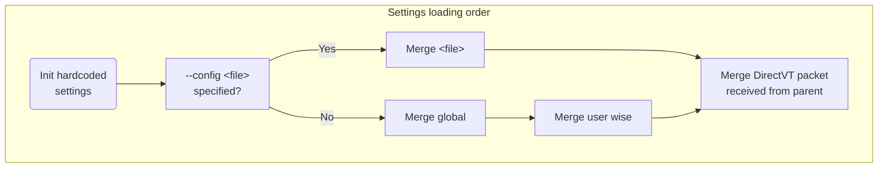

# Text Mode Desktop Settings



- Hardcoded settings
  - See [/src/vtm.xml](../src/vtm.xml) for reference.
- Global settings
  - on posix: `/etc/vtm/settings.xml`
  - on win32: `%programdata%/vtm/settings.xml`
- User wise settings
  - on posix: `~/.config/vtm/settings.xml`
  - on win32: `%userprofile%/.config/vtm/settings.xml`
- DirectVT packet (built-in terminal only for now)
  - The `<config>` menu item subsection passed to the dtvt application upon startup:
    ```xml
    <config>
        <menu>
            ...
            <item ... type=DirectVT ... param="$0 ...">
                <config> <!-- item's `<config>` subsection -->
                    ...
                </config>
            </item>
            ...
        </menu>
        ...
    </config>
    ```

## Configuration file Format (settings.xml)

Configuration file format is a slightly modified XML-format which allows to store hierarchical list of key=value pairs.

### Key differences from the standard XML

 - All stored values are UTF-8 strings:
   - `name=2000` and `name="2000"` has the same meaning.
 - There is no distinction between XML-attribute and XML-subobject, i.e. any attributes are sub-objects:
   - `<name param=value />` and `<name> <param=value /> </name>` has the same meaning.
 - In addition to a set of sub-objects each object can contain its own text value:
   - E.g. `<name=names_value param=params_value />`.
 - Each object can be defined in any way, either using an XML-attribute or an XML-subobject syntax:
   - `<... name=value />`, `<...> <name> "value" </name> </...>`, and `<...> <name=value /> </...>` has the same meaning.
 - The object name that ending in an asterisk indicates that this object is not an object, but it is a template for all subsequent objects with the same name in the same scope. See `Template Example` below.
 - Escaped characters:
   - `\e`  ASCII 0x1B ESC
   - `\t`  ASCII 0x09 TAB
   - `\a`  ASCII 0x07 BEL
   - `\n`  ASCII 0x0A LF
   - `\\`  ASCII 0x5C Backslash
   - `\"`  ASCII 0x22 Quotes
   - `\'`  ASCII 0x27 Single quote
   - `$0`  Current module full path

Let's take the following object hierarchy as an example:

- \<document\> - Top-level element
  - \<thing\> - Second level element
    - \<name\> - Third level element

The following forms of element declaration are equivalent:

```xml
<document>
    <thing name="a">text1</thing>
    <thing name="b">text2</thing>
</document>
```

```xml
<document>
    <thing="text1" name="a"/>
    <thing="text2" name="b"/>
</document>
```

```xml
<document>
    <thing name="a">
        "text1"
    </thing>
    <thing name="b">
        "text2"
    </thing>
</document>
```

```xml
<document>
    <thing>
        "text1"
        <name="a"/>
    </thing>
    <thing>
        <name="b"/>
        "text2"
    </thing>
</document>
```

```xml
<document>
    <thing="t">
        "ext"
        <name>
            "a"
        </name>
        "1"
    </thing>
    <thing>
        <name>
            "b"
        </name>
        "text"
        "2"
    </thing>
</document>
```

#### Templates

- Using asterisk `*` at the end of the element name sets defaults for subsequent elements with the same name.

Note. Placing an asterisk without any other nested elements (such as `<listitem*/>`) indicates the start of a new list of elements. This list will replace the existing one when merging the configuration.

The following declarations have the same meaning:

```xml
<list>
    <listitem id=first  name="text">another_text</listitem>
    <listitem id=second name="text">another_text</listitem>
</list>
```

```xml
<list>
    <listitem* name="text"/> <!-- skip this element and set name="text" as default for the following listitems -->
    <listitem id=first >another_text</listitem>
    <listitem id=second>another_text</listitem>
</list>
```

```xml
<list>
    <listitem* name="text"/>
    <listitem="another_text" id=first />
    <listitem="another_text" id=second/>
</list>
```

```xml
<list>
    <listitem*="another_text" name="text"/>  <!-- skip this element and set listitem="another_text" and name="text" as default for the following listitems -->
    <listitem id=first />
    <listitem id=second/>
</list>
```

### Configuration Structure

Top-level element `<config>` contains the following base elements:
  - Single `<menu>` block - taskbar menu configuration which contains:
    - Set of `<item>` elements - a list of menu items.
    - Single `<autorun>` block - a list of items to run at the environment startup.

#### Application Configuration

The menu item of DirectVT type (`type=DirectVT` or `type=dtvt`) can be additionally configured using `<config>` subelement. This type is only supported by built-in terminal for now.

The content of the `<config>` subelement is passed to the application upon startup.

#### Taskbar menu item attributes

Attribute  | Description                                       | Value type | Mandatory | Default value
-----------|---------------------------------------------------|------------|-----------|---------------
`id`       |  Item textual identifier                          | `string`   | required  |
`alias`    |  Use existing item specified by `id` as template  | `string`   |           |
`hidden`   |  Item visibility                                  | `boolean`  |           | `no`
`label`    |  Item label text                                  | `string`   |           | =`id`
`notes`    |  Item tooltip text                                | `string`   |           | empty
`title`    |  App window title                                 | `string`   |           | empty
`footer`   |  App window footer                                | `string`   |           | empty
`bgc`      |  App window background color                      | `RGBA`     |           |
`fgc`      |  App window foreground color                      | `RGBA`     |           |
`winsize`  |  App window 2D size                               | `x;y`      |           |
`winform`  |  App window state                                 | `undefined` \| `maximized` \| `minimized` |           |
`slimmenu` |  App window menu vertical size                    | `boolean`  |           | `no`
`env`      |  Environment variable in "var=val" format         | `string`   |           |
`cwd`      |  Current working directory                        | `string`   |           |
`type`     |  App type                                         | `string`   |           | `SHELL`
`param`    |  App constructor arguments                        | `string`   |           | empty
`config`   |  Configuration patch for DirectVT apps            | `xml-node` |           | empty

#### Value literals

Type     | Format
---------|-----------------
`RGBA`   |  `#rrggbbaa` \| `0xaabbggrr` \| `rrr,ggg,bbb,aaa` \| 256-color index
`boolean`|  `true` \| `false` \| `yes` \| `no` \| `1` \| `0` \| `on` \| `off`
`string` |  _UTF-8 text string_
`x;y`    |  _integer_ <any_delimeter> _integer_

#### App type

Type              | Parameter        | Description
------------------|------------------|-----------
`DirectVT`        | `_command line_` | Run `_command line_` using DirectVT protocol. Usage example `type=DirectVT param="_command line_"`.
`XLVT`\|`XLinkVT` | `_command line_` | Run `_command line_` using DirectVT protocol with controlling terminal attached for OpenSSH interactivity. Usage example `type=XLVT param="_command line_"`.
`ANSIVT`          | `_command line_` | Run `_command line_` inside the built-in terminal. Usage example `type=ANSIVT param="_command line_"`. Same as `type=DirectVT param="$0 -r term _command line_"`.
`SHELL` (default) | `_command line_` | Run `_command line_` on top of a system shell that runs inside the built-in terminal. Usage example `type=SHELL param="_command line_"`. Same as `type=DirectVT param="$0 -r term _shell_ -c _command line_"`.
`Group`           | [[ v[`n:m:w`] \| h[`n:m:w`] ] ( id_1 \| _nested_block_ , id_2 \| _nested_block_ )] | Run tiling window manager with layout specified in `param`. Usage example `type=Group param="h1:1(Term, Term)"`.
`Region`          | | The `param` attribute is not used, use attribute `title=_view_title_` to set region name.

The following configuration items produce the same final result:
```
<item …. param=‘mc’/>
<item …. type=SHELL param=‘mc’/>
<item …. type=ANSIVT param=‘bash -c mc’/>
<item …. type=DirectVT param=‘$0 -r term bash -c mc’/>
```

### Configuration Example

Note: The following configuration sections are not implemented yet:
- config/menu/item/hotkeys
- config/hotkeys

#### Minimal config (`~/.config/vtm/settings.xml`)

```xml
<config>
    <menu selected=Term item*>  <!-- Use asterisk to remove previous/existing items from the list. -->
        <item id=Term/>  <!-- title=id type=SHELL param=os_default_shell -->
    </menu>
</config>
```

#### Typical config  (`~/.config/vtm/settings.xml`)

Note: Hardcoded settings are built from the [/src/vtm.xml](../src/vtm.xml) source file.

```xml
<config>
    <menu wide=off selected=Term>  <!-- Set selected using menu item id. -->
        <item*/>  <!-- Use asterisk at the end of the element name to set defaults.
                       Using an asterisk with the parameter name of the first element in the list without any other nested attributes
                       indicates the beginning of the list, i.e. the list will replace the existing one when the configuration is merged. -->
        <item splitter label="apps">
            <notes>
                " Default applications group                         \n"
                " It can be configured in ~/.config/vtm/settings.xml "
            </notes>
        </item>
        <item* hidden=no fgc=whitedk bgc=0x00000000 winsize=0,0 wincoor=0,0 winform=undefined /> <!-- winform: undefined | maximized | minimized -->
        <item id=Term label="Term" type=DirectVT title="Terminal Emulator" notes=" Terminal Emulator " param="$0 -r term">
            <config>   <!-- The following config partially overrides the base configuration. It is valid for DirectVT apps only. -->
                <term>
                    <scrollback>
                        <size=35000    />   <!-- Initial scrollback buffer length. -->
                        <wrap="on"     />   <!-- Lines wrapping mode. -->
                    </scrollback>
                    <color>
                        <color4  = bluedk     /> <!-- See /config/set/* for the color name reference. -->
                        <color15 = whitelt    />
                        <default bgc=0 fgc=15 />  <!-- Initial colors. -->
                    </color>
                    <cursor>
                        <style="underline"/> <!-- block | underline  -->
                    </cursor>
                    <selection>
                        <mode = text/> <!-- text | ansi | rich | html | protected | none -->
                    </selection>
                    <menu>
                        <autohide=off/>  <!--  If true/on, show window menu only on hover. -->
                        <enabled=true/>
                        <slim=1/>
                    </menu>
                </term>
            </config>
        </item>
        <item id=PowerShell label="PowerShell" type=DirectVT title="Windows PowerShell"          param="$0 -r term powershell" fgc=15 bgc=0xFF562401 notes=" Windows PowerShell "/>
   <!-- <item id=WSL        label="WSL"        type=DirectVT title="Windows Subsystem for Linux" param="$0 -r term wsl"                              notes=" Default WSL profile session "/> -->
   <!-- <item id=Far        label="Far"        type=SHELL    title="Far Manager"                 param="far"                                         notes=" Far Manager in its own window "/> -->
   <!-- <item id=mc         label="mc"         type=SHELL    title="Midnight Commander"    param="mc"               notes=" Midnight Commander in its own window "/> -->
        <item id=Tile       label="Tile"       type=Group    title="Tiling Window Manager" param="h1:1(Term, Term)" notes=" Tiling window manager with two terminals attached "/>
        <item id=View       label=View         type=Region   title="\e[11:3pView: Region"  winform=maximized        notes=" Desktop region marker "/>
        <item id=Logs       label=Logs         type=DirectVT title="Logs"            param="$0 -q -r term $0 -m" notes=" Log monitor "/>
        <autorun item*>  <!-- Autorun specified menu items      -->
            <!--  <item* id=Term winsize=80,25 />               -->
            <!--  <item wincoor=92,31 winform=minimized />      --> <!-- Autorun supports minimized winform only. -->
            <!--  <item wincoor=8,31 />                         -->
            <!--  <item wincoor=8,4 winsize=164,25 focused />   -->
        </autorun>
        <viewport coor=0,0/>  <!-- Viewport position for the first connected user. At runtime, this value is temporarily replaced with the next disconnecting user's viewport coordinates to restore the viewport position on reconnection. -->
        <width>    <!-- Taskbar menu width -->
            <folded=11/>
            <expanded=32/>
        </width>
        <color fgc=whitedk bgc=0x60202020 />
    </menu>
    <panel> <!-- Desktop info panel. -->
        <cmd = ""/> <!-- Command-line to activate. -->
        <cwd = ""/> <!-- Working directory. -->
        <height = 1 /> <!-- Desktop space reserved on top. -->
    </panel>
    <hotkeys key*>    <!-- not implemented -->
        <key="Ctrl+PgUp" action=PrevWindow />
        <key="Ctrl+PgDn" action=NextWindow />
    </hotkeys>
    <appearance>
        <defaults>
            <fps      = 60   />
            <bordersz = 1,1  />
            <lucidity = 0xff /> <!-- not implemented -->
            <tracking = off  /> <!-- Mouse cursor highlighting. -->
            <macstyle = no /> <!-- Preferred window control buttons location. no: right corner (like on MS Windows), yes: left side (like on macOS) -->
            <brighter   fgc=purewhite bgc=purewhite alpha=60 /> <!-- Highlighter. -->
            <kb_focus   fgc=bluelt    bgc=bluelt    alpha=60 /> <!-- Keyboard focus indicator. -->
            <shadower   bgc=0xB4202020 />                       <!-- Darklighter. -->
            <shadow     bgc=0xB4202020 />                       <!-- Light Darklighter. -->
            <selector   bgc=0x30ffffff txt=" " />               <!-- Selection overlay. -->
            <highlight  fgc=purewhite bgc=bluelt      />
            <warning    fgc=whitelt   bgc=yellowdk    />
            <danger     fgc=whitelt   bgc=redlt       />
            <action     fgc=whitelt   bgc=greenlt     />
            <label      fgc=blackdk   bgc=whitedk     />
            <inactive   fgc=blacklt   bgc=transparent />
            <menu_white fgc=whitelt   bgc=0x80404040  />
            <menu_black fgc=blackdk   bgc=0x80404040  />
            <timings>
                <fader duration=0ms fast=0ms/>  <!-- Fader animation config. -->
                <spd            = 10    /> <!-- Auto-scroll initial speed component ΔR.              -->
                <pls            = 167   /> <!-- Auto-scroll initial speed component ΔT.              -->
                <ccl            = 120   /> <!-- Auto-scroll duration in ms.                          -->
                <spd_accel      = 1     /> <!-- Auto-scroll speed accelation.                        -->
                <ccl_accel      = 30    /> <!-- Auto-scroll additional duration in ms.               -->
                <spd_max        = 100   /> <!-- Auto-scroll max speed.                               -->
                <ccl_max        = 1000  /> <!-- Auto-scroll max duration in ms                       -->
                <deceleration   = 2s    /> <!-- Object state stopping duration in s.                 -->
                <switching      = 200   /> <!-- Object state switching duration in ms.               -->
                <blink_period   = 400ms /> <!-- Period in ms between the blink states of the cursor. -->
                <menu_timeout   = 250ms /> <!-- Taskbar collaplse timeout.                           -->
                <active_timeout = 1s    /> <!-- Timeout off the active object.                       -->
                <repeat_delay   = 500ms /> <!-- Repeat delay.                                        -->
                <repeat_rate    = 30ms  /> <!-- Repeat rate.                                         -->
            </timings>
            <limits>
                <window size=2000x1000 />  <!-- Max window size -->
            </limits>
        </defaults>
        <runapp>    <!-- Override defaults. -->
            <brighter fgc=purewhite bgc=purewhite alpha=0 /> <!-- Highlighter. -->
        </runapp>
    </appearance>
    <set>         <!-- Global namespace - Unresolved literals will be taken from here. -->
        <blackdk   = 0xFF101010 /> <!-- Color reference literals. -->
        <reddk     = 0xFF1f0fc4 />
        <greendk   = 0xFF0ea112 />
        <yellowdk  = 0xFF009cc0 />
        <bluedk    = 0xFFdb3700 />
        <magentadk = 0xFF981787 />
        <cyandk    = 0xFFdd963b />
        <whitedk   = 0xFFbbbbbb />
        <blacklt   = 0xFF757575 />
        <redlt     = 0xFF5648e6 />
        <greenlt   = 0xFF0cc615 />
        <yellowlt  = 0xFFa5f1f8 />
        <bluelt    = 0xFFff783a />
        <magentalt = 0xFF9e00b3 />
        <cyanlt    = 0xFFd6d660 />
        <whitelt   = 0xFFf3f3f3 />
        <pureblack = 0xFF000000 />
        <purewhite = 0xFFffffff />
        <nocolor   = 0x00000000 />
        <transparent = nocolor  />
    </set>
    <client>
        <background fgc=whitedk bgc=0xFF000000>  <!-- Desktop background color. -->
            <tile=""/> <!-- True color ANSI-art with gradients can be used here. -->
            <!-- Example of background with some gradients -->
            <!-- <tile>
                "\e[48;2;83;161;238m \e[48;2;78;179;241m \e[48;2;70;195;244m \e[48;2;60;207;246m \e[48;2;55;212;247m \e[48;2;55;212;247m \e[48;2;60;207;246m \e[48;2;70;195;244m \e[48;2;78;179;241m \e[48;2;83;161;238m \n"
                "\e[48;2;82;171;239m \e[48;2;72;191;243m \e[48;2;55;212;247m \e[48;2;31;233;251m \e[m\e[48;2;0;255;255m \e[m\e[48;2;0;255;255m \e[48;2;31;233;251m \e[48;2;55;212;247m \e[48;2;72;191;243m \e[48;2;82;171;239m \n"
                "\e[48;2;83;161;238m \e[48;2;78;179;241m \e[48;2;70;195;244m \e[48;2;60;207;246m \e[48;2;55;212;247m \e[48;2;55;212;247m \e[48;2;60;207;246m \e[48;2;70;195;244m \e[48;2;78;179;241m \e[48;2;83;161;238m \e[m"
            </tile> -->
        </background>
        <clipboard>
            <preview enabled=true size=80x25 bgc=bluedk fgc=whitelt>
                <alpha=0xFF />  <!-- Preview alpha is applied only to the ansi/rich/html text type -->
                <timeout=3s />  <!-- Preview hiding timeout. Set it to zero to disable hiding. -->
                <shadow=7   />  <!-- Preview shadow strength (0-10). -->
            </preview>
            <format=html />  <!-- none | text | ansi | rich | html | protected -->
        </clipboard>
        <viewport coor=0,0 />
        <mouse dblclick=500ms />
        <tooltips timeout=2000ms enabled=true fgc=pureblack bgc=purewhite />
        <debug overlay=off toggle="🐞" />  <!-- Display console debug info. -->
        <regions enabled=0 />             <!-- Highlight UI objects boundaries. -->
    </client>
    <term>      <!-- Base configuration for the Term app. It can be partially overridden by the menu item's config subarg. -->
        <scrollback>
            <size=40000    />   <!-- Scrollback buffer length. -->
            <growstep=0    />   <!-- Scrollback buffer grow step. The buffer behaves like a ring in case of zero. -->
            <maxline=65535 />   <!-- Max line length. Line splits if it exceeds the limit. -->
            <wrap="on"     />   <!-- Lines wrapping mode. -->
            <reset onkey="on" onoutput="off" />   <!-- Scrollback viewport reset triggers. -->
        </scrollback>
        <color>
            <color0  = blackdk    /> <!-- See /config/set/* for the color name reference. -->
            <color1  = reddk      />
            <color2  = greendk    />
            <color3  = yellowdk   />
            <color4  = bluedk     />
            <color5  = magentadk  />
            <color6  = cyandk     />
            <color7  = whitedk    />
            <color8  = blacklt    />
            <color9  = redlt      />
            <color10 = greenlt    />
            <color11 = yellowlt   />
            <color12 = bluelt     />
            <color13 = magentalt  />
            <color14 = cyanlt     />
            <color15 = whitelt    />
            <default bgc=0 fgc=15 />  <!-- Initial colors. -->
            <match fx=color bgc="0xFF007F00" fgc=whitelt/>  <!-- Color of the selected text occurrences. Set fx to use cell::shaders: xlight | color | invert | reverse -->
            <selection>
                <text fx=color bgc=bluelt fgc=whitelt/>  <!-- Highlighting of the selected text in plaintext mode. -->
                <protected fx=color bgc=bluelt fgc=whitelt/>  <!-- Note: The bgc and fgc attributes only apply to the fx=color shader. -->
                <ansi fx=xlight bgc=bluelt fgc=whitelt/>
                <rich fx=xlight bgc=bluelt fgc=whitelt/>
                <html fx=xlight bgc=bluelt fgc=whitelt/>
                <none fx=color bgc=blacklt fgc=whitedk/>  <!-- Inactive selection color. -->
            </selection>
        </color>
        <fields>
            <lucent=0xC0 /> <!-- Fields transparency level. -->
            <size=0      /> <!-- Left/right field size (for hz scrolling UX). -->
        </fields>
        <tablen=8 />   <!-- Tab length. -->
        <cursor>
            <style="underline"/> <!-- block | underline -->
            <blink=400ms/>       <!-- blink period -->
            <show=true/>
        </cursor>
        <menu item*>
            <autohide=off/>
            <enabled=1/>
            <slim=1/>
            <item label="Wrap" type=Option action=TerminalWrapMode data="off">
                <label="\e[38:2:0:255:0mWrap\e[m" data="on"/>
                <notes>
                    " Wrapping text lines on/off      \n"
                    " - applied to selection if it is "
                </notes>
            </item>
            <item label="Selection" notes=" Text selection mode " type=Option action=TerminalSelectionMode data="none">  <!-- type=Option means that the тext label will be selected when clicked.  -->
                <label="\e[38:2:0:255:0mPlaintext\e[m" data="text"/>
                <label="\e[38:2:255:255:0mANSI-text\e[m" data="ansi"/>
                <label data="rich">
                    "\e[38:2:109:231:237m""R"
                    "\e[38:2:109:237:186m""T"
                    "\e[38:2:60:255:60m"  "F"
                    "\e[38:2:189:255:53m" "-"
                    "\e[38:2:255:255:49m" "s"
                    "\e[38:2:255:189:79m" "t"
                    "\e[38:2:255:114:94m" "y"
                    "\e[38:2:255:60:157m" "l"
                    "\e[38:2:255:49:214m" "e" "\e[m"
                </label>
                <label="\e[38:2:0:255:255mHTML-code\e[m" data="html"/>
                <label="\e[38:2:0:255:255mProtected\e[m" data="protected"/>
            </item>
            <item label="<" action=TerminalFindPrev>  <!-- type=Command is a default item's attribute. -->
                <label="\e[38:2:0:255:0m<\e[m"/>
                <notes>
                    " Previous match                    \n"
                    " - using clipboard if no selection \n"
                    " - page up if no clipboard data    "
                </notes>
            </item>
            <item label=">" action=TerminalFindNext>
                <label="\e[38:2:0:255:0m>\e[m"/>
                <notes>
                    " Next match                        \n"
                    " - using clipboard if no selection \n"
                    " - page up if no clipboard data    "
                </notes>
            </item>
            <item label="  "    notes=" ...empty menu block/splitter for safety "/>
            <item label="Clear" notes=" Clear TTY viewport "                  action=TerminalOutput data="\e[2J"/>
            <item label="Reset" notes=" Clear scrollback and SGR-attributes " action=TerminalOutput data="\e[!p"/>
            <item label="Top" action=TerminalViewportTop/> <!-- See Term app description below for details (readme.md). -->
            <item label="End" action=TerminalViewportEnd/>
            <item label="PgUp" type=Repeat action=TerminalViewportPageUp/>
            <item label="PgDn" type=Repeat action=TerminalViewportPageDown/>
            <item label="Hello, World!" notes=" Simulating keypresses "       action=TerminalSendKey data="Hello World!"/>
        </menu>
        <selection>
            <mode="text"/> <!-- text | ansi | rich | html | protected | none -->
            <rect=false/>  <!-- Preferred selection form: Rectangular: true, Linear false. -->
        </selection>
        <atexit = auto /> <!-- auto:    Stay open and ask if exit code != 0. (default)
                               ask:     Stay open and ask.
                               close:   Always close.
                               restart: Restart session.
                               retry:   Restart session if exit code != 0. -->
        <hotkeys key*>    <!-- not implemented -->
            <key="Alt+RightArrow" action=TerminalFindNext />
            <key="Alt+LeftArrow"  action=TerminalFindPrev />
        </hotkeys>
    </term>
    <defapp>
        <menu>
            <autohide=off/>
            <enabled=true/>
            <slim=true/>
        </menu>
    </defapp>
    <tile>
        <menu>
            <autohide=off/>
            <enabled=true/>
            <slim=true/>
        </menu>
    </tile>
    <text>      <!-- Base configuration for the Text app. It can be overridden by param's subargs. -->
        <!-- not implemented -->
    </text>
    <calc>      <!-- Base configuration for the Calc app. It can be overridden by param's subargs. -->
        <!-- not implemented -->
    </calc>
    <settings>      <!-- Base configuration for the Settings app. It can be overridden by param's subargs. -->
        <!-- not implemented -->
    </settings>
</config>
```

Note: The `$0` tag will be expanded to the fully qualified current module filename when the configuration is loaded.