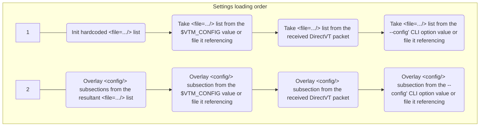

# Text-based Desktop Environment settings



## TL;DR

The settings are stored in an XML-like format, forming a hierarchical list of key=value pairs.  
See [`/src/vtm.xml`](../src/vtm.xml) for reference.

We call the text data in the settings file "plain XML data" even though our file format is not technically XML, but only visually resembles it.

There are two predefined settings source locations:
```xml
<file="/etc/vtm/settings.xml"/>        <!-- Default system-wide settings source. The "/etc/..." path will be auto converted to the "%PROGRAMDATA%\..." on Windows. -->
<file="~/.config/vtm/settings.xml"/>   <!-- Default user-wise settings source. -->
```

The process of loading settings consists of the following steps:
- Build an ordered list of the setting source files by looking for the root `<file=.../>` subsections.
- Overlay the `<config/>` subsection from the source files in the specified order.
- Overlay the `<config/>` subsection from the value of the `$VTM_CONFIG` environment variable or from a settings file it references.
- Overlay the `<config/>` subsection from the DirectVT config payload received from the parent process.
- Overlay the `<config/>` subsection from the specified `--config <...>` CLI option value or from a settings file it referencing.

The file list is built in the following order from the following sources:
- The settings file list from the hardcoded configuration containing a list of two files:
  ```xml
  <file*/>  <!-- Clear previously defined sources. Start a new list. -->
  <file="/etc/vtm/settings.xml"/>        <!-- Default system-wide settings source. The "/etc/..." path will be auto converted to the "%PROGRAMDATA%\..." on Windows. -->
  <file="~/.config/vtm/settings.xml"/>   <!-- Default user-wise settings source. -->
  ...
  ```
- The settings file list from the `$VTM_CONFIG` environment variable value or from a settings file it referencing.
  - A case with a plain XML-data:
    - `$VTM_CONFIG=<file*/><file='/path/to/override_defaults.xml'/>...` - Clear the current file list and begin a new file list containing a single file '/path/to/override_defaults.xml'.
    - `$VTM_CONFIG=<file='/path/to/first.xml'/><file='/path/to/second.xml'/>...` - Append the current file list with the files '/path/to/first.xml' and '/path/to/second.xml'.
  - A case with a file reference:
    - `$VTM_CONFIG='/path/to/override_defaults.xml'` - Take the file list from the '/path/to/override_defaults.xml'.
- The settings file list from the DirectVT config received from the parent process.
- The settings file list from the specified `--config <...>` CLI option value or from a settings file it referencing.
  - A case with a plain XML-data:
    - `./vtm --config "<file*/><file='/path/to/override_defaults.xml'/>..."` - Clear the current file list and begin a new file list containing a single file '/path/to/override_defaults.xml/'.
  - A case with a file reference:
    - `./vtm --config "/path/to/override_defaults.xml"` - Take the file list from the '/path/to/override_defaults.xml'.

## Details

### Key differences from XML

 - All stored values are UTF-8 strings (the settings consumer decides on its own side how to interpret the string):
   - `name=2000` and `name="2000"` have the same meaning.
 - There is no distinction between XML-attribute and XML-subobject, i.e. any attributes are sub-objects:
   - `<name param=value />` and `<name> <param=value /> </name>` have the same meaning.
 - In addition to a set of sub-objects each object can contain its own text value:
   - E.g. `<name=names_value param=params_value />` - subobject `name` has text value `names_value`.
 - Each object can be defined in any way, either using an XML-attribute or an XML-subobject syntax:
   - `<... name=value />`, `<...> <name> "value" </name> </...>`, and `<...> <name=value /> </...>` have the same meaning.
 - The object name that ending in an asterisk indicates that this object is not an object, but it is a template for all subsequent objects with the same name in the same scope. See `Template Example` below.
 - Compact syntax is allowed.
   - `<node0><node1><thing name=value/></node1></node0>` and `<node0/node1/thing name=value/>` have the same meaning.
 - Objects can reference values of other objects using absolute references (three levels of indirection allowed).
   - `thing2` refers to the value `thing1` in `<node1 thing1=value1/><node2 thing2=/node1/thing1 />`.
 - Any Unicode characters are allowed, including the U+0000 (null) character.
 - Multiple root elements are allowed.
 - There is no support for named XML character entities.
 - Escaped characters with special meaning:
   - `\a`  ASCII 0x07 BEL
   - `\t`  ASCII 0x09 TAB
   - `\n`  ASCII 0x0A LF
   - `\r`  ASCII 0x0D CF
   - `\e`  ASCII 0x1B ESC
   - `\\`  ASCII 0x5C Backslash
   - `\u`  A Unicode escape sequence in the form `\u{XXX}` or `\uXXX`, where `XXX` is the hexadecimal codepoint value.
   - `$0`  Current module full path (it only expands in cases where it makes sense)

Let's take the following object hierarchy as an example:

- \<document\> - Top-level element
  - \<thing\> - Second level element
    - \<name\> - Third level element

The following forms of element declaration are equivalent:

```xml
<document>
    <thing name="a">text1</thing>
    <thing name="b">text2</thing>
</document>
```

```xml
<document>
    <thing="text1" name="a"/>
    <thing="text2" name="b"/>
</document>
```

```xml
<document>
    <thing name="a">
        "text1"
    </thing>
    <thing name="b">
        "text2"
    </thing>
</document>
```

```xml
<document>
    <thing>
        "text1"
        <name="a"/>
    </thing>
    <thing>
        <name="b"/>
        "text2"
    </thing>
</document>
```

```xml
<document>
    <thing="t">
        "ext"
        <name>
            "a"
        </name>
        "1"
    </thing>
    <thing>
        <name>
            "b"
        </name>
        "text"
        "2"
    </thing>
</document>
```

#### Templates

- Using asterisk `*` at the end of the element name sets defaults for subsequent elements with the same name.

Note. Placing an asterisk without any other nested elements (such as `<listitem*/>`) indicates the start of a new list of elements. This list will replace the existing one when merging the configuration.

The following declarations have the same meaning:

```xml
<list>
    <listitem id=first  name="text_string1">text_string2</listitem>
    <listitem id=second name="text_string1">text_string2</listitem>
</list>
```

```xml
<list>
    <listitem* name="text_string1"/> <!-- skip this element and set name="text_string1" as default for the following listitems -->
    <listitem id=first >text_string2</listitem>
    <listitem id=second>text_string2</listitem>
</list>
```

```xml
<list>
    <listitem* name="text_string1"/>
    <listitem="text_string2" id=first />
    <listitem="text_string2" id=second/>
</list>
```

```xml
<list>
    <listitem*="text_string2" name="text_string1"/>  <!-- skip this element and set listitem="text_string2" and name="text_string1" as default for the following listitems -->
    <listitem id=first />
    <listitem id=second/>
</list>
```

### Compact XML syntax

The following declarations have the same meaning:

```xml
<config>
    <document>
        <thing="thing_value">
            <name="name_value"/>
        </thing>
    </document>
</config>
```

```xml
<config/document/thing="thing_value" name="name_value"/>
```

### Vtm configuration structure

```xml
<file= ... />  <!-- Ordered list of references to settings files used to form the resultant configuration. -->
...
<config>  <!-- Global configuration. -->
    <variables>  <!-- Global namespace - Unresolved literals will try to be resolved from here. -->
        <variable_name = variable_value/>  <!-- Globally referenced variable. -->
        ...  <!-- Set of global variables. -->
    </variables>
    ...
    <object1=variable_name/>      <!-- object1 references the value of /config/variables/variable_name (/config/variables is a default namespace). -->
    <object2=/config/object1/>    <!-- object2 references the value of /config/object1 using an absolute reference (three levels of indirection allowed). -->
    <object3="/config/object1"/>  <!-- object3 contains the string value "/config/object1". -->
    ...
    <desktop>  <!-- Desktop client settings. -->
        <taskbar ... >  <!-- Taskbar menu settings. -->
            ...  <!-- Set of additional taskbar settings. -->
            <item ... >  <!-- Taskbar menu item definition. -->
                ...  <!-- Additional application settings. -->
            </item>
            ...  <!-- Set of taskbar menu items. -->
        </taskbar>
        ...  <!-- Set of additional desktop settings. -->
    </desktop>
    <terminal ... >  <!-- Built-in terminal configuration section. -->
        ...
    </terminal>
    <events>  <!-- The required key combination sequence can be generated on the Info page, accessible by clicking on the label in the lower right corner of the vtm desktop. -->
        <gate>  <!-- Native GUI window layer key bindings. -->
            <key="Key+Chord" script="<script body>"/>
            ...
        </gate>
        <desktop>  <!-- Desktop layer key bindings. -->
            <key="Key+Chord" script="<script body>"/>
            ...
        </desktop>
        <applet>  <!-- Application/window layer key bindings. -->
            <key="Key+Chord" script="<script body>"/>
            ...
        </applet>
        <terminal>  <!-- Application specific layer key bindings. -->
            <key="Key+Chord" script="<script body>"/>
            ...
        </terminal>
    </events>
</config>
```

#### Value literals `attribute=literal`

All value literals containing spaces must be enclosed in double or single quotes.

Value type | Format
-----------|-----------------
`RGBA`     | Hex: `#rrggbbaa` \| Hex: `0xaarrggbb` \| Decimal: `r,g,b,a` \| 256-color index: `i`
`boolean`  | `true` \| `false` \| `yes` \| `no` \| `1` \| `0` \| `on` \| `off` \| `undef`
`string`   | _UTF-8 text string_
`x;y`      | _integer_ <any_delimeter> _integer_

#### Taskbar menu item configuration `<config/desktop/taskbar/item ... />`

Attribute  | Description                                       | Value type | Default value
-----------|---------------------------------------------------|------------|---------------
`id`       |  Item id                                          | `string`   |
`alias`    |  Item template `id` reference                     | `string`   |
`hidden`   |  Item visibility on taskbar                       | `boolean`  | `no`
`label`    |  Item label text                                  | `string`   | =`id`
`tooltip`  |  Item tooltip text                                | `string`   | empty
`title`    |  App window title                                 | `string`   | empty
`footer`   |  App window footer                                | `string`   | empty
`winsize`  |  App window size                                  | `x;y`      |
`winform`  |  App window state                                 | `undefined` \| `normal` \| `maximized` \| `minimized` |
`type`     |  Desktop window type                              | `string`   | `vtty`
`env`      |  Environment variable in "var=val" format         | `string`   |
`cwd`      |  Current working directory                        | `string`   |
`cmd`      |  Desktop window constructor arguments             | `string`   | empty
`cfg`      |  Configuration patch for dtvt-apps in XML-format  | `string`   | empty
`config`   |  Configuration patch for dtvt-apps                | `xml-node` | empty

The menu item of DirectVT Gateway type (`type=dtvt`) can be additionally configured using a `<config>` subsection or a `cfg="xml-text-data"` attribute. The `<config>` subsection will be ignored if the `cfg` attribute contains a non-empty value.

The content of the `cfg` attribute (or `<config>` subsection) is passed to the dtvt-application on launch.

#### Desktop window type `<config/desktop/taskbar/item type=... />`

Window type<br>(case insensitive) | Parameter `cmd=` | Description
----------------------------------|------------------|------------
`vtty` (default)                  | A CUI application command line with arguments | Run a CUI application inside the `Teletype Console dtvt-bridge`. Usage example `type=vtty cmd="cui_app ..."`. It is the same as `type=dtvt cmd="vtm -r vtty cui_app ..."`.
`term`                            | A CUI application command line with arguments | Run a CUI application inside the `Terminal Console dtvt-bridge`. Usage example `type=term cmd="cui_app ..."`. It is the same as `type=dtvt cmd="vtm -r term cui_app ..."`.
`dtvt`                            | A DirectVT-aware application command line with arguments | Run a DirectVT-aware application inside the `DirectVT Gateway`. Usage example `type=dtvt cmd="dtvt_app ..."`.
`dtty`                            | A DirectVT-aware application command line with arguments | Run a DirectVT-aware application inside the `DirectVT Gateway with TTY` which has additional controlling terminal. Usage example `type=dtty cmd="dtvt_app ..."`.
`tile`                            | [[ v[`n:m:w`] \| h[`n:m:w`] ] ( id1 \| _nested_block_ , id2 \| _nested_block_ )] | Run tiling window manager with layout specified in `cmd`. Usage example `type=tile cmd="v(h1:1(Term, Term),Term)"`.<br>`n:m` - Ratio between panes (default n:m=1:1).<br>`w` - Resizing grip width (default w=1).
`site`                            | `cmd=@` or empty | The attribute `title=<view_title>` is used to set region name/title. Setting the value of the `cmd` attribute to `@` adds numbering to the title.

The following configuration items produce the same final result:
```
<item ... cmd=mc/>
<item ... type=vtty cmd=mc/>
<item ... type=dtvt cmd='vtm -r vtty mc'/>
```

### Key bindings

> 2025 Feb 28: This section is under development.

In vtm there are several layers of key combination processing. Each layer has its own set of key bindings. Keys processed at the previous layer usually do not get to the next one.

Layer                  | Config section               | Description
-----------------------|------------------------------|------------
`gate`                 |                              | ...
`desktop`              |                              | ...
`applet`               |                              | ...
`tile`                 |                              | ...
`defapp`               |                              | ...
...                    |                              | ...

#### Syntax

The syntax for defining key combination bindings is:

```xml
<key="Key+Chord | ... | Another+Key+Chord" [ preview ] script="<script body>"/>
```

Tag      | Value
---------|--------
`key`    | The text string containing the key combinations.
`preview`| A Boolean value specifying that hotkey actions should be processed while traversing the focus tree until the target object is reached (ignoring keyboard exclusive mode). Default is `off`.
`script` | The Lua script body.

The following joiners are allowed for combining keys:

Joiner | Meaning
-------|--------
`+`    | The subsequent key is in pressed state.
`-`    | The subsequent key is in released state. This joiner is allowed for the last key only.
` \| ` | The separator for key combinations in a list (vertical bar surrounded by spaces).

Key combinations can be of the following types:

Type        | Example                |Description
------------|------------------------|-----------
`Generic`   | `Ctrl+A`               | A generic key combination without distinction left/right and numpad.
`Literal`   | `Alt+'a'`              | A generic key combination without distinction left/right and numpad, except for the last key represented as a single-quoted character/string generated by the key.
`Specific`  | `LeftShift+RightShift` | A key combination with explicitly specified physical keys.
`Scancodes` | `0x3B+0x3C`            | A key combination represented solely by scan codes of physical keys in hexadecimal format.

Generic, literal and specific key sequences can be mixed in any order.

The required key combination sequence can be generated on the Info page, accessible by clicking on the label in the lower right corner of the vtm desktop.

#### Interpretation

Configuration record                                           | Interpretation
---------------------------------------------------------------|-----------------
`<key="Key+Chord" script=ScriptReference/>`                    | Append existing bindings using an indirect reference (the `ScriptReference` variable without quotes).
`<key="Key+Chord | Another+Chord" script="<script body>"/>`    | Append existing bindings for `Key+Chord | Another+Chord`.
`<key="Key+Chord" script="<script body>"/>`                    | Append existing bindings with the directly specified Lua script `"<script body>"`.
`<key="Key+Chord" script=""/>`                                 | Remove all existing bindings for the specified key combination "Key+Chord".
`<key=""          script="..."/>`                              | Do nothing.

### DirectVT configuration payload received from the parent process

The value of the `cfg` menu item attribute (or a whole `<config>` subsection) will be passed to the child dtvt-aware application on launch.  

- `settings.xml`:
  ```xml
    ...
    <desktop>
      <taskbar>
        ...
        <item ... title="DirectVT-aware Application" type=dtvt ... cfg="plain xml data as alternative to <config> subsection" cmd="dtvt_app...">
          <config> <!-- item's `<config>` subsection in case of 'cfg=' is not specified -->
            ...
          </config>
        </item>
        ...
      </taskbar>
    </desktop>
    ...
  ```

### Configuration example

#### Minimal configuration

`~/.config/vtm/settings.xml`:
```xml
<config>
    <desktop>
        <taskbar selected=Term item*>  <!-- Use asterisk to remove previous/existing items from the list. -->
            <item id=Term/>  <!-- id=Term title="Term" type=SHELL cmd=os_default_shell -->
        </taskbar>
    </desktop>
</config>
```

#### Typical configuration

Notes
- Hardcoded settings can be found in the source file [/src/vtm.xml](../src/vtm.xml).
- The `$0` tag will be expanded to the fully qualified current module filename at runtime.

`$VTM-CONFIG=/path/to/settings.xml`.
`settings.xml`:
```xml
<file*/>  <!-- Clear previously defined sources. Start a new list. -->
<file="/etc/vtm/settings.xml"/>        <!-- Default system-wide settings source. The "/etc/..." path will be auto converted to the "%PROGRAMDATA%\..." on Windows. -->
<file="~/.config/vtm/settings.xml"/>   <!-- Default user-wise settings source. -->
<config>  <!-- App configuration. -->
    <gui>  <!-- GUI mode related settings. (win32 platform only for now) -->
        <antialiasing=on/>    <!-- Antialiasing of rendered glyphs. Note: Multi-layered color glyphs such as emoji are always antialiased. -->
        <cellheight=22/>      <!-- Text cell height in physical pixels. Note: The width of the text cell depends on the primary font (the first one in the font list). -->
        <gridsize=""/>        <!-- Window initial grid size "width,height" in text cells. If gridsize="" or gridsize=0,0, then the size of the GUI window is left to the OS window manager. -->
        <wincoor=""/>         <!-- Window initial coordinates "x,y" (top-left corner on the desktop in physical pixels). If wincoor="", then the position of the GUI window is left to the OS window manager. -->
        <winstate="normal"/>  <!-- Window initial state: normal | maximized | minimized . -->
        <blinkrate=400ms/>    <!-- SGR5/6 attribute blink rate. Blinking will be disabled when set to zero. -->
        <fonts>  <!-- Font fallback ordered list. The rest of the fonts available in the system will be loaded dynamically. -->
            <font*/>  <!-- Clear previously defined fonts. Start a new list. -->
            <font="Courier New"/>  <!-- The first font in the list: Primary font. Its metrics define the cell geometry. -->
            <font="Cascadia Mono"/>
            <font="NSimSun"/>
            <font="Noto Sans Devanagari"/>
        </fonts>
    </gui>
    <cursor>
        <style="bar"/>  <!-- Cursor style: "bar" | "block" | "underline" ( |  █  _ ). -->
        <blink=400ms/>  <!-- Cursor blink period. Set to zero for a steady cursor. -->
        <show=true/>
        <color fgc=color/default bgc=color/default/>  <!-- Cursor cell color. By default, the cursor color (bgc) is set to either black or white depending on the lightness of the underlying text background. -->
    </cursor>
    <tooltips>  <!-- Not implemented for GUI mode. -->
        <timeout=2000ms/>
        <enabled=true/>
        <color fgc=pureblack bgc=purewhite/>
    </tooltips>
    <debug>
        <logs=off/>     <!-- Enable logging. Use the Logs or vtm monitor mode (vtm -m) to see the log output. -->
        <overlay=off/>  <!-- Show debug overlay. -->
        <regions=0/>    <!-- Highlight UI objects boundaries. -->
    </debug>
    <clipboard>
        <preview enabled=no size=80x25>  <!-- Not implemented for GUI mode. -->
            <color fgc=whitelt bgc=bluedk/>
            <alpha=0xFF/>  <!-- Preview alpha is applied only to the ansi/rich/html text type. -->
            <timeout=3s/>  <!-- Preview hiding timeout. Set it to zero to disable hiding. -->
            <shadow=3  />  <!-- Preview shadow strength (0-5). -->
        </preview>
        <format="html"/>  <!-- Default clipboard format for screenshots: "text" | "ansi" | "rich" | "html" | "protected" . -->
    </clipboard>
    <colors>  <!-- Along with fgc, bgc and txt, other SGR attributes (boolean) are allowed here: itc: italic, bld: bold, und: underline, inv: reverse, ovr: overline, blk: blink. -->
        <window   fgc=whitelt   bgc=0x80404040        />  <!-- Base desktop window color. -->
        <focus    fgc=purewhite bgc=bluelt            />  <!-- Focused item tinting. -->
        <brighter fgc=purewhite bgc=purewhite alpha=60/>  <!-- Brighter. -->
        <shadower               bgc=0xB4202020        />  <!-- Dimmer. -->
        <warning  fgc=whitelt   bgc=yellowdk          />  <!-- "Warning" color. -->
        <danger   fgc=whitelt   bgc=purered           />  <!-- "Danger" color. -->
        <action   fgc=whitelt   bgc=greenlt           />  <!-- "Action" color. -->
    </colors>
    <timings>
        <fps=60/>  <!-- Frames per second. Maximum frequency of rendering UI updates. -->
        <kinetic>  <!-- Kinetic scrolling. -->
            <spd       = 10  />  <!-- Initial speed component ΔR. -->
            <pls       = 167 />  <!-- Initial speed component ΔT. -->
            <ccl       = 120 />  <!-- Duration in ms. -->
            <spd_accel = 1   />  <!-- Speed accelation. -->
            <ccl_accel = 30  />  <!-- Additional duration in ms. -->
            <spd_max   = 100 />  <!-- Max speed. -->
            <ccl_max   = 1000/>  <!-- Max duration in ms. -->
        </kinetic>
        <switching     = 200ms/>  <!-- Duration of an object state switching. -->
        <deceleration  = 2s   />  <!-- Duration of stopping a moving object. -->
        <leave_timeout = 1s   />  <!-- Timeout off the active object (e.g. after mouse leaving scrollbar). -->
        <repeat_delay  = 500ms/>  <!-- Repeat delay. -->
        <repeat_rate   = 30ms />  <!-- Repeat rate. -->
        <dblclick      = 500ms/>  <!-- Mouse double click threshold. -->
    </timings>
    <variables>  <!-- Global variables - Unresolved literals will try to be resolved from here. -->
        <blackdk     = 0xFF101010 />
        <reddk       = 0xFFc40f1f />
        <greendk     = 0xFF12a10e />
        <yellowdk    = 0xFFc09c00 />
        <bluedk      = 0xFF0037db />
        <magentadk   = 0xFF871798 />
        <cyandk      = 0xFF3b96dd />
        <whitedk     = 0xFFbbbbbb />
        <blacklt     = 0xFF757575 />
        <redlt       = 0xFFe64856 />
        <greenlt     = 0xFF15c60c />
        <yellowlt    = 0xFFf8f1a5 />
        <bluelt      = 0xFF3a78ff />
        <magentalt   = 0xFFb3009e />
        <cyanlt      = 0xFF60d6d6 />
        <whitelt     = 0xFFf3f3f3 />
        <pureblack   = 0xFF000000 />
        <purewhite   = 0xFFffffff />
        <purered     = 0xFFff0000 />
        <puregreen   = 0xFF00ff00 />
        <pureblue    = 0xFF0000ff />
        <puremagenta = 0xFFff00ff />
        <purecyan    = 0xFF00ffff />
        <pureyellow  = 0xFFff00ff />
        <nocolor     = 0x00000000 />
        <color>
            <default     = 0x00ffffff />
            <transparent = nocolor    />
        </color>
        <menu>
            <autohide=no/>  <!-- Auto hide window menu items on mouse leave. -->
            <slim=true/>    <!-- Make the window menu one cell high (slim=true) or three cells high (slim=false). -->
        </menu>
        <selection>
            <mode="text"/>  <!-- Clipboard copy format: "text" | "ansi" | "rich" | "html" | "protected" | "none" . -->
            <rect=false/>   <!-- Preferred selection form: Rectangular: true, Linear: false. -->
        </selection>
        <!-- vtm.* scripting context:
            - .gate: ...
            - .applet (standalone app): ...
                - .gear: ...
            - .desktop: ...
                    - .window: ...
                    - .applet: ...
                        - .tile: ...
                            - .grip: ...
                        - .terminal: ...  -->
        <TryToQuit             ="vtm.desktop.Shutdown('try')"/>      <!-- Shut down the desktop server if no applications are running. -->
        <RunApplication        ="vtm.desktop.Run()"/>                <!-- Run default application. -->
        <RunInfoPage           ="vtm.desktop.Run({ title='Info-page', hidden=true, label='Info', type='info' })"/>  <!-- Run Info-page. -->
        <FocusPrevWindow       ="vtm.desktop.FocusNextWindow(-1)"/>  <!-- Switch focus to the prev window. -->
        <FocusNextWindow       ="vtm.desktop.FocusNextWindow( 1)"/>  <!-- Switch focus to the next window. -->

        <AlwaysOnTopApplet     ="vtm.applet.AlwaysOnTop(not vtm.applet.AlwaysOnTop())"/>  <!-- Request to toggle AlwaysOnTop window flag. -->
        <CloseApplet           ="vtm.applet.Close()"/>            <!-- Request to Close window. -->
        <MinimizeApplet        ="vtm.applet.Minimize()"/>         <!-- Request to Minimize window. -->
        <MaximizeApplet        ="vtm.applet.Maximize()"/>         <!-- Request to Maximize window. -->
        <FullscreenApplet      ="vtm.applet.Fullscreen()"/>       <!-- Request to Maximize window to full screen. -->
        <RestoreApplet         ="vtm.applet.Restore()"/>          <!-- Request to Restore maximized/fullscreen window. -->
        <MoveAppletLeft        ="vtm.applet.Warp( 1,-1, 0, 0)"/>  <!-- Request to Move window to the left. WarpApplet(l, r, t, b): The parameters specify four deltas for the left, right, top and bottom sides of the window. -->
        <MoveAppletRight       ="vtm.applet.Warp(-1, 1, 0, 0)"/>  <!-- Request to Move window to the right. -->
        <MoveAppletUp          ="vtm.applet.Warp( 0, 0, 1,-1)"/>  <!-- Request to Move window up. -->
        <MoveAppletDown        ="vtm.applet.Warp( 0, 0,-1, 1)"/>  <!-- Request to Move window down. -->
        <MoveAppletTopLeft     ="vtm.applet.Warp( 2,-2, 1,-1)"/>  <!-- Request to Move window to the top-left. -->
        <MoveAppletBottomLeft  ="vtm.applet.Warp( 2,-2,-1, 1)"/>  <!-- Request to Move window to the bottom-left. -->
        <MoveAppletTopRight    ="vtm.applet.Warp(-2, 2, 1,-1)"/>  <!-- Request to Move window to the top-right. -->
        <MoveAppletBottomRight ="vtm.applet.Warp(-2, 2,-1, 1)"/>  <!-- Request to Move window to the bottom-right. -->
        <IncreaseAppletWidth   ="vtm.applet.Warp( 0, 1, 0, 0)"/>  <!-- Request to Increase window width. -->
        <DecreaseAppletWidth   ="vtm.applet.Warp( 0,-1, 0, 0)"/>  <!-- Request to Decrease window width. -->
        <IncreaseAppletHeight  ="vtm.applet.Warp( 0, 0, 0, 1)"/>  <!-- Request to Increase window height. -->
        <DecreaseAppletHeight  ="vtm.applet.Warp( 0, 0, 0,-1)"/>  <!-- Request to Decrease window height. -->

        <TileFocusPrev         ="vtm.tile.FocusNextPaneOrGrip(-1)"/>  <!-- Focus the previous pane or the split grip. -->
        <TileFocusNext         ="vtm.tile.FocusNextPaneOrGrip( 1)"/>  <!-- Focus the next pane or the split grip. -->
        <TileFocusPrevPane     ="vtm.tile.FocusNextPane(-1)"/>        <!-- Focus the previous pane. -->
        <TileFocusNextPane     ="vtm.tile.FocusNextPane( 1)"/>        <!-- Focus the next pane. -->
        <TileRunApplication    ="vtm.tile.RunApplication()"/>         <!-- Launch application instances in active empty slots. The app to run can be set by RightClick on the taskbar. -->
        <TileSelectAllPanes    ="vtm.tile.SelectAllPanes()"/>         <!-- Select all panes. -->
        <TileSplitHorizontally ="vtm.tile.SplitPane(0)"/>             <!-- Split active panes horizontally. -->
        <TileSplitVertically   ="vtm.tile.SplitPane(1)"/>             <!-- Split active panes vertically. -->
        <TileSplitOrientation  ="vtm.tile.RotateSplit()"/>            <!-- Change split orientation. -->
        <TileSwapPanes         ="vtm.tile.SwapPanes()"/>              <!-- Swap two or more panes. -->
        <TileEqualizeSplitRatio="vtm.tile.EqualizeSplitRatio()"/>     <!-- Equalize split ratio. -->
        <TileSetManagerTitle   ="vtm.tile.SetTitle()"/>               <!-- Set tiling window manager title using clipboard data. -->
        <TileClosePane         ="vtm.tile.ClosePane()"/>              <!-- Close active application. -->
        <TileMoveGripLeft      ="vtm.grip.MoveGrip(-1, 0)"/>          <!-- Move the split grip to the left. -->
        <TileMoveGripRight     ="vtm.grip.MoveGrip( 1, 0)"/>          <!-- Move the split grip to the right. -->
        <TileMoveGripUp        ="vtm.grip.MoveGrip( 0,-1)"/>          <!-- Move the split grip up. -->
        <TileMoveGripDown      ="vtm.grip.MoveGrip( 0, 1)"/>          <!-- Move the split grip down. -->
        <TileDecreaseGripWidth ="vtm.grip.ResizeGrip(-1)"/>           <!-- Decrease the split grip width. -->
        <TileIncreaseGripWidth ="vtm.grip.ResizeGrip( 1)"/>           <!-- Increase the split grip width. -->
        <TileFocusPrevGrip     ="vtm.grip.FocusNextGrip(-1)"/>        <!-- Focus the prev split grip. -->
        <TileFocusNextGrip     ="vtm.grip.FocusNextGrip( 1)"/>        <!-- Focus the next split grip. -->

        <Disconnect            ="vtm.gate.Disconnect()"/>             <!-- Disconnect from the desktop. -->
        <ToggleDebugOverlay    ="vtm.gate.DebugOverlay()"/>           <!-- Toggle debug overlay. -->
        <IncreaseCellHeight    ="vtm.gate.IncreasecCellHeight( 1)"/>  <!-- Increase the text cell height by one pixel. -->
        <DecreaseCellHeight    ="vtm.gate.IncreasecCellHeight(-1)"/>  <!-- Decrease the text cell height by one pixel. -->
        <ResetWheelAccumulator ="vtm.gate.WheelAccumReset()"/>        <!-- Reset wheel accumulator. -->
        <ResetCellHeight       ="if (not vtm.gear.IsKeyRepeated()) then vtm.gate.CellHeightReset() end"/>   <!-- Reset text cell height. -->
        <ToggleAntialiasingMode="if (not vtm.gear.IsKeyRepeated()) then vtm.gate.AntialiasingMode() end"/>  <!-- Toggle text antialiasing mode. -->
        <RollFontsBackward     ="if (not vtm.gear.IsKeyRepeated()) then vtm.gate.RollFonts(-1) end"/>       <!-- Roll font list backward. -->
        <RollFontsForward      ="if (not vtm.gear.IsKeyRepeated()) then vtm.gate.RollFonts( 1) end"/>       <!-- Roll font list forward. -->

        <ExclusiveKeyboardMode             ="vtm.terminal.SetExclusiveKeyboardMode()"/>   <!-- Toggle exclusive keyboard mode by pressing and releasing Ctrl-Alt or Alt-Ctrl (reversed release order). -->
        <TerminalFindPrev                  ="vtm.terminal.FindNextMatch(-1)"/>            <!-- Highlight prev match of selected text fragment. Clipboard content is used if no active selection. -->
        <TerminalFindNext                  ="vtm.terminal.FindNextMatch( 1)"/>            <!-- Highlight next match of selected text fragment. Clipboard content is used if no active selection. -->
        <TerminalScrollViewportOnePageUp   ="vtm.terminal.ScrollViewportByPage( 0, 1)"/>  <!-- Scroll viewport one page up. -->
        <TerminalScrollViewportOnePageDown ="vtm.terminal.ScrollViewportByPage( 0,-1)"/>  <!-- Scroll viewport one page down. -->
        <TerminalScrollViewportOnePageLeft ="vtm.terminal.ScrollViewportByPage( 1, 0)"/>  <!-- Scroll viewport one page to the left. -->
        <TerminalScrollViewportOnePageRight="vtm.terminal.ScrollViewportByPage(-1, 0)"/>  <!-- Scroll viewport one page to the right. -->
        <TerminalScrollViewportOneLineUp   ="vtm.terminal.ScrollViewportByCell( 0, 1)"/>  <!-- Scroll viewport one line up. -->
        <TerminalScrollViewportOneLineDown ="vtm.terminal.ScrollViewportByCell( 0,-1)"/>  <!-- Scroll viewport one line down. -->
        <TerminalScrollViewportOneCellLeft ="vtm.terminal.ScrollViewportByCell( 1, 0)"/>  <!-- Scroll viewport one cell to the left. -->
        <TerminalScrollViewportOneCellRight="vtm.terminal.ScrollViewportByCell(-1, 0)"/>  <!-- Scroll viewport one cell to the right. -->
        <TerminalScrollViewportToTop       ="if (not vtm.gear.IsKeyRepeated()) then vtm.terminal.ScrollViewportToTop() end"/>  <!-- Scroll viewport to the scrollback top. -->
        <TerminalScrollViewportToEnd       ="if (not vtm.gear.IsKeyRepeated()) then vtm.terminal.ScrollViewportToEnd() end"/>  <!-- Scroll viewport to the scrollback top. -->
        <TerminalSendKey                   ="vtm.terminal.SendKey('test\r')"/>            <!-- Simulating keypresses using the specified string. -->
        <TerminalOutput                    ="vtm.terminal.Print('Hello!')"/>              <!-- Direct output the string to the terminal scrollback. -->
        <TerminalCopyViewport              ="vtm.terminal.CopyViewport()"/>               <!-- Сopy viewport to clipboard. -->
        <TerminalCopySelection             ="vtm.terminal.CopySelection()"/>              <!-- Сopy selection to clipboard. -->
        <TerminalClipboardPaste            ="vtm.terminal.PasteClipboard()"/>             <!-- Paste from clipboard. -->
        <TerminalClipboardWipe             ="vtm.terminal.ClearClipboard()"/>             <!-- Reset clipboard. -->
        <TerminalClipboardFormat           ="vtm.terminal.SetClipboardFormat()"/>         <!-- Toggle terminal text selection copy format. -->
        <TerminalSelectionForm             ="vtm.terminal.SetSelectionForm()"/>           <!-- Toggle between linear and rectangular selection form. -->
        <TerminalSelectionCancel           ="vtm.terminal.ClearSelection()"/>             <!-- Deselect a selection. -->
        <TerminalSelectionOneShot          ="vtm.terminal.OneShotSelection()"/>           <!-- One-shot toggle to copy text while mouse tracking is active. Keep selection if 'Ctrl' key is pressed. -->
        <TerminalUndo                      ="vtm.terminal.UndoReadline()"/>               <!-- (Win32 Cooked/ENABLE_LINE_INPUT mode only) Discard the last input. -->
        <TerminalRedo                      ="vtm.terminal.RedoReadline()"/>               <!-- (Win32 Cooked/ENABLE_LINE_INPUT mode only) Discard the last Undo command. -->
        <TerminalCwdSync                   ="vtm.terminal.SetCwdSync()"/>                 <!-- Toggle the current working directory sync mode. -->
        <TerminalWrapMode                  ="vtm.terminal.SetWrappingMode()"/>            <!-- Toggle terminal scrollback lines wrapping mode. Applied to the active selection if it is. -->
        <TerminalAlignMode                 ="vtm.terminal.SetAligningMode()"/>            <!-- Toggle terminal scrollback lines aligning mode. Applied to the active selection if it is. -->
        <TerminalStdioLog                  ="vtm.terminal.SetLogging()"/>                 <!-- Toggle stdin/stdout logging. -->
        <TerminalRestart                   ="vtm.terminal.Restart()"/>                    <!-- Terminate runnning console apps and restart current session. -->
    </variables>
    <desktop>  <!-- Desktop client settings. -->
        <viewport coor=0,0/>  <!-- Viewport position for the first connected user. At runtime, this value is temporarily replaced with the next disconnecting user's viewport coordinates to restore the viewport position on reconnection. -->
        <windowmax=3000x2000/>  <!-- Maximum window cell grid size. -->
        <macstyle=no/>  <!-- Preferred window control buttons location. no: right corner (like on MS Windows), yes: left side (like on macOS). -->
        <taskbar wide=off selected="Term">  <!-- Taskbar menu. wide: Set wide/compact menu layout; selected: Set selected taskbar menu item id. -->
            <item*/>  <!-- Clear all previously defined items. Start a new list of items. -->
            <item splitter label="apps">
                <tooltip>
                    " Default applications group                         \n"
                    " It can be configured in ~/.config/vtm/settings.xml "
                </tooltip>
            </item>
            <item* hidden=no winsize=0,0 wincoor=0,0 winform="normal"/>  <!-- Asterisk in the xml node name to set default node values (it is a template). -->
            <item id="Term" label="Terminal Emulator" type="dtvt" title="Terminal" cmd="$0 -r term">
                <tooltip>
                    " Terminal Console               \n"
                    "   LeftClick to launch instance \n"
                    "   RightClick to set as default "
                </tooltip>
                <config>  <!-- The following config partially overrides the base configuration. It is valid for DirectVT apps only. -->
                    <terminal>
                        <scrollback>
                            <size=40000/>  <!-- Scrollback buffer length. -->
                            <wrap=on/>     <!-- Lines wrapping mode. -->
                        </scrollback>
                        <selection>
                            <mode=selection/mode/>  <!-- Clipboard copy format: "text" | "ansi" | "rich" | "html" | "protected" | "none" . -->
                        </selection>
                    </terminal>
                </config>
            </item>
            <item id="Tile" label="Window Manager"  type="tile" title="Window Manager" cmd="h1:1(Term, Term)"      tooltip=" Tiling Window Manager           \n   LeftClick to launch instance  \n   RightClick to set as default  "/>
            <item id="Site" label="Viewport Marker" type="site" title="\e[11:3pSite "  cmd="@" winform="maximized" tooltip=" Desktop Viewport Marker         \n   LeftClick to launch instance  \n   RightClick to set as default  "/>  <!-- "\e[11:3p" for center alignment, cmd="@" for instance numbering -->
            <item id="Logs" label="Log Monitor"     type="dtvt" title="Log Monitor"    cmd="$0 -q -r term $0 -m"   tooltip=" Log Monitor                     \n   LeftClick to launch instance  \n   RightClick to set as default  ">
                <config>
                    <terminal>
                        <scrollback>
                            <size=5000/>
                            <wrap="off"/>
                        </scrollback>
                        <menu item*>
                            <autohide=menu/autohide/>
                            <slim=menu/slim/>
                            <item action=TerminalFindPrev>  <!-- type=Command is a default item's attribute. -->
                                <tooltip>
                                    " Previous match                                  \n"
                                    "   LeftClick to jump to previous match or scroll \n"
                                    "             one page up if nothing to search    \n"
                                    "   Match clipboard data if no selection          "
                                </tooltip>
                                <label="<"/>
                                <label="\e[38:2:0:255:0m<\e[m"/>
                            </item>
                            <item action=TerminalFindNext>
                                <tooltip>
                                    " Next match                                     \n"
                                    "   LeftClick to jump to next match or scroll    \n"
                                    "             one page down if nothing to search \n"
                                    "   Match clipboard data if no selection         "
                                </tooltip>
                                <label=">"/>
                                <label="\e[38:2:0:255:0m>\e[m"/>
                            </item>
                            <item type="Option" action=TerminalWrapMode>
                                <tooltip>
                                    " Wrapping text lines on/off      \n"
                                    "   Applied to selection if it is "
                                </tooltip>
                                <label="Wrap"                     data="off"/>
                                <label="\e[38:2:0:255:0mWrap\e[m" data="on"/>
                            </item>
                            <item type="Option" action=TerminalClipboardFormat tooltip=" Clipboard format ">  <!-- type=Option means that the тext label will be selected when clicked. -->
                                <label="Clipboard"                       data="none"/>
                                <label="\e[38:2:0:255:0mPlaintext\e[m"   data="text"/>
                                <label="\e[38:2:255:255:0mANSI-text\e[m" data="ansi"/>
                                <label                                   data="rich">
                                    "\e[38:2:109:231:237m""R"
                                    "\e[38:2:109:237:186m""T"
                                    "\e[38:2:60:255:60m"  "F"
                                    "\e[38:2:189:255:53m" "-"
                                    "\e[38:2:255:255:49m" "s"
                                    "\e[38:2:255:189:79m" "t"
                                    "\e[38:2:255:114:94m" "y"
                                    "\e[38:2:255:60:157m" "l"
                                    "\e[38:2:255:49:214m" "e" "\e[m"
                                </label>
                                <label="\e[38:2:0:255:255mHTML-code\e[m" data="html"/>
                                <label="\e[38:2:0:255:255mProtected\e[m" data="protected"/>
                            </item>
                            <item action=TerminalOutput tooltip=" Clear scrollback and SGR-attributes ">
                                <label="Reset" data="\e[!p"/>
                            </item>
                        </menu>
                    </terminal>
                </config>
            </item>
            <autorun item*>  <!-- Autorun specified menu items:     -->
                <!--  <item* id=Term winsize=80,25 />               -->
                <!--  <item wincoor=92,31 winform=minimized />      -->  <!-- Autorun supports minimized winform only. -->
                <!--  <item wincoor=8,31 />                         -->
                <!--  <item wincoor=8,4 winsize=164,25 focused />   -->
            </autorun>
            <width>  <!-- Taskbar menu width. -->
                <folded=18/>
                <expanded=32/>
            </width>
            <timeout=250ms/>  <!-- Taskbar collaplse timeout after mouse leave. -->
            <colors>
                <bground  fgc=whitedk bgc=0xC0202020       />  <!-- Set the bgc color non-transparent (alpha to FF) to disable acrylics in taskbar. -->
                <focused  fgc=puregreen                    />  <!-- Focused taskbar item color. -->
                <selected fgc=whitelt                      />  <!-- Default taskbar item color. -->
                <active   fgc=whitelt                      />  <!-- Running taskbar item color. -->
                <inactive fgc=blacklt bgc=color.transparent/>  <!-- Blocked taskbar item color (e.g. when the app is maximized by a remote user). -->
            </colors>
        </taskbar>
        <panel>  <!-- Desktop info panel. -->
            <env=""/>    <!-- Environment block. -->
            <cmd=""/>    <!-- Command-line to activate. -->
            <cwd=""/>    <!-- Working directory. -->
            <height=1/>  <!-- Desktop space reserved on top. -->
        </panel>
        <background>  <!-- Desktop background. -->
            <color fgc=whitedk bgc=0x80000000/>  <!-- Desktop background color. -->
            <tile=""/>                           <!-- Truecolor ANSI-art with gradients can be used here. -->
        </background>
        <shadow enabled=0>  <!-- Desktop window shadows (TUI mode). -->
            <blur=3/>         <!-- Blur radius (in cells). Default is "3". -->
            <bias=0.37/>      <!-- Shadow contour bias [0.0 - 1.0]. Default is "0.37". -->
            <opacity=105.5/>  <!-- Opacity level (alpha) [0.0 - 255.0]. Default is "105.5". -->
            <offset=2,1/>     <!-- 2D offset relative to the window (in cells). Default is "2,1". -->
        </shadow>
    </desktop>
    <terminal>  <!-- Base settings for the built-in terminal. It can be partially overridden by the menu item's config subarg. -->
        <sendinput=""/>  <!-- Send input on startup. E.g. sendinput="echo \"test\"\n" -->
        <cwdsync=" cd $P\n"/>  <!-- Command to sync the current working directory. When 'Sync' is active, $P (case sensitive) will be replaced with the current path received via OSC9;9 notification. Prefixed with a space to avoid touching command history. -->
        <scrollback>
            <size=40000    />   <!-- Initial scrollback buffer size. -->
            <growstep=0    />   <!-- Scrollback buffer grow step. The buffer behaves like a ring in case of zero. -->
            <growlimit=0   />   <!-- Scrollback buffer grow limit. The buffer will behave like a ring when the limit is reached. If set to zero, then the limit is equal to the initial buffer size. -->
            <maxline=65535 />   <!-- Max line length. Line splits if it exceeds the limit. -->
            <wrap=on       />   <!-- Lines wrapping mode. -->
            <reset onkey=on onoutput=off/>  <!-- Scrollback viewport position reset triggers. -->
            <altscroll=on  />   <!-- Alternate scroll mode settings. -->
            <oversize=0 opacity=0xC0/>  <!-- Scrollback horizontal (left and right) oversize. It is convenient for horizontal scrolling. -->
        </scrollback>
        <colors>  <!-- Terminal colors. -->
            <color0  = pureblack  />
            <color1  = reddk      />
            <color2  = greendk    />
            <color3  = yellowdk   />
            <color4  = bluedk     />
            <color5  = magentadk  />
            <color6  = cyandk     />
            <color7  = whitedk    />
            <color8  = blacklt    />
            <color9  = redlt      />
            <color10 = greenlt    />
            <color11 = yellowlt   />
            <color12 = bluelt     />
            <color13 = magentalt  />
            <color14 = cyanlt     />
            <color15 = whitelt    />
            <default fgc=whitedk bgc=pureblack/>  <!-- Default/current colors (SGR49/39). -->
            <bground = color/default/>  <!-- Independent background color of the scrollback canvas. Set to 0x00ffffff(or =color/default) to sync with SGR49 (default background). -->
            <match fx="color" fgc=whitelt bgc=0xFF007F00/>  <!-- Color of the selected text occurrences. Set an fx to use cell::shaders: "xlight" | "color" | "invert" | "reverse". -->
            <selection>
                <text      fx="color"  fgc=whitelt bgc=bluelt/>  <!-- Highlighting of the selected text in plaintext mode. -->
                <protected fx="color"  fgc=whitelt bgc=bluelt/>  <!-- Note: The bgc and fgc attributes only apply to the fx=color shader. -->
                <ansi      fx="xlight" fgc=whitelt bgc=bluelt/>
                <rich      fx="xlight" fgc=whitelt bgc=bluelt/>
                <html      fx="xlight" fgc=whitelt bgc=bluelt/>
                <none      fx="color"  fgc=whitedk bgc=blacklt/>  <!-- Inactive selection color. -->
            </selection>
        </colors>
        <border=0/>  <!-- Width of the left and right border of the terminal window. -->
        <tablen=8/>  <!-- Tab length. -->
        <menu item*>
            <autohide=menu/autohide/>
            <slim=menu/slim/>
            <item action=TerminalFindPrev>  <!-- type=Command is a default item's attribute. -->
                <tooltip>
                    " Previous match                                  \n"
                    "   LeftClick to jump to previous match or scroll \n"
                    "             one page up if nothing to search    \n"
                    "   Match clipboard data if no selection          "
                </tooltip>
                <label="<"/>
                <label="\e[38:2:0:255:0m<\e[m"/>
            </item>
            <item action=TerminalFindNext>
                <tooltip>
                    " Next match                                     \n"
                    "   LeftClick to jump to next match or scroll    \n"
                    "             one page down if nothing to search \n"
                    "   Match clipboard data if no selection         "
                </tooltip>
                <label=">"/>
                <label="\e[38:2:0:255:0m>\e[m"/>
            </item>
            <item type="Option" action=ExclusiveKeyboardMode>
                <tooltip>
                    " Toggle exclusive keyboard mode              \n"
                    "   Exclusive keyboard mode allows keystrokes \n"
                    "   to be passed through without processing   "
                </tooltip>
                <label=" Desktop "                                      data="off"/>
                <label="\e[48:2:0:128:128;38:2:0:255:0m Exclusive \e[m" data="on"/>
            </item>
            <item type="Option" action=TerminalWrapMode>
                <tooltip>
                    " Wrapping text lines on/off      \n"
                    "   Applied to selection if it is "
                </tooltip>
                <label="Wrap"                     data="off"/>
                <label="\e[38:2:0:255:0mWrap\e[m" data="on"/>
            </item>
            <item type="Option" action=TerminalClipboardFormat tooltip=" Clipboard format ">  <!-- type=Option means that the тext label will be selected when clicked. -->
                <label="Clipboard"                       data="none"/>
                <label="\e[38:2:0:255:0mPlaintext\e[m"   data="text"/>
                <label="\e[38:2:255:255:0mANSI-text\e[m" data="ansi"/>
                <label                                   data="rich">
                    "\e[38:2:109:231:237m""R"
                    "\e[38:2:109:237:186m""T"
                    "\e[38:2:60:255:60m"  "F"
                    "\e[38:2:189:255:53m" "-"
                    "\e[38:2:255:255:49m" "s"
                    "\e[38:2:255:189:79m" "t"
                    "\e[38:2:255:114:94m" "y"
                    "\e[38:2:255:60:157m" "l"
                    "\e[38:2:255:49:214m" "e" "\e[m"
                </label>
                <label="\e[38:2:0:255:255mHTML-code\e[m" data="html"/>
                <label="\e[38:2:0:255:255mProtected\e[m" data="protected"/>
            </item>
            <!-- <item type="Option" action=TerminalCwdSync> -->
            <!--     <label="Sync"                     data="off" tooltip=" CWD sync is off "/> -->
            <!--     <label="\e[38:2:0:255:0mSync\e[m" data="on"  tooltip=" CWD sync is on                          \n Make sure your shell has OSC9;9 enabled "/> -->
            <!-- </item> -->
            <item type="Option" action=TerminalStdioLog>
                <label="Log"                     data="off" tooltip=" Console logging is off "/>
                <label="\e[38:2:0:255:0mLog\e[m" data="on"  tooltip=" Console logging is on   \n Run Logs to see output  "/>
            </item>
            <item action=TerminalOutput tooltip=" Clear TTY viewport ">
                <label="Clear" data="\e[2J"/>
            </item>
            <item action=TerminalOutput tooltip=" Clear scrollback and SGR-attributes ">
                <label="Reset" data="\e[!p"/>
            </item>
            <!-- <item label="Hello, World!" tooltip=" Simulate keypress " action=TerminalSendKey data="Hello World!"/> -->
        </menu>
        <selection>
            <mode=selection/mode/>  <!-- Selection clipboard copy format: "text" | "ansi" | "rich" | "html" | "protected" | "none". -->
            <rect=selection/rect/>  <!-- Preferred selection form: Rectangular: true, Linear: false. -->
        </selection>
        <atexit="auto"/>  <!-- Behavior after the last console process has terminated: "auto" | "ask" | "close" | "restart" | "retry" 
                                auto:    Stay open and ask if exit code != 0. (default)
                                ask:     Stay open and ask.
                                close:   Always close.
                                restart: Restart session.
                                retry:   Restart session if exit code != 0. -->
    </terminal>
    <tile>
        <menu item*>
            <autohide=menu/autohide/>
            <slim=menu/slim/>
            <item action=TileRunApplication label=" + ">
                <tooltip>
                    " Launch application instances in active empty slots.     \n"
                    " The app to run can be set by RightClick on the taskbar. "
                </tooltip>
            </item>
            <item action=TileSelectAllPanes     label=":::" tooltip=" Select all panes "/>
            <item action=TileSplitHorizontally  label=" │ " tooltip=" Split active panes horizontally "/>
            <item action=TileSplitVertically    label="──"  tooltip=" Split active panes vertically "/>
            <item action=TileSplitOrientation   label="┌┘"  tooltip=" Change split orientation "/>
            <item action=TileSwapPanes          label="<->" tooltip=" Swap two or more panes "/>
            <item action=TileEqualizeSplitRatio label=">|<" tooltip=" Equalize split ratio "/>
            <item action=TileSetManagerTitle    label='"…"' tooltip=" Set tiling window manager title using clipboard data "/>
            <item action=TileClosePane          label="×"   tooltip=" Close active application "/>
            <!-- <item action=TileFocusPrev      label="<"   tooltip=" Focus the previous pane or the split grip "/> -->
            <!-- <item action=TileFocusNext      label=">"   tooltip=" Focus the next pane or the split grip "/> -->
            <!-- <item action=TileFocusPrevPane  label="<-"  tooltip=" Focus the previous pane "/> -->
            <!-- <item action=TileFocusNextPane  label="->"  tooltip=" Focus the next pane "/> -->
        </menu>
    </tile>
    <defapp>
        <menu>
            <autohide=menu/autohide/>
            <slim=menu/slim/>
        </menu>
    </defapp>
    <events>  <!-- The required key combination sequence can be generated on the Info page, accessible by clicking on the label in the lower right corner of the vtm desktop. The 'key*' statement here is to clear all previous bindings and start a new list. -->
        <gate key*>  <!-- `User gate`/`standalone app` key bindings. -->
            <key="CapsLock+UpArrow"                                     script=IncreaseCellHeight/>
            <key="CapsLock+DownArrow"                                   script=DecreaseCellHeight/>
            <key="Esc+0"                                                script=ResetCellHeight/>
            <key="Ctrl+CapsLock"                                        script=ToggleAntialiasingMode/>
            <key="Ctrl+Shift+F11"                                       script=RollFontsBackward/>
            <key="Ctrl+Shift+F12"                                       script=RollFontsForward/>
            <key="-Ctrl" preview                                        script=ResetWheelAccumulator/>
            <key="Space-Backspace | Backspace-Space"                    script=ToggleDebugOverlay/>
        </gate>
        <desktop key*>  <!-- Desktop key bindings. -->
            <key="Ctrl+PageUp"                                          script=FocusPrevWindow/>
            <key="Ctrl+PageDown"                                        script=FocusNextWindow/>
            <key="Shift+F7"                                             script=Disconnect/>
            <key="F10" preview                                          script=TryToQuit/>
            <key="Alt+Shift+N"                                          script=RunApplication/>
            <key="Esc+F1"                                               script=RunInfoPage/>
        </desktop>
        <applet key*>  <!-- Applet key bindings. -->
            <key="Esc+T"                                                script=AlwaysOnTopApplet/>
            <key="Esc+W"                                                script=CloseApplet/>
            <key="Esc+M"                                                script=MinimizeApplet/>
            <key="Esc+F10"                                              script=RestoreApplet/>
            <key="Esc+F11"                                              script=MaximizeApplet/>
            <key="Esc+F12"                                              script=FullscreenApplet/>
            <key="Esc+LeftArrow"                                        script=MoveAppletLeft/>
            <key="Esc+RightArrow"                                       script=MoveAppletRight/>
            <key="Esc+UpArrow"                                          script=MoveAppletUp/>
            <key="Esc+DownArrow"                                        script=MoveAppletDown/>
            <key="Esc+LeftArrow+UpArrow    | Esc+UpArrow+LeftArrow"     script=MoveAppletTopLeft/>
            <key="Esc+LeftArrow+DownArrow  | Esc+DownArrow+LeftArrow"   script=MoveAppletBottomLeft/>
            <key="Esc+RightArrow+UpArrow   | Esc+UpArrow+RightArrow"    script=MoveAppletTopRight/>
            <key="Esc+RightArrow+DownArrow | Esc+DownArrow+RightArrow"  script=MoveAppletBottomRight/>
            <key="Esc+LeftArrow+RightArrow"                             script=IncreaseAppletWidth/>
            <key="Esc+RightArrow+LeftArrow"                             script=DecreaseAppletWidth/>
            <key="Esc+UpArrow+DownArrow"                                script=IncreaseAppletHeight/>
            <key="Esc+DownArrow+UpArrow"                                script=DecreaseAppletHeight/>
        </applet>
        <tile key*>
            <key="Ctrl+PageUp"     script=TileFocusPrev/>
            <key="Ctrl+PageDown"   script=TileFocusNext/>
            <key=""                script=TileFocusPrevPane/>
            <key=""                script=TileFocusNextPane/>
            <key="Alt+Shift+N"     script=TileRunApplication/>
            <key="Alt+Shift+A"     script=TileSelectAllPanes/>
            <key="Alt+Shift+'|'"   script=TileSplitHorizontally/>
            <key="Alt+Shift+Minus" script=TileSplitVertically/>
            <key="Alt+Shift+R"     script=TileSplitOrientation/>
            <key="Alt+Shift+S"     script=TileSwapPanes/>
            <key="Alt+Shift+E"     script=TileEqualizeSplitRatio/>
            <key="Alt+Shift+F2"    script=TileSetManagerTitle/>
            <key="Alt+Shift+W"     script=TileClosePane/>
            <grip key*>
                <key="LeftArrow"                          script=TileMoveGripLeft/>
                <key="RightArrow"                         script=TileMoveGripRight/>
                <key="UpArrow"                            script=TileMoveGripUp/>
                <key="DownArrow"                          script=TileMoveGripDown/>
                <key="'-'"                                script=TileDecreaseGripWidth/>
                <key="Shift+'+' | '+' | '=' | NumpadPlus" script=TileIncreaseGripWidth/>
                <key="Shift+Tab"                          script=TileFocusPrevGrip/>
                <key="Tab"                                script=TileFocusNextGrip/>
            </grip>
        </tile>
        <terminal key*>  <!-- Terminal key bindings. -->
            <key="Esc"                   script="vtm.gear.SetHandled()"/> <!-- Do nothing. We use the Esc key as a modifier. Its press+release events will only be sent after the key is physically released, and only if no other keys were pressed along with Esc. -->
            <key="-Esc"                  script="vtm.terminal.ClearSelection(); vtm.terminal.KeyEvent({ virtcod=0x1b, scancod=1, keystat=1, cluster='\\u{1b}' }, { virtcod=0x1b, scancod=1, keystat=0 })"/> <!-- Clear selection if it is and send Esc press and release events. -->
            <key="Ctrl-Alt | Alt-Ctrl" preview script=ExclusiveKeyboardMode/>
            <key="Alt+Shift+B" preview   script=ExclusiveKeyboardMode/>
            <key="Alt+RightArrow"        script=TerminalFindNext/>
            <key="Alt+LeftArrow"         script=TerminalFindPrev/>
            <key="Shift+Ctrl+PageUp"     script=TerminalScrollViewportOnePageUp/>
            <key="Shift+Ctrl+PageDown"   script=TerminalScrollViewportOnePageDown/>
            <key="Shift+Alt+LeftArrow"   script=TerminalScrollViewportOnePageLeft/>
            <key="Shift+Alt+RightArrow"  script=TerminalScrollViewportOnePageRight/>
            <key="Shift+Ctrl+UpArrow"    script=TerminalScrollViewportOneLineUp/>
            <key="Shift+Ctrl+DownArrow"  script=TerminalScrollViewportOneLineDown/>
            <key="Shift+Ctrl+LeftArrow"  script=TerminalScrollViewportOneCellLeft/>
            <key="Shift+Ctrl+RightArrow" script=TerminalScrollViewportOneCellRight/>
            <key="Shift+Ctrl+Home"       script=TerminalScrollViewportToTop/>
            <key="Shift+Ctrl+End"        script=TerminalScrollViewportToEnd/>
            <key=""                      script=TerminalSendKey/>
            <key=""                      script=TerminalOutput/>
            <key=""                      script=TerminalCopyViewport/>
            <key="Ctrl+Insert"  preview  script=TerminalCopySelection/>
            <key="Shift+Insert" preview  script=TerminalClipboardPaste/>
            <key=""                      script=TerminalClipboardWipe/>
            <key=""                      script=TerminalClipboardFormat/>
            <key=""                      script=TerminalSelectionRect/>
            <key=""                      script=TerminalSelectionOneShot/>
            <key=""                      script=TerminalUndo/>
            <key=""                      script=TerminalRedo/>
            <key=""                      script=TerminalCwdSync/>
            <key=""                      script=TerminalWrapMode/>
            <key=""                      script=TerminalAlignMode/>
            <key=""                      script=TerminalStdioLog/>
            <key=""                      script=TerminalRestart/>
        </terminal>
        <defapp key*>  <!-- Default application bindings (e.g., Info-Page). -->
            <key="Esc"  preview script="vtm.defapp.ShowClosingPreview(not vtm.gear.IsKeyRepeated())"/> <!-- Pred window close action. -->
            <key="-Esc" preview script="if (vtm.defapp.ShowClosingPreview()) then vtm.defapp.Close() end"/> <!-- Close the window on Esc release. -->
            <key="Any"  preview script="vtm.defapp.ShowClosingPreview(false)"/> <!-- Preview for "Any" is always triggered after all other previews. Non-preview "Any" is triggered before all other keys. -->
            <key="PageUp"       script="vtm.defapp.ScrollViewportByPage( 0, 1)"/>
            <key="PageDown"     script="vtm.defapp.ScrollViewportByPage( 0,-1)"/>
            <key="UpArrow"      script="vtm.defapp.ScrollViewportByStep( 0, 3)"/>
            <key="DownArrow"    script="vtm.defapp.ScrollViewportByStep( 0,-3)"/>
            <key="LeftArrow"    script="vtm.defapp.ScrollViewportByStep( 3, 0)"/>
            <key="RightArrow"   script="vtm.defapp.ScrollViewportByStep(-3, 0)"/>
            <key="Home"         script="if (not vtm.gear.IsKeyRepeated()) then vtm.defapp.ScrollViewportToTop() end"/>
            <key="End"          script="if (not vtm.gear.IsKeyRepeated()) then vtm.defapp.ScrollViewportToEnd() end"/>
        </defapp>
    </events>
</config>
```
