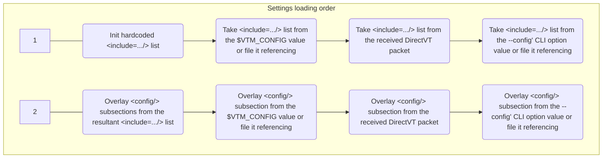

# Text-based desktop environment settings



## TL;DR

The settings are stored in a Pure 'XML' which is an XML-like format, storing a hierarchical list of key=value pairs.  
See [`/src/vtm.xml`](../src/vtm.xml) for reference.

We call the text data in the settings file "plain XML data" even though our file format is not technically XML, but only visually resembles it.

There are two predefined settings source locations and this can be changed as needed:
```xml
<include="/etc/vtm/settings.xml"/>        <!-- Default system-wide settings source. The "/etc/..." path will be auto converted to the "%PROGRAMDATA%\..." on Windows. -->
<include="~/.config/vtm/settings.xml"/>   <!-- Default user-wise settings source. -->
```

The process of loading settings consists of the following steps:
- Build an ordered list of the setting source files by looking for the root `<include=.../>` subsections.
- Overlay the XML data from the source files in the specified order.
- Overlay the XML data from the value of the `$VTM_CONFIG` environment variable or from a settings file it references.
- Overlay the XML data from the DirectVT config payload received from the parent process.
- Overlay the XML data from the specified `--config <...>` CLI option value or from a settings file it referencing.

The file list is built in the following order from the following sources:
- The settings file list from the hardcoded configuration containing a list of two files:
  ```xml
  <include*/>  <!-- Clear previously defined sources. Start a new list. -->
  <include="/etc/vtm/settings.xml"/>        <!-- Default system-wide settings source. The "/etc/..." path will be auto converted to the "%PROGRAMDATA%\..." on Windows. -->
  <include="~/.config/vtm/settings.xml"/>   <!-- Default user-wise settings source. -->
  ...
  ```
- The settings file list from the `$VTM_CONFIG` environment variable value or from a settings file it referencing.
  - A case with a plain XML-data:
    - `$VTM_CONFIG=<include*/><include='/path/to/override_defaults.xml'/>...` - Clear the current file list and begin a new file list containing a single file '/path/to/override_defaults.xml'.
    - `$VTM_CONFIG=<include='/path/to/first.xml'/><include='/path/to/second.xml'/>...` - Append the current file list with the files '/path/to/first.xml' and '/path/to/second.xml'.
  - A case with a file reference:
    - `$VTM_CONFIG='/path/to/override_defaults.xml'` - Take the file list from the '/path/to/override_defaults.xml'.
- The settings file list from the DirectVT config received from the parent process.
- The settings file list from the specified `--config <...>` CLI option value or from a settings file it referencing.
  - A case with a plain XML-data:
    - `./vtm --config "<include*/><include='/path/to/override_defaults.xml'/>..."` - Clear the current file list and begin a new file list containing a single file '/path/to/override_defaults.xml/'.
  - A case with a file reference:
    - `./vtm --config "/path/to/override_defaults.xml"` - Take the file list from the '/path/to/override_defaults.xml'.

## Pure XML

### Key differences from XML

 - Document encoding is UTF-8.
 - Any Unicode characters are allowed, including the U+0000 (null) character.
 - There is no support for named XML character entities.
 - The stored data forms a hierarchical list of `name=value` pairs.
 - Multiple root elements are allowed.
 - There is no distinction between XML-attribute and XML-element, i.e. any attributes are sub-elements.
   - Each element can be defined in any way, either using an XML-attribute or an XML-element syntax:
     - `<... name="value" />`, `<...> <name> "value" </name> </...>`, and `<...> <name="value" /> </...>` have the same meaning.
   - The XML-attribute `param` in `<name param="value"/>` and the XML-element `param` in `<name> <param="value"/> </name>` are semantically identical sub-elements of the `name` element.
 - No spaces are allowed between the opening angle bracket and the element name:
   - `... < name ...`, `... <= ...`, `... << ...` are treated as parts of the element's value content.
 - Every element has its own text value.
   - For example, `<name="names_value" param="params_value"/>` - the `name` element has the text value `names_value`, and its `param` sub-element has the text value `params_value`.
 - All stored values are strings (the data requester decides on its side how to interpret it):
   - `name=2000` and `name="2000"` have the same meaning.
 - All value strings, except those that begin with a decimal digit character (ASCII `0` - `9`), must be quoted with either double or single quotes (`"` U+0022 or `'` U+0027).
 - The value string can be fragmented. Fragments can be located after the equal sign following the element name, as well as between the opening and closing tags.
 - The fragments located between the opening and closing tags can be either quoted or in raw form. The quoted form sets strict boundaries for the string value. The raw form pulls all characters between the opening and closing tags, including line breaks.
 - The following compact syntax for elements is allowed:
   - `<node0/node1/thing name="value"/>` and `<node0><node1><thing name="value"/></node1></node0>` have the same meaning.
 - Elements can reference any element using relative and absolute references, in the form of an unquoted name or an XML path to the referenced element.
   - `thing2` refers to the value `/node1/thing1` in `<node1 thing1="value1"/><node2 thing2=/node1/thing1 />`.
   - `thing2` refers to the value `thing1` within the scope of `<node1 thing1="value1"><node2 thing2=thing1 /></node1>`.
   - Circular references are silently ignored.
 - The element reference includes all of the element's contents, including the element's value and all nested elements.
 - The element's content may include any number of substrings, as well as references to other elements, combined in the required order using the vertical bar character ASCII 0x7C `|`.
   - `<thing1="1"/><thing2="2"/><thing21=thing2 | thing1/>` and `<thing1="1"/><thing2="2"/><thing21="21"/>` have the same meaning.
 - Identical data structures in this format allow overlaying.
   - The values of single elements of the original structure will be updated to the values of the overlaid structure.
   - A list of elements with the same name within a scope may start with an empty element with an asterisk at the end of the name, meaning that this list will overwrite the existing one during merging, otherwise the list will be appended to the existing one.
 - There is a list of escaped characters with special meaning:
   - `\a`  ASCII 0x07 BEL
   - `\t`  ASCII 0x09 TAB
   - `\n`  ASCII 0x0A LF
   - `\r`  ASCII 0x0D CF
   - `\e`  ASCII 0x1B ESC
   - `\\`  ASCII 0x5C Backslash
   - `\u`  A Unicode escape sequence in the form `\u{XX...}` or `\uXX...`, where `XX...` is the hexadecimal codepoint value.

Let's take the following element hierarchy as an example:

- \<document\> - Top-level element
  - \<thing\> - Second level element
    - \<name\> - Third level element

The following forms of element declaration are equivalent:

- Standard XML syntax:
  ```xml
  <document>
      <thing name="a">text1</thing>
      <thing name="b">text2</thing>
  </document>
  ```
- Assigning a content value to an element directly using the equal sign:
  ```xml
  <document>
      <thing="text1" name="a"/>
      <thing="text2" name="b"/>
  </document>
  ```
- Assigning a value to an element using quoted literals between the opening and closing tags:
  ```xml
  <document>
      <thing name="a">
          "text1"
      </thing>
      <thing name="b">
          "text2"
      </thing>
  </document>
  ```
- Assigning values to sub-elements directly using the equal sign:
  ```xml
  <document>
      <thing>
          "text1"
          <name="a"/>
      </thing>
      <thing>
          <name="b"/>
          "text2"
      </thing>
  </document>
  ```
- Fragmenting the assigned value strings:
  ```xml
  <document>
      <thing="t">
          "ext"
          <name>
              "a"
          </name>
          "1"
      </thing>
      <thing>
          <name>
              "b"
          </name>
          "text"
          "2"
      </thing>
  </document>
  ```
- Referencing the string value from the independent element:
  ```xml
  <document>
      <basename="a"/>
      <thing name=basename>text1</thing>
      <thing name="b">text2</thing>
  </document>
  ```
- Referencing the string value and existing sub-elements from the independent element:
  ```xml
  <document>
      <basething="text1" name="a"/>
      <thing=basething/>
      <thing name="b">text2</thing>
  </document>
  ```
- Referencing the string value fragment and sub-elements from the independent element:
  ```xml
  <document>
      <basething="1" name="a"/>
      <thing="text" | basething/>
      <thing name="b">text2</thing>
  </document>
  ```
- Referencing the string value fragment and sub-elements from the independent element:
  ```xml
  <document>
      <basething="text" name="a"/>
      <thing=basething | "1"/>
      <thing name="b">text2</thing>
  </document>
  ```
- Referencing element from surrounding scope:
  ```xml
  <basething name="a"/>
  <document>
      <thing=basething | "text1"/>
      <thing name="b">text2</thing>
  </document>
  ```
- Referencing the string value fragments between opening and closing tags:
  ```xml
  <basething="xt" name="a"/>
  <document>
      <thing> "te" | basething | "1" </thing>
      <thing name="b">text2</thing>
  </document>
  ```
- Parameterized templating:
  ```xml
  <ThingTemplate = "text" | NumberRef>
      <name = LetterRef/>
  </ThingTemplate>
  <document>
      <thing=ThingTemplate NumberRef="1" LetterRef="a"/>
      <thing=ThingTemplate NumberRef="2" LetterRef="b"/>
  </document>
  ```
- Parameterized templating from an external namespace:
  ```xml
  <Namespace>
      <ThingTemplate = "text" | NumberRef>
          <name = LetterRef/>
      </ThingTemplate>
  </Namespace>
  <document=/Namespace>
      <thing=ThingTemplate NumberRef="1" LetterRef="a"/>
      <thing=ThingTemplate NumberRef="2" LetterRef="b"/>
  </document>
  ```

### Compact XML syntax

The following declarations have the same meaning:

```xml
<config>
    <document>
        <thing="thing_value">
            <name="name_value"/>
        </thing>
    </document>
</config>
```

```xml
<config/document/thing="thing_value" name="name_value"/>
```

### Vtm configuration structure

```xml
<!-- Global namespace - Unresolved literals will try to be resolved from here. -->
<include= ... />  <!-- Ordered list of references to settings files used to form the resultant configuration. -->
...
<!-- Set of global variables. -->
<global_variable_name = variable_value/>  <!-- Globally visible variable. -->
...
<config>  <!-- Global configuration. -->
    ...
    <element1=global_variable_name/>  <!-- element1 references the value of /global_variable_name (three levels of indirection allowed). -->
    <element2=/config/element1/>       <!-- element2 references the value of /config/element1. -->
    <element3="/config/element1"/>     <!-- element3 contains the string value "/config/element1". -->
    ...
    <desktop>  <!-- Desktop settings. -->
        <taskbar ... >  <!-- Taskbar menu settings. -->
            ...  <!-- Taskbar settings. -->
            <item ... >  <!-- Taskbar menu item declaration. -->
                ...  <!-- Item settings. -->
            </item>
            ...  <!-- Set of taskbar menu items. -->
        </taskbar>
        ...  <!-- Desktop settings. -->
    </desktop>
    <terminal ... >  <!-- Built-in terminal configuration section. -->
        ...
    </terminal>
    <events>  <!-- The required key/mouse combination sequence can be generated on the Info page, accessible by clicking on the label in the lower right corner of the vtm desktop. -->
        <gate>  <!-- Native GUI window layer event bindings. -->
            <script="script body" on="Key+Chord" on="Another+Key+Chord" on="SomeMouseEvent" on="SomeGenericEvent"/>
            <script="script body">
                <on="Key+Chord"/>
                <on="SomeGenericEvent" source="GenericEventSourceId"/>
            </script>
            <script>
                <on="Key+Chord1"/>
                <on="Key+Chord2"/>
                raw text script body;
                raw text script body;
                ...
            </script>
            ...
        </gate>
        <desktop>  <!-- Desktop layer event bindings. -->
            <script="script body" on="Key+Chord"/>
            ...
        </desktop>
        <applet>  <!-- Application/window layer event bindings. -->
            <script="script body" on="Key+Chord"/>
            ...
        </applet>
        <terminal>  <!-- Application specific layer event bindings. -->
            <script="script body" on="Key+Chord"/>
            ...
        </terminal>
        <tile>  <!-- Application specific layer event bindings. -->
            <script="script body" on="Key+Chord"/>
            ...
            <grip> <!-- Pane's grip event bindings. -->
                <script="script body" on="Key+Chord"/>
                ...
            </grip>
        </tile>
        <defapp>  <!-- Default application event bindings (e.g., Info-Page). -->
            <script="script body" on="Key+Chord"/>
            ...
        </defapp>
    </events>
</config>
```

#### Value literals `attribute=literal`

All value literals containing spaces must be enclosed in double or single quotes.

Value type | Format
-----------|-----------------
`RGBA`     | Hex: `#rrggbbaa` \| Hex: `0xaarrggbb` \| Decimal: `r,g,b,a` \| 256-color index: `i`
`boolean`  | `true` \| `false` \| `yes` \| `no` \| `1` \| `0` \| `on` \| `off`
`string`   | _UTF-8 text string_
`2D point` | _integer_ <any_delimeter> _integer_
`Duration` | _integer_ followed by<br>- `...ms`  for milliseconds<br>- `...us`  for microseconds<br>- `...ns`  for  nanoseconds<br>- `...s`   for      seconds<br>- `...min` for      minutes<br>- `...h`   for        hours<br>- `...d`   for         days<br>- `...w`   for        weeks<br>

#### Taskbar menu item configuration `<config/desktop/taskbar/item ... />`

Attribute  | Description                                       | Value type | Default value
-----------|---------------------------------------------------|------------|---------------
`id`       |  Item id                                          | `string`   |
`splitter` |  Non-active menu item                             | presence   | Not present
`hidden`   |  Item visibility on taskbar                       | `boolean`  | `no`
`label`    |  Item label text                                  | `string`   | =`id`
`tooltip`  |  Item tooltip text                                | `string`   | empty
`title`    |  App window title                                 | `string`   | empty
`footer`   |  App window footer                                | `string`   | empty
`wincoor`  |  App window coordinates                           | `2D point` |
`winsize`  |  App window size                                  | `2D point` |
`winform`  |  App window state                                 | `undefined` \| `normal` \| `maximized` \| `minimized` |
`type`     |  Desktop window type                              | `string`   | `vtty`
`env`      |  Environment variable in "var=val" format         | `string`   |
`cwd`      |  Current working directory                        | `string`   |
`cmd`      |  Desktop window constructor arguments             | `string`   | empty
`cfg`      |  Configuration patch for dtvt-apps in XML-format  | `string`   | empty
`config`   |  Configuration patch for dtvt-apps                | `xml-node` | empty

The menu item of DirectVT Gateway type (`type="dtvt"`) can be additionally configured using a `<config>` subsection or a `cfg="xml-text-data"` attribute. The `<config>` subsection will be ignored if the `cfg` attribute contains a non-empty value.

The content of the `cfg` attribute (or `<config>` subsection) is passed to the dtvt-application on launch.

#### Desktop window type `<config/desktop/taskbar/item type="..."/>`

Window type<br>(case insensitive) | Parameter `cmd=` | Description
----------------------------------|------------------|------------
`vtty` (default)                  | A CUI application command line with arguments | Run a CUI application inside the `Teletype Console dtvt-bridge`. Usage example `type="vtty" cmd="cui_app ..."`. It is the same as `type="dtvt" cmd="vtm -r vtty cui_app ..."`.
`term`                            | A CUI application command line with arguments | Run a CUI application inside the `Terminal Console dtvt-bridge`. Usage example `type="term" cmd="cui_app ..."`. It is the same as `type="dtvt" cmd="vtm -r term cui_app ..."`.
`dtvt`                            | A DirectVT-aware application command line with arguments | Run a DirectVT-aware application inside the `DirectVT Gateway`. Usage example `type="dtvt" cmd="dtvt_app ..."`.
`dtty`                            | A DirectVT-aware application command line with arguments | Run a DirectVT-aware application inside the `DirectVT Gateway with TTY` which has additional controlling terminal. Usage example `type="dtty" cmd="dtvt_app ..."`.
`tile`                            | [[ v[`n:m:w`] \| h[`n:m:w`] ] ( id1 \| _nested_block_ , id2 \| _nested_block_ )] | Run tiling window manager with layout specified in `cmd`. Usage example `type="tile" cmd="v(h1:1(Term, Term),Term)"`.<br>`n:m` - Ratio between panes (default n:m=1:1).<br>`w` - Resizing grip width (default w=1).
`site`                            | `cmd=@` or empty | The attribute `title="view_title"` is used to set region name/title. Setting the value of the `cmd` attribute to `@` adds numbering to the title.

The following item declarations are identical:
```
<item ... cmd="mc"/>
<item ... type="vtty" cmd="mc"/>
<item ... type="dtvt" cmd="vtm -r vtty mc"/>
```

### Event scripting

#### General syntax

The syntax for defining event bindings is:

```xml
<dom_element1>
    <script="script body" on="EventID1" ... on="preview:EventId2" ...>
        <on="EventID"/>
        <on="EventID" source="OptionalEventSourceObjectID"/>
        ...
        raw text script body
        ...
    </script>
</dom_element1>
<dom_element2 id="AdditionalIDfor_dom_element2">
    <script="script body" on="EventID"/>
</dom_element2>
```

Tag                 | Belongs to           | Value           | Description
--------------------|----------------------|-----------------|---------------
`<dom_element>`     |                      | ObjectID        | Visual tree object id.
`id`                | `<dom_element>`      | UTF-8 string    | Additional id for the visual tree object.
`script`            | `<dom_element>`      | UTF-8 string    | A Lua script that will be executed when the events specified by the `on` tags occur.
`on`                | `script`             | EventID         | Specific event id text string.
`source`            | `on`                 | ObjectID        | Visual tree object id.

The `preview:` prefix of the EventID is an indication that event processing should be performed in reverse order - from the container to the nested objects. By default, the visual tree traversal order is from the nested objects to the container.

Note: Using an empty string in the `script=""` tag with a non-empty event value specified in the `on="EventID"` tag resets all subscriptions for that EventID.

#### Keyboard events

Synax:
```
<... on="KeyboardSpecificEvent" ...>
  or
<... on="preview:KeyboardSpecificEvent" ...>
```

The following keyboard-specific event delimiters/joiners are available to form a key-chord:

Joiner | Meaning
-------|--------
`+`    | The subsequent key is in pressed state.
`-`    | The subsequent key is in released state. This joiner is allowed for the last key only.
` \| ` | The separator to combine multiple key chords in a key chord list (vertical bar surrounded by at least one space on either side).

Key combinations can be of the following types:

Type        | Example                |Description
------------|------------------------|-----------
`Generic`   | `Ctrl+A`               | A generic key combination without distinction left/right and numpad.
`Literal`   | `Alt+'a'`              | A generic key combination without distinction left/right and numpad, except for the last key represented as a single-quoted character/string generated by the key.
`Specific`  | `LeftShift+RightShift` | A key combination with explicitly specified physical keys.
`Scancodes` | `0x3B+0x3C`            | A key combination represented solely by scan codes of physical keys in hexadecimal format.

Generic, literal and specific key sequences can be mixed in any order within a key chord list.

The required key combination sequence can be generated on the Info page, accessible by clicking on the label in the lower right corner of the vtm desktop.

#### Mouse events

Synax:
```
<... on="MouseSpecificEvent" ...>
  or
<... on="preview:MouseSpecificEvent" ...>
```

The following formats are available for mouse-specific events:

- Named  
  `<Mouse | Left | Right | LeftRight | Middle><Down | Up | [Double | Multi]Click | <Double | Multi>Press | Drag<Start | Pull | Stop | Cancel>>`
- Generic  
  `<Mouse><Down | Up | [Double | Multi]Click | <Double | Multi>Press | Drag<Start | Pull | Stop | Cancel>><bbb...>`  
  where `<bbb...>` is a set of 8 bits to represent mouse buttons (decimal or binary):
  Decimal `<bbb...>` | Binary `<bbb...>` | Corresponding mouse button(s)
  -------------------|-------------------|-----------------
  0                  | 0                 | Any button
  1                  | 1                 | Left
  2                  | 01                | Right
  3                  | 001               | Middle
  4                  | 0001              | Button4
  5                  | 00001             | Button5
  6                  | 000001            | Button6
  7                  | 0000001           | Button7
  8                  | 00000001          | Button8
  n/a                | 11                | Left+Right
  n/a                | 111               | Left+Middle+Right
  n/a                | 011               | Middle+Right
  n/a                | 10000001          | Left+Button8

```
  011  Middle+Right
  ││└──────── middle is pressed
  │└───────── right is pressed
  └────────── left is not pressed
  10000001  Left+Button8
  │      └─── button8 is pressed
  └────────── left is pressed
```

  Note: In binary `<bbb...>` format the trailing zeros can be omitted.

The following mouse events are tracked:

EventID                             | Description
------------------------------------|----------------------------------
MouseDown<bbb...>                   | Button<bbb...> push down / pressed.
MouseUp<bbb...>                     | Button<bbb...> release.
MouseClick<bbb...>                  | Press and release button<bbb...> w/o movement.
MouseDoublePress<bbb...>            | Double press by button<bbb...>.
MouseMultiPress<bbb...>             | Multi press by button<bbb...>.
MouseDoubleClick<bbb...>            | Double click by button<bbb...>.
MouseMultiClick<bbb...>             | Multi click by button<bbb...>.
MouseDragStart<bbb...>              | Drag start with button<bbb...> pressed.
MouseDragPull<bbb...>               | Drag pull with button<bbb...> pressed.
MouseDragStop<bbb...>               | Drag stop with button<bbb...> pressed.
MouseDragCancel<bbb...>             | Drag cancel with button<bbb...> pressed.
MouseHover                          | Mouse hover.
MouseEnter                          | Mouse enter.
MouseLeave                          | Mouse leave.
MouseMove                           | Mouse move by fp2d delta.
MouseWheel                          | Wheel by fp2d delta.
MouseAny                            | Any mouse event.

Matching between Named and Generic formats:

Named format        | Generic format       | Internal representation | Notes
--------------------|----------------------|-------------------------|------------
MouseAny            |                      | `0x00'00`               | Any mouse event.
MouseDown           | MouseDown0           | `0x01'00`               | Any mouse button down.
MouseUp             | MouseUp0             | `0x02'00`               | Any mouse button up.
LeftClick           | MouseClick1          | `0x03'01`               | Left click.
LeftRightClick      | MouseClick11         | `0x03'03`               | Left + Right click.
MouseClick          | MouseClick0          | `0x03'00`               | Any click.
MouseDoubleClick    | MouseDoubleClick0    | `0x04'00`               | The mouse button is pressed and released twice.
MouseDoublePress    | MouseDoublePress0    | `0x05'00`               | The mouse button is pressed twice and remains pressed.
MouseMultiClick     | MouseMultiClick0     | `0x06'00`               | The mouse button is pressed and released several times.
MouseMultiPress     | MouseMultiPress0     | `0x07'00`               | The mouse button is pressed several times and remains pressed.
MouseDragStart      | MouseDragStart0      | `0x08'00`               | The mouse started moving with the button just pressed.
MouseDragPull       | MouseDragPull0       | `0x09'00`               | The mouse continues to move with the button pressed.
MouseDragStop       | MouseDragStop0       | `0x0A'00`               | The mouse button is released after moving while it was pressed.
MouseDragCancel     | MouseDragCancel0     | `0x0B'00`               | Mouse movement with the button pressed was cancelled due to another button being pressed or canceled by the system.
MouseHover          |                      | `0x0C'00`               | The mouse cursor moved to hover directly over the object.
MouseEnter          |                      | `0x0D'00`               | The mouse cursor has moved inside the geometric boundaries of the object.
MouseLeave          |                      | `0x0E'00`               | The mouse cursor has moved outside the geometric boundaries of the object.
MouseMove           |                      | `0x0F'00`               | The mouse cursor has moved within the geometric boundaries of the object.
MouseWheel          |                      | `0x10'00`               | The mouse wheel is scrolled by 2D step (to distinguish between horizontal and vertical scrolling).

#### Generic events

Synax:
```
<... on="EventTier: Generic::Event::ID" ...>
```

The following generic event tiers are available for use:

EventTier | Description
----------|------------
`general:`| Events that fire globally without being tied to any objects.
`preview:`| Events typically provide previews of object property values for an upcoming `release:` event.
`release:`| Events typically notify the set values of an object's properties.
`request:`| Events typically request values of properties of an object.
`anycast:`| Events firing on a subset of all nested objects on some branch of the visual tree.

The list of available generic event identifiers can be retrieved using the `vtm.desktop.EventList()` script command in the `vtm --monitor` environment monitoring mode or the `Log Monitor` command line applet.

#### Event sources

Visual tree objects can subscribe to events of any other environment objects using the `source="..."` subtag of the `on="..."` tag. In addition to the list of standard object names, it is possible to register custom object names.

//todo At the moment, this is only available for window menu items `<menu><item id="CustomObjectId"/></menu>`.

Standard object names

|ObjectID/ClassID | Role                     | Methods                                            | Method description
|-----------------|--------------------------|----------------------------------------------------|-------------------
|`vtm`            | Scripting context holder | Parentheses operator(): `vtm()`                    | Retrieve event parameters.
|                 |                          | Dot index: `vtm.ObjectId`/`vtm.ClassId`            | Retrieve object refernce by ObjectId/ClassId.
|`gate`           | User viewport            | `vtm.gate.Disconnect()`                            | Disconnect user from the desktop.
|                 |                          | `vtm.gate.DebugOverlay(bool state)`                | Set debug overlay.
|                 |                          | `vtm.gate.IncreaseCellHeight(int n)`               | Increase/decrease cell height for GUI mode.
|                 |                          | `vtm.gate.RollFonts(int n)`                        | Roll by step n the list of fonts specified in the configuration.
|                 |                          | `vtm.gate.WheelAccumReset()`                       | Reset floating point step accumulator for mouse wheel.
|                 |                          | `vtm.gate.CellHeightReset()`                       | Resets the cell height to the value specified in the settings.
|                 |                          | `vtm.gate.AntialiasingMode() -> int`               | Toggle anti-aliasing mode.
|`applet`         | Running applet           | `vtm.applet.Warp(int l, int r, int t, int b)`      | Request to deform the applet window. The parameters specify four deltas for the left, right, top and bottom sides of the applet window.
|                 |                          | `vtm.applet.ZOrder() -> int`                       | Request the current z-order state of the applet window.
|                 |                          | `vtm.applet.ZOrder(int n) -> int`                  | Set the current z-order state for the applet window. -1: backmost; 0: plain; 1: topmost.
|                 |                          | `vtm.applet.Close()`                               | Close applet window.
|                 |                          | `vtm.applet.Minimize()`                            | Minimize applet window.
|                 |                          | `vtm.applet.Maximize()`                            | Maximize applet window.
|                 |                          | `vtm.applet.Fullscreen()`                          | Fullscreen applet window.
|                 |                          | `vtm.applet.Restore()`                             | Restore applet window.
|`gear`           | User mouse and keyboard  | `vtm.gear.IsKeyRepeated() -> bool`                 | Returns true if the keyboard event is a key-repeat generated event.
|                 |                          | `vtm.gear.SetHandled()`                            | Set that the event is processed, and stop further processing.
|                 |                          | `vtm.gear.RepeatWhilePressed(ref ObjectId)`        | Capture the mouse by ObjectId and trigger the mouse button pressed event to repeat while pressed.
|`desktop`        | Desktop environment      | `vtm.desktop.Cleanup(bool b)`                      | Clean up temporary internal structures of the desktop environment and optionally report the state of registry objects.
|                 |                          | `vtm.desktop.EventList()`                          | Print all available generic event IDs.
|                 |                          | `vtm.desktop.Shutdown()`                           | Close all windows and shutdown the desktop.
|                 |                          | `vtm.desktop.Disconnect()`                         | Disconnect the current desktop user.
|                 |                          | `vtm.desktop.Run({ lua_table })`                   | Run the specified applet.
|                 |                          | `vtm.desktop.FocusNextWindow(int n)`               | Set focus to the next (n=1) or previous (n=-1) desktop window.
|`tile`           | Tiling window manager    | `vtm.tile.FocusNextPaneOrGrip(int n)`              | Set focus to the next (n=1) or previous (n=-1) tile's pane or pane splitter.
|                 |                          | `vtm.tile.FocusNextPane(int n)`                    | Set focus to the next (n=1) or previous (n=-1) tile's pane.
|                 |                          | `vtm.tile.FocusNextGrip(int n)`                    | Set focus to the next (n=1) or previous (n=-1) pane splitter.
|                 |                          | `vtm.tile.RunApplication()`                        | Run the default applet inside the selected empty panes.
|                 |                          | `vtm.tile.SelectAllPanes()`                        | Select all tile's panes.
|                 |                          | `vtm.tile.SplitPane(int axis)`                     | Split the selected panes. If axis > 0: split vertically, otherwise split horizontally.
|                 |                          | `vtm.tile.RotateSplit()`                           | Toggle pane splitter orientation.
|                 |                          | `vtm.tile.SwapPanes()`                             | Cyclically swap selected panes.
|                 |                          | `vtm.tile.EqualizeSplitRatio()`                    | Equalize split ratio.
|                 |                          | `vtm.tile.SetTitle()`                              | Set the window manager title.
|                 |                          | `vtm.tile.ClosePane()`                             | Close selected panes.
|`grip`           | Pane splitter            | `vtm.grip.MoveGrip(int x, int y)`                  | Move splitter by 2D step specified by pair { x, y }. 
|                 |                          | `vtm.grip.ResizeGrip(int n)`                       | Set splitter width to n.
|                 |                          | `vtm.grip.FocusNextGrip(int n)`                    | Set focus to the next (n=1) or previous (n=-1) tile's splitter.
|`terminal`       |                          | `vtm.terminal.KeyEvent({ ... })`                   | Generates a terminal key event using the specified parameters.<br>- `keystat=...,`: Pressed state. 1 - Pressed, 0 - Released.<br>- `ctlstat=...,`: Keyboard modifiers bit-field.<br>- `virtcod=...,`: Key virtual code.<br>- `scancod=...,`: Key scan code.<br>- `keycode=...,`: Physical key code.<br>- `extflag=...,`: Extended key flag.<br>- `cluster=...,`: Text cluster generated by the key.
|                 |                          | `vtm.terminal.ExclusiveKeyboardMode(int n)`        | Set/reset exclusive keyboard mode for the terminal.
|                 |                          | `vtm.terminal.FindNextMatch(int n)`                | Highlight next/previous(n>0/n<0) match of selected text fragment. Clipboard content is used if no active selection.
|                 |                          | `vtm.terminal.ScrollViewportByPage(int x, int y)`  | Scroll the terminal viewport page by page in the direction specified by the 2D point { x, y }.
|                 |                          | `vtm.terminal.ScrollViewportByCell(int x, int y)`  | Scroll the terminal viewport cell by cell in the direction specified by the 2D point { x, y }.
|                 |                          | `vtm.terminal.ScrollViewportToTop()`               | Scroll the terminal viewport to the scrollback top.
|                 |                          | `vtm.terminal.ScrollViewportToEnd()`               | Scroll the terminal viewport to the scrollback bottom.
|                 |                          | `vtm.terminal.SendKey(string s)`                   | Send the text string `s` as terminal input.
|                 |                          | `vtm.terminal.Print(string s)`                     | Print the text string `s` to the terminal scrollback buffer.
|                 |                          | `vtm.terminal.CopyViewport()`                      | Сopy terminal viewport to the clipboard.
|                 |                          | `vtm.terminal.CopySelection()`                     | Copy selected lines or the current line to the clipboard.
|                 |                          | `vtm.terminal.PasteClipboard()`                    | Paste from clipboard.
|                 |                          | `vtm.terminal.ClearClipboard()`                    | Reset clipboard.
|                 |                          | `vtm.terminal.ClipboardFormat(int n)`              | Set the terminal text selection copy format.<br>n=0: Disabled<br>n=1: Plain text<br>n=2: ANSI<br>n=3: RTF<br>n=4: HTML<br>n=5: Sensitive plain text.
|                 |                          | `vtm.terminal.ClipboardFormat() -> int`            | Get the current terminal text selection copy format.
|                 |                          | `vtm.terminal.SelectionForm(int n)`                | Set selection form. n=0: linear form; n=1: boxed form.
|                 |                          | `vtm.terminal.SelectionForm() -> int`              | Get the current selection form.
|                 |                          | `vtm.terminal.ClearSelection()`                    | Deselect a selection.
|                 |                          | `vtm.terminal.OneShotSelection()`                  | One-shot toggle to copy text while mouse tracking is active. Keep selection if `Ctrl` key is pressed.
|                 |                          | `vtm.terminal.UndoReadline()`                      | (Win32 Cooked/ENABLE_LINE_INPUT mode only) Discard the last input.
|                 |                          | `vtm.terminal.RedoReadline()`                      | (Win32 Cooked/ENABLE_LINE_INPUT mode only) Discard the last Undo command.
|                 |                          | `vtm.terminal.CwdSync(int n)`                      | Set the current working directory sync mode.
|                 |                          | `vtm.terminal.CwdSync() -> int`                    | Get the current working directory sync mode.
|                 |                          | `vtm.terminal.LineWrapMode(int n)`                 | Set the current line wrapping mode. Applied to the active selection if it is.<br>n=0: line wrapping is off<br>n=1: line wrapping is on
|                 |                          | `vtm.terminal.LineWrapMode() -> int`               | Get the current line wrapping mode.
|                 |                          | `vtm.terminal.LineAlignMode(int n)`                | Set the current line aligning mode. Applied to the active selection if it is.<br>n=0: left<br>n=1: right<br>n=2: center
|                 |                          | `vtm.terminal.LineAlignMode() -> int`              | Get the current line aligning mode.
|                 |                          | `vtm.terminal.LogMode(int n)`                      | Set the current terminal logging mode on/off.
|                 |                          | `vtm.terminal.LogMode() -> int`                    | Get the current terminal logging mode state.
|                 |                          | `vtm.terminal.ClearScrollback()`                   | Clear the terminal scrollback buffer.
|                 |                          | `vtm.terminal.Restart()`                           | Restart the current terminal session.
|                 |                          | `vtm.terminal.Quit()`                              | Close terminal.

#### Examples

Key bindings:

Configuration                                                  | Interpretation
---------------------------------------------------------------|-----------------
`<script=ScriptReference on="Key+Chord"/>`                     | Append existing bindings using an indirect reference (the `ScriptReference` variable without quotes).
`<script="text"  on="Key+Chord \| Another+Chord"/>`            | Append existing bindings for `Key+Chord | Another+Chord`.
`<script="text"  on="Key+Chord"/>`                             | Append existing bindings with the directly specified Lua script body.
`<script="text"><on="Key+Chord" source="ObjectID"/></script>`  | Binding to an event source using a specific ObjectID.
`<script=""      on="Key+Chord"/>`                             | Remove all existing bindings for the specified key combination "Key+Chord".
`<script="..."   on=""         />`                             | Do nothing.

EventId's:

EventId                        | Description
-------------------------------|-------------
`on="MouseEnter"`              | Mouse enter.
`on="MouseLeave"`              | Mouse leave.
`on="MouseMove"`               | Mouse move.
`on="MouseWheel"`              | Mouse wheeling by fp2d step (hz/vt).
`on="MouseDown1"`              | The left button is pressed down.
`on="MouseUp1"`                | The left button is released.
`on="preview:MouseDown01"`     | The right button is pressed down (preview phase).
`on="MouseClick"`              | Any button click.
`on="MouseClick1"`             | Left button click.
`on="LeftClick"`               | Left button click.
`on="MouseClick01"`            | Right button click.
`on="MouseClick2"`             | Right button click.
`on="MouseClick3"`             | Middle button click.
`on="MouseClick11"`            | Left+Right button click.
`on="MouseDoublePress1"`       | Double click (and hold pressed) by the left button.
`on="MouseDoubleClick1"`       | Double click (and release) by the left button.
`on="MouseDragStart11"`        | Drag start with Left and Right mouse buttons pressed.
`on="MouseDragPull11"`         | Dragging with Left and Right mouse buttons pressed.
`on="MouseDragStop11"`         | Release Left and Right mouse buttons after dragging.
`on="MouseDragCancel11"`       | The current dragging was interrupted for some reason, such as pressing additional mouse buttons.
`on="Enter"`                   | The `Enter` key was pressed.
`on="preview:Enter"`           | The `Enter` key was pressed (detected in a preview phase).
`on="Ctrl+B"`                  | The `Ctrl+B` key combination was pressed.
`on="-Ctrl"`                   | The `Ctrl` key was released.
`on="Esc-F10"`                 | The `Esc-F10` key combination was released.
`on="general: e2::timer::any"` | Timer event, related to the current frame rate, usually about 60 times per second.

### DirectVT configuration payload received from the parent process

The value of the `cfg` menu item attribute (or a whole `<config>` subsection) will be passed to the child dtvt-aware application on launch.

- `settings.xml`:
  ```xml
    ...
    <desktop>
      <taskbar>
        ...
        <item ... title="DirectVT-aware Application" type="dtvt" ... cfg="plain xml data as alternative to <config> subsection" cmd="dtvt_app...">
          <config> <!-- item's `<config>` subsection in case of 'cfg=' is not specified -->
            ...
          </config>
        </item>
        ...
      </taskbar>
    </desktop>
    ...
  ```

### Configuration example

#### Minimal configuration

`~/.config/vtm/settings.xml`:
```xml
<config>
    <desktop>
        <taskbar selected="Term" item*>  <!-- Use asterisk to remove previous/existing items from the list. -->
            <item id="Term"/>  <!-- id=Term title="Term" type="vtty" cmd="os_default_shell" -->
        </taskbar>
    </desktop>
</config>
```

#### Typical configuration

Notes
- Hardcoded settings can be found in the source file [/src/vtm.xml](../src/vtm.xml).
- The `$0` tag will be expanded to the fully qualified current module filename at runtime.

`$VTM-CONFIG=/path/to/settings.xml`.
`settings.xml`:
```xml
<include*/>  <!-- Clear previously defined sources. Start a new list. -->
<include="/etc/vtm/settings.xml"/>        <!-- Default system-wide settings source. The "/etc/..." path will be auto converted to the "%PROGRAMDATA%\..." on Windows. -->
<include="~/.config/vtm/settings.xml"/>   <!-- Default user-wise settings source. -->

<!-- App configuration. -->
<config=/Colors | /Scripting | /Macro> <!-- Using additional namespaces: "/Colors", "/Scripting" and "/Macro" -->
    <gui>  <!-- GUI mode related settings. (win32 platform only for now) -->
        <antialiasing=true/>  <!-- Antialiasing of rendered glyphs. Note: Multi-layered color glyphs such as emoji are always antialiased. -->
        <cellheight=22/>      <!-- Text cell height in physical pixels. Note: The width of the text cell depends on the primary font (the first one in the font list). -->
        <gridsize=""/>        <!-- Window initial grid size "width,height" in text cells. If gridsize="" or gridsize=0,0, then the size of the GUI window is left to the OS window manager. -->
        <wincoor=""/>         <!-- Window initial coordinates "x,y" (top-left corner on the desktop in physical pixels). If wincoor="", then the position of the GUI window is left to the OS window manager. -->
        <winstate="normal"/>  <!-- Window initial state: "normal" | "maximized" | "minimized" . -->
        <blinkrate=400ms/>    <!-- SGR5/6 attribute blink rate. Blinking will be disabled when set to zero. -->
        <fonts>  <!-- Font fallback ordered list. The rest of the fonts available in the system will be loaded dynamically. -->
            <font*/>  <!-- Clear previously defined fonts. Start a new list. -->
            <font="Courier New"/>  <!-- The first font in the list: Primary font. Its metrics define the cell geometry. -->
            <font="Cascadia Mono"/>
            <font="NSimSun"/>
            <font="Noto Sans Devanagari"/>
        </fonts>
    </gui>
    <cursor>
        <style="bar"/>  <!-- Cursor style: "bar" | "block" | "underline" ( |  █  _ ). -->
        <blink=400ms/>  <!-- Cursor blink period. Set to zero for a steady cursor. -->
        <show=true/>
        <color fgc=DefaultColor bgc=DefaultColor/>  <!-- Cursor cell color. By default, the cursor color (bgc) is set to either black or white depending on the lightness of the underlying text background. -->
    </cursor>
    <tooltips>  <!-- Not implemented for GUI mode. -->
        <timeout=400ms/>
        <enabled=true/>
        <color fgc=pureblack bgc=purewhite/>
    </tooltips>
    <debug>
        <logs=false/>     <!-- Enable logging. Use the Logs or vtm monitor mode (vtm -m) to see the log output. -->
        <overlay=false/>  <!-- Show debug overlay. -->
        <regions=false/>      <!-- Highlight UI objects boundaries. -->
    </debug>
    <clipboard>
        <preview enabled=false size=80,25>  <!-- Not implemented for GUI mode. -->
            <color fgc=whitelt bgc=bluedk/>
            <alpha=0xFF/>  <!-- Preview alpha is applied only to the ansi/rich/html text type. -->
            <timeout=3s/>  <!-- Preview hiding timeout. Set it to zero to disable hiding. -->
            <shadow=3  />  <!-- Preview shadow strength (0-5). -->
        </preview>
        <format="html"/>  <!-- Default clipboard format for screenshots: "text" | "ansi" | "rich" | "html" | "protected" . -->
    </clipboard>
    <colors>  <!-- Along with fgc, bgc and txt, other SGR attributes (boolean) are allowed here: itc: italic, bld: bold, und: underline, inv: reverse, ovr: overline, blk: blink. -->
        <window   fgc=whitelt   bgc=0x80404040        />  <!-- Base desktop window color. -->
        <focus    fgc=purewhite bgc=bluelt            />  <!-- Focused item tinting. -->
        <brighter fgc=purewhite bgc=purewhite alpha=60/>  <!-- Brighter. -->
        <shadower               bgc=0xB4202020        />  <!-- Dimmer. -->
        <warning  fgc=whitelt   bgc=yellowdk          />  <!-- "Warning" color. -->
        <danger   fgc=whitelt   bgc=purered           />  <!-- "Danger" color. -->
        <action   fgc=whitelt   bgc=greenlt           />  <!-- "Action" color. -->
    </colors>
    <timings>
        <fps=60/>  <!-- Frames per second. Maximum frequency of rendering UI updates. -->
        <kinetic>  <!-- Kinetic scrolling. -->
            <spd       = 10  />  <!-- Initial speed component ΔR. -->
            <pls       = 167 />  <!-- Initial speed component ΔT. -->
            <ccl       = 120 />  <!-- Duration in ms. -->
            <spd_accel = 1   />  <!-- Speed accelation. -->
            <ccl_accel = 30  />  <!-- Additional duration in ms. -->
            <spd_max   = 100 />  <!-- Max speed. -->
            <ccl_max   = 1000/>  <!-- Max duration in ms. -->
        </kinetic>
        <switching     = 200ms/>  <!-- Duration of an object state switching. -->
        <deceleration  = 2s   />  <!-- Duration of stopping a moving object. -->
        <leave_timeout = 1s   />  <!-- Timeout off the active object (e.g. after mouse leaving scrollbar). -->
        <repeat_delay  = 500ms/>  <!-- Repeat delay. -->
        <repeat_rate   = 30ms />  <!-- Repeat rate. -->
        <dblclick      = 500ms/>  <!-- Mouse double click threshold. -->
    </timings>
    <desktop>  <!-- Desktop client settings. -->
        <viewport coor=0,0/>  <!-- Viewport position for the first connected user. At runtime, this value is temporarily replaced with the next disconnecting user's viewport coordinates to restore the viewport position on reconnection. -->
        <windowmax=3000x2000/>  <!-- Maximum window cell grid size. -->
        <macstyle=false/>  <!-- Preferred window control buttons location. no: right corner (like on MS Windows), yes: left side (like on macOS). -->
        <taskbar wide=false selected="Term">  <!-- Taskbar menu. wide: Set wide/compact menu layout; selected: Set selected taskbar menu item id. -->
            <item*/>  <!-- Clear all previously defined items. Start a new list of items. -->
            <item splitter label="apps">
                <tooltip>
                    " \e[1mDefault applications group\e[m                         \n"
                    " It can be configured in ~/.config/vtm/settings.xml "
                </tooltip>
            </item>
            <item id="Term" label="Terminal Emulator" type="dtvt" title="Terminal" cmd="$0 -r term">
                <tooltip>
                    " \e[1mTerminal Console\e[m               \n"
                    "   LeftClick to launch instance \n"
                    "   RightClick to set as default "
                </tooltip>
                <config>  <!-- The following config partially overrides the base configuration. It is valid for DirectVT apps only. -->
                    <terminal>
                        <scrollback>
                            <size=100000/>  <!-- Scrollback buffer length. -->
                            <wrap=true/>    <!-- Lines wrapping mode. -->
                        </scrollback>
                        <selection>
                            <mode=/Terminal/selection/mode/>  <!-- Clipboard copy format: "text" | "ansi" | "rich" | "html" | "protected" | "none" . -->
                        </selection>
                    </terminal>
                </config>
            </item>
            <item id="Tile" label="Window Manager"  type="tile" title="Window Manager" cmd="h1:1(Term, Term)"      tooltip=" \e[1mTiling Window Manager\e[m           \n   LeftClick to launch instance  \n   RightClick to set as default  "/>
            <item id="Site" label="Viewport Marker" type="site" title="Site "          cmd="@" winform="maximized" tooltip=" \e[1mDesktop Viewport Marker\e[m         \n   LeftClick to launch instance  \n   RightClick to set as default  "/>  <!-- cmd="@" is a directive for numbering instances. -->
            <item id="Logs" label="Log Monitor"     type="dtvt" title="Log Monitor"    cmd="$0 -q -r term $0 -m"   tooltip=" \e[1mLog Monitor\e[m                     \n   LeftClick to launch instance  \n   RightClick to set as default  ">
                <config>
                    <terminal>
                        <scrollback>
                            <size=50000/>
                            <wrap=false/>
                        </scrollback>
                        <menu item*>
                            <autohide=/Menu/Defaults/autohide/>
                            <slim=/Menu/Defaults/slim/>
                            <item=/Menu/Buttons/AlwaysOnTop/>
                            <item=/Menu/Buttons/FindPrev/>
                            <item=/Menu/Buttons/FindNext/>
                            <item=/Menu/Buttons/WrapMode/>
                            <item=/Menu/Buttons/ClipboardFormat/>
                            <item=/Menu/Buttons/ClearScrollback/>
                        </menu>
                    </terminal>
                </config>
            </item>
            <autorun run*>  <!-- Autorun specified menu items:     -->
                <!-- //todo use scripting. init_script()? on="anycast:Start"?-->
                <!--  <run*/>             -->
                <!--  <run id="Term" winsize=80,25  wincoor=92,31 winform=minimized />      -->  <!-- Autorun supports minimized winform only. -->
                <!--  <run id="Term" winsize=80,25  wincoor=8,31 />                         -->
                <!--  <run id="Term" winsize=164,25 wincoor=8,4 focused />   -->
            </autorun>
            <width>  <!-- Taskbar menu width. -->
                <folded=18/>
                <expanded=32/>
            </width>
            <timeout=250ms/>  <!-- Taskbar collaplse timeout after mouse leave. -->
            <colors>
                <bground  fgc=whitedk bgc=0xC0202020 />  <!-- Set the bgc color non-transparent (alpha to FF) to disable acrylics in taskbar. -->
                <focused  fgc=puregreen              />  <!-- Focused taskbar item color. -->
                <selected fgc=whitelt                />  <!-- Default taskbar item color. -->
                <active   fgc=whitelt                />  <!-- Running taskbar item color. -->
                <inactive fgc=blacklt bgc=Transparent/>  <!-- Blocked taskbar item color (e.g. when the app is maximized by a remote user). -->
            </colors>
        </taskbar>
        <panel>  <!-- Desktop info panel. -->
            <env=""/>    <!-- Environment block. -->
            <cmd=""/>    <!-- Command-line to activate. -->
            <cwd=""/>    <!-- Working directory. -->
            <height=1/>  <!-- Desktop space reserved on top. -->
        </panel>
        <background>  <!-- Desktop background. -->
            <color fgc=whitedk bgc=0x80000000/>  <!-- Desktop background color. -->
            <tile=""/>                           <!-- Truecolor ANSI-art with gradients can be used here. -->
        </background>
        <shadow enabled=0>  <!-- Desktop window shadows (TUI mode). -->
            <blur=3/>         <!-- Blur radius (in cells). Default is "3". -->
            <bias=0.37/>      <!-- Shadow contour bias [0.0 - 1.0]. Default is "0.37". -->
            <opacity=105.5/>  <!-- Opacity level (alpha) [0.0 - 255.0]. Default is "105.5". -->
            <offset=2,1/>     <!-- 2D offset relative to the window (in cells). Default is "2,1". -->
        </shadow>
    </desktop>
    <terminal>  <!-- Base settings for the built-in terminal. It can be partially overridden by the menu item's config subarg. -->
        <sendinput=""/>  <!-- Send input on startup. E.g. sendinput="echo \"test\"\n" -->
        <cwdsync=" cd $P\n"/>  <!-- Command to sync the current working directory. When 'Sync' is active, $P (case sensitive) will be replaced with the current path received via OSC9;9 notification. Prefixed with a space to avoid touching command history. -->
        <scrollback>
            <size=100000   />   <!-- Initial scrollback buffer size. -->
            <growstep=0    />   <!-- Scrollback buffer grow step. The buffer behaves like a ring in case of zero. -->
            <growlimit=0   />   <!-- Scrollback buffer grow limit. The buffer will behave like a ring when the limit is reached. If set to zero, then the limit is equal to the initial buffer size. -->
            <maxline=65535 />   <!-- Max line length. Line splits if it exceeds the limit. -->
            <wrap=true     />   <!-- Lines wrapping mode. -->
            <reset onkey=true onoutput=false/>  <!-- Scrollback viewport position reset triggers. -->
            <altscroll=true/>   <!-- Alternate scroll mode settings. -->
            <oversize=0 opacity=0xC0/>  <!-- Scrollback horizontal (left and right) oversize. It is convenient for horizontal scrolling. -->
        </scrollback>
        <colors>  <!-- Terminal colors. -->
            <color0  = pureblack  />
            <color1  = reddk      />
            <color2  = greendk    />
            <color3  = yellowdk   />
            <color4  = bluedk     />
            <color5  = magentadk  />
            <color6  = cyandk     />
            <color7  = whitedk    />
            <color8  = blacklt    />
            <color9  = redlt      />
            <color10 = greenlt    />
            <color11 = yellowlt   />
            <color12 = bluelt     />
            <color13 = magentalt  />
            <color14 = cyanlt     />
            <color15 = whitelt    />
            <default fgc=whitedk bgc=pureblack/>  <!-- Default/current colors (SGR49/39). -->
            <bground = DefaultColor/>  <!-- Independent background color of the scrollback canvas. Set to 0x00ffffff(or =DefaultColor) to sync with SGR49 (default background). -->
            <match fx="color" fgc=whitelt bgc=0xFF007F00/>  <!-- Color of the selected text occurrences. Set an fx to use cell::shaders: "xlight" | "color" | "invert" | "reverse". -->
            <selection>
                <text      fx="color"  fgc=whitelt bgc=bluelt/>  <!-- Highlighting of the selected text in plaintext mode. -->
                <protected fx="color"  fgc=whitelt bgc=bluelt/>  <!-- Note: The bgc and fgc attributes only apply to the fx=color shader. -->
                <ansi      fx="xlight" fgc=whitelt bgc=bluelt/>
                <rich      fx="xlight" fgc=whitelt bgc=bluelt/>
                <html      fx="xlight" fgc=whitelt bgc=bluelt/>
                <none      fx="color"  fgc=whitedk bgc=blacklt/>  <!-- Inactive selection color. -->
            </selection>
        </colors>
        <border=0/>  <!-- Width of the left and right border of the terminal window. -->
        <tablen=8/>  <!-- Tab length. -->
        <menu item*>
            <autohide=/Menu/Defaults/autohide/>
            <slim=/Menu/Defaults/slim/>
            <item=/Menu/Buttons/AlwaysOnTop/>
            <item=/Menu/Buttons/FindPrev/>
            <item=/Menu/Buttons/FindNext/>
            <item=/Menu/Buttons/ExclusiveKeyboard/>
            <item=/Menu/Buttons/WrapMode/>
            <item=/Menu/Buttons/ClipboardFormat/>
            <item=/Menu/Buttons/StdioLog/>
            <item=/Menu/Buttons/ClearScrollback/>
            <item=/Menu/Buttons/Restart/>
        </menu>
        <selection>
            <mode=/Terminal/selection/mode/>  <!-- Selection clipboard copy format: "text" | "ansi" | "rich" | "html" | "protected" | "none". -->
            <rect=/Terminal/selection/rect/>  <!-- Preferred selection form: Rectangular: true, Linear: false. -->
        </selection>
        <atexit="auto"/>  <!-- Behavior after the last console process has terminated: "auto" | "ask" | "close" | "restart" | "retry"
                                auto:    Stay open and ask if exit code != 0. (default)
                                ask:     Stay open and ask.
                                close:   Always close.
                                restart: Restart session.
                                retry:   Restart session if exit code != 0. -->
    </terminal>
    <tile>
        <menu item*>
            <autohide=/Menu/Defaults/autohide/>
            <slim=/Menu/Defaults/slim/>
            <item=/Menu/Buttons/AlwaysOnTop/>
            <item label="   +   " script=OnLeftClick|TileRunApplication>
                <tooltip>
                    " Launch application instances in active empty slots.     \n"
                    " The app to run can be set by RightClick on the taskbar. "
                </tooltip>
            </item>
            <item label="  :::  " tooltip=" Select all panes "                                     script=OnLeftClick|TileSelectAllPanes    />
            <item label="   │   " tooltip=" Split active panes horizontally "                      script=OnLeftClick|TileSplitHorizontally />
            <item label="  ──  "  tooltip=" Split active panes vertically "                        script=OnLeftClick|TileSplitVertically   />
            <item label="  ┌┘  "  tooltip=" Change split orientation "                             script=OnLeftClick|TileSplitOrientation  />
            <item label="  <->  " tooltip=" Swap two or more panes "                               script=OnLeftClick|TileSwapPanes         />
            <item label="  >|<  " tooltip=" Equalize split ratio "                                 script=OnLeftClick|TileEqualizeSplitRatio/>
            <item label='  "…"  ' tooltip=" Set tiling window manager title using clipboard data " script=OnLeftClick|TileSetManagerTitle   />
            <item label="  ×  "   tooltip=" Close active application "                             script=OnLeftClick|TileClosePane         />
            <!-- <item label="  <  "   tooltip=" Focus the previous pane or the split grip " script=OnLeftClick|TileFocusPrev    /> -->
            <!-- <item label="  >  "   tooltip=" Focus the next pane or the split grip "     script=OnLeftClick|TileFocusNext    /> -->
            <!-- <item label="  <-  "  tooltip=" Focus the previous pane "                   script=OnLeftClick|TileFocusPrevPane/> -->
            <!-- <item label="  ->  "  tooltip=" Focus the next pane "                       script=OnLeftClick|TileFocusNextPane/> -->
        </menu>
    </tile>
    <defapp>
        <menu=/Menu/Defaults>
        </menu>
    </defapp>
    <events>  <!-- The required key combination sequence can be generated on the Info page, accessible by clicking on the label in the lower right corner of the vtm desktop. -->
        <gate script*>  <!-- `User gate`/`standalone app` bindings. The 'script*' statement here is to clear all previous bindings and start a new list. -->
            <script=IncreaseCellHeight     on="CapsLock+UpArrow"                 />
            <script=DecreaseCellHeight     on="CapsLock+DownArrow"               />
            <script=ResetCellHeight        on="Esc+0"                            />
            <script=ToggleAntialiasingMode on="Ctrl+CapsLock"                    />
            <script=RollFontsBackward      on="Ctrl+Shift+F11"                   />
            <script=RollFontsForward       on="Ctrl+Shift+F12"                   />
            <script=ResetWheelAccumulator  on="preview:-Ctrl"                    />
            <script=ToggleDebugOverlay     on="Space-Backspace | Backspace-Space"/>
        </gate>
        <desktop script*>  <!-- Desktop bindings. -->
            <script=FocusPrevWindow on="Ctrl+PageUp"  />
            <script=FocusNextWindow on="Ctrl+PageDown"/>
            <script=Disconnect      on="Shift+F7"     />
            <script=TryToQuit       on="preview:F10"  />
            <script=RunApplication  on="Alt+Shift+N"  />
            <script=RunInfoPage     on="Esc+F1"       />
        </desktop>
        <applet script*>  <!-- Applet bindings. -->
            <script=AlwaysOnTopApplet     on="Esc+T"                                              />
            <script=CloseApplet           on="Esc+W"                                              />
            <script=MinimizeApplet        on="Esc+M"                                              />
            <script=RestoreApplet         on="Esc+F10"                                            />
            <script=MaximizeApplet        on="Esc+F11"                                            />
            <script=FullscreenApplet      on="Esc+F12"                                            />
            <script=MoveAppletLeft        on="Esc+LeftArrow"                                      />
            <script=MoveAppletRight       on="Esc+RightArrow"                                     />
            <script=MoveAppletUp          on="Esc+UpArrow"                                        />
            <script=MoveAppletDown        on="Esc+DownArrow"                                      />
            <script=MoveAppletTopLeft     on="Esc+LeftArrow+UpArrow    | Esc+UpArrow+LeftArrow"   />
            <script=MoveAppletBottomLeft  on="Esc+LeftArrow+DownArrow  | Esc+DownArrow+LeftArrow" />
            <script=MoveAppletTopRight    on="Esc+RightArrow+UpArrow   | Esc+UpArrow+RightArrow"  />
            <script=MoveAppletBottomRight on="Esc+RightArrow+DownArrow | Esc+DownArrow+RightArrow"/>
            <script=IncreaseAppletWidth   on="Esc+LeftArrow+RightArrow"                           />
            <script=DecreaseAppletWidth   on="Esc+RightArrow+LeftArrow"                           />
            <script=IncreaseAppletHeight  on="Esc+UpArrow+DownArrow"                              />
            <script=DecreaseAppletHeight  on="Esc+DownArrow+UpArrow"                              />
        </applet>
        <tile script*>
            <script=TileFocusPrev          on="Ctrl+PageUp"    />
            <script=TileFocusNext          on="Ctrl+PageDown"  />
            <script=TileFocusPrevPane      on=""               />
            <script=TileFocusNextPane      on=""               />
            <script=TileRunApplication     on="Alt+Shift+N"    />
            <script=TileSelectAllPanes     on="Alt+Shift+A"    />
            <script=TileSplitHorizontally  on="Alt+Shift+'|'"  />
            <script=TileSplitVertically    on="Alt+Shift+Minus"/>
            <script=TileSplitOrientation   on="Alt+Shift+R"    />
            <script=TileSwapPanes          on="Alt+Shift+S"    />
            <script=TileEqualizeSplitRatio on="Alt+Shift+E"    />
            <script=TileSetManagerTitle    on="Alt+Shift+F2"   />
            <script=TileClosePane          on="Alt+Shift+W"    />
            <grip script*>
                <script=TileMoveGripLeft      on="LeftArrow"                         />
                <script=TileMoveGripRight     on="RightArrow"                        />
                <script=TileMoveGripUp        on="UpArrow"                           />
                <script=TileMoveGripDown      on="DownArrow"                         />
                <script=TileDecreaseGripWidth on="'-'"                               />
                <script=TileIncreaseGripWidth on="Shift+'+' | '+' | '=' | NumpadPlus"/>
                <script=TileFocusPrevGrip     on="Shift+Tab"                         />
                <script=TileFocusNextGrip     on="Tab"                               />
            </grip>
        </tile>
        <terminal script*>  <!-- Terminal bindings. -->
            <script=ExclusiveKeyboardMode on="preview: Ctrl-Alt | Alt-Ctrl"/>
            <script=ExclusiveKeyboardMode on="preview: Alt+Shift+B"/>
            <script="vtm.gear.SetHandled()" on="Esc"/> <!-- Do nothing. We use the Esc key as a modifier. Its press+release events will only be sent after the key is physically released, and only if no other keys were pressed along with Esc. -->
            <script                         on="-Esc">  --  Clear selection if it is and send Esc press and release events.
                vtm.terminal.ClearSelection()
                vtm.terminal.KeyEvent({ virtcod=0x1b, scancod=1, keystat=1, cluster='\\u{1b}' }, { virtcod=0x1b, scancod=1, keystat=0 })
            </script>
            <script=TerminalFindNext                   on="Alt+RightArrow"       />
            <script=TerminalFindPrev                   on="Alt+LeftArrow"        />
            <script=TerminalScrollViewportOnePageUp    on="Shift+Ctrl+PageUp"    />
            <script=TerminalScrollViewportOnePageDown  on="Shift+Ctrl+PageDown"  />
            <script=TerminalScrollViewportOnePageLeft  on="Shift+Alt+LeftArrow"  />
            <script=TerminalScrollViewportOnePageRight on="Shift+Alt+RightArrow" />
            <script=TerminalScrollViewportOneLineUp    on="Shift+Ctrl+UpArrow"   />
            <script=TerminalScrollViewportOneLineDown  on="Shift+Ctrl+DownArrow" />
            <script=TerminalScrollViewportOneCellLeft  on="Shift+Ctrl+LeftArrow" />
            <script=TerminalScrollViewportOneCellRight on="Shift+Ctrl+RightArrow"/>
            <script=TerminalScrollViewportToTop        on="Shift+Ctrl+Home"      />
            <script=TerminalScrollViewportToEnd        on="Shift+Ctrl+End"       />
            <script=TerminalSendKey                    on=""                     />
            <script=TerminalReset                      on=""                     />
            <script=TerminalClearScrollback            on=""                     />
            <script=TerminalCopyViewport               on=""                     />
            <script=TerminalCopySelection              on="preview:Ctrl+Insert"  />
            <script=TerminalClipboardPaste             on="preview:Shift+Insert" />
            <script=TerminalClipboardWipe              on=""                     />
            <script=TerminalClipboardFormat            on=""                     />
            <script=TerminalSelectionForm              on=""                     />
            <script=TerminalSelectionOneShot           on=""                     />
            <script=TerminalUndo                       on=""                     />
            <script=TerminalRedo                       on=""                     />
            <script=TerminalCwdSync                    on=""                     />
            <script=TerminalWrapMode                   on=""                     />
            <script=TerminalAlignMode                  on=""                     />
            <script=TerminalStdioLog                   on=""                     />
            <script=TerminalRestart                    on=""                     />
        </terminal>
        <defapp script*>  <!-- Default application bindings (e.g., Info-Page). -->
            <script="vtm.defapp.ShowClosingPreview(not vtm.gear.IsKeyRepeated())"                 on="preview:Esc" /> <!-- Pred window close action. -->
            <script="if (vtm.defapp.ShowClosingPreview()) then vtm.defapp.Close() end"            on="preview:-Esc"/> <!-- Close the window on Esc release. -->
            <script="if (vtm.gear.IsKeyRepeated()) then vtm.defapp.ShowClosingPreview(false) end" on="preview:Any" /> <!-- Preview for "Any" is always triggered after all other previews. Non-preview "Any" is triggered before all other keys. -->
            <script="vtm.defapp.ScrollViewportByPage( 0, 1)"                                      on="PageUp"      />
            <script="vtm.defapp.ScrollViewportByPage( 0,-1)"                                      on="PageDown"    />
            <script="vtm.defapp.ScrollViewportByStep( 0, 3)"                                      on="UpArrow"     />
            <script="vtm.defapp.ScrollViewportByStep( 0,-3)"                                      on="DownArrow"   />
            <script="vtm.defapp.ScrollViewportByStep( 3, 0)"                                      on="LeftArrow"   />
            <script="vtm.defapp.ScrollViewportByStep(-3, 0)"                                      on="RightArrow"  />
            <script="if (not vtm.gear.IsKeyRepeated()) then vtm.defapp.ScrollViewportToTop() end" on="Home"        />
            <script="if (not vtm.gear.IsKeyRepeated()) then vtm.defapp.ScrollViewportToEnd() end" on="End"         />
        </defapp>
    </events>
</config>

<!-- Globals - Unresolved literals will try to be resolved from here. -->
<Macro>
    <true  = 1 />
    <yes   = 1 />
    <on    = 1 />
    <false = 0 />
    <no    = 0 />
    <off   = 0 />
</Macro>

<Menu=/Scripting>
    <Defaults>
        <autohide=false/>  <!-- Auto hide window menu items on mouse leave. -->
        <slim=true/>       <!-- Make the window menu one cell high (slim=true) or three cells high (slim=false). -->
    </Defaults>
    <Buttons>
        <AlwaysOnTop label="  " tooltip=" AlwaysOnTop off " script=OnLeftClick|AlwaysOnTopApplet> <!-- The default event source is the parent object, i.e. source="item" (aka vtm.item). -->
            <script>  <!-- A binding to update the menu item label at runtime. -->
                <on="release: e2::form::prop::zorder" source="applet"/>
                local is_topmost=vtm()                   -- Use event arguments to get the current state.
                -- local is_topmost=vtm.applet.ZOrder()  -- or ask the object iteslf for the current state.
                vtm.item.Label(is_topmost==1 and "\\x1b[38:2:0:255:0m▀ \\x1b[m" or "  ")
                vtm.item.Tooltip(is_topmost==1 and " AlwaysOnTop on " or " AlwaysOnTop off ")
                vtm.item.Deface()
            </script>
        </AlwaysOnTop>
        <FindPrev label="  <  " script=OnLeftClick|TerminalFindPrev>
            <tooltip>
                " \e[1mPrevious match           Alt+LeftArrow\e[m  \n"
                "   Click to jump to the previous match   \n"
                "   Match clipboard data if no selection  "
            </tooltip>
        </FindPrev>
        <FindNext label="  >  " script=OnLeftClick|TerminalFindNext>
            <tooltip>
                " \e[1mNext match              Alt+RightArrow\e[m  \n"
                "   Click to jump to the next match       \n"
                "   Match clipboard data if no selection  "
            </tooltip>
        </FindNext>
        <ExclusiveKeyboard label="   Desktop   " script=OnLeftClick|ExclusiveKeyboardMode>
            <tooltip>
                " \e[1mToggle exclusive keyboard mode\e[m              \n"
                "   Exclusive keyboard mode allows keystrokes \n"
                "   to be passed through without processing   "
            </tooltip>
            <script>
                <on="release: terminal::events::rawkbd" source="terminal"/>
                local m=vtm()                                    -- Use event arguments to get the current state.
                -- local m=vtm.terminal.ExclusiveKeyboardMode()  -- or ask the terminal instance iteslf for the current state.
                vtm.item.Label(m==1 and "\e[48:2:0:128:128;38:2:0:255:0m  Exclusive  \e[m" or "   Desktop   ")
                vtm.item.Tooltip(m==1 and " ExclusiveKeyboardMode on " or " ExclusiveKeyboardMode off ")
                vtm.item.Deface()
            </script>
        </ExclusiveKeyboard>
        <WrapMode label="  Wrap  " script=OnLeftClick|TerminalWrapMode>
            <tooltip>
                " Wrapping text lines on/off      \n"
                "   Applied to selection if it is "
            </tooltip>
            <script>
                <on="release: terminal::events::layout::wrapln" source="terminal"/>
                local m=vtm()                           -- Use event arguments to get the current state.
                -- local m=vtm.terminal.LineWrapMode()  -- or ask the terminal instance iteslf for the current state.
                vtm.item.Label(m==1 and "\e[38:2:0:255:0m  Wrap  \e[m" or "  Wrap  ")
                vtm.item.Deface()
            </script>
        </WrapMode>
        <ClipboardFormat label="  Clipboard  " tooltip=" Clipboard format " script=OnLeftClick|TerminalClipboardFormat>
            <script>
                <on="release: terminal::events::selmod" source="terminal"/>
                local m=vtm()                              -- Use event arguments to get the current state.
                -- local m=vtm.terminal.ClipboardFormat()  -- or ask the terminal instance iteslf for the current state.
                vtm.item.Label(m==1 and "\e[38:2:0:255:0m  Plaintext  \e[m"     -- "textonly"
                            or m==2 and "\e[38:2:255:255:0m  ANSI-text  \e[m"   -- "ansitext"
                            or m==3 and "\e[38:2:109:231:237m  ".."R"..
                                        "\e[38:2:109:237:186m"  .."T"..
                                        "\e[38:2:60:255:60m"    .."F"..
                                        "\e[38:2:189:255:53m"   .."-"..
                                        "\e[38:2:255:255:49m"   .."s"..
                                        "\e[38:2:255:189:79m"   .."t"..
                                        "\e[38:2:255:114:94m"   .."y"..
                                        "\e[38:2:255:60:157m"   .."l"..
                                        "\e[38:2:255:49:214m"   .."e".."  \e[m" -- "richtext"
                            or m==4 and "\e[38:2:0:255:255m  HTML-code  \e[m"   -- "htmltext"
                            or m==5 and "\e[38:2:0:255:255m  Protected  \e[m"   -- "safetext" ala protected
                            or          "  Clipboard  ")                        -- "disabled"
                vtm.item.Deface()
            </script>
        </ClipboardFormat>
        <StdioLog label="  Log  " tooltip=" \e[1mConsole logging\e[m        \n Use Logs to see output " script=OnLeftClick|TerminalStdioLog>
            <script>
                <on="release: terminal::events::io_log" source="terminal"/>
                local m=vtm()                      -- Use event arguments to get the current state.
                -- local m=vtm.terminal.LogMode()  -- or ask the terminal instance iteslf for the current state.
                vtm.item.Label(m==1 and "\e[38:2:0:255:0m  Log  \e[m" or "  Log  ")
                vtm.item.Deface()
            </script>
        </StdioLog>
        <ClearScrollback label="  Clear  "   tooltip=" Clear scrollback "                 script=OnLeftClick|TerminalClearScrollback/>
        <Restart         label="  Restart  " tooltip=" Restart current terminal session " script=OnLeftClick|TerminalRestart/>
    </Buttons>
</Menu>

<Colors>
    <DefaultColor = 0x00ffffff />
    <Transparent  = 0x00000000 />
    <blackdk      = 0xFF101010 />
    <reddk        = 0xFFc40f1f />
    <greendk      = 0xFF12a10e />
    <yellowdk     = 0xFFc09c00 />
    <bluedk       = 0xFF0037db />
    <magentadk    = 0xFF871798 />
    <cyandk       = 0xFF3b96dd />
    <whitedk      = 0xFFbbbbbb />
    <blacklt      = 0xFF757575 />
    <redlt        = 0xFFe64856 />
    <greenlt      = 0xFF15c60c />
    <yellowlt     = 0xFFf8f1a5 />
    <bluelt       = 0xFF3a78ff />
    <magentalt    = 0xFFb3009e />
    <cyanlt       = 0xFF60d6d6 />
    <whitelt      = 0xFFf3f3f3 />
    <pureblack    = 0xFF000000 />
    <purewhite    = 0xFFffffff />
    <purered      = 0xFFff0000 />
    <puregreen    = 0xFF00ff00 />
    <pureblue     = 0xFF0000ff />
    <puremagenta  = 0xFFff00ff />
    <purecyan     = 0xFF00ffff />
    <pureyellow   = 0xFFff00ff />
</Colors>

<Terminal>
    <selection>
        <mode="text"/>  <!-- Clipboard copy format: "text" | "ansi" | "rich" | "html" | "protected" | "none" . -->
        <rect=false/>   <!-- Preferred selection form: Rectangular: true, Linear: false. -->
    </selection>
</Terminal>

<Scripting>
    <OnLeftClick on="LeftClick"/>
    <!-- vtm.* scripting context:
        - .gate: ...
        - .applet (standalone app): ...
            - .gear: ...
        - .desktop: ...
                - .window: ...
                - .applet: ...
                    - .tile: ...
                        - .grip: ...
                    - .terminal: ...  -->
    <TryToQuit             ="vtm.desktop.Shutdown('try');"/>      <!-- Shut down the desktop server if no applications are running. -->
    <RunApplication        ="vtm.desktop.Run();"/>                <!-- Run default application. -->
    <RunInfoPage           ="vtm.desktop.Run({ title='Info-page', hidden=true, label='Info', type='info' });"/>  <!-- Run Info-page. -->
    <FocusPrevWindow       ="vtm.desktop.FocusNextWindow(-1);"/>  <!-- Switch focus to the prev window. -->
    <FocusNextWindow       ="vtm.desktop.FocusNextWindow( 1);"/>  <!-- Switch focus to the next window. -->

    <AlwaysOnTopApplet     ="vtm.applet.ZOrder(vtm.applet.ZOrder()==1 and 0 or 1);"/>  <!-- Request to toggle z-order window attribute. -1: backmost; 0: plain; 1: topmost. -->
    <CloseApplet           ="vtm.applet.Close();"/>            <!-- Request to Close window. -->
    <MinimizeApplet        ="vtm.applet.Minimize();"/>         <!-- Request to Minimize window. -->
    <MaximizeApplet        ="vtm.applet.Maximize();"/>         <!-- Request to Maximize window. -->
    <FullscreenApplet      ="vtm.applet.Fullscreen();"/>       <!-- Request to Maximize window to full screen. -->
    <RestoreApplet         ="vtm.applet.Restore();"/>          <!-- Request to Restore maximized/fullscreen window. -->
    <MoveAppletLeft        ="vtm.applet.Warp( 1,-1, 0, 0);"/>  <!-- Request to Move window to the left. WarpApplet(l, r, t, b): The parameters specify four deltas for the left, right, top and bottom sides of the window. -->
    <MoveAppletRight       ="vtm.applet.Warp(-1, 1, 0, 0);"/>  <!-- Request to Move window to the right. -->
    <MoveAppletUp          ="vtm.applet.Warp( 0, 0, 1,-1);"/>  <!-- Request to Move window up. -->
    <MoveAppletDown        ="vtm.applet.Warp( 0, 0,-1, 1);"/>  <!-- Request to Move window down. -->
    <MoveAppletTopLeft     ="vtm.applet.Warp( 2,-2, 1,-1);"/>  <!-- Request to Move window to the top-left. -->
    <MoveAppletBottomLeft  ="vtm.applet.Warp( 2,-2,-1, 1);"/>  <!-- Request to Move window to the bottom-left. -->
    <MoveAppletTopRight    ="vtm.applet.Warp(-2, 2, 1,-1);"/>  <!-- Request to Move window to the top-right. -->
    <MoveAppletBottomRight ="vtm.applet.Warp(-2, 2,-1, 1);"/>  <!-- Request to Move window to the bottom-right. -->
    <IncreaseAppletWidth   ="vtm.applet.Warp( 0, 1, 0, 0);"/>  <!-- Request to Increase window width. -->
    <DecreaseAppletWidth   ="vtm.applet.Warp( 0,-1, 0, 0);"/>  <!-- Request to Decrease window width. -->
    <IncreaseAppletHeight  ="vtm.applet.Warp( 0, 0, 0, 1);"/>  <!-- Request to Increase window height. -->
    <DecreaseAppletHeight  ="vtm.applet.Warp( 0, 0, 0,-1);"/>  <!-- Request to Decrease window height. -->

    <TileFocusPrev         ="vtm.tile.FocusNextPaneOrGrip(-1);"/>  <!-- Focus the previous pane or the split grip. -->
    <TileFocusNext         ="vtm.tile.FocusNextPaneOrGrip( 1);"/>  <!-- Focus the next pane or the split grip. -->
    <TileFocusPrevPane     ="vtm.tile.FocusNextPane(-1);"/>        <!-- Focus the previous pane. -->
    <TileFocusNextPane     ="vtm.tile.FocusNextPane( 1);"/>        <!-- Focus the next pane. -->
    <TileRunApplication    ="vtm.tile.RunApplication();"/>         <!-- Launch application instances in active empty slots. The app to run can be set by RightClick on the taskbar. -->
    <TileSelectAllPanes    ="vtm.tile.SelectAllPanes();"/>         <!-- Select all panes. -->
    <TileSplitHorizontally ="vtm.tile.SplitPane(0);"/>             <!-- Split active panes horizontally. -->
    <TileSplitVertically   ="vtm.tile.SplitPane(1);"/>             <!-- Split active panes vertically. -->
    <TileSplitOrientation  ="vtm.tile.RotateSplit();"/>            <!-- Change split orientation. -->
    <TileSwapPanes         ="vtm.tile.SwapPanes();"/>              <!-- Swap two or more panes. -->
    <TileEqualizeSplitRatio="vtm.tile.EqualizeSplitRatio();"/>     <!-- Equalize split ratio. -->
    <TileSetManagerTitle   ="vtm.tile.SetTitle();"/>               <!-- Set tiling window manager title using clipboard data. -->
    <TileClosePane         ="vtm.tile.ClosePane();"/>              <!-- Close active application. -->
    <TileMoveGripLeft      ="vtm.grip.MoveGrip(-1, 0);"/>          <!-- Move the split grip to the left. -->
    <TileMoveGripRight     ="vtm.grip.MoveGrip( 1, 0);"/>          <!-- Move the split grip to the right. -->
    <TileMoveGripUp        ="vtm.grip.MoveGrip( 0,-1);"/>          <!-- Move the split grip up. -->
    <TileMoveGripDown      ="vtm.grip.MoveGrip( 0, 1);"/>          <!-- Move the split grip down. -->
    <TileDecreaseGripWidth ="vtm.grip.ResizeGrip(-1);"/>           <!-- Decrease the split grip width. -->
    <TileIncreaseGripWidth ="vtm.grip.ResizeGrip( 1);"/>           <!-- Increase the split grip width. -->
    <TileFocusPrevGrip     ="vtm.grip.FocusNextGrip(-1);"/>        <!-- Focus the prev split grip. -->
    <TileFocusNextGrip     ="vtm.grip.FocusNextGrip( 1);"/>        <!-- Focus the next split grip. -->

    <Disconnect            ="vtm.gate.Disconnect();"/>             <!-- Disconnect from the desktop. -->
    <ToggleDebugOverlay    ="vtm.gate.DebugOverlay();"/>           <!-- Toggle debug overlay. -->
    <IncreaseCellHeight    ="vtm.gate.IncreaseCellHeight( 1);"/>   <!-- Increase the text cell height by one pixel. -->
    <DecreaseCellHeight    ="vtm.gate.IncreaseCellHeight(-1);"/>   <!-- Decrease the text cell height by one pixel. -->
    <ResetWheelAccumulator ="vtm.gate.WheelAccumReset();"/>        <!-- Reset wheel accumulator. -->
    <ResetCellHeight       ="if (not vtm.gear.IsKeyRepeated()) then vtm.gate.CellHeightReset() end;"/>   <!-- Reset text cell height. -->
    <ToggleAntialiasingMode="if (not vtm.gear.IsKeyRepeated()) then vtm.gate.AntialiasingMode() end;"/>  <!-- Toggle text antialiasing mode. -->
    <RollFontsBackward     ="if (not vtm.gear.IsKeyRepeated()) then vtm.gate.RollFonts(-1) end;"/>       <!-- Roll font list backward. -->
    <RollFontsForward      ="if (not vtm.gear.IsKeyRepeated()) then vtm.gate.RollFonts( 1) end;"/>       <!-- Roll font list forward. -->

    <ExclusiveKeyboardMode             ="vtm.terminal.ExclusiveKeyboardMode(vtm.terminal.ExclusiveKeyboardMode()==1 and 0 or 1);"/>  <!-- Toggle exclusive keyboard mode by pressing and releasing Ctrl-Alt or Alt-Ctrl (reversed release order). -->
    <TerminalFindPrev                  ="vtm.terminal.FindNextMatch(-1);"/>            <!-- Highlight prev match of selected text fragment. Clipboard content is used if no active selection. -->
    <TerminalFindNext                  ="vtm.terminal.FindNextMatch( 1);"/>            <!-- Highlight next match of selected text fragment. Clipboard content is used if no active selection. -->
    <TerminalScrollViewportOnePageUp   ="vtm.terminal.ScrollViewportByPage( 0, 1);"/>  <!-- Scroll viewport one page up. -->
    <TerminalScrollViewportOnePageDown ="vtm.terminal.ScrollViewportByPage( 0,-1);"/>  <!-- Scroll viewport one page down. -->
    <TerminalScrollViewportOnePageLeft ="vtm.terminal.ScrollViewportByPage( 1, 0);"/>  <!-- Scroll viewport one page to the left. -->
    <TerminalScrollViewportOnePageRight="vtm.terminal.ScrollViewportByPage(-1, 0);"/>  <!-- Scroll viewport one page to the right. -->
    <TerminalScrollViewportOneLineUp   ="vtm.terminal.ScrollViewportByCell( 0, 1);"/>  <!-- Scroll viewport one line up. -->
    <TerminalScrollViewportOneLineDown ="vtm.terminal.ScrollViewportByCell( 0,-1);"/>  <!-- Scroll viewport one line down. -->
    <TerminalScrollViewportOneCellLeft ="vtm.terminal.ScrollViewportByCell( 1, 0);"/>  <!-- Scroll viewport one cell to the left. -->
    <TerminalScrollViewportOneCellRight="vtm.terminal.ScrollViewportByCell(-1, 0);"/>  <!-- Scroll viewport one cell to the right. -->
    <TerminalScrollViewportToTop       ="if (not vtm.gear.IsKeyRepeated()) then vtm.terminal.ScrollViewportToTop() end;"/>  <!-- Scroll viewport to the scrollback top. -->
    <TerminalScrollViewportToEnd       ="if (not vtm.gear.IsKeyRepeated()) then vtm.terminal.ScrollViewportToEnd() end;"/>  <!-- Scroll viewport to the scrollback top. -->
    <TerminalSendKey                   ="vtm.terminal.SendKey('test\\r');"/>           <!-- Simulating keypresses using the specified string. -->
    <TerminalOutput                    ="vtm.terminal.Print('Hello!\\n');"/>           <!-- Direct output the string to the terminal scrollback. -->
    <TerminalReset                     ="vtm.terminal.Print('\\x1b[!p');"/>            <!-- Clear scrollback and SGR-attributes. -->
    <TerminalClearScrollback           ="vtm.terminal.ClearScrollback();"/>            <!-- Clear scrollback above current line. -->
    <TerminalCopyViewport              ="vtm.terminal.CopyViewport();"/>               <!-- Сopy viewport to clipboard. -->
    <TerminalCopySelection             ="vtm.terminal.CopySelection();"/>              <!-- Сopy selection to clipboard. -->
    <TerminalClipboardPaste            ="vtm.terminal.PasteClipboard();"/>             <!-- Paste from clipboard. -->
    <TerminalClipboardWipe             ="vtm.terminal.ClearClipboard();"/>             <!-- Reset clipboard. -->
    <TerminalClipboardFormat           ="vtm.terminal.ClipboardFormat((vtm.terminal.ClipboardFormat() + 1) % 6);"/>  <!-- Toggle terminal text selection copy format. 0: Disabled; 1: Plain text; 2: ANSI; 3: RTF; 4: HTML; 5: Sensitive plain text. -->
    <TerminalSelectionForm             ="vtm.terminal.SelectionForm(vtm.terminal.SelectionForm()==1 and 0 or 1);"/>  <!-- Toggle between linear and rectangular selection form. 0: linear form; 1: boxed form. -->
    <TerminalSelectionCancel           ="vtm.terminal.ClearSelection();"/>             <!-- Deselect a selection. -->
    <TerminalSelectionOneShot          ="vtm.terminal.OneShotSelection();"/>           <!-- One-shot toggle to copy text while mouse tracking is active. Keep selection if 'Ctrl' key is pressed. -->
    <TerminalUndo                      ="vtm.terminal.UndoReadline();"/>               <!-- (Win32 Cooked/ENABLE_LINE_INPUT mode only) Discard the last input. -->
    <TerminalRedo                      ="vtm.terminal.RedoReadline();"/>               <!-- (Win32 Cooked/ENABLE_LINE_INPUT mode only) Discard the last Undo command. -->
    <TerminalCwdSync                   ="vtm.terminal.CwdSync(vtm.terminal.CwdSync()==1 and 0 or 1);"/>            <!-- Toggle the current working directory sync mode. -->
    <TerminalWrapMode                  ="vtm.terminal.LineWrapMode(vtm.terminal.LineWrapMode()==1 and 0 or 1);"/>  <!-- Toggle terminal scrollback lines wrapping mode. Applied to the active selection if it is. 0: line wrapping is off; 1: line wrapping is on. -->
    <TerminalAlignMode                 ="vtm.terminal.LineAlignMode((vtm.terminal.LineAlignMode() + 1) % 3);"/>    <!-- Toggle terminal scrollback lines aligning mode. Applied to the active selection if it is. 0: left; 1: right; 2: center. -->
    <TerminalStdioLog                  ="vtm.terminal.LogMode(vtm.terminal.LogMode()==1 and 0 or 1);"/>            <!-- Toggle stdin/stdout logging. -->
    <TerminalRestart                   ="vtm.terminal.Restart();"/>                    <!-- Terminate runnning console apps and restart current session. -->
</Scripting>
```
