# Text-based Desktop Environment settings

```mermaid
graph LR
    subgraph Settings loading order
    direction LR
        B("Init hardcoded
        settings")
        B --> C["--config ‹file›
        specified?"]
        C -->|Yes| D["Overlay the settings from the ‹file›"]
        C --->|No| F["Overlay global settings"]
        F --> G["Overlay user wise settings"]
        D ---> H["Overlay the settings received
        from the DirectVT Gateway"]
        G --> H
        H --> O[Overlay
        plain xml-data]
    end
```



- Hardcoded settings
  - See [/src/vtm.xml](../src/vtm.xml) for reference.
- `--config <file>` CLI option
  - `<file>`: Path to the configuration file.  
    `command line`:
    ```bash
    vtm -c "/path/to/settings.xml" -r term
    ```
- Global settings
  - on POSIX: `/etc/vtm/settings.xml`
  - on Windows: `%programdata%/vtm/settings.xml`
- User wise settings
  - on POSIX: `~/.config/vtm/settings.xml`
  - on Windows: `%userprofile%/.config/vtm/settings.xml`
- DirectVT packet with configuration payload
  - The value of the `cfg` menu item attribute (or `<config>` subsection) will be passed to the dtvt-aware application on launch.  
    `settings.xml`:
    ```xml
        ...
        <taskbar>
            ...
            <item ... type=dtvt ... cfg="xml data as alternative to <config> subsection" cmd="dtvt_app...">
                <config> <!-- item's `<config>` subsection in case of 'cfg=' is not specified -->
                    ...
                </config>
            </item>
            ...
        </taskbar>
        ...
    ```
- The plain xml-data could be specified in place of `<file>` in `--config <file>` option:  
  `command line`:
  ```bash
  vtm -c "<config><term><scrollback size=1000000/></term></config>" -r term
  ```
  or (using compact syntax)  
  `command line`:
  ```bash
  vtm -c "<config/term/scrollback size=1000000/>" -r term
  ```

## Configuration body format (settings.xml)

Configuration body format is a slightly modified XML-format which allows to store hierarchical list of key=value pairs.

### Key differences from the standard XML

 - All stored values are UTF-8 strings:
   - `name=2000` and `name="2000"` has the same meaning.
 - There is no distinction between XML-attribute and XML-subobject, i.e. any attributes are sub-objects:
   - `<name param=value />` and `<name> <param=value /> </name>` has the same meaning.
 - In addition to a set of sub-objects each object can contain its own text value:
   - E.g. `<name=names_value param=params_value />`.
 - Each object can be defined in any way, either using an XML-attribute or an XML-subobject syntax:
   - `<... name=value />`, `<...> <name> "value" </name> </...>`, and `<...> <name=value /> </...>` has the same meaning.
 - The object name that ending in an asterisk indicates that this object is not an object, but it is a template for all subsequent objects with the same name in the same scope. See `Template Example` below.
 - Compact syntax is allowed.
   - `<node0><node1><thing name=value/></node1></node0>` and `<node0/node1/thing name=value/>` has the same meaning.
 - Escaped characters with special meaning:
   - `\a`  ASCII 0x07 BEL
   - `\t`  ASCII 0x09 TAB
   - `\n`  ASCII 0x0A LF
   - `\r`  ASCII 0x0D CF
   - `\e`  ASCII 0x1B ESC
   - `\\`  ASCII 0x5C Backslash
   - `$0`  Current module full path

Let's take the following object hierarchy as an example:

- \<document\> - Top-level element
  - \<thing\> - Second level element
    - \<name\> - Third level element

The following forms of element declaration are equivalent:

```xml
<document>
    <thing name="a">text1</thing>
    <thing name="b">text2</thing>
</document>
```

```xml
<document>
    <thing="text1" name="a"/>
    <thing="text2" name="b"/>
</document>
```

```xml
<document>
    <thing name="a">
        "text1"
    </thing>
    <thing name="b">
        "text2"
    </thing>
</document>
```

```xml
<document>
    <thing>
        "text1"
        <name="a"/>
    </thing>
    <thing>
        <name="b"/>
        "text2"
    </thing>
</document>
```

```xml
<document>
    <thing="t">
        "ext"
        <name>
            "a"
        </name>
        "1"
    </thing>
    <thing>
        <name>
            "b"
        </name>
        "text"
        "2"
    </thing>
</document>
```

#### Templates

- Using asterisk `*` at the end of the element name sets defaults for subsequent elements with the same name.

Note. Placing an asterisk without any other nested elements (such as `<listitem*/>`) indicates the start of a new list of elements. This list will replace the existing one when merging the configuration.

The following declarations have the same meaning:

```xml
<list>
    <listitem id=first  name="text_string1">text_string2</listitem>
    <listitem id=second name="text_string1">text_string2</listitem>
</list>
```

```xml
<list>
    <listitem* name="text_string1"/> <!-- skip this element and set name="text_string1" as default for the following listitems -->
    <listitem id=first >text_string2</listitem>
    <listitem id=second>text_string2</listitem>
</list>
```

```xml
<list>
    <listitem* name="text_string1"/>
    <listitem="text_string2" id=first />
    <listitem="text_string2" id=second/>
</list>
```

```xml
<list>
    <listitem*="text_string2" name="text_string1"/>  <!-- skip this element and set listitem="text_string2" and name="text_string1" as default for the following listitems -->
    <listitem id=first />
    <listitem id=second/>
</list>
```

### Compact XML syntax

The following declarations have the same meaning:

```xml
<config>
    <document>
        <thing="thinf_value">
            <name="name_value"/>
        </thing>
    </document>
</config>
```

```xml
<config/document/thing="thing_value" name="name_value"/>
```

### Configuration structure

Top-level element `<config>` contains the following base elements:
  - Single `<menu>` block - taskbar menu configuration which contains:
    - Set of `<item>` elements - a list of menu items.
    - Single `<autorun>` block - a list of items to run at the environment startup.

#### Application configuration

The menu item of DirectVT Gateway type (`type=dtvt`) can be additionally configured using a `<config>` subsection or a `cfg="xml-text-data"` attribute. The `<config>` subsection will be ignored if the `cfg` attribute contains a non-empty value.

The content of the `cfg` attribute (or `<config>` subsection) is passed to the dtvt-application on launch.

#### Taskbar menu item attributes

Attribute  | Description                                       | Value type | Default value
-----------|---------------------------------------------------|------------|---------------
`id`       |  Item id                                          | `string`   |
`alias`    |  Item template `id` reference                     | `string`   |
`hidden`   |  Item visibility on taskbar                       | `boolean`  | `no`
`label`    |  Item label text                                  | `string`   | =`id`
`notes`    |  Item tooltip text                                | `string`   | empty
`title`    |  App window title                                 | `string`   | empty
`footer`   |  App window footer                                | `string`   | empty
`winsize`  |  App window size                                  | `x;y`      |
`winform`  |  App window state                                 | `normal` \| `maximized` \| `minimized` | `normal`
`type`     |  Desktop window type                              | `string`   | `vtty`
`env`      |  Environment variable in "var=val" format         | `string`   |
`cwd`      |  Current working directory                        | `string`   |
`cmd`      |  Desktop window constructor arguments             | `string`   | empty
`cfg`      |  Configuration patch for dtvt-apps in XML-format  | `string`   | empty
`config`   |  Configuration patch for dtvt-apps                | `xml-node` | empty

#### Value literals

All value literals containing spaces must be enclosed in double or single quotes.

Value type | Format
-----------|-----------------
`RGBA`     | Hex: `#rrggbbaa` \| Hex: `0xaarrggbb` \| Decimal: `r,g,b,a` \| 256-color index: `i`
`boolean`  | `true` \| `false` \| `yes` \| `no` \| `1` \| `0` \| `on` \| `off` \| `undef`
`string`   | _UTF-8 text string_
`x;y`      | _integer_ <any_delimeter> _integer_

#### Desktop windows

Window type<br>(case insensitive) | Parameter `cmd=` | Description
----------------------------------|------------------|------------
`vtty` (default)                  | A CUI application command line with arguments | Run a CUI application inside the `Teletype Console dtvt-bridge`. Usage example `type=vtty cmd="cui_app ..."`. It is the same as `type=dtvt cmd="vtm -r vtty cui_app ..."`.
`term`                            | A CUI application command line with arguments | Run a CUI application inside the `Terminal Console dtvt-bridge`. Usage example `type=term cmd="cui_app ..."`. It is the same as `type=dtvt cmd="vtm -r term cui_app ..."`.
`dtvt`                            | A DirectVT-aware application command line with arguments | Run a DirectVT-aware application inside the `DirectVT Gateway`. Usage example `type=dtvt cmd="dtvt_app ..."`.
`dtty`                            | A DirectVT-aware application command line with arguments | Run a DirectVT-aware application inside the `DirectVT Gateway with TTY` which has additional controlling terminal. Usage example `type=dtty cmd="dtvt_app ..."`.
`tile`                            | [[ v[`n:m:w`] \| h[`n:m:w`] ] ( id1 \| _nested_block_ , id2 \| _nested_block_ )] | Run tiling window manager with layout specified in `cmd`. Usage example `type=tile cmd="v(h1:1(Term, Term),Term)"`.<br>`n:m` - Ratio between panes (default n:m=1:1).<br>`w` - Resizing grip width (default w=1).
`site`                            | `cmd=@` or empty | The attribute `title=<view_title>` is used to set region name/title. Setting the value of the `cmd` attribute to `@` adds numbering to the title.

The following configuration items produce the same final result:
```
<item ... cmd=mc/>
<item ... type=vtty cmd=mc/>
<item ... type=dtvt cmd='vtm -r vtty mc'/>
```

### Configuration example

Note: The following configuration sections are not implemented yet:
- config/.../hotkeys

#### Minimal config

`~/.config/vtm/settings.xml`:
```xml
<config>
    <desktop>
        <taskbar selected=Term item*>  <!-- Use asterisk to remove previous/existing items from the list. -->
            <item id=Term/>  <!-- id=Term title="Term" type=SHELL cmd=os_default_shell -->
        </taskbar>
    </desktop>
</config>
```

#### Typical config

Notes
- Hardcoded settings can be found in the source file [/src/vtm.xml](../src/vtm.xml).
- The `$0` tag will be expanded to the fully qualified current module filename at runtime.

`~/.config/vtm/settings.xml`:
```xml
<config>
    <gui>  <!-- GUI mode related settings. (win32 platform only for now) -->
        <antialiasing=off/>   <!-- Antialiasing of rendered glyphs. Note: Multi-layered color glyphs such as emoji are always antialiased. -->
        <cellheight=20/>      <!-- Text cell height in physical pixels. Note: The width of the text cell depends on the primary font (the first one in the font list). -->
        <gridsize=""/>        <!-- Window initial grid size "width,height" in text cells. If gridsize="" or gridsize=0,0, then the size of the GUI window is left to the OS window manager. -->
        <wincoor=""/>         <!-- Window initial coordinates "x,y" (top-left corner on the desktop in physical pixels). If wincoor="", then the position of the GUI window is left to the OS window manager. -->
        <winstate=normal/>    <!-- Window initial state: normal | maximized | minimized . -->
        <blinkrate=400ms/>    <!-- SGR5/6 attribute blink rate. Blinking will be disabled when set to zero. -->
        <fonts>  <!-- Font fallback ordered list. The rest of the fonts available in the system will be loaded dynamically. -->
            <font*/>  <!-- Clear previously defined fonts. Start a new list. -->
            <font="Courier New"/>  <!-- The first font in the list: Primary font. Its metrics define the cell geometry. -->
            <font="Cascadia Mono"/>
            <font="NSimSun"/>
            <font="Noto Sans Devanagari"/>
        </fonts>
    </gui>
    <cursor>
        <style=bar/>    <!-- Cursor style: bar "|" | block "█" | underline "_". -->
        <blink=400ms/>  <!-- Cursor blink period. Set to zero for a steady cursor. -->
        <show=true/>
        <color fgc=color.default bgc=color.default/>  <!-- Cursor cell color. By default, the cursor color (bgc) is set to either black or white depending on the lightness of the underlying text background. -->
    </cursor>
    <tooltips>
        <timeout=2000ms/>
        <enabled=true/>
        <color fgc=pureblack bgc=purewhite/>
    </tooltips>
    <debug>
        <logs=off/>     <!-- Enable logging. Use the Logs or vtm monitor mode (vtm -m) to see the log output. -->
        <overlay=off/>  <!-- Show debug info overlay. -->
        <toggle="🐞"/>  <!-- Shortcut to toggle debug info overlay/regions. -->
        <regions=0/>    <!-- Highlight UI objects boundaries. -->
    </debug>
    <clipboard>
        <preview enabled=no size=80x25>
            <color fgc=whitelt bgc=bluedk/>
            <alpha=0xFF/>  <!-- Preview alpha is applied only to the ansi/rich/html text type. -->
            <timeout=3s/>  <!-- Preview hiding timeout. Set it to zero to disable hiding. -->
            <shadow=3  />  <!-- Preview shadow strength (0-5). -->
        </preview>
        <format=html/>  <!-- Default clipboard format for screenshots: text | ansi | rich | html | protected . -->
    </clipboard>
    <colors>  <!-- Along with fgc, bgc and txt, other SGR attributes (boolean) are allowed here: itc: italic, bld: bold, und: underline, inv: reverse, ovr: overline, blk: blink. -->
        <window   fgc=whitelt   bgc=0x80404040        />  <!-- Base desktop window color. -->
        <focus    fgc=purewhite bgc=bluelt            />  <!-- Focused item tinting. -->
        <brighter fgc=purewhite bgc=purewhite alpha=60/>  <!-- Brighter. -->
        <shadower               bgc=0xB4202020        />  <!-- Dimmer. -->
        <warning  fgc=whitelt   bgc=yellowdk          />  <!-- "Warning" color. -->
        <danger   fgc=whitelt   bgc=purered           />  <!-- "Danger" color. -->
        <action   fgc=whitelt   bgc=greenlt           />  <!-- "Action" color. -->
    </colors>
    <timings>
        <fps=60/>  <!-- Frames per second. Maximum frequency of rendering UI updates. -->
        <kinetic>  <!-- Kinetic scrolling. -->
            <spd       = 10  />  <!-- Initial speed component ΔR. -->
            <pls       = 167 />  <!-- Initial speed component ΔT. -->
            <ccl       = 120 />  <!-- Duration in ms. -->
            <spd_accel = 1   />  <!-- Speed accelation. -->
            <ccl_accel = 30  />  <!-- Additional duration in ms. -->
            <spd_max   = 100 />  <!-- Max speed. -->
            <ccl_max   = 1000/>  <!-- Max duration in ms. -->
        </kinetic>
        <switching     = 200ms/>  <!-- Duration of an object state switching. -->
        <deceleration  = 2s   />  <!-- Duration of stopping a moving object. -->
        <leave_timeout = 1s   />  <!-- Timeout off the active object (e.g. after mouse leaving scrollbar). -->
        <repeat_delay  = 500ms/>  <!-- Repeat delay. -->
        <repeat_rate   = 30ms />  <!-- Repeat rate. -->
        <dblclick      = 500ms/>  <!-- Mouse double click threshold. -->
    </timings>
    <set>        <!-- Global namespace - Unresolved literals will try to be evaluated from here. -->
        <blackdk           = 0xFF101010 />  <!-- Color reference literals. -->
        <reddk             = 0xFFc40f1f />
        <greendk           = 0xFF12a10e />
        <yellowdk          = 0xFFc09c00 />
        <bluedk            = 0xFF0037db />
        <magentadk         = 0xFF871798 />
        <cyandk            = 0xFF3b96dd />
        <whitedk           = 0xFFbbbbbb />
        <blacklt           = 0xFF757575 />
        <redlt             = 0xFFe64856 />
        <greenlt           = 0xFF15c60c />
        <yellowlt          = 0xFFf8f1a5 />
        <bluelt            = 0xFF3a78ff />
        <magentalt         = 0xFFb3009e />
        <cyanlt            = 0xFF60d6d6 />
        <whitelt           = 0xFFf3f3f3 />
        <pureblack         = 0xFF000000 />
        <purewhite         = 0xFFffffff />
        <purered           = 0xFFff0000 />
        <puregreen         = 0xFF00ff00 />
        <pureblue          = 0xFF0000ff />
        <puremagenta       = 0xFFff00ff />
        <purecyan          = 0xFF00ffff />
        <pureyellow        = 0xFFff00ff />
        <nocolor           = 0x00000000 />
        <color.default     = 0x00ffffff />
        <color.transparent = nocolor    />
        <menu.autohide=no/>  <!-- Auto hide window menu items on mouse leave. -->
        <menu.slim=true/>    <!-- Make the window menu one cell high (slim=true) or three cells high (slim=false). -->
        <selection.mode=text/>   <!-- Text selection clipboard copy format: text | ansi | rich | html | protected | none . -->
        <selection.rect=false/>  <!-- Preferred selection form: Rectangular: true, Linear: false. -->
    </set>
    <desktop>  <!-- Desktop client settings. -->
        <viewport coor=0,0/>  <!-- Viewport position for the first connected user. At runtime, this value is temporarily replaced with the next disconnecting user's viewport coordinates to restore the viewport position on reconnection. -->
        <windowmax=3000x2000/>  <!-- Maximum window cell grid size. -->
        <macstyle=no/>  <!-- Preferred window control buttons location. no: right corner (like on MS Windows), yes: left side (like on macOS). -->
        <taskbar wide=off selected=Term>  <!-- Taskbar menu. wide: Set wide/compact menu layout; selected: Set selected taskbar menu item id. -->
            <item*/>  <!-- Clear all previously defined items. Start a new list of items. -->
            <item splitter label="apps">
                <notes>
                    " Default applications group                         \n"
                    " It can be configured in ~/.config/vtm/settings.xml "
                </notes>
            </item>
            <item* hidden=no winsize=0,0 wincoor=0,0 winform=normal/>  <!-- winform: normal | maximized | minimized (asterisk in the xml node name to set default node values). -->
            <item id=Term label="Term" type=dtvt title="Terminal Console" cmd="$0 -r term">
                <notes>
                    " Terminal Console               \n"
                    "   LeftClick to launch instance \n"
                    "   RightClick to set as default "
                </notes>
                <hotkeys key*>  <!-- not implemented -->
                    <key="Ctrl+T" action=Start/>
                </hotkeys>
                <config>  <!-- The following config partially overrides the base configuration. It is valid for DirectVT apps only. -->
                    <term>
                        <scrollback>
                            <size=40000/>  <!-- Scrollback buffer length. -->
                            <wrap=on/>     <!-- Lines wrapping mode. -->
                        </scrollback>
                        <selection>
                            <mode=selection.mode/>  <!-- Text selection clipboard copy format: text | ansi | rich | html | protected | none . -->
                        </selection>
                        <hotkeys key*>    <!-- not implemented -->
                            <key="Alt+RightArrow" action=TerminalFindNext/>
                            <key="Alt+LeftArrow"  action=TerminalFindPrev/>
                            <key="Ctrl+Z"         action=TerminalQuit/>
                        </hotkeys>
                    </term>
                </config>
            </item>
            <!-- <item id=WSL  label="WSL"        type=dtvt title="Windows Subsystem for Linux" cmd="$0 -r term wsl" notes=" Default WSL profile session "/> -->
            <!-- <item id=Far  label="Far"        type=dtvt title="Far Manager"           cmd="$0 -r far"            notes=" Far Manager in its own DirectVT window "/> -->
            <!-- <item id=Far  label="Far VTTY"   type=vtty title="Far Manager (vtty)"    cmd="far"                  notes=" Far Manager in its own window "/> -->
            <!-- <item id=mc   label="mc"         type=vtty title="Midnight Commander"    cmd="mc"                   notes=" Midnight Commander in its own window "/> -->
            <item id=Tile label="Tile" type=tile title="Tiling Window Manager" cmd="h1:1(Term, Term)"    notes=" Tiling Window Manager           \n   LeftClick to launch instance  \n   RightClick to set as default "/>
            <item id=Site label="Site" type=site title="\e[11:3pSite "         cmd="@" winform=maximized notes=" Desktop Region Marker           \n   LeftClick to launch instance  \n   RightClick to set as default "/>  <!-- "\e[11:3p" for center alignment, cmd="@" for instance numbering -->
            <item id=Logs label="Logs" type=dtvt title="Logs"                  cmd="$0 -q -r term $0 -m" notes=" Log Monitor                     \n   LeftClick to launch instance  \n   RightClick to set as default ">
                <config>
                    <term>
                        <scrollback>
                            <size=5000/>
                            <wrap="off"/>
                        </scrollback>
                        <menu item*>
                            <autohide=menu.autohide/>
                            <slim=menu.slim/>
                            <item label="<" action=TerminalFindPrev>  <!-- type=Command is a default item's attribute. -->
                                <label="\e[38:2:0:255:0m<\e[m"/>
                                <notes>
                                    " Previous match                                  \n"
                                    "   LeftClick to jump to previous match or scroll \n"
                                    "             one page up if nothing to search    \n"
                                    "   Match clipboard data if no selection          \n"
                                    "   Left+RightClick to clear clipboard            "
                                </notes>
                            </item>
                            <item label=">" action=TerminalFindNext>
                                <label="\e[38:2:0:255:0m>\e[m"/>
                                <notes>
                                    " Next match                                     \n"
                                    "   LeftClick to jump to next match or scroll    \n"
                                    "             one page down if nothing to search \n"
                                    "   Match clipboard data if no selection         \n"
                                    "   Left+RightClick to clear clipboard           "
                                </notes>
                            </item>
                            <item label="Wrap" type=Option action=TerminalWrapMode data="off">
                                <label="\e[38:2:0:255:0mWrap\e[m" data="on"/>
                                <notes>
                                    " Wrapping text lines on/off      \n"
                                    "   Applied to selection if it is "
                                </notes>
                            </item>
                            <item label="Selection" notes=" Text selection mode " type=Option action=TerminalSelectionMode data="none">  <!-- type=Option means that the тext label will be selected when clicked. -->
                                <label="\e[38:2:0:255:0mPlaintext\e[m" data="text"/>
                                <label="\e[38:2:255:255:0mANSI-text\e[m" data="ansi"/>
                                <label data="rich">
                                    "\e[38:2:109:231:237m""R"
                                    "\e[38:2:109:237:186m""T"
                                    "\e[38:2:60:255:60m"  "F"
                                    "\e[38:2:189:255:53m" "-"
                                    "\e[38:2:255:255:49m" "s"
                                    "\e[38:2:255:189:79m" "t"
                                    "\e[38:2:255:114:94m" "y"
                                    "\e[38:2:255:60:157m" "l"
                                    "\e[38:2:255:49:214m" "e" "\e[m"
                                </label>
                                <label="\e[38:2:0:255:255mHTML-code\e[m" data="html"/>
                                <label="\e[38:2:0:255:255mProtected\e[m" data="protected"/>
                            </item>
                            <item label="Reset" notes=" Clear scrollback and SGR-attributes " action=TerminalOutput data="\e[!p"/>
                        </menu>
                    </term>
                </config>
            </item>
            <autorun item*>  <!-- Autorun specified menu items:     -->
                <!--  <item* id=Term winsize=80,25 />               -->
                <!--  <item wincoor=92,31 winform=minimized />      -->  <!-- Autorun supports minimized winform only. -->
                <!--  <item wincoor=8,31 />                         -->
                <!--  <item wincoor=8,4 winsize=164,25 focused />   -->
            </autorun>
            <width>    <!-- Taskbar menu width. -->
                <folded=16/>
                <expanded=32/>
            </width>
            <timeout=250ms/>  <!-- Taskbar collaplse timeout after mouse leave. -->
            <colors>
                <bground  fgc=whitedk bgc=0xC0202020       />  <!-- Set the bgc color non-transparent (alpha to FF) to disable acrylics in taskbar. -->
                <focused  fgc=puregreen                    />  <!-- Focused taskbar item color. -->
                <selected fgc=whitelt                      />  <!-- Default taskbar item color. -->
                <active   fgc=whitelt                      />  <!-- Running taskbar item color. -->
                <inactive fgc=blacklt bgc=color.transparent/>  <!-- Blocked taskbar item color (e.g. when the app is maximized by a remote user). -->
            </colors>
        </taskbar>
        <panel>  <!-- Desktop info panel. -->
            <env=""/>  <!-- Environment block. -->
            <cmd=""/>  <!-- Command-line to activate. -->
            <cwd=""/>  <!-- Working directory. -->
            <height=1/>  <!-- Desktop space reserved on top. -->
        </panel>
        <background>  <!-- Desktop background. -->
            <color fgc=whitedk bgc=0x80000000/>  <!-- Desktop background color. -->
            <tile=""/>  <!-- Truecolor ANSI-art with gradients can be used here. -->
        </background>
        <shadow enabled=0>  <!-- Desktop window shadows (TUI mode). -->
            <blur=3/>         <!-- Blur radius (in cells). Default is "3". -->
            <bias=0.37/>      <!-- Shadow contour bias [0.0 - 1.0]. Default is "0.37". -->
            <opacity=105.5/>  <!-- Opacity level (alpha) [0.0 - 255.0]. Default is "105.5". -->
            <offset=2,1/>     <!-- 2D offset relative to the window (in cells). Default is "2,1". -->
        </shadow>
        <hotkeys key*>    <!-- not implemented -->
            <key="Ctrl+PgUp" action=PrevWindow/>
            <key="Ctrl+PgDn" action=NextWindow/>
        </hotkeys>
    </desktop>
    <term>  <!-- Base settings for the Term app. It can be partially overridden by the menu item's config subarg. -->
        <sendinput=""/>  <!-- Send input on startup. E.g. sendinput="echo test\n" -->
        <cwdsync=" cd $P\n"/>  <!-- Command to sync the current working directory. When 'Sync' is active, $P (case sensitive) will be replaced with the current path received via OSC9;9 notification. Prefixed with a space to avoid touching command history. -->
        <scrollback>
            <size=40000    />   <!-- Initial scrollback buffer size. -->
            <growstep=0    />   <!-- Scrollback buffer grow step. The buffer behaves like a ring in case of zero. -->
            <growlimit=0   />   <!-- Scrollback buffer grow limit. The buffer will behave like a ring when the limit is reached. If set to zero, then the limit is equal to the initial buffer size. -->
            <maxline=65535 />   <!-- Max line length. Line splits if it exceeds the limit. -->
            <wrap=on       />   <!-- Lines wrapping mode. -->
            <reset onkey=on onoutput=off/>  <!-- Scrollback viewport position reset triggers. -->
            <altscroll=on  />   <!-- Alternate scroll mode settings. -->
            <oversize=0 opacity=0xC0/>  <!-- Scrollback horizontal (left and right) oversize. It is convenient for horizontal scrolling. -->
        </scrollback>
        <colors>  <!-- Terminal colors. -->
            <color0  = pureblack  />  <!-- Link to global <config/set/*/> namespace. -->
            <color1  = reddk      />
            <color2  = greendk    />
            <color3  = yellowdk   />
            <color4  = bluedk     />
            <color5  = magentadk  />
            <color6  = cyandk     />
            <color7  = whitedk    />
            <color8  = blacklt    />
            <color9  = redlt      />
            <color10 = greenlt    />
            <color11 = yellowlt   />
            <color12 = bluelt     />
            <color13 = magentalt  />
            <color14 = cyanlt     />
            <color15 = whitelt    />
            <default fgc=whitedk bgc=pureblack/>  <!-- Default/current colors (SGR49/39). -->
            <bground = color.default/>  <!-- Independent background color of the scrollback canvas. Set to 0x00ffffff(or =color.default) to sync with SGR49 (default background). -->
            <match fx=color fgc=whitelt bgc=0xFF007F00/>  <!-- Color of the selected text occurrences. Set an fx to use cell::shaders: xlight | color | invert | reverse . -->
            <selection>
                <text fx=color fgc=whitelt bgc=bluelt/>  <!-- Highlighting of the selected text in plaintext mode. -->
                <protected fx=color fgc=whitelt bgc=bluelt/>  <!-- Note: The bgc and fgc attributes only apply to the fx=color shader. -->
                <ansi fx=xlight fgc=whitelt bgc=bluelt/>
                <rich fx=xlight fgc=whitelt bgc=bluelt/>
                <html fx=xlight fgc=whitelt bgc=bluelt/>
                <none fx=color fgc=whitedk bgc=blacklt/>  <!-- Inactive selection color. -->
            </selection>
        </colors>
        <border=0/>  <!-- Width of the left and right border of the terminal window. -->
        <tablen=8/>  <!-- Tab length. -->
        <menu item*>
            <autohide=menu.autohide/> <!-- Link to global <config/set/menu.autohide>. -->
            <slim=menu.slim/> <!-- Link to global <config/set/menu.slim>. -->
            <item label="<" action=TerminalFindPrev>  <!-- type=Command is a default item's attribute. -->
                <label="\e[38:2:0:255:0m<\e[m"/>
                <notes>
                    " Previous match                                  \n"
                    "   LeftClick to jump to previous match or scroll \n"
                    "             one page up if nothing to search    \n"
                    "   Match clipboard data if no selection          \n"
                    "   Left+RightClick to clear clipboard            "
                </notes>
            </item>
            <item label=">" action=TerminalFindNext>
                <label="\e[38:2:0:255:0m>\e[m"/>
                <notes>
                    " Next match                                     \n"
                    "   LeftClick to jump to next match or scroll    \n"
                    "             one page down if nothing to search \n"
                    "   Match clipboard data if no selection         \n"
                    "   Left+RightClick to clear clipboard           "
                </notes>
            </item>
            <item label="Wrap" type=Option action=TerminalWrapMode data="off">
                <label="\e[38:2:0:255:0mWrap\e[m" data="on"/>
                <notes>
                    " Wrapping text lines on/off      \n"
                    "   Applied to selection if it is "
                </notes>
            </item>
            <item label="Selection" notes=" Text selection mode " type=Option action=TerminalSelectionMode data="none">  <!-- type=Option means that the тext label will be selected when clicked.  -->
                <label="\e[38:2:0:255:0mPlaintext\e[m" data="text"/>
                <label="\e[38:2:255:255:0mANSI-text\e[m" data="ansi"/>
                <label data="rich">
                    "\e[38:2:109:231:237m""R"
                    "\e[38:2:109:237:186m""T"
                    "\e[38:2:60:255:60m"  "F"
                    "\e[38:2:189:255:53m" "-"
                    "\e[38:2:255:255:49m" "s"
                    "\e[38:2:255:189:79m" "t"
                    "\e[38:2:255:114:94m" "y"
                    "\e[38:2:255:60:157m" "l"
                    "\e[38:2:255:49:214m" "e" "\e[m"
                </label>
                <label="\e[38:2:0:255:255mHTML-code\e[m" data="html"/>
                <label="\e[38:2:0:255:255mProtected\e[m" data="protected"/>
            </item>
            <item label="Sync" notes=" CWD sync is off " type=Option action=TerminalCwdSync data="off">
                <label="\e[38:2:0:255:0mSync\e[m" notes=" CWD sync is on                          \n Make sure your shell has OSC9;9 enabled " data="on"/>
            </item>
            <item label="Log" notes=" Console logging is off " type=Option action=TerminalStdioLog data="off">
                <label="\e[38:2:0:255:0mLog\e[m" notes=" Console logging is on   \n Run Logs to see output  " data="on"/>
            </item>
            <item label="Clear" notes=" Clear TTY viewport "                  action=TerminalOutput data="\e[2J"/>
            <item label="Reset" notes=" Clear scrollback and SGR-attributes " action=TerminalOutput data="\e[!p"/>
            <!-- <item label="Hello, World!" notes=" Simulate keypresses "       action=TerminalSendKey data="Hello World!"/> -->
        </menu>
        <selection>
            <mode=selection.mode/>  <!-- Selection clipboard copy format: text | ansi | rich | html | protected | none . -->
            <rect=selection.rect/>  <!-- Preferred selection form: Rectangular: true, Linear: false. -->
        </selection>
        <atexit=auto/>  <!-- Behavior after the last console process has terminated: auto | ask | close | restart | retry 
                                auto:    Stay open and ask if exit code != 0. (default)
                                ask:     Stay open and ask.
                                close:   Always close.
                                restart: Restart session.
                                retry:   Restart session if exit code != 0. -->
        <hotkeys key*>  <!-- not implemented -->
            <key="Alt+RightArrow" action=FindNext/>
            <key="Alt+LeftArrow"  action=FindPrev/>
        </hotkeys>
    </term>
    <defapp>
        <menu>
            <autohide=menu.autohide/>  <!-- Link to global <config/set/menu.autohide>. -->
            <slim=menu.slim/>          <!-- Link to global <config/set/menu.slim>. -->
        </menu>
    </defapp>
</config>
```