# Text-based Desktop Environment settings

```mermaid
graph LR
    subgraph Settings loading order
    direction LR
        B("Init hardcoded
        settings")
        B --> C["--config ‹file›
        specified?"]
        C -->|Yes| D["Overlay the settings from the ‹file›"]
        C --->|No| F["Overlay global settings"]
        F --> G["Overlay user wise settings"]
        D ---> H["Overlay the settings received
        from the DirectVT Gateway"]
        G --> H
    end
```



- Hardcoded settings
  - See [/src/vtm.xml](../src/vtm.xml) for reference.
- `--config <file>` CLI option
  - Instead of the path to the configuration file, the configuration body itself can be specified (this case is detected by the keyword `<config` at the beginning).  
    `command line`:
    ```bash
    vtm -c "<config><term><scrollback size=1000000 growstep=100000/></term></config>" -r term
    ```

- Global settings
  - on POSIX: `/etc/vtm/settings.xml`
  - on Windows: `%programdata%/vtm/settings.xml`
- User wise settings
  - on POSIX: `~/.config/vtm/settings.xml`
  - on Windows: `%userprofile%/.config/vtm/settings.xml`
- DirectVT packet with configuration payload
  - The value of the `cfg` menu item attribute (or `<config>` subsection) will be passed to the dtvt-aware application on launch.  
    `settings.xml`:
    ```xml
        ...
        <menu>
            ...
            <item ... type=dtvt ... cfg="xml data as alternative to <config> subsection" cmd="dtvt_app...">
                <config> <!-- item's `<config>` subsection in case of 'cfg=' is not specified -->
                    ...
                </config>
            </item>
            ...
        </menu>
        ...
    ```

## Configuration body Format (settings.xml)

Configuration body format is a slightly modified XML-format which allows to store hierarchical list of key=value pairs.

### Key differences from the standard XML

 - All stored values are UTF-8 strings:
   - `name=2000` and `name="2000"` has the same meaning.
 - There is no distinction between XML-attribute and XML-subobject, i.e. any attributes are sub-objects:
   - `<name param=value />` and `<name> <param=value /> </name>` has the same meaning.
 - In addition to a set of sub-objects each object can contain its own text value:
   - E.g. `<name=names_value param=params_value />`.
 - Each object can be defined in any way, either using an XML-attribute or an XML-subobject syntax:
   - `<... name=value />`, `<...> <name> "value" </name> </...>`, and `<...> <name=value /> </...>` has the same meaning.
 - The object name that ending in an asterisk indicates that this object is not an object, but it is a template for all subsequent objects with the same name in the same scope. See `Template Example` below.
 - Escaped characters:
   - `\e`  ASCII 0x1B ESC
   - `\t`  ASCII 0x09 TAB
   - `\a`  ASCII 0x07 BEL
   - `\n`  ASCII 0x0A LF
   - `\\`  ASCII 0x5C Backslash
   - `\"`  ASCII 0x22 Quotes
   - `\'`  ASCII 0x27 Single quote
   - `$0`  Current module full path

Let's take the following object hierarchy as an example:

- \<document\> - Top-level element
  - \<thing\> - Second level element
    - \<name\> - Third level element

The following forms of element declaration are equivalent:

```xml
<document>
    <thing name="a">text1</thing>
    <thing name="b">text2</thing>
</document>
```

```xml
<document>
    <thing="text1" name="a"/>
    <thing="text2" name="b"/>
</document>
```

```xml
<document>
    <thing name="a">
        "text1"
    </thing>
    <thing name="b">
        "text2"
    </thing>
</document>
```

```xml
<document>
    <thing>
        "text1"
        <name="a"/>
    </thing>
    <thing>
        <name="b"/>
        "text2"
    </thing>
</document>
```

```xml
<document>
    <thing="t">
        "ext"
        <name>
            "a"
        </name>
        "1"
    </thing>
    <thing>
        <name>
            "b"
        </name>
        "text"
        "2"
    </thing>
</document>
```

#### Templates

- Using asterisk `*` at the end of the element name sets defaults for subsequent elements with the same name.

Note. Placing an asterisk without any other nested elements (such as `<listitem*/>`) indicates the start of a new list of elements. This list will replace the existing one when merging the configuration.

The following declarations have the same meaning:

```xml
<list>
    <listitem id=first  name="text_string1">text_string2</listitem>
    <listitem id=second name="text_string1">text_string2</listitem>
</list>
```

```xml
<list>
    <listitem* name="text_string1"/> <!-- skip this element and set name="text_string1" as default for the following listitems -->
    <listitem id=first >text_string2</listitem>
    <listitem id=second>text_string2</listitem>
</list>
```

```xml
<list>
    <listitem* name="text_string1"/>
    <listitem="text_string2" id=first />
    <listitem="text_string2" id=second/>
</list>
```

```xml
<list>
    <listitem*="text_string2" name="text_string1"/>  <!-- skip this element and set listitem="text_string2" and name="text_string1" as default for the following listitems -->
    <listitem id=first />
    <listitem id=second/>
</list>
```

### Configuration Structure

Top-level element `<config>` contains the following base elements:
  - Single `<menu>` block - taskbar menu configuration which contains:
    - Set of `<item>` elements - a list of menu items.
    - Single `<autorun>` block - a list of items to run at the environment startup.

#### Application Configuration

The menu item of DirectVT Gateway type (`type=dtvt`) can be additionally configured using a `<config>` subsection or a `cfg="xml-text-data"` attribute. The `<config>` subsection will be ignored if the `cfg` attribute contains a non-empty value.

The content of the `cfg` attribute (or `<config>` subsection) is passed to the dtvt-application on launch.

#### Taskbar menu item attributes

Attribute  | Description                                       | Value type | Default value
-----------|---------------------------------------------------|------------|---------------
`id`       |  Item id                                          | `string`   |
`alias`    |  Item template `id` reference                     | `string`   |
`hidden`   |  Item visibility on taskbar                       | `boolean`  | `no`
`label`    |  Item label text                                  | `string`   | =`id`
`notes`    |  Item tooltip text                                | `string`   | empty
`title`    |  App window title                                 | `string`   | empty
`footer`   |  App window footer                                | `string`   | empty
`winsize`  |  App window size                                  | `x;y`      |
`winform`  |  App window state                                 | `undefined` \| `normal` \| `maximized` \| `minimized` |
`type`     |  Desktop window type                              | `string`   | `vtty`
`env`      |  Environment variable in "var=val" format         | `string`   |
`cwd`      |  Current working directory                        | `string`   |
`cmd`      |  Desktop window constructor arguments             | `string`   | empty
`cfg`      |  Configuration patch for dtvt-apps in XML-format  | `string`   | empty
`config`   |  Configuration patch for dtvt-apps                | `xml-node` | empty

#### Value literals

All value literals containing spaces must be enclosed in double or single quotes.

Value type | Format
-----------|-----------------
`RGBA`     | `#rrggbbaa` \| `0xaarrggbb` \| `rrr,ggg,bbb,aaa` \| 256-color index
`boolean`  | `true` \| `false` \| `yes` \| `no` \| `1` \| `0` \| `on` \| `off` \| `undef`
`string`   | _UTF-8 text string_
`x;y`      | _integer_ <any_delimeter> _integer_

#### Desktop Window Types

Window type<br>(case insensitive) | Parameter `cmd=` | Description
----------------------------------|------------------|------------
`vtty` (default)                  | A CUI application command line with arguments | Run a CUI application inside the `Teletype Console dtvt-bridge`. Usage example `type=vtty cmd="cui_app ..."`. It is the same as `type=dtvt cmd="vtm -r vtty cui_app ..."`.
`term`                            | A CUI application command line with arguments | Run a CUI application inside the `Terminal Console dtvt-bridge`. Usage example `type=term cmd="cui_app ..."`. It is the same as `type=dtvt cmd="vtm -r term cui_app ..."`.
`dtvt`                            | A DirectVT-aware application command line with arguments | Run a DirectVT-aware application inside the `DirectVT Gateway`. Usage example `type=dtvt cmd="dtvt_app ..."`.
`dtty`                            | A DirectVT-aware application command line with arguments | Run a DirectVT-aware application inside the `DirectVT Gateway with TTY` which has additional controlling terminal. Usage example `type=dtty cmd="dtvt_app ..."`.
`tile`                            | [[ v[`n:m:w`] \| h[`n:m:w`] ] ( id1 \| _nested_block_ , id2 \| _nested_block_ )] | Run tiling window manager with layout specified in `cmd`. Usage example `type=tile cmd="v(h1:1(Term, Term),Term)"`.<br>`n:m` - Ratio between panes (default n:m=1:1).<br>`w` - Resizing grip width (default w=1).
`site`                            | `cmd=@` or empty | The attribute `title=<view_title>` is used to set region name/title. Setting the value of the `cmd` attribute to `@` adds numbering to the title.

The following configuration items produce the same final result:
```
<item ... cmd=mc/>
<item ... type=vtty cmd=mc/>
<item ... type=dtvt cmd='vtm -r vtty mc'/>
```

### Configuration Example

Note: The following configuration sections are not implemented yet:
- config/menu/item/hotkeys
- config/hotkeys

#### Minimal config

`~/.config/vtm/settings.xml`:
```xml
<config>
    <menu selected=Term item*>  <!-- Use asterisk to remove previous/existing items from the list. -->
        <item id=Term/>  <!-- title=id type=SHELL cmd=os_default_shell -->
    </menu>
</config>
```

#### Typical config

Notes
- Hardcoded settings can be found in the source file [/src/vtm.xml](../src/vtm.xml).
- The `$0` tag will be expanded to the fully qualified current module filename at runtime.

`~/.config/vtm/settings.xml`:
```xml
<config>
    <gui> <!-- GUI related settings. (win32 platform only for now) -->
        <antialiasing=off/>   <!-- Antialiasing of rendered glyphs. Note: Multi-layered color glyphs such as emoji are always antialiased. -->
        <cellheight=20/>      <!-- Text cell height in physical pixels. Note: The width of the text cell depends on the primary font (the first one in the font list). -->
        <gridsize=""/>        <!-- Window initial grid size "width,height" in text cells. If gridsize="" or gridsize=0,0, then the size of the GUI window is left to the OS window manager. -->
        <wincoor=""/>         <!-- Window initial coordinates "x,y" (top-left corner on the desktop in physical pixels). If wincoor="", then the position of the GUI window is left to the OS window manager. -->
        <winstate=normal/>    <!-- Window initial state: normal | maximized | minimized -->
        <blinkrate=400ms/>    <!-- SGR5/6 attribute blink rate. Blinking will be disabled when set to zero. -->
        <fonts> <!-- Font fallback ordered list. The rest of the fonts available in the system will be loaded dynamically. -->
            <font*/> <!-- Clear previously defined fonts. Start a new list. -->
            <font="Courier New"/> <!-- The first font in the list: Primary font. Its metrics define the cell geometry. -->
            <font="Cascadia Mono"/>
            <font="NSimSun"/>
            <font="Noto Sans Devanagari"/>
        </fonts>
    </gui>
    <menu wide=off selected=Term>  <!-- Set selected using menu item id. -->
        <item*/>  <!-- Use asterisk at the end of the element name to set defaults.
                       Using an asterisk with the parameter name of the first element in the list without any other nested attributes
                       indicates the beginning of the list, i.e. the list will replace the existing one when the configuration is merged. -->
        <item splitter label="apps">
            <notes>
                " Default applications group                         \n"
                " It can be configured in ~/.config/vtm/settings.xml "
            </notes>
        </item>
        <item* hidden=no winsize=0,0 wincoor=0,0 winform=normal/> <!-- winform: normal | maximized | minimized -->
        <item id=Term label="Term" type=dtvt title="Terminal Console" notes=" Terminal Console " cmd="$0 -r term">
            <config>   <!-- The following config partially overrides the base configuration. It is valid for DirectVT apps only. -->
                <term>
                    <scrollback>
                        <size=35000/>   <!-- Initial scrollback buffer length. -->
                        <wrap="on" />   <!-- Lines wrapping mode. -->
                    </scrollback>
                    <color>
                        <color4=bluedk  /> <!-- See /config/set/* for the color name reference. -->
                        <color15=whitelt/>
                        <default bgc=pureblack fgc=whitedk/>  <!-- Default/current colors (SGR49/39). -->
                        <bground=default/>  <!-- Independent background color of the scrollback canvas. Set to 0x00ffffff(or =default) to sync with SGR49 (default background). -->
                    </color>
                    <cursor>
                        <style="underline"/> <!-- block | underline  -->
                    </cursor>
                    <selection>
                        <mode=text/> <!-- text | ansi | rich | html | protected | none -->
                    </selection>
                    <menu>
                        <autohide=off/>  <!--  If true/on, show window menu only on hover. -->
                        <enabled=true/>
                        <slim=1/>
                    </menu>
                </term>
            </config>
        </item>
        <item id=pwsh label=PowerShell   type=dtvt title="PowerShell"            cmd="$0 -r term pwsh"     notes=" PowerShell Core "/>
   <!-- <item id=WSL  label="WSL"        type=dtvt title="Windows Subsystem for Linux" cmd="$0 -r term wsl"                  notes=" Default WSL profile session "/> -->
   <!-- <item id=Far  label="Far"        type=vtty title="Far Manager"           cmd="far"                             notes=" Far Manager in its own window "/> -->
   <!-- <item id=mc   label="mc"         type=vtty title="Midnight Commander"    cmd="mc"                  notes=" Midnight Commander in its own window "/> -->
        <item id=Tile label=Tile         type=tile title="Tiling Window Manager" cmd="h1:1(Term, Term)"    notes=" Tiling window manager with two terminals attached "/>
        <item id=Site label=Site         type=site title="\e[11:3pSite "         cmd=@ winform=maximized   notes=" Desktop region marker "/>
        <item id=Logs label=Logs         type=dtvt title="Logs"                  cmd="$0 -q -r term $0 -m" notes=" Log monitor "/>
        <autorun item*>  <!-- Autorun specified menu items      -->
            <!--  <item* id=Term winsize=80,25/>                -->
            <!--  <item wincoor=92,31 winform=minimized/>       --> <!-- Autorun supports minimized winform only. -->
            <!--  <item wincoor=8,31/>                          -->
            <!--  <item wincoor=8,4 winsize=164,25 focused/>    -->
        </autorun>
        <viewport coor=0,0/>  <!-- Viewport position for the first connected user. At runtime, this value is temporarily replaced with the next disconnecting user's viewport coordinates to restore the viewport position on reconnection. -->
        <width>    <!-- Taskbar menu width -->
            <folded=11/>
            <expanded=32/>
        </width>
        <color fgc=whitedk bgc=0x60202020/>
    </menu>
    <panel> <!-- Desktop info panel. -->
        <cmd=""/> <!-- Command-line to activate. -->
        <cwd=""/> <!-- Working directory. -->
        <height=1/> <!-- Desktop space reserved on top. -->
    </panel>
    <hotkeys key*>    <!-- not implemented -->
        <key="Ctrl+PgUp" action=PrevWindow/>
        <key="Ctrl+PgDn" action=NextWindow/>
    </hotkeys>
    <appearance>
        <defaults>
            <fps=60/>
            <bordersz=1,1 />
            <lucidity=0xff/> <!-- not implemented -->
            <tracking=off /> <!-- Mouse cursor highlighting. -->
            <macstyle=no  /> <!-- Preferred window control buttons location. no: right corner (like on MS Windows), yes: left side (like on macOS) -->
            <brighter   fgc=purewhite bgc=purewhite alpha=60/> <!-- Highlighter. -->
            <kb_focus   fgc=bluelt    bgc=bluelt    alpha=60/> <!-- Keyboard focus indicator. -->
            <shadower   bgc=0xB4202020/>                       <!-- Darklighter. -->
            <shadow     bgc=0xB4202020/>                       <!-- Light Darklighter. -->
            <selector   bgc=0x30ffffff txt=" "/>               <!-- Selection overlay. -->
            <highlight  fgc=purewhite bgc=bluelt     />
            <warning    fgc=whitelt   bgc=yellowdk   />
            <danger     fgc=whitelt   bgc=redlt      />
            <action     fgc=whitelt   bgc=greenlt    />
            <label      fgc=blackdk   bgc=whitedk    />
            <inactive   fgc=blacklt   bgc=transparent/>
            <menu_white fgc=whitelt   bgc=0x80404040 />
            <menu_black fgc=blackdk   bgc=0x80404040 />
            <timings>
                <fader duration=0ms fast=0ms/>  <!-- Fader animation config. -->
                <spd            = 10    /> <!-- Auto-scroll initial speed component ΔR.              -->
                <pls            = 167   /> <!-- Auto-scroll initial speed component ΔT.              -->
                <ccl            = 120   /> <!-- Auto-scroll duration in ms.                          -->
                <spd_accel      = 1     /> <!-- Auto-scroll speed accelation.                        -->
                <ccl_accel      = 30    /> <!-- Auto-scroll additional duration in ms.               -->
                <spd_max        = 100   /> <!-- Auto-scroll max speed.                               -->
                <ccl_max        = 1000  /> <!-- Auto-scroll max duration in ms                       -->
                <deceleration   = 2s    /> <!-- Object state stopping duration in s.                 -->
                <switching      = 200   /> <!-- Object state switching duration in ms.               -->
                <blink_period   = 400ms /> <!-- Period in ms between the blink states of the cursor. -->
                <menu_timeout   = 250ms /> <!-- Taskbar collaplse timeout.                           -->
                <active_timeout = 1s    /> <!-- Timeout off the active object.                       -->
                <repeat_delay   = 500ms /> <!-- Repeat delay.                                        -->
                <repeat_rate    = 30ms  /> <!-- Repeat rate.                                         -->
            </timings>
            <limits>
                <window size=3000x2000/> <!-- Max window grid size -->
            </limits>
        </defaults>
        <runapp>    <!-- Override defaults. -->
            <brighter fgc=purewhite bgc=purewhite alpha=0/> <!-- Highlighter. -->
        </runapp>
    </appearance>
    <set>         <!-- Global namespace - Unresolved literals will be taken from here. -->
        <blackdk   = 0xFF101010 /> <!-- Color reference literals. -->
        <reddk     = 0xFFc40f1f />
        <greendk   = 0xFF12a10e />
        <yellowdk  = 0xFFc09c00 />
        <bluedk    = 0xFF0037db />
        <magentadk = 0xFF871798 />
        <cyandk    = 0xFF3b96dd />
        <whitedk   = 0xFFbbbbbb />
        <blacklt   = 0xFF757575 />
        <redlt     = 0xFFe64856 />
        <greenlt   = 0xFF15c60c />
        <yellowlt  = 0xFFf8f1a5 />
        <bluelt    = 0xFF3a78ff />
        <magentalt = 0xFFb3009e />
        <cyanlt    = 0xFF60d6d6 />
        <whitelt   = 0xFFf3f3f3 />
        <pureblack = 0xFF000000 />
        <purewhite = 0xFFffffff />
        <nocolor   = 0x00000000 />
        <transparent = nocolor  />
    </set>
    <client>
        <background fgc=whitedk bgc=0xFF000000>  <!-- Desktop background color. -->
            <tile=""/> <!-- True color ANSI-art with gradients can be used here. -->
            <!-- Example of background with some gradients -->
            <!-- <tile>
                "\e[48;2;83;161;238m \e[48;2;78;179;241m \e[48;2;70;195;244m \e[48;2;60;207;246m \e[48;2;55;212;247m \e[48;2;55;212;247m \e[48;2;60;207;246m \e[48;2;70;195;244m \e[48;2;78;179;241m \e[48;2;83;161;238m \n"
                "\e[48;2;82;171;239m \e[48;2;72;191;243m \e[48;2;55;212;247m \e[48;2;31;233;251m \e[m\e[48;2;0;255;255m \e[m\e[48;2;0;255;255m \e[48;2;31;233;251m \e[48;2;55;212;247m \e[48;2;72;191;243m \e[48;2;82;171;239m \n"
                "\e[48;2;83;161;238m \e[48;2;78;179;241m \e[48;2;70;195;244m \e[48;2;60;207;246m \e[48;2;55;212;247m \e[48;2;55;212;247m \e[48;2;60;207;246m \e[48;2;70;195;244m \e[48;2;78;179;241m \e[48;2;83;161;238m \e[m"
            </tile> -->
        </background>
        <clipboard>
            <preview enabled=true size=80x25 bgc=bluedk fgc=whitelt>
                <alpha=0xFF/>  <!-- Preview alpha is applied only to the ansi/rich/html text type -->
                <timeout=3s/>  <!-- Preview hiding timeout. Set it to zero to disable hiding. -->
                <shadow=7  />  <!-- Preview shadow strength (0-10). -->
            </preview>
            <format=html/>  <!-- none | text | ansi | rich | html | protected -->
        </clipboard>
        <viewport coor=0,0/>
        <mouse dblclick=500ms/>
        <tooltips timeout=2000ms enabled=true fgc=pureblack bgc=purewhite/>
        <debug overlay=off toggle="🐞"/>  <!-- Display console debug info. -->
        <regions enabled=0/>  <!-- Highlight UI objects boundaries. -->
    </client>
    <term>      <!-- Base configuration for the Term app. It can be partially overridden by the menu item's config subarg. -->
        <sendinput=""/>  <!-- Send input on startup. E.g. sendinput="echo test\n" -->
        <cwdsync=" cd $P\n"/>   <!-- Command to sync the current working directory. When 'Sync' is active, $P (case sensitive) will be replaced with the current path received via OSC9;9 notification. Prefixed with a space to avoid touching command history. -->
        <scrollback>
            <size=40000    />   <!-- Initial scrollback buffer length. -->
            <growstep=0    />   <!-- Scrollback buffer grow step. The buffer behaves like a ring in case of zero. -->
            <growlimit=0   />   <!-- Scrollback buffer grow limit. The buffer will behave like a ring when the limit is reached. If set to zero, then the limit is equal to the initial buffer size. -->
            <maxline=65535 />   <!-- Max line length. Line splits if it exceeds the limit. -->
            <wrap="on"     />   <!-- Lines wrapping mode. -->
            <reset onkey="on" onoutput="off"/>  <!-- Scrollback viewport reset triggers. -->
            <altscroll="on"/>   <!-- Alternate scroll mode settings. -->
        </scrollback>
        <color>
            <color0  = pureblack  /> <!-- See /config/set/* for the color name reference. -->
            <color1  = reddk      />
            <color2  = greendk    />
            <color3  = yellowdk   />
            <color4  = bluedk     />
            <color5  = magentadk  />
            <color6  = cyandk     />
            <color7  = whitedk    />
            <color8  = blacklt    />
            <color9  = redlt      />
            <color10 = greenlt    />
            <color11 = yellowlt   />
            <color12 = bluelt     />
            <color13 = magentalt  />
            <color14 = cyanlt     />
            <color15 = whitelt    />
            <default bgc=pureblack fgc=whitedk/>  <!-- Default/current colors (SGR49/39). -->
            <bground = default/>  <!-- Independent background color of the scrollback canvas. Set to 0x00ffffff(or =default) to sync with SGR49 (default background). -->
            <match fx=color bgc="0xFF007F00" fgc=whitelt/>  <!-- Color of the selected text occurrences. Set fx to use cell::shaders: xlight | color | invert | reverse -->
            <selection>
                <text fx=color bgc=bluelt fgc=whitelt/>  <!-- Highlighting of the selected text in plaintext mode. -->
                <protected fx=color bgc=bluelt fgc=whitelt/>  <!-- Note: The bgc and fgc attributes only apply to the fx=color shader. -->
                <ansi fx=xlight bgc=bluelt fgc=whitelt/>
                <rich fx=xlight bgc=bluelt fgc=whitelt/>
                <html fx=xlight bgc=bluelt fgc=whitelt/>
                <none fx=color bgc=blacklt fgc=whitedk/>  <!-- Inactive selection color. -->
            </selection>
        </color>
        <layout>
            <oversize=0 opacity=0xC0/>  <!-- Scrollback horizontal (left and right) oversize. (for convenient horizontal scrolling). -->
            <border=0/>                 <!-- Terminal window left and right border size. -->
        </layout>
        <tablen=8/>   <!-- Tab length. -->
        <cursor>
            <style="underline"/> <!-- block | underline -->
            <blink=400ms/>       <!-- blink period -->
            <show=true/>
        </cursor>
        <menu item*>
            <autohide=off/>
            <enabled=1/>
            <slim=1/>
            <item label="Wrap" type=Option action=TerminalWrapMode data="off">
                <label="\e[38:2:0:255:0mWrap\e[m" data="on"/>
                <notes>
                    " Wrapping text lines on/off      \n"
                    " - applied to selection if it is "
                </notes>
            </item>
            <item label="Selection" notes=" Text selection mode " type=Option action=TerminalSelectionMode data="none">  <!-- type=Option means that the тext label will be selected when clicked.  -->
                <label="\e[38:2:0:255:0mPlaintext\e[m" data="text"/>
                <label="\e[38:2:255:255:0mANSI-text\e[m" data="ansi"/>
                <label data="rich">
                    "\e[38:2:109:231:237m""R"
                    "\e[38:2:109:237:186m""T"
                    "\e[38:2:60:255:60m"  "F"
                    "\e[38:2:189:255:53m" "-"
                    "\e[38:2:255:255:49m" "s"
                    "\e[38:2:255:189:79m" "t"
                    "\e[38:2:255:114:94m" "y"
                    "\e[38:2:255:60:157m" "l"
                    "\e[38:2:255:49:214m" "e" "\e[m"
                </label>
                <label="\e[38:2:0:255:255mHTML-code\e[m" data="html"/>
                <label="\e[38:2:0:255:255mProtected\e[m" data="protected"/>
            </item>
            <item label="<" action=TerminalFindPrev>  <!-- type=Command is a default item's attribute. -->
                <label="\e[38:2:0:255:0m<\e[m"/>
                <notes>
                    " Previous match                                  \n"
                    "   LeftClick to jump to previous match or scroll \n"
                    "             one page up if nothing to search    \n"
                    "   Match clipboard data if no selection          \n"
                    "   Left+RightClick to clear clipboard            "
                </notes>
            </item>
            <item label=">" action=TerminalFindNext>
                <label="\e[38:2:0:255:0m>\e[m"/>
                <notes>
                    " Next match                                     \n"
                    "   LeftClick to jump to next match or scroll    \n"
                    "             one page down if nothing to search \n"
                    "   Match clipboard data if no selection         \n"
                    "   Left+RightClick to clear clipboard           "
                </notes>
            </item>
            <item label="  "    notes=" ...empty menu block/splitter for safety "/>
            <item label="Clear" notes=" Clear TTY viewport "                  action=TerminalOutput data="\e[2J"/>
            <item label="Reset" notes=" Clear scrollback and SGR-attributes " action=TerminalOutput data="\e[!p"/>
            <item label="Top" action=TerminalViewportTop/> <!-- See Term app description below for details (readme.md). -->
            <item label="End" action=TerminalViewportEnd/>
            <item label="PgUp" type=Repeat action=TerminalViewportPageUp/>
            <item label="PgDn" type=Repeat action=TerminalViewportPageDown/>
            <item label="Hello, World!" notes=" Simulating keypresses "       action=TerminalSendKey data="Hello World!"/>
        </menu>
        <selection>
            <mode="text"/> <!-- text | ansi | rich | html | protected | none -->
            <rect=false/>  <!-- Preferred selection form: Rectangular: true, Linear false. -->
        </selection>
        <atexit=auto/> <!-- auto:    Stay open and ask if exit code != 0. (default)
                            ask:     Stay open and ask.
                            close:   Always close.
                            restart: Restart session.
                            retry:   Restart session if exit code != 0. -->
        <hotkeys key*> <!-- not implemented -->
            <key="Alt+RightArrow" action=TerminalFindNext/>
            <key="Alt+LeftArrow"  action=TerminalFindPrev/>
        </hotkeys>
    </term>
    <defapp>
        <menu>
            <autohide=off/>
            <enabled=true/>
            <slim=true/>
        </menu>
    </defapp>
    <tile>
        <menu>
            <autohide=off/>
            <enabled=true/>
            <slim=true/>
        </menu>
    </tile>
    <text>      <!-- Base configuration for the Text app. It can be overridden by param's subargs. -->
        <!-- not implemented -->
    </text>
    <calc>      <!-- Base configuration for the Calc app. It can be overridden by param's subargs. -->
        <!-- not implemented -->
    </calc>
    <settings>      <!-- Base configuration for the Settings app. It can be overridden by param's subargs. -->
        <!-- not implemented -->
    </settings>
</config>
```