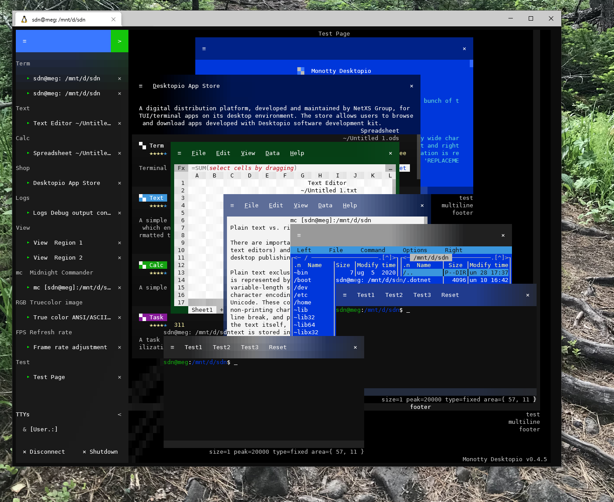

# vtm

Text-based desktop environment inside your terminal*



#### * Terminal Requirements

 - [Unicode/UTF-8](https://www.cl.cam.ac.uk/~mgk25/unicode.html)
 - [Grapheme Clustering](https://unicode.org/reports/tr29/#Grapheme_Cluster_Boundaries)
 - [24-bit True Color](https://github.com//termstandard/colors)
 - [xterm-style Mouse Reporting](https://invisible-island.net/xterm/ctlseqs/ctlseqs.html#h2-Mouse-Tracking)

#### [Tested Terminals](https://github.com/netxs-group/vtm/discussions/72)

# Demo

<a href="https://www.youtube.com/watch?v=kofkoxGjFWQ">
  
</a>

### Video

 - [Desktop Environment](https://youtu.be/fLumnSctakY)
 - [Collaborative Interaction](https://youtu.be/0zU4e5Vam8c)
 - [Recursive Connection](https://youtu.be/Fm5X75sO62c)

# Supported Platforms

- POSIX-oriented
  - Linux
  - macOS
  - FreeBSD
  - NetBSD
  - OpenBSD
  - [`...`](https://en.wikipedia.org/wiki/POSIX#POSIX-oriented_operating_systems)
- Windows
  - Windows 10 or later
  - Windows Server 2019 or later

# Building from Source

### POSIX-oriented

Build-time dependencies
 - `git`
 - `cmake`
 - C++20 compiler
 - Minimal requirements to compile
   - Using [`GCC`](https://gcc.gnu.org/projects/cxx-status.html) — `3GB` of RAM
   - Using [`Clang`](https://clang.llvm.org/cxx_status.html) — `8GB` of RAM

```bash
git clone https://github.com/netxs-group/vtm.git && cd ./vtm
cmake ./src -DCMAKE_BUILD_TYPE=Release
cmake --build .
cmake --install .
```

### Windows

Build-time dependencies
 - `git`
 - `cmake`
 - `Visual Studio 2019` or later
 - `UTF-8` for worldwide language support, https://github.com/netxs-group/vtm/issues/175#issuecomment-1034734346

Use `Developer Command Prompt` as a build environment
```cmd
git clone https://github.com/netxs-group/vtm.git && cd ./vtm
cmake ./src -DCMAKE_BUILD_TYPE=Release "-GVisual Studio 16 2019"
cmake --build . --config Release
cd ./Release
powershell ../src/install/install.ps1
```

# Binaries

[](https://github.com/netxs-group/vtm/releases/latest/download/vtm_macos_any.tar.gz)  
[](https://github.com/netxs-group/vtm/releases/latest/download/vtm_freebsd_amd64.tar.gz)  
[](https://github.com/netxs-group/vtm/releases/latest/download/vtm_netbsd_amd64.tar.gz)  
[](https://github.com/netxs-group/vtm/releases/latest/download/vtm_openbsd_amd64.tar.gz)  
[](https://github.com/netxs-group/vtm/releases/latest/download/vtm_linux_amd64.tar.gz)  
[](https://github.com/netxs-group/vtm/releases/latest/download/vtm_windows_amd64.zip)  

---

# Command Line Options `vtm(.exe)`

Option       | Description
-------------|-------------------------------------------------------
No arguments | Run client (auto start server)
` -d `       | Run server in background
` -s `       | Run server in interactive mode
` -r [<app>]`| Run the specified `<app>` in offline mode<br>`Term` Terminal emulator (default)<br>`Calc` (Demo) Spreadsheet calculator<br>`Text` (Demo) Text editor<br>`Gems` (Demo) Desktopio application manager

# User Interface

<table>
<thead>
  <tr>
    <th rowspan="2"></th>
    <th colspan="3">Sidebar</th>
    <th colspan="4">App window</th>
    <th colspan="2">Desktop</th>
  </tr>
  <tr>
    <th>App group</th>
    <th>Running app</th>
    <th>User list</th>
    <th>≡ Menu</th>
    <th>Menu bar</th>
    <th>Interior</th>
    <th>Resize grips</th>
    <th>Navigation strings</th>
    <th>Free space</th>
  </tr>
</thead>
<tbody>
  <tr>
    <th>Ctrl + PgUp/Dn</th>
    <td colspan="9">Switch between running apps and assign exclusive keyboard focus</td>
  </tr>
  <tr>
    <th>LeftClick</th>
    <td>Run app</td>
    <td>Go to app</td>
    <td></td>
    <td>Maximize/restore</td>
    <td colspan="3">Assign exclusive keyboard focus</td>
    <td>Go to app</td>
    <td>Clear keyboard focus</td>
  </tr>
  <tr>
    <th>Ctrl + LeftClick</th>
    <td colspan="3"></td>
    <td colspan="5">Assign/clear group keyboard focus</td>
    <td></td>
  </tr>
  <tr>
    <th>double LeftClick</th>
    <td colspan="3"></td>
    <td></td>
    <td colspan="2">Maximize/restore app window</td>
    <td colspan="3"></td>
  </tr>
  <tr>
    <th>triple Left+RightClick</th>
    <td colspan="3">Show/hide sysstat overlay</td>
    <td colspan="6"></td>
  </tr>
  <tr>
    <th>RightClick</th>
    <td>Set default app</td>
    <td>Center app window</td>
    <td colspan="1"></td>
    <td colspan="2">Toggle menu height</td>
    <td colspan="1"></td>
    <td colspan="2">Center app window</td>
    <td></td>
  </tr>
  <tr>
    <th>Left+RightClick</th>
    <td colspan="3"></td>
    <td colspan="5">Clear clipboard</td>
    <td></td>
  </tr>
  <tr>
    <th>LeftDrag</th>
    <td colspan="3">Adjust sidebar width</td>
    <td colspan="5">Move window or Select text</td>
    <td>Panoramic workspace scrolling</td>
  </tr>
  <tr>
    <th>RightDrag</th>
    <td colspan="5"></td>
    <td>Panoramic content scrolling</td>
    <td colspan="2"></td>
    <td>Run default app</td>
  </tr>
  <tr>
    <th>MiddleDrag</th>
    <td colspan="9">Run default app</td>
  </tr>
  <tr>
    <th>Left+RightDrag</th>
    <td colspan="3"></td>
    <td colspan="4">Move window / Restore maximized window</td>
    <td colspan="2">Panoramic workspace scrolling</td>
  </tr>
  <tr>
    <th>Ctrl+LeftDrag</th>
    <td colspan="9">Modify selection</td>
  </tr>
  <tr>
  <tr>
    <th>Alt+LeftDrag</th>
    <td colspan="9">Switch boxed/linear selection mode</td>
  </tr>
  <tr>
    <th>Ctrl+RightDrag or Ctrl+MiddleDrag</th>
    <td colspan="9">Copy selected area to clipboard, OSC 52</td>
  </tr>
  <tr>
    <th>Wheel</th>
    <td colspan="7">Vertical scrolling</td>
    <td colspan="2"></td>
  </tr>
  <tr>
    <th>Shift+Wheel or Ctrl+Wheel</th>
    <td colspan="7">Horizontal scrolling</td>
    <td colspan="2"></td>
  </tr>
</tbody>
</table>


# Main Menu Configuration

The main menu can be configured in the `~/.config/vtm/settings.xml` file in xml format.

The top-level element `<config selected=_selected_id_>` contains a list of
  - menu items `<menuitem ... />`
  - splitters `<splitter ... />`
  - default attribute definitions `<defaults ... />`.

The value of the `selected=` attribute specifies which menu item will be selected by default at startup.

The list of main menu items can be extended using the `VTM_CONFIG=...` environment variable. This variable should contain a list of items as inside the `<config selected=_selected_id_> ... </config>` block.

Arguments can be specified without quotes if there are no spaces.

#### Character escapes

 - `\e`  ASCII 0x1B ESC
 - `\t`  ASCII 0x09 TAB
 - `\a`  ASCII 0x07 BEL
 - `\n`  ASCII 0x0A LF
 - `\\`  ASCII 0x5C Backslash
 - `\"`  ASCII 0x22 Quotes
 - `\'`  ASCII 0x27 Single quote
 - `$0`  Current module full path

#### Menu item attributes

Attribute  | Description                       | Value type | Mandatory | Default value
-----------|-----------------------------------|------------|-----------|---------------
`id`       |  Menu item textual identifier     | `string`   | required  | 
`index`    |  Menu item zero-based index       | `index`    |           | 
`alias`    |  Use existing menu item specified by `id` as template  | `string` | |
`hidden`   |  Menu item visibility             | `boolean`  |           | `no`
`label`    |  Menu item label text             | `string`   |           | =`id`
`notes`    |  Menu item tooltip text           | `string`   |           | empty
`title`    |  App window title                 | `string`   |           | empty
`footer`   |  App window footer                | `string`   |           | empty
`bgcolor`  |  App window background color      | `RGBA`     |           |
`fgcolor`  |  App window foreground color      | `RGBA`     |           |
`winsize`  |  App window 2D size               | `x;y`      |           |
`slimmenu` |  App window menu vertical size    | `boolean`  |           | `no`
`cwd`      |  Current working directory        | `string`   |           |
`type`     |  App type                         | `string`   |           | `SHELL`
`param`    |  App constructor arguments        | `string`   |           | empty

#### Value type

Type     | Format
---------|-----------------
`RGBA`   |  `#rrggbbaa` \| `0xaabbggrr` \| `rrr,ggg,bbb,aaa` \| 256-color index
`boolean`|  `true` \| `false` \| `yes` \| `no` \| `1` \| `0`
`index`  |  0 .. N
`string` |  _UTF-8 text string_
`x;y`    |  _integer_ <any_delimeter> _integer_

#### App type

Type              | Parameter
------------------|-----------------
`DirectVT`        | `_command line_`
`SHELL` (default) | `_command line_`
`ANSIVT`          | `_command line_`
`Group`           | [ v[`n:m:w`] \| h[`n:m:w`] ] ( id_1 \| _nested_block_ , id_2 \| _nested_block_ )]
`Region`          | `param` attribute is not used, use attribute `title=_view_title_` to set region name

#### Example of `~/.config/vtm/settings.xml`

```
<config selected=Term>
    <splitter label="apps"/>
    <defaults index=-1 hidden=no slimmenu=false type=SHELL fgcolor=#00000000 bgcolor=#00000000 winsize=0x0 wincoor=0x0 />
    <menuitem id=Term index=1 label="Term" bgcolor=#0a0a0a fgcolor=15 slimmenu notes="$0 -r Term:\nTerminal emulator" type=DirectVT param="vtm -r term bash"/>
    <menuitem id=mc label="mc" title="mc" notes="Midnight Commander" type=SHELL param="mc"/>
    <menuitem id=Settings index=2 label="Settings \e[45mLink\e[m" title="Settings title" footer="\e[11:2psettings status" fgcolor=15 bgcolor=0xFF562401 notes="$0\n\tRun settings" type=DirectVT param="vtm -r settings"/>
    <menuitem id=View label=View notes="Set desktop region" type=Region title="\e[11:3pView: Region"/>"
    <splitter label="groups"/>
    <menuitem id=Tile1 label="Tile" notes="Tiling window manager" type=Group param="h(Term, v(mc, Term))"/>
    <menuitem id=Tile2 label="Second TWM"
                       notes="Tooltip for Tiling window manager"
                       type=Group
                       param="h(v(Term, Tile1), v(mc, Term))"/>
</config>
```

#### Example of `VTM_CONFIG=` envar

```
VTM_CONFIG='<splitter label="envars" notes=" Menu items configured using envar VTM_CONFIG=... "/>
            <menuitem id=Term2 notes="Run terminal" type=DirectVT label="Virtual \e[41mTerminal\e[m Emulator" param="$0 -r term"/>
            <menuitem id=View2 label=View notes="Desktop region" type=Region title="Region 1"/>
            <menuitem id=htop2 label=htop hidden=yes notes="htop app" type=ANSIVT param="htop"/>
            <menuitem id=mc2 label=mc hidden=1 notes="mc app" type=SHELL param="mc"/>
            <menuitem id=Tile2 label=Tile notes="Tiling Window Manager" type=Group title="Tiling Window Manager" param="h1:2( v1:1(htop2, mc2), Term2)"/>'
```

# Built-in Applications

- `▀▄ Term` Terminal emulator
- `▀▄ Logs` Debug output console
- `▀▄ View` Workspace navigation helper
- `▀▄ Tile` Tiling window manager
- `▀▄ Gems` Application manager (Demo)

<details><summary>show details...</summary><p>

 - `▀▄ Term`
   - UTF-8 Everywhere
   - Unicode clustering
   - TrueColor/256-color support
   - Auto-wrap mode `DECAWM` (with horizontal scrolling)
   - Focus tracking `DECSET 1004`
   - Bracketed paste mode `DECSET 2004`
   - SGR attributes: overline, double underline, strikethrough, and others
   - Save/restore terminal window title `XTWINOPS 22/23`
   - Mouse tracking `DECSET 1000/1002/1003/1006 SGR` mode
   - Mouse tracking `DECSET 10060 Extended SGR` mode, mouse reporting outside of the terminal viewport (outside + negative arguments) #62
   - Text selection by mouse #149
   - Configurable using VT-sequences

      Name         | Sequence                         | Description
      -------------|----------------------------------|-------------
      `CCC_SBS`    | `CSI` 24 : n : m `p`             | Set scrollback buffer size, `int32_t`<br>`n` Initial buffer size in lines; 0 — grow step is used for initial size; _default (if omitted) is 20.000_<br>`m` Grow step for unlimited buffer; _default (if omitted) is 0_ — for fixed size buffer
      `CCC_SGR`    | `CSI` 28 : Pm `p`                | Set terminal background using SGR parameters (one attribute at once)<br>`Pm` Colon-separated list of attribute parameters, 0 — reset all attributes, _default is 0_
      `CCC_SEL`    | `CSI` 29 : n `p`                 | Set selection mode, _default is 0_<br>`n = 0` Selection is off<br>`n = 1`Select and copy as plaintext<br>`n = 2` Select and copy as ANSI-text
      `CCC_PAD`    | `CSI` 30 : n `p`                 | Set scrollbuffer side padding<br>`n` Width in cells, _max = 255, default is 0_
      `CCC_RST`    | `CSI` 1 `p`                      | Reset all parameters to default
      `CCC_TBS`    | `CSI` 5 : n `p`                  | Set tabulation length<br>`n` Length in cells, _max = 256, default is 8_
      `CCC_JET`    | `CSI` 11 : n `p`                 | Set text alignment, _default is Left_<br>`n = 0` default<br>`n = 1` Left<br>`n = 2` Right<br>`n = 3` Center
      `CCC_WRP`    | `CSI` 12 : n `p`                 | Set text autowrap mode, _default is On_<br>`n = 0` default<br>`n = 1` On<br>`n = 2` Off (_enable horizontal scrolling_)
      `CCC_RTL`    | `CSI` 13 : n `p`                 | Set text right-to-left mode, _default is Off_<br>`n = 0` default<br>`n = 1` On<br>`n = 2` Off

      Note: It is possible to combine multiple command into a single sequence using a semicolon. For example, the following sequence disables wrapping, enables text selection, and sets the background to blue: `CSI 12 : 2 ; 29 : 1 ; 28 : 44 p` or `CSI 12 : 2 ; 29 : 1 ; 28 : 48 : 2 : 0 : 0 : 255 p`.

 - `▀▄ Logs`
   - Debug output console.

 - `▀▄ View`
   - Serves for quick navigation through the workspace using cyclic selection (left click on group title) in the `View` group on the taskbar. Right click to set clipboard data as region title (swap clipboard text and title).

 - `▀▄ Tile`
   - Supports Drag and Drop for panes (like tabs in a browser).
   - Use any modifier (`Ctrl` or `Alt`) while pane dragging to disable drag&drop mode.
   - List of panes (outside the right side of the window)
     - `LeftClick` -- Set exclusive focus
     - `Ctrl+LeftClick`/`RightClick` -- Set/Unset group focus
     - `double LeftClick` -- Maxixmize/restore
   - Configurable via environment variable `VTM_CONFIG*`
     ```
     # Configuration example:

     VTM_CONFIG='<menuitem id=Term notes="Run terminal" type=DirectVT label="Virtual \e[41mTerminal\e[m] Emulator" param="$0 -r term"/>
                 <menuitem id=View label=View notes="Desktop region" type=Region title="Region 1"/>
                 <menuitem id=htop label=htop hidden=yes notes="htop app" type=ANSIVT param="htop"/>
                 <menuitem id=mc label=mc hidden=1 notes="mc app" type=SHELL param="mc"/>
                 <menuitem id=Tile label=Tile notes="Tiling Window Manager" type=Group title="Tiling Window Manager" param="h1:2( v1:1(htop, mc), Term)"/>'
     ```

</p></details>

# Related Repositories

[Desktopio Framework Documentation](https://github.com/netxs-group/Desktopio-Docs)

---

[](https://github.com/netxs-group/vtm) [![Twitter handle][]][twitter badge]

[//]: # (LINKS)
[twitter handle]: https://img.shields.io/twitter/follow/desktopio.svg?style=social&label=Follow
[twitter badge]: https://twitter.com/desktopio
