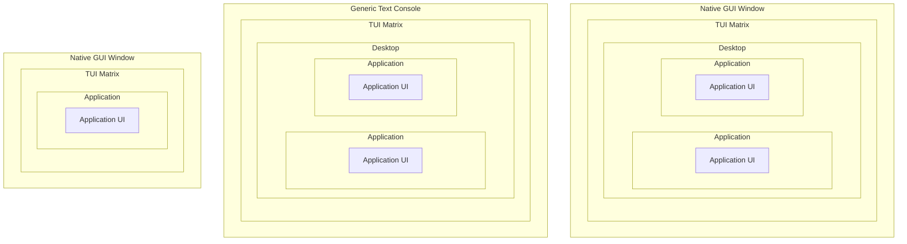

# vtm

It is a text-based application where the entire user interface is represented by a mosaic of text cells forming a TUI matrix. The resulting TUI matrix is ​​just rendered either into its own GUI window or into a compatible text console.

It can run indefinitely nested, forming a text-based desktop environment.

# Supported platforms

- Windows
  - Windows 8.1 and later
- Unix
  - Linux
  - macOS
  - FreeBSD
  - NetBSD
  - OpenBSD
  - [`...`](https://en.wikipedia.org/wiki/POSIX#POSIX-oriented_operating_systems)

[Tested Terminals](https://github.com/directvt/vtm/discussions/72)

Currently, rendering into a native GUI window is only available on the Windows platform; on Unix platforms, a terminal emulator is required.

# Binary downloads

          
         
       

# Documentation

- [Architecture](doc/architecture.md)
- [Building from source](doc/build.md)
- [Command-line options](doc/command-line-options.md)
- [User interface](doc/user-interface.md)
- [Settings](doc/settings.md)
- [Unicode Character Geometry Modifiers](doc/character_geometry.md)
